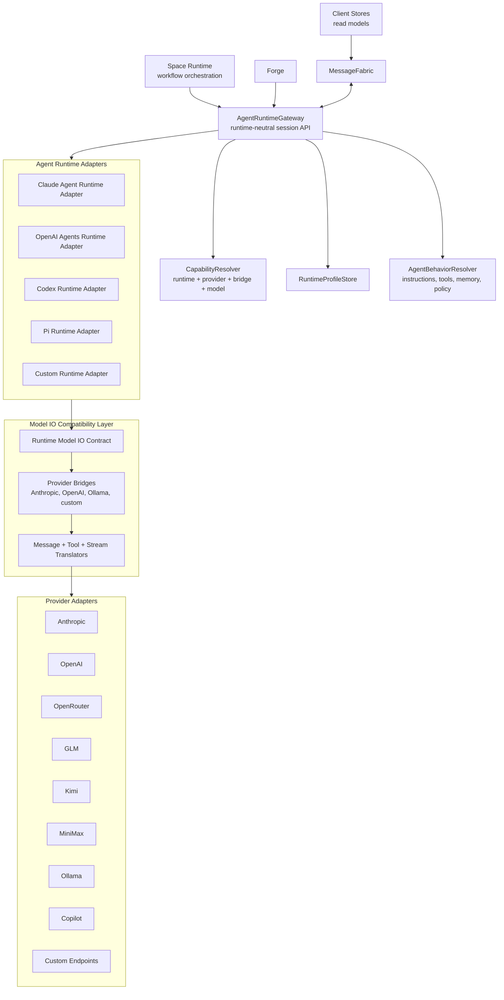
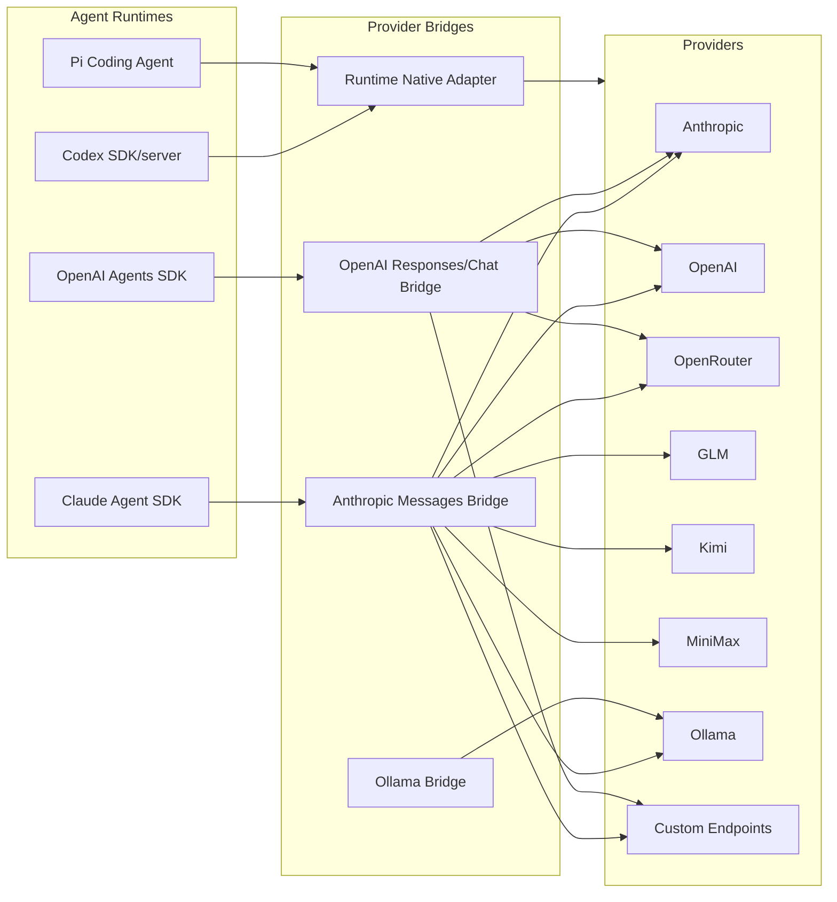

# Agent Runtime And Provider Compatibility Design

**Date:** 2026-05-22
**Status:** Draft Design
**Related:**

- [Target Architecture Overview](./target-architecture-overview.md)
- [Unified Message Fabric Architecture Design](./unified-message-fabric-design.md)
- [Space Runtime Decomposition Design](./space-runtime-decomposition.md)
- [Storage Unit Of Work And Outbox Design](./storage-unit-of-work-and-outbox.md)
- [Shared Package Boundaries Design](./shared-package-boundaries.md)

---

## 1. Purpose

NeoKai should be agent-runtime agnostic and provider agnostic.

That means the Space runtime, Forge, client stores, and MessageFabric should not assume Claude Agent SDK is the only execution runtime. They should also not assume a model provider must natively speak the runtime's preferred API.

The target is:

> Any Agent Runtime can be paired with any Provider when technically possible, with explicit compatibility bridges and capability degradation.

The current codebase already proves part of this direction. NeoKai runs the Claude Agent SDK with providers that are not Anthropic by projecting those providers behind Anthropic-compatible endpoints and process environment routing. That is the correct architectural pattern. This spec generalizes it so future runtimes such as OpenAI Agents SDK, Codex SDK/server, Pi coding agent, or other local/remote agent engines can participate without forcing the rest of the daemon to know their native APIs.

---

## 2. Terminology

### Agent Runtime

An **Agent Runtime** is the execution substrate that runs an agent loop.

Examples:

- Claude Agent SDK
- OpenAI Agents SDK
- Codex SDK/server
- Pi coding agent
- a local custom runtime
- a remote hosted agent service

The runtime owns mechanics such as session start/resume, message streaming, tool invocation protocol, cancellation, process lifecycle, and runtime-specific session state.

### Provider

A **Provider** is the model/inference backend or model gateway.

Examples:

- Anthropic
- OpenAI
- OpenRouter
- GLM
- Kimi
- MiniMax
- Ollama local/cloud
- GitHub Copilot-backed bridge
- custom OpenAI-compatible, Anthropic-compatible, or Ollama-compatible endpoints

### Provider Bridge

A **Provider Bridge** adapts a provider's native API into the API shape expected by a runtime.

Examples already present in the codebase:

- OpenAI Responses API exposed as Anthropic Messages API for Claude Agent SDK.
- OpenAI Chat Completions exposed as Anthropic Messages API for custom endpoints.
- Ollama native `/api/chat` exposed as Anthropic Messages API.
- custom Anthropic Messages pass-through endpoints.

### Model IO Compatibility Layer

The **Model IO Compatibility Layer** is the conceptual boundary that normalizes messages, tools, streams, multimodal inputs, reasoning metadata, and errors between runtimes and providers. In the first implementation it can be implemented by provider bridges and runtime adapters rather than one monolithic module.

### Agent Behavior

**Agent Behavior** is not the runtime. It is the portable description of what the agent should do:

- role and instructions
- workflow node assignment
- tools and MCP servers
- memory scope
- permission policy
- autonomy level
- output expectations
- tool guards

The same behavior should be runnable on different runtimes and providers when capabilities allow.

### Runtime Profile

A **Runtime Profile** is a saved selection of:

- agent runtime
- provider
- model
- bridge mode
- credentials source
- sandbox/process settings
- tool policy
- behavior profile reference

The user-facing UI can call this "Runtime" or "Agent Runtime" depending on space.

---

## 3. Current State

### Provider System

The current provider layer is already extensible:

- `packages/shared/src/provider/types.ts` defines a string-based provider id, provider capabilities, SDK config, provider session config, auth status, and the provider interface.
- `packages/daemon/src/lib/providers/registry.ts` registers and resolves providers.
- `packages/daemon/src/lib/providers/factory.ts` registers built-ins:
  - Anthropic
  - GLM
  - Kimi
  - MiniMax
  - OpenRouter
  - Ollama local/cloud
  - Anthropic-to-Codex bridge
  - Anthropic-to-Copilot bridge
  - synced custom endpoints
- `packages/daemon/src/lib/provider-service.ts` applies provider-specific env vars before Claude Agent SDK query creation.
- `packages/daemon/src/lib/agent/query-options-builder.ts` maps session config into Claude Agent SDK `Options`, including provider-aware model translation, context-window settings, thinking mode, MCP servers, tools, hooks, and sandbox settings.

This is already a runtime-provider compatibility layer, but it is named and shaped around the current Claude Agent SDK runtime.

### Claude Runtime Coupling

The current runtime path is centered on `@anthropic-ai/claude-agent-sdk`:

- `AgentSession` is a facade/orchestrator for Claude Agent SDK sessions.
- `QueryRunner` imports `query`, `Options`, `Query`, `SpawnOptions`, and `SpawnedProcess` from the Claude Agent SDK.
- `QueryOptionsBuilder` emits Claude Agent SDK `Options`.
- `SDKRuntimeConfig` calls runtime methods such as `setPermissionMode`, `mcpServerStatus`, and context usage APIs.
- session messages are stored and rendered as SDK message shapes.

This is expected for the first runtime, but the target architecture should rename the boundary: Claude Agent SDK is one `AgentRuntimeAdapter`, not the whole agent/session architecture.

### Existing Bridge Pattern

The bridge pattern is already present and should be promoted:

- `AnthropicToCodexBridgeProvider` exposes OpenAI-backed models through an Anthropic-compatible bridge.
- `openai-responses-bridge/server.ts` translates Anthropic Messages requests to OpenAI Responses requests and streams Anthropic SSE back.
- `CustomEndpointProvider` can bridge OpenAI Chat, Anthropic Messages, and Ollama native endpoints.
- `provider-anthropic-compat/translator.ts` defines shared Anthropic Messages request/SSE translation helpers.
- provider config can set model-level capabilities so unsupported features are suppressed before they hit upstream APIs.

This proves the desired architecture: a runtime can keep its native model IO shape while NeoKai bridges providers into that shape.

---

## 4. Design Goals

1. **Independent axes:** runtime selection and provider selection are independent whenever bridges can make them compatible.
2. **Runtime-neutral Space orchestration:** Space runtime talks to `AgentRuntimeGateway`, not Claude Agent SDK directly.
3. **Provider-neutral runtime profiles:** provider/model/credentials are selected through runtime profiles, not hard-coded runtime assumptions.
4. **Bridge-first compatibility:** bridges are first-class, not hacks. They make unsupported native pairs possible.
5. **Explicit capabilities:** every runtime, provider, model, and bridge declares capabilities and limitations.
6. **Graceful degradation:** incompatible features are disabled or surfaced clearly instead of failing deep inside a stream.
7. **Portable behavior:** agent behavior definitions should move across runtimes/providers when capability requirements are met.
8. **Incremental migration:** current Claude Agent SDK sessions and provider bridges remain the first implementation path.

## 5. Non-Goals

- Replacing Claude Agent SDK immediately.
- Guaranteeing every runtime/provider pair has perfect feature parity.
- Hiding meaningful behavior differences across runtimes.
- Rewriting all SDK message rendering in the first slice.
- Making provider bridges distributed services by default. Embedded local bridges are fine.
- Converting NeoKai into a generic model proxy independent of agent execution.

---

## 6. Target Architecture



### Reading The Diagram

- `AgentRuntimeGateway` is what daemon domains call.
- Runtime adapters hide runtime-specific session mechanics.
- Provider bridges make providers look like the API shape a runtime expects.
- `CapabilityResolver` decides whether a selected runtime/provider/model/bridge pair is native, bridged, degraded, or unsupported.
- `AgentBehaviorResolver` keeps prompts/tools/policy separate from execution mechanics.

---

## 7. Component Responsibilities

### 7.1 AgentRuntimeGateway

The gateway is the daemon boundary for agent execution.

Responsibilities:

- create session
- resume session
- send input messages
- stream output events
- cancel/interrupt
- update runtime config when supported
- attach or refresh tools/MCP servers
- expose runtime status and health
- persist runtime-neutral session metadata
- delegate runtime-specific state to the selected adapter

Target interface:

```ts
export interface AgentRuntimeGateway {
  startSession(input: StartAgentRuntimeSession): Promise<AgentRuntimeSessionRef>;
  resumeSession(input: ResumeAgentRuntimeSession): Promise<AgentRuntimeSessionRef>;
  sendMessage(input: RuntimeInputMessage): Promise<RuntimeSendResult>;
  subscribe(sessionId: string, sink: RuntimeEventSink): RuntimeSubscription;
  interrupt(sessionId: string, reason?: string): Promise<RuntimeInterruptResult>;
  updateConfig(sessionId: string, patch: RuntimeConfigPatch): Promise<RuntimeConfigResult>;
  getStatus(sessionId: string): Promise<AgentRuntimeStatus>;
  stopSession(sessionId: string): Promise<void>;
}
```

The gateway should expose fabric commands and events over time:

| Contract | Kind | Purpose |
| --- | --- | --- |
| `agentRuntime.session.start` | command | Start a runtime session. |
| `agentRuntime.session.resume` | command | Resume an existing runtime session. |
| `agentRuntime.message.send` | command | Send input into a runtime session. |
| `agentRuntime.session.interrupt` | command | Interrupt/cancel active execution. |
| `agentRuntime.config.update` | command | Change model, tools, permissions, or runtime config. |
| `agentRuntime.session.status.get` | query | Read runtime status. |
| `agentRuntime.capabilities.resolve` | query | Validate runtime/provider/model compatibility. |
| `agentRuntime.event.stream` | event | Normalized output, tool, status, and error events. |

### 7.2 AgentRuntimeAdapter

Each runtime adapter implements the runtime-native mechanics.

Examples:

- `ClaudeAgentRuntimeAdapter`
- `OpenAIAgentsRuntimeAdapter`
- `CodexRuntimeAdapter`
- `PiRuntimeAdapter`

Responsibilities:

- translate `RuntimeProfile` and `AgentBehavior` into runtime-native options
- start/resume runtime sessions
- normalize runtime output into `AgentRuntimeEvent`
- normalize incoming messages into runtime-native input
- handle runtime-specific cancellation and process/session lifecycle
- report capabilities
- expose runtime-specific diagnostics without leaking them into domain logic

Target interface:

```ts
export interface AgentRuntimeAdapter {
  readonly id: AgentRuntimeId;
  readonly displayName: string;
  readonly nativeModelIo: ModelIoProtocol;
  readonly capabilities: AgentRuntimeCapabilities;

  createSession(input: RuntimeAdapterCreateInput): Promise<RuntimeAdapterSession>;
  resumeSession(input: RuntimeAdapterResumeInput): Promise<RuntimeAdapterSession>;
  resolveOptions(input: RuntimeAdapterOptionsInput): Promise<RuntimeNativeOptions>;
  normalizeEvent(event: unknown): AgentRuntimeEvent;
  shutdown?(): Promise<void>;
}
```

### 7.3 ProviderAdapter

Provider adapters already exist conceptually in `@neokai/shared/provider` and `packages/daemon/src/lib/providers`.

Target responsibilities:

- expose model catalog
- expose provider/model capabilities
- expose authentication status
- build provider-native request configuration
- optionally provide direct native clients
- optionally start provider bridge servers
- declare supported bridge targets

The existing `Provider` interface can evolve rather than be replaced.

### 7.4 ProviderBridge

A provider bridge adapts provider-native IO to runtime-expected IO.

Bridge directions:

| Runtime expected IO | Provider native IO | Example |
| --- | --- | --- |
| Anthropic Messages | OpenAI Responses | Current Codex/OpenAI bridge. |
| Anthropic Messages | OpenAI Chat Completions | Current custom endpoint bridge. |
| Anthropic Messages | Ollama `/api/chat` | Current Ollama bridge. |
| OpenAI Responses | Anthropic Messages | Future OpenAI runtime with Anthropic provider. |
| Codex protocol | Anthropic/OpenAI provider APIs | Future Codex runtime bridge. |

Responsibilities:

- translate message roles and content blocks
- translate tool definitions and tool calls
- translate tool results
- translate streaming deltas
- translate reasoning/thinking metadata where possible
- translate multimodal inputs
- map provider errors into runtime-compatible errors
- map usage/context metadata
- expose capability degradation

### 7.5 Model IO Compatibility Layer

The compatibility layer is the abstract model between runtime adapters and provider bridges.

It should define canonical concepts:

```ts
export type ModelIoProtocol =
  | 'anthropic-messages'
  | 'openai-responses'
  | 'openai-chat'
  | 'ollama-chat'
  | 'codex-agent'
  | 'custom';

export interface ModelIoCapabilities {
  streaming: boolean;
  toolUse: boolean;
  toolChoice: boolean;
  parallelToolCalls: boolean;
  vision: boolean;
  fileInputs: boolean;
  structuredOutput: boolean;
  reasoning: 'none' | 'opaque' | 'summary' | 'tokens' | 'signed-blocks';
  promptCaching: boolean;
  resumableContext: boolean;
  maxContextTokens?: number;
  maxOutputTokens?: number;
}
```

It does not have to be one runtime class on day one. The first implementation can keep logic inside existing bridge servers while moving shared types into `@neokai/shared/contracts/agent-runtime` or a similar subpath.

### 7.6 CapabilityResolver

The resolver validates a runtime profile before a session starts.

Inputs:

- runtime id
- provider id
- model id
- requested bridge mode
- behavior requirements
- tool policy
- workspace/session context

Output:

```ts
export interface RuntimeCompatibilityResult {
  status: 'native' | 'bridged' | 'degraded' | 'unsupported';
  runtimeId: string;
  providerId: string;
  modelId: string;
  bridge?: {
    id: string;
    from: ModelIoProtocol;
    to: ModelIoProtocol;
  };
  effectiveCapabilities: ModelIoCapabilities & AgentRuntimeCapabilities;
  disabledFeatures: Array<{
    feature: string;
    reason: string;
    severity: 'info' | 'warning' | 'blocking';
  }>;
  warnings: string[];
}
```

Rules:

- `native`: runtime can call provider/model without a bridge.
- `bridged`: bridge provides full required behavior.
- `degraded`: bridge can run but disables or changes non-required features.
- `unsupported`: required behavior cannot be satisfied.

### 7.7 RuntimeProfileStore

Runtime profiles should be persisted separately from session records.

Example shape:

```ts
export interface RuntimeProfile {
  id: string;
  name: string;
  runtimeId: string;
  providerId: string;
  modelId: string;
  bridgeMode: 'auto' | 'native' | 'force-bridge';
  behaviorProfileId?: string;
  credentialRef?: string;
  sandbox?: RuntimeSandboxConfig;
  toolPolicy?: RuntimeToolPolicy;
  createdAt: number;
  updatedAt: number;
}
```

Resolution precedence:

1. explicit workflow node runtime profile
2. Space agent runtime profile
3. Space default runtime profile
4. user default runtime profile
5. daemon default runtime profile

### 7.8 AgentBehaviorResolver

Agent behavior should be a portable input to runtime adapters.

Behavior includes:

- role
- instructions
- system/developer prompt segments
- tool list
- MCP servers
- memory/context sources
- permission policy
- autonomy level
- output schema
- workflow metadata
- prompt provenance

Runtime adapters then map behavior into native runtime concepts:

| Behavior concept | Claude Agent SDK | OpenAI Agents SDK | Codex/Pi future |
| --- | --- | --- | --- |
| instructions | `systemPrompt` | instructions/developer messages | runtime prompt config |
| tools | SDK tools + MCP servers | tools/functions/MCP if supported | runtime tool registry |
| subagents | `agents` + Task tools | agents/handoffs if supported | runtime-specific |
| permissions | `canUseTool`, hooks, permission mode | approval hooks/policy | runtime-specific |
| sandbox | SDK sandbox/options | runtime sandbox | runtime-specific |

---

## 8. Runtime And Provider Matrix

The target matrix should be explicit and capability-driven.



The diagram is conceptual: not every line exists today, and not every future line has equal fidelity. The architecture should allow lines to be added without changing Space runtime or client stores.

---

## 9. Message And Tool Normalization

The core compatibility work is model IO translation.

### Messages

Normalize:

- system/developer/user/assistant roles
- runtime-specific system prompt concepts
- multimodal inputs
- file attachments
- tool use blocks
- tool result blocks
- reasoning/thinking blocks
- hidden/internal runtime metadata

Rule: domain modules should not store provider-native request payloads as the authoritative state. They may store runtime-native raw events for diagnostics, but the durable session event stream should include normalized runtime events.

### Tools

Normalize:

- tool name
- input schema
- invocation id
- invocation arguments
- result payload
- error payload
- approval state
- permission decision
- streaming/progress events

Tool compatibility classes:

| Class | Meaning |
| --- | --- |
| `native` | Runtime/provider supports this tool shape directly. |
| `bridged` | Bridge translates tool calls/results. |
| `emulated` | NeoKai simulates behavior outside provider support. |
| `disabled` | Capability is not available for this runtime/profile. |

### Streaming

Normalize stream events into:

- text delta
- reasoning delta
- tool call start
- tool call delta
- tool call complete
- tool result accepted
- usage update
- error
- session status
- final result

The web renderer can keep rendering SDK-specific messages during migration, but new read models should use normalized event shapes.

---

## 10. Capability Model

Capabilities exist at four levels:

1. runtime capabilities
2. provider capabilities
3. model capabilities
4. bridge capabilities

Effective capability is the intersection plus bridge transformations.

Example:

| Feature | Runtime | Provider/model | Bridge | Effective |
| --- | --- | --- | --- | --- |
| streaming | yes | yes | yes | yes |
| tool use | yes | no | no | disabled |
| thinking tokens | yes | yes | maps to reasoning effort | degraded |
| prompt caching | yes | no | no | disabled |
| signed thinking blocks | yes | provider-specific | not portable | disabled on cross-provider switch |
| resume | runtime local | provider stateless | bridge stores continuation | degraded/native depends on bridge |

Current code already handles a few of these:

- provider-level `thinkingModes`
- model-level custom endpoint capabilities
- context-window overrides for non-native providers
- thinking block stripping on cross-provider model switches
- explicit provider id to avoid ambiguous model ownership

The target makes these a formal resolver result.

---

## 11. Session State And Persistence

Current sessions store `sdkSessionId`, SDK-origin path, SDK message rows, and Claude Agent SDK message blobs. That should remain for compatibility, but target session state should separate:

- NeoKai session id
- runtime id
- provider id
- model id
- runtime profile id
- behavior profile id
- runtime-native session id
- runtime-native resume token/checkpoint
- normalized message/event cursor
- raw runtime diagnostics reference

Target session fields should avoid names that imply only one SDK:

| Current concept | Target concept |
| --- | --- |
| `sdkSessionId` | `runtimeSessionId` or `runtimeState.resumeToken` |
| `SDKMessage` | `RuntimeMessage` plus raw runtime payload |
| `SDKRuntimeConfig` | `AgentRuntimeConfigService` |
| `QueryRunner` | Claude runtime adapter internals |
| `QueryOptionsBuilder` | Claude runtime options builder |

Migration can preserve current field names until read/write paths move.

---

## 12. Agent Runtime Events

Normalized runtime events should be fabric events over time.

Event examples:

| Event | Purpose |
| --- | --- |
| `agentRuntime.session.started` | Runtime session created. |
| `agentRuntime.session.resumed` | Runtime session resumed from state. |
| `agentRuntime.message.received` | Runtime produced a normalized message. |
| `agentRuntime.text.delta` | Streaming text delta. |
| `agentRuntime.reasoning.delta` | Reasoning/thinking delta when available. |
| `agentRuntime.tool.requested` | Runtime requested a tool call. |
| `agentRuntime.tool.completed` | Tool result accepted by runtime. |
| `agentRuntime.usage.updated` | Usage/context/cost update. |
| `agentRuntime.session.interrupted` | Session interrupted. |
| `agentRuntime.session.failed` | Runtime failed. |
| `agentRuntime.capability.degraded` | Profile ran with degraded capabilities. |

Durability policy:

- final messages and tool requests/results should be durable
- stream deltas can remain ephemeral if final message state is durable
- capability degradation events should be durable when they affect behavior
- low-level process lifecycle can remain ephemeral unless needed for recovery

---

## 13. UI Model

The UI should expose runtime and provider as independent choices.

Recommended selection flow:

1. Runtime
2. Provider
3. Model
4. Bridge mode
5. Behavior profile/tool policy

The UI should show compatibility status:

- Native
- Bridged
- Degraded
- Unsupported

Example:

```text
Runtime: Claude Agent SDK
Provider: OpenAI
Model: GPT-5.5
Bridge: Anthropic Messages -> OpenAI Responses
Status: Bridged
Warnings: prompt caching disabled, reasoning mapped to effort
```

Another example:

```text
Runtime: Claude Agent SDK
Provider: Ollama
Model: qwen3-coder
Bridge: Anthropic Messages -> Ollama Chat
Status: Degraded
Warnings: thinking disabled, prompt caching disabled
```

---

## 14. Shared Package Boundaries

New shared subpaths should be explicit:

```text
@neokai/shared/contracts/agent-runtime
@neokai/shared/domain/agent-runtime
@neokai/shared/read-models/agent-runtime
@neokai/shared/provider
@neokai/shared/sdk/*
```

Rules:

- runtime contracts do not import daemon adapter implementations
- provider contracts remain separate from runtime contracts
- bridge capability types can be shared
- upstream SDK `.d.ts` files stay under explicit SDK subpaths
- `SessionConfig` should eventually reference runtime/provider/profile ids through domain types instead of embedding Claude-specific runtime callbacks

---

## 15. Migration Plan

### Phase 0: Naming And Boundary

- Add `agent-runtime` shared contract/domain types.
- Define `AgentRuntimeId`, `RuntimeProfile`, `AgentBehavior`, and compatibility result types.
- Keep current `AgentSession` implementation unchanged.
- Add docs and names that treat Claude Agent SDK as one runtime.

### Phase 1: Claude Agent Runtime Adapter

- Wrap current `AgentSession`, `QueryRunner`, `QueryOptionsBuilder`, `SDKRuntimeConfig`, and message handling behind `ClaudeAgentRuntimeAdapter`.
- Rename internal interfaces where practical without breaking compatibility.
- Expose runtime-neutral events while still storing raw SDK messages.

### Phase 2: Capability Resolver

- Build resolver on top of current provider registry.
- Include runtime capabilities for Claude Agent SDK.
- Include bridge capabilities from existing provider bridges.
- Surface native/bridged/degraded/unsupported in settings/model selection UI.

### Phase 3: Runtime Profiles

- Add runtime profile persistence.
- Store runtime id + provider id + model id + bridge mode.
- Add profile resolution precedence for workflow node, Space agent, Space default, user default, daemon default.
- Ensure existing sessions can be mapped to a default Claude Agent SDK profile.

### Phase 4: Runtime-Neutral Session Commands

- Add fabric commands/queries for runtime session start, send, interrupt, config update, status, and capability resolution.
- Route current session RPC handlers through the gateway.
- Keep MessageHub compatibility for existing clients.

### Phase 5: Normalized Runtime Events

- Add normalized runtime message/event shapes.
- Project current SDK messages into normalized runtime events/read models.
- Keep raw SDK payloads for diagnostics and current UI compatibility.

### Phase 6: Second Runtime Adapter

- Add one non-Claude runtime adapter.
- Codex SDK/server is a strong candidate because the codebase already has Codex bridge/provider work and auth import patterns.
- Validate that Space runtime and client stores do not need runtime-specific changes.

### Phase 7: Provider Bridge Generalization

- Move bridge metadata into provider registry.
- Add bridge selection and compatibility diagnostics.
- Support future bridge directions such as Anthropic provider behind OpenAI runtime expected IO.

### Phase 8: Enforcement

- New domain code calls `AgentRuntimeGateway`, not `AgentSession` or Claude SDK APIs.
- New UI code reads runtime/provider capabilities from read models.
- New provider work declares model/bridge capabilities.
- New runtime work implements `AgentRuntimeAdapter`.

---

## 16. First Implementation Slice

Do not start by adding a second runtime. Start by creating the boundary around the existing one.

First slice:

1. Add shared `agent-runtime` types.
2. Add `AgentRuntimeAdapter` and `AgentRuntimeGateway` interfaces in daemon.
3. Implement `ClaudeAgentRuntimeAdapter` as a wrapper around current `AgentSession`.
4. Add `CapabilityResolver` for current Claude runtime plus existing providers.
5. Add a read/query path for compatibility status.
6. Keep existing session RPCs and MessageHub behavior unchanged.

Success criteria:

- current Claude Agent SDK sessions still work
- current provider bridges still work
- a runtime profile can represent today's session config
- UI/API can ask whether `Claude Agent SDK + OpenAI/Codex/OpenRouter/Ollama/custom` is native, bridged, degraded, or unsupported
- Space runtime can depend on the gateway interface for new code

---

## 17. Open Questions

1. Should runtime profiles be user-global first, or Space-scoped from day one?
2. Should normalized runtime messages be stored beside SDK messages immediately, or projected lazily for read models?
3. Which second runtime should validate the abstraction first: Codex SDK/server, OpenAI Agents SDK, or Pi coding agent?
4. Should bridges be registered by providers, runtimes, or a separate bridge registry?
5. How should runtime-specific behavior gaps be represented in workflow definitions so authors know whether a behavior is portable?

