# Neo driver model

Status: agreed design, revised 2026-10-04. Follows epic #5334.

This document describes how Neo finds and drives the work that runs in other places: HyperNeo sessions and projects, HyperNeo Spaces, Codex Desktop and Claude Code Desktop. Each part traces back to a failure seen while dogfooding Neo on 2026-10-03, recorded in the tts daemon's database. The Claude Code Desktop routes were verified on the laptop with Claude Code CLI 2.1.289 and Claude Desktop 2.19675.0.

## Decisions

- **One holder per topic.** A topic can span several projects and backends. Its holder (分身) keeps the context and decides how to drive it.
- **Find open work first, and reuse before creating.** Neo searches for open work and the places it lives instead of listing everything the daemon has ever seen. When a Space, agent, session or thread already fits, the work goes there.
- **No-file sessions share one project.** Sessions that need no files go in a single named Neo project, never in temp folders named by session id.
- **Drivers are their own subsystem with swappable adapters.** `lib/drivers` defines one interface. Each backend has an adapter that implements it, so an adapter can later be replaced, for example by one built on OAP.
- **Desktop adapters stay visible.** Everything the Codex Desktop and Claude Code Desktop adapters create or change shows in that desktop app.
- **OAP is not the primary driver yet.** It is promising but young; an OAP adapter can be added behind the same interface when it matures.
- **A daemon on each Mac.** The iMac (tts) and the laptop each run HyperNeo and attach to each other both ways.

## What Neo is

Agents produce more parallel work than one person can manage session by session. Neo is the one place the user talks to. It sends each ask to a topic holder, which keeps that topic's context and decides how to move it forward: answer from what it knows, check progress, or hand work to a backend.

The backends share one shape: a place (a folder, project or Space) and units of work inside it (sessions, threads, tasks, agents). Spaces add structure for longer work: tasks with workflows, long-lived agents, goals on a schedule, and an evolve loop. Neo uses Spaces where they fit and keeps them out of the user's way otherwise.

The UI stays simple: one conversation and one work panel, with a way into any session when the user wants detail.

## The model

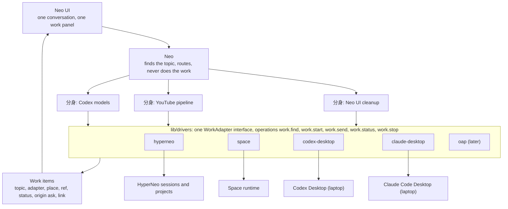

What each layer never does:

- Neo never does a topic's reasoning or work, and never lists everything. It finds open work, routes, and answers small talk.
- A holder never says "I can't". When it lacks an answer, it asks an agent or session that has one, through an adapter.
- An adapter never decides what to do. It operates one backend and reports what happened.
- The work panel never reads a backend directly. It reads work items, so a new adapter shows up without UI changes.

## The adapter interface

```ts
type WorkStatus = 'queued' | 'running' | 'needs_you' | 'done' | 'failed' | 'stopped';
type Place = { machine: string; folder?: string; spaceId?: string; name: string };
type WorkRef = { adapter: string; daemon?: string; id: string };

interface WorkSummary {
  ref: WorkRef;
  title: string;
  place: Place;
  status: WorkStatus;
  lastActivityAt: number;
  link?: string;
}

interface PlaceGroup {
  place: Place;
  lastActivityAt: number;
  openCount: number;
  archivedCount: number;
  adapters: string[];
  work: WorkSummary[];
}

type WorkRejection =
  | 'unknown_adapter'
  | 'unsupported'
  | 'not_found'
  | 'not_open'
  | 'not_delivered'
  | 'unreachable'
  | 'invalid_place';

type Result<T> = { ok: true; value: T } | { ok: false; reason: WorkRejection; detail: string };

interface WorkAdapter {
  id: string;
  capabilities: ReadonlyArray<'find' | 'start' | 'send' | 'status' | 'stop'>;
  find(q: { text?: string; place?: Place; includeClosed?: boolean; limit: number }): Promise<PlaceGroup[]>;
  start(w: { place: Place; title: string; message: string }): Promise<Result<WorkSummary>>;
  send(ref: WorkRef, message: string): Promise<Result<{ delivered: boolean }>>;
  status(ref: WorkRef): Promise<Result<WorkSummary & { lastReply?: string }>>;
  stop(ref: WorkRef): Promise<Result<void>>;
}
```

- Five verbs. Finding a place is part of `find`, a deep link is a field, and push events wait: status is refreshed on read and on a timer until a backend can push.
- Rejections are result values with a named reason, following ADR 0006; `detail` carries the backend's own words. `unknown_adapter` and `unsupported` come from the operation layer (an adapter id that isn't registered, or a verb it doesn't declare). `not_found` and `not_open` cover a ref that doesn't exist or is archived or ended, such as `message.send`'s archived and ended rejections. `not_delivered` means the backend refused or dropped the message. `unreachable` means the other daemon didn't answer. `invalid_place` is a folder or Space the adapter can't start work in.
- `capabilities` makes a missing verb explicit. Claude Code Desktop has no `stop` today, so its adapter declares four verbs and Neo tells the user instead of failing.
- A different implementation of the same backend can replace an adapter in the registry without touching Neo.

## Operations

Neo reaches every adapter through one set of operations:

| Operation | What it does |
| --- | --- |
| `work.find {text?, folder?, spaceId?, adapters?, includeClosed?, limit?, localOnly?}` | Asks every local adapter and, unless `localOnly` is set, every attached daemon; merges the results by place and returns the groups most recent first, plus any source that could not answer. |
| `work.start {adapter, place, title, message}` | Starts new work in a place and records a work item. |
| `work.send {ref, message}` | Sends to existing work, confirms delivery, and records a work item. |
| `work.status {ref}` | Returns the current status, the last reply and the link. |
| `work.stop {ref}` | Stops the current turn, when the adapter supports it. |

- A reference with a `daemon` is forwarded with `remoteDaemons.invoke(daemon, 'work.…', input)`, which already exists and calls any operation on an attached daemon. `work.find` sets `localOnly: true` when it fans out, so two daemons attached both ways never ask each other in a loop.
- `work.start` and `work.send` run straight away when the user's current message asked for the work. When a holder decides on its own, Neo shows a Start card first.

## Finding work and places

Today Neo calls `daemon.snapshot` at the start of every turn. For each kind of record it returns a total and the 20 most recently active items. Archived items are hidden, but ended sessions and done or cancelled tasks are still listed. On 2026-10-03 Neo saw a total of 2,451 sessions and the names of twenty.

`work.find` replaces that, and it also serves as the project list, so no separate operation is needed:

- With no text it returns every place, most recent first, with its open work.
- With text it matches place names, work titles and content. HyperNeo already keeps a full-text index over messages and tasks (`message_search_content` / `message_search_fts`), so far used only by the UI's `message.search` RPC.
- A place appears even when nothing in it is open, so Neo can start new work there and resolve "in dolmen" to a folder.
- Groups merge across adapters on the same machine: `~/focus/dolmen` is one place whether its work lives in Claude Code Desktop, Codex Desktop or HyperNeo. Neo then picks an adapter inside the place by the rules under "How Neo chooses".

| Kind | Counts as open | Left out by default |
| --- | --- | --- |
| HyperNeo session | active, paused, pending worktree choice (shown as needs you) | ended, archived |
| Space task | draft, open, in progress, review, approved, blocked, rate or usage limited | done, cancelled, stopped, archived |
| Space agent | active, paused | disabled, archived |
| Space | active, including paused | archived, stopped |
| Codex thread | in the thread list | archived, guardian review sub-threads |
| Claude Code Desktop session | not archived | archived |
| Work item | queued, running, needs you | done, failed and stopped, once the user has been told |

Where each adapter gets its places:

| Adapter | Places |
| --- | --- |
| hyperneo | session folders, workspace history, the Neo project |
| space | Spaces and their registered workspaces |
| codex-desktop | thread working directories in `~/.codex/state_5.sqlite` |
| claude-desktop | each session's origin folder in the app's session records, archived sessions included |

## Topics, places and work items

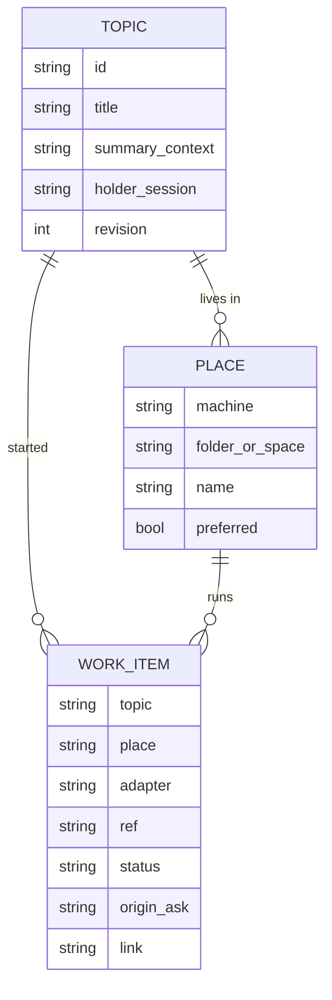

- **Topic** exists today as `neo_concerns`.
- **Place** links a topic to where its work lives, for example "this topic's code is in the dev-neokai Space" or "this topic uses the Codex thread in that repo". A topic can have several.
- **Work item** grows out of `neo_work`. `neo_work_resources` and `neo_agent_work_targets` fold into it.

Topics, places and work items belong to Neo. `lib/drivers` owns how each backend is operated.

## Adapters

### hyperneo

HyperNeo's own sessions and projects. They run on the Claude Agent SDK and show in HyperNeo, not in the Claude Code Desktop app.

- `find`: open sessions plus the full-text index, grouped by session folder.
- `start`: a session in the folder's project, or in the Neo project when no files are needed.
- `send`: the `message.send` path, which rejects archived and ended targets (#5580) and reports delivery (#5582, #5584).
- `status`: processing state and the last reply. `stop`: interrupt.

### space

HyperNeo Spaces. The adapter calls the Space managers directly, so the Space caller gates that blocked Neo do not apply.

- `find`: Spaces, their open tasks and agents.
- `start`: a task with a workflow, or a message to an agent by `@handle` (#5586).
- `send`: `task.message.send`, or `message.send` to an agent.
- `status`: the task's status. `stop`: cancel the task.

### codex-desktop

Runs on the laptop, ported from the `codex-driver` skill. Everything it does shows in Codex Desktop.

- `find` and `status`: `~/.codex/state_5.sqlite` and the thread's rollout file.
- `start`: the shared app-server socket that Codex Desktop uses (`thread/start`, `thread/name/set`, `turn/start`), so the thread appears in the Desktop sidebar.
- `send`: `codex queue --thread <id> --message …`, then a delivery check in the rollout.
- `stop`: interrupt the turn through the app-server. `link`: to be found.

### claude-desktop

Runs on the laptop. Everything it does shows in the Claude Code Desktop app. Verified on 2026-10-04 with a throwaway session:

| Verb | How |
| --- | --- |
| `start` | `claude -p --session-id <uuid> -n <title> "<opening message>"` in the place's folder, then `claude --desktop --resume <uuid>` under a pseudo-terminal. The app creates session `local_<uuid>` in its sidebar with the transcript and starts its own process for it. |
| `send` | When the app runs the session, a short headless relay, `claude -p --model haiku --allowedTools "SendMessage ListAgents"`, delivers the message with cross-session messaging and it starts a turn. When the session is not running, `claude -p --resume <uuid> "<message>"`. |
| `find`, `status` | `claude agents --json` for live sessions (`status` busy, waiting or idle, and `waitingFor`), the app's session records for title, folder, archived state and last activity, and the transcript for the last reply. |
| `link` | `claude://claude.ai/epitaxy/local_<uuid>`, the link the app reports for a session. |
| `stop` | Not available outside the app. The adapter does not declare it. |

Constraints:

- `claude --desktop` refuses to run without a terminal, so the adapter launches it under a pseudo-terminal (`script -q /dev/null claude --desktop --resume <uuid>` works).
- Never resume a session headlessly while the app runs it: the two writers could fork the conversation. Use the relay whenever `claude agents --json` lists the session.
- A relayed message arrives as a message from another session, which the receiving Claude treats as a teammate's request. Sessions in bypass-permissions mode hold such messages and the app cannot show the approval dialog, so they expire after five minutes. Sessions Neo drives run in auto or default mode.
- The first turn runs headless before the session reaches the app. Keep it short, open the session in the app, then send the real task through the relay so the work happens where the user can watch it.

### Status mapping

| Status | hyperneo | space | codex-desktop | claude-desktop |
| --- | --- | --- | --- | --- |
| queued | message accepted, not yet picked up | draft, open, rate or usage limited | message queued | relay delivered, turn not started |
| running | processing | in progress | turn active | `busy` |
| needs you | waiting for input or a worktree choice | review, blocked | approval requested | `waiting` (permission prompt or input needed) |
| done | idle after the reply | done | turn completed | `idle` after the reply |
| failed | turn or delivery error | (none) | turn error | turn error in the transcript |
| stopped | interrupted | cancelled, stopped | interrupted | (no stop) |

## OAP

The Open Agent Protocol (`~/focus/open-agent-protocol`) defines one boundary between a control layer and an agent loop: sessions, runs, streamed events, cancellation, recovery, and permission and question prompts. `oapx` serves Claude Code, Codex app-server, Pi, ACP agents, Hermes, DeepSeek and OpenCode behind it. Findings from the session that works on that repository:

| Question | Answer |
| --- | --- |
| Surface to embed | `oapx hub --stdio --config` is the most stable. Live streaming needs the `oapx hub --addr` HTTP+SSE wire with `clients/ts`. |
| Attaching to open desktop threads | Not supported. Reopen resumes only sessions the hub recorded. |
| Listing a harness's history | Out of scope. |
| Restarts | A hub restart is a cold reconnect: live sessions, pending prompts and replay are lost. |
| Desktop app visibility | Untested. |

Its run events map one-to-one onto the six statuses (`run.started` running, `action.permission.requested` and `user.input.requested` needs you, `run.completed` done, `run.failed` failed, `run.cancelled` stopped). When it matures, an `oap` adapter can implement `WorkAdapter` over `oapx hub`, first for harnesses with no native adapter (Pi, OpenCode, ACP agents), and possibly behind codex-desktop or claude-desktop once desktop visibility is proven.

## How Neo chooses

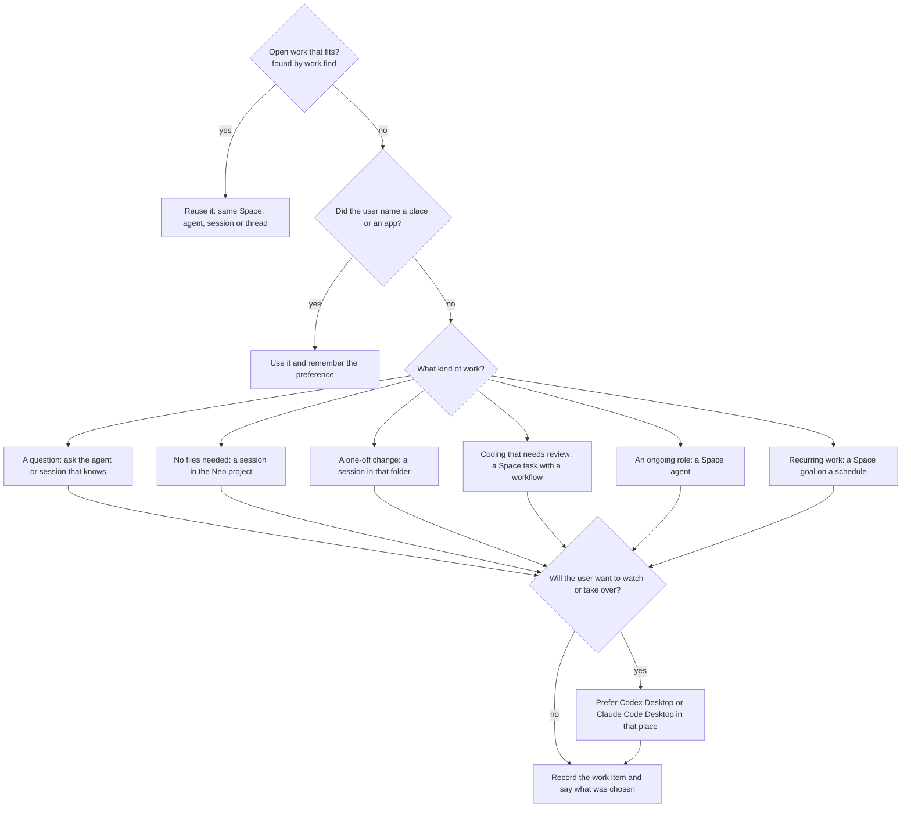

Preferences the user states, such as "dolmen work goes to its Codex thread", are saved in the topic's context and answer the second question next time.

## Walkthroughs

### Today: the font-size question

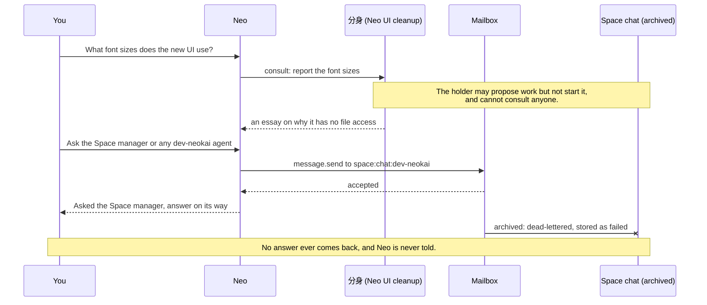

### Today: task #2008

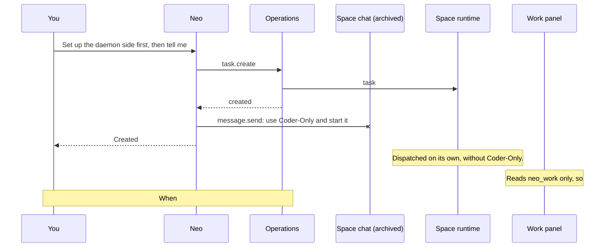

### With adapters: the font-size question

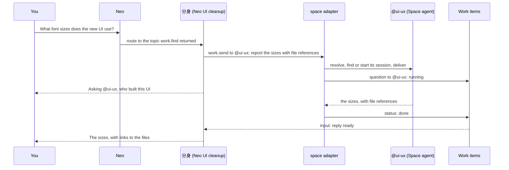

### With adapters: task #2008

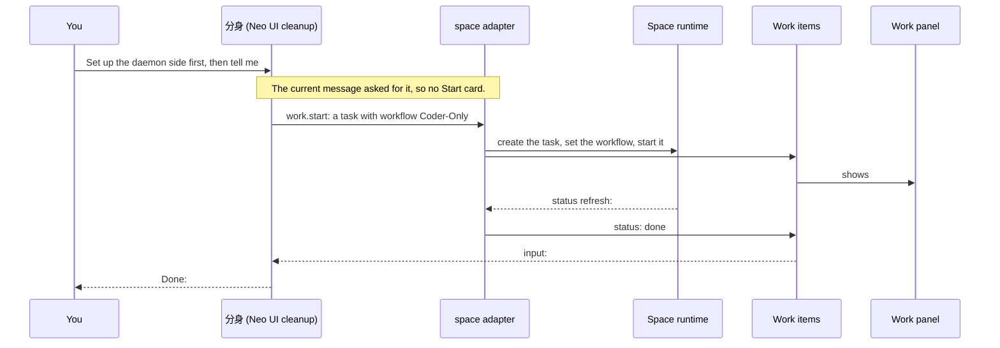

### With adapters: new work in Claude Code Desktop on the laptop

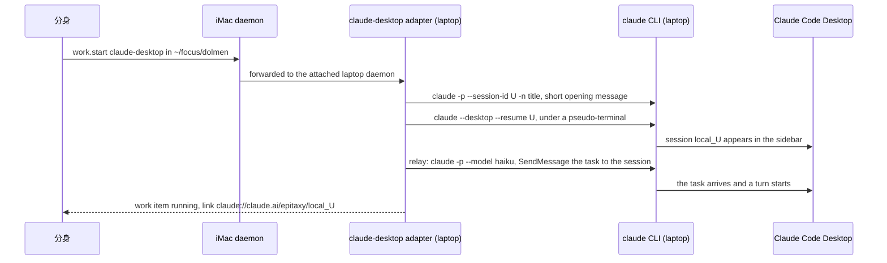

### With adapters: a hand-off to Codex Desktop

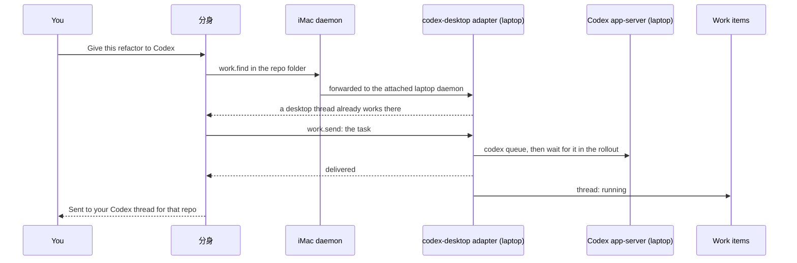

## Status and follow-up

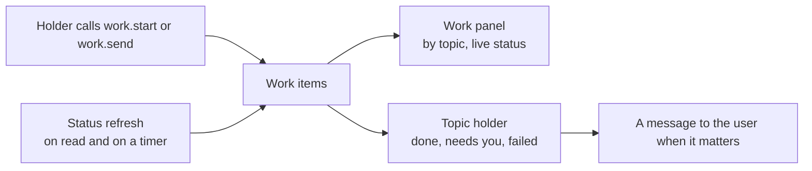

`work.start` and `work.send` record the work item themselves, so recording does not depend on the model remembering to file a card. Until backends can push, the drivers subsystem refreshes the status of open work items when they are read and on a timer. When an item reaches done, needs you or failed, its holder gets an input and Neo tells the user through the existing nudge and publication machinery. Every work item has a way in: HyperNeo sessions and Space tasks open in place (the session pane from #5525); desktop items open their app through the link.

## Where adapters run

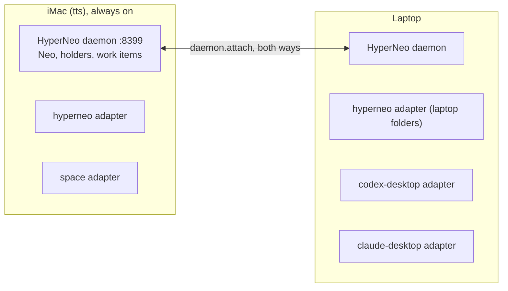

- An adapter runs next to its backend. Desktop adapters run on the laptop, where the apps are.
- `remoteDaemons.invoke` already forwards any operation to an attached daemon. Attachments live only in memory today, so M6 stores them in global settings and restores them at startup.
- The daemons' RPC door has no caller identity: any WebSocket peer that reaches it calls operations as the local user, including `daemon.attach`. That exposure exists whether or not attachments are remembered, so both daemons stay on the private network (Tailscale) for now, and a shared-secret handshake on attach and on the RPC door is planned as its own security slice.

## Gaps and fixes

| Gap | What happened | Fix | Status |
| --- | --- | --- | --- |
| G1 Holders can't act | The holder answered a font-size question with an essay about having no file access; its prompt forbids starting work or consulting others. | Holders route and delegate through `work.*`. | M4 |
| G2 Sends to dead sessions looked successful | Every message to the archived dev-neokai Space chat since 9/21 was stored as failed while Neo reported success. | Reject archived and ended targets, notify the sender, expose delivery status, address agents by name. | Merged: #5580, #5582, #5584, #5586 |
| G3 Neo can't find open work | `daemon.snapshot` showed 2,451 sessions and the 20 most recent, mixed with ended sessions and done tasks. HyperNeo work landed outside the dev-neokai Space. | `work.find`: open work grouped by place, places included. | M1, M4 |
| G4 Projects named by session id | Scratch work runs in `/var/folders/…/hyperneo-neo-work/<session id>`, and the sidebar names projects after folders. | One named Neo project for no-file sessions. | M2 |
| G5 Work Neo starts is invisible | #2007–#2009 were made with `task.create`; the panel reads `neo_work`, last written 9/29. | `work.start` and `work.send` record work items; the panel reads them. | M5 |
| G6 Nobody follows up | Nothing reports when #2008 finishes; a card has been queued since 9/29. | Status refresh and holder notifications. | M9 |
| G7 Space gates block Neo | Cancelling #2007 was denied; `workflow.list` returned `space_not_resolved`; session reads were protected. | Session reads fixed; the space adapter calls Space managers directly. | #5535 merged; M3 |
| G8 All backend knowledge in one prompt | The root prompt is about 18k characters. | Root Neo learns `work.*`; adapter specifics live in the drivers subsystem. | M4 |
| G9 The approval path never runs | Neo skips work cards and calls `task.create` directly. | Approval at `work.start` and `work.send`. | M4, M5 |

## Plan

The minimal path. Each slice stays under the 300 production-line limit from ADR 0004, with construction, wiring and deletion in separate PRs.

| Slice | What | Closes | Needs |
| --- | --- | --- | --- |
| M1 | `lib/drivers` core: the `WorkAdapter` interface, the registry, the five `work.*` operations with routing to attached daemons, and the hyperneo adapter's `find` and `status`. | G3 | none |
| M2 | hyperneo `start`, `send` and `stop`, and the named Neo project for no-file sessions. | G4 | M1 |
| M3 | The space adapter. | G7 | M1 |
| M4 | Neo wiring: `work.find` instead of `daemon.snapshot`, holders use `work.*`, approval for holder-initiated work. | G1, G3, G8, G9 | M2, M3 |
| M5 | Work items recorded by `work.start` and `work.send`; the panel lists them with status. | G5, G9 | M4 |
| M6 | Store and restore daemon attachments; run the laptop daemon attached both ways. | (enables M7, M8) | M1 |
| M7 | The codex-desktop adapter. | new backend | M6 |
| M8 | The claude-desktop adapter: `find`, `status`, `start`, `send` and `link`. | new backend | M6 |
| M9 | Status refresh on a timer, holder inputs and messages on done, needs you and failed. | G6 | M5 |

After M5, Neo drives HyperNeo and Spaces correctly on the iMac. M7 and M8 add the desktop apps.

Later, outside the minimal path: a shared-secret handshake for daemon attach and the RPC door, push events instead of refresh, an `oap` adapter, `stop` for Claude Code Desktop when the app offers a way, a Codex Desktop deep link, and editing a topic's places in the UI.

## Open questions

1. Adopt the six statuses everywhere, including OAP later? This document assumes yes.
2. Which status changes reach the user as a message? The proposal: done, needs you and failed.
3. Should `work.find` search desktop transcripts, or only titles and folders, to start with?
4. Should a topic's places show in the UI where the user can edit them, or only change through conversation?
