# Neo driver model

Status: proposal, agreed in discussion on 2026-10-04. Follows epic #5334.

This document describes how Neo understands and drives the backends that do work: HyperNeo chats and projects, HyperNeo Spaces, Codex, Claude Code, and any harness that speaks the Open Agent Protocol (OAP). Each part traces back to a failure seen while dogfooding Neo on 2026-10-03, recorded in the tts daemon's database.

## Decisions

- **One holder per topic.** A topic can span several projects and backends. Its holder (分身) keeps the context and decides how to drive it.
- **Find open work first.** Neo searches for work that is still open instead of listing everything the daemon has ever seen.
- **Reuse before creating.** When a Space, agent, session or thread already fits, the work goes there. Work on HyperNeo goes to the dev-neokai Space.
- **No-file sessions share one project.** Sessions that need no files go in a single named Neo project, never in temp folders named by session id.
- **Drivers are their own subsystem.** Driving harnesses lives in `lib/drivers`. Neo is its first user and sits closest to the user.
- **A daemon on each Mac.** The iMac (tts) and the laptop each run HyperNeo and attach to each other both ways.

## What Neo is

Agents produce more parallel work than one person can manage session by session. Neo is the one place the user talks to. It sends each ask to a topic holder, which keeps that topic's context and decides how to move it forward: answer from what it knows, check progress, or hand work to a backend.

The backends share one shape: a place (a folder, project or Space) and units of work inside it (sessions, threads, tasks, agents). Spaces add structure for longer work: tasks with workflows, long-lived agents, goals on a schedule, and an evolve loop. Neo should use Spaces where they fit and keep them out of the user's way otherwise.

The UI stays simple: one conversation and one work panel, with a way into any session when the user wants detail.

## The model

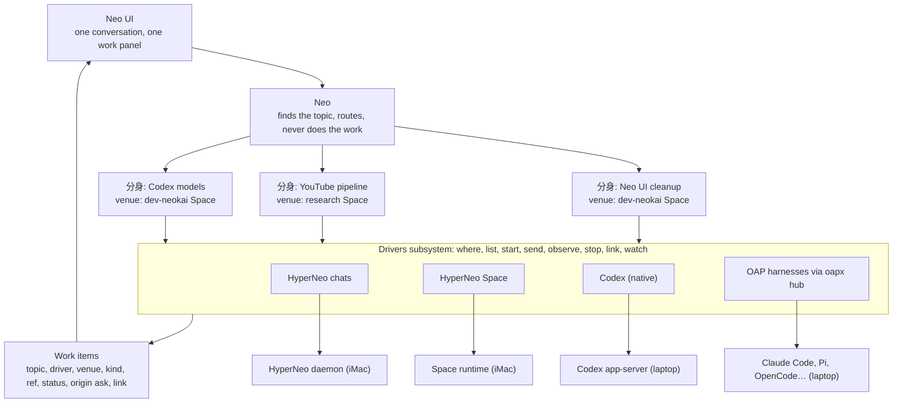

What each layer never does:

- Neo never does a topic's reasoning or work, and never lists everything. It finds open work by search, routes, and answers small talk.
- A holder never says "I can't". When it lacks an answer, it asks an agent or session that has one, through a driver.
- A driver never decides what to do. It operates one backend and reports what happened.
- The work panel never reads a backend directly. It reads work items, so a new backend shows up without UI changes.

## Finding work

Today Neo calls `daemon.snapshot` at the start of every turn. For each kind of record it returns a total and the 20 most recently active items. Archived items are hidden, but ended sessions and done or cancelled tasks are still listed. On 2026-10-03 Neo saw a total of 2,451 sessions and the names of twenty.

HyperNeo already keeps a full-text index over messages and tasks (`message_search_content` / `message_search_fts`), but only the UI can use it, through the `message.search` RPC. Vector search exists only for agent memory.

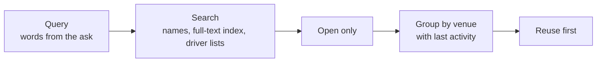

The proposed operation (working name `work.find`) returns a short ranked list grouped by venue. Closed work stays searchable when the user asks about history; it is not the default.

| Kind | Counts as open | Left out by default |
| --- | --- | --- |
| Session | active, paused | ended, archived |
| Space task | draft, open, in progress, review, approved, blocked, rate or usage limited | done, cancelled, stopped, archived |
| Space agent | active, paused | disabled, archived |
| Space | active, including paused | archived, stopped |
| Codex thread | in the thread list | archived, guardian review sub-threads |
| Work item | queued, running, needs you | done, failed and stopped, once the user has been told |

## Topics, venues and work items

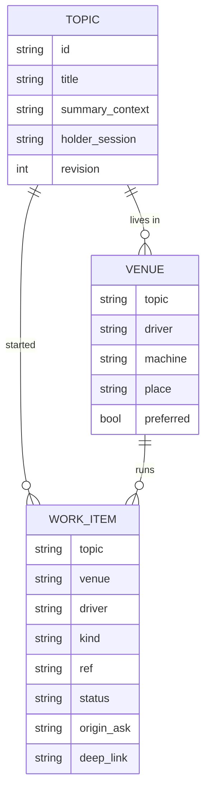

- **Topic** exists today as `neo_concerns`.
- **Venue** is new: where a topic's work lives, for example "this topic's code is in the dev-neokai Space" or "this topic uses the Codex thread in that repo".
- **Work item** grows out of `neo_work`. `neo_work_resources` and `neo_agent_work_targets` fold into it.

Topics, venues and work items belong to Neo. The drivers subsystem owns how each backend is operated.

Work items use six statuses: queued, running, needs you, done, failed, stopped. They match OAP's run states (below), and each driver maps its backend onto them. A Space task in `review` is "needs you".

## Drivers

`lib/drivers` owns the driver registry, the packages, the verb operations, status mapping, `watch` events and forwarding between daemons. A driver package has three parts:

- `manifest.json`: backend, work kinds, verbs, deep-link format.
- `SKILL.md`: the backend's mental model, when to use which primitive, pitfalls. A holder reads it when its topic has a venue on that backend. Root Neo only sees a one-line menu entry per driver, which keeps the root prompt (about 18k characters today) from growing with every backend.
- `verbs/`: the code or scripts behind each verb, installed on the daemon that runs on the backend's machine and exposed as operations. Neo has no shell, so operations are its only way to act.

Approval lives at `start` and `send`: they run straight away when the user's current message asked for the work, and show a Start card first when a holder decided to do it on its own.

| Verb | HyperNeo chats | HyperNeo Space | Codex (native) | Any harness via `oapx hub` | Claude Code |
| --- | --- | --- | --- | --- | --- |
| where | find or create the project for a folder (to build) | `space.list`, `space.get` | thread working directory (`threads.py list`) | outside OAP | to design |
| list | `session.list` | `task.list`, `agent.list`, `goal.list` | `threads.py list` | the hub's own sessions only | to design |
| start | session in a project (to build) | `task.create` + `task.preferredWorkflow.set` + `task.start`, `agent.create`, `goal.create` | `appserver.py start` | `session.open` + submit | to design |
| send | `message.send` (#5580) | `message.send` to an agent by name (#5586), `task.message.send` | `send.sh`: `codex queue` plus a delivery check | submit, with queue admission when busy | to design |
| observe | `session.get`, `session.message.list`, `message.status` (#5582) | `task.get`, `goal.get`, `daemon.session.inspect` (#5535) | `threads.py show` | `session.state`, the `sessions` listing | to design |
| stop | `session.interrupt` | `task.transition` (denied for Neo today), `session.interrupt` | to build | `run.cancel`, then wait for `run.cancelled` | to design |
| link | HyperNeo session view | Space task view | Codex Desktop link (to build) | outside OAP | to design |
| watch | session idle and turn-end events exist in the daemon (to build) | `space.task.updated` events exist in the daemon (to build) | follow the thread's rollout (to build) | SSE events from `oapx hub --addr`, with resume | to design |

The native Codex column is the existing `codex-driver` skill (`~/.claude/skills/codex-driver`). It covers four of the eight verbs and already prefers a desktop thread the user can watch.

## Harnesses and OAP

The Open Agent Protocol (`~/focus/open-agent-protocol`) defines one boundary between a control layer and an agent loop: sessions, runs, streamed events, cancellation, recovery, and permission and question prompts. `oapx` serves Claude Code, Codex app-server, Pi, ACP agents, Hermes, DeepSeek and OpenCode behind that boundary. The laptop has oapx 0.1.0-alpha.7, Codex 0.157.0 and Claude Code 2.1.283.

Findings from the session that works on that repository, checked against it:

| Question | Answer |
| --- | --- |
| Surface to embed | `oapx hub --stdio --config` is the most stable: one process, many sessions. Its stdio wire has no events stream yet, so live streaming uses the `oapx hub --addr` HTTP+SSE wire with `clients/ts`. Per-session `serve agent` processes would mean rebuilding the hub. |
| Attaching to open threads | Not today. Reopen resumes only sessions the hub recorded, and it has not been tried against a thread Codex Desktop is writing. |
| Listing a harness's history | Out of scope. OAP lists the hub's own sessions only. |
| Restarts | A hub restart ends every live session, pending prompt, subscription and replay journal. Treat it as a cold reconnect. |
| Version pins | Pins name research ledgers and test corpora; there is no runtime refusal, so Claude Code 2.1.283 should run. |
| Desktop app visibility | Untested for both Codex Desktop and the Claude app. |

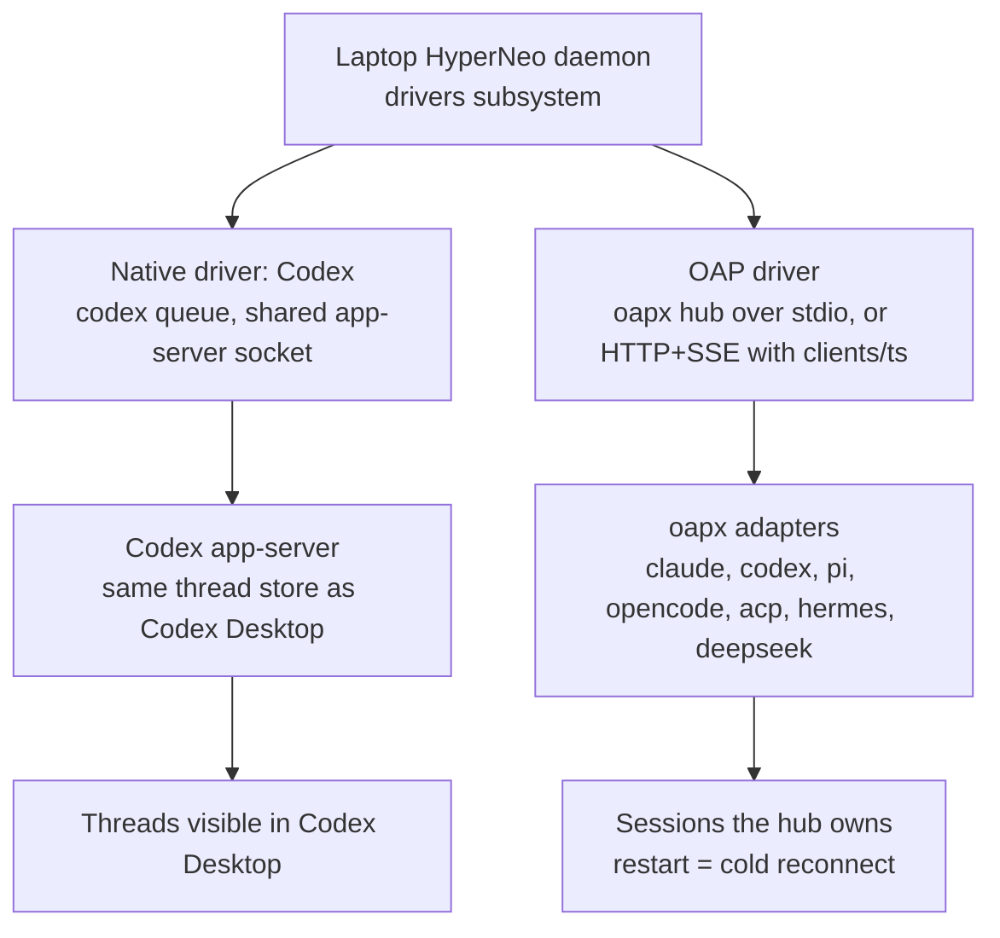

OAP's run events map onto the work-item statuses:

| Status | OAP signal |
| --- | --- |
| queued | submit admitted as `queued`, or `active_runs[].status = queued` with a queue position |
| running | `run.started`, `run.status.updated` |
| needs you | `action.permission.requested`, `user.input.requested`, answered through resolve |
| done | `run.completed` |
| failed | `run.failed` |
| stopped | `run.cancelled` (a cancel response is only intent) |

Recommendation: align on OAP's semantics and use oapx as one backend behind an OAP driver, not as HyperNeo's whole harness layer. `where`, `list`, `link` and attaching to threads a desktop app owns sit outside OAP today. Use the native path when the user will want to open the work in a desktop app or continue a thread started there; use the OAP path for harnesses with no native driver and for managed sessions nobody needs to watch in an app. Do not build on per-session `serve agent` processes, and do not resume threads a desktop app is actively writing.

## How Neo chooses

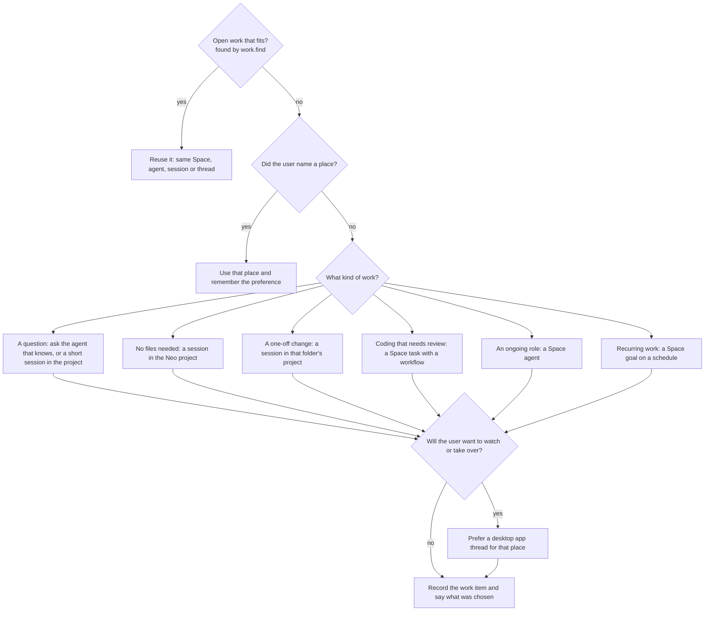

The trade-offs behind the Space choices live in the HyperNeo Space driver's `SKILL.md`. Preferences the user states are saved in the topic's context and answer the second question next time.

## Walkthroughs

### Today: the font-size question

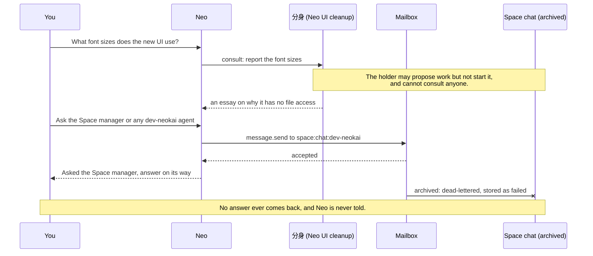

Since 9/21 every message to that archived chat was stored as failed. Fixed by #5580, #5582, #5584 and #5586.

### Today: task #2008

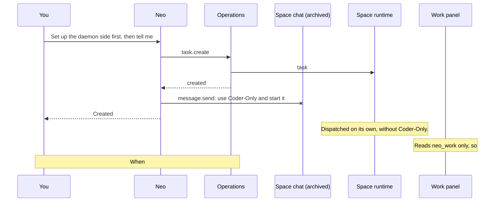

### With drivers: the font-size question

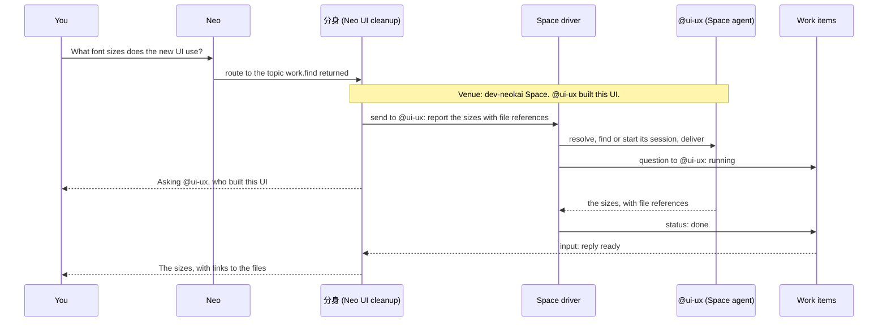

### With drivers: task #2008

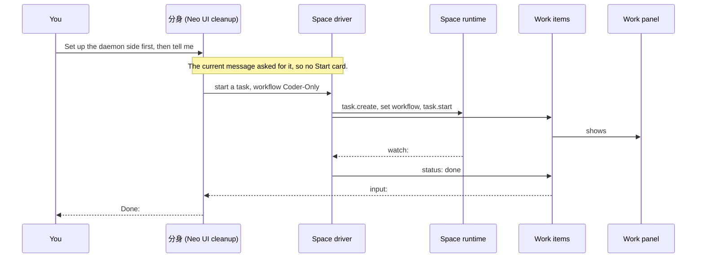

### With drivers: a hand-off to Codex on the laptop

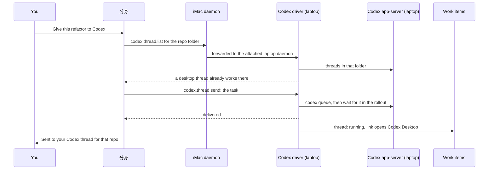

## Status and follow-up

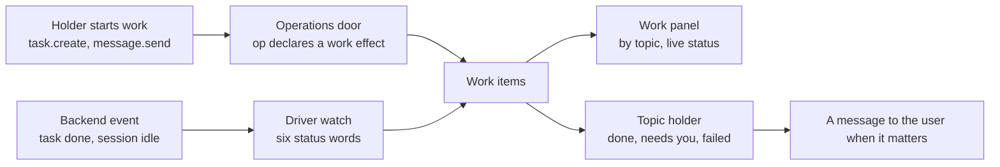

Recording happens at the operations door: an operation that starts or messages work declares that effect, and the door records a work item whenever the caller is a Neo session. It does not depend on the model remembering to file a card. Follow-up comes from the backend through the driver's `watch`, and the existing nudge and publication machinery carries the message to the user. Every work item has a way in: HyperNeo sessions and Space tasks open in place (the session pane from #5525); Codex and Claude Code items open their desktop app through the item's deep link.

## Where drivers run

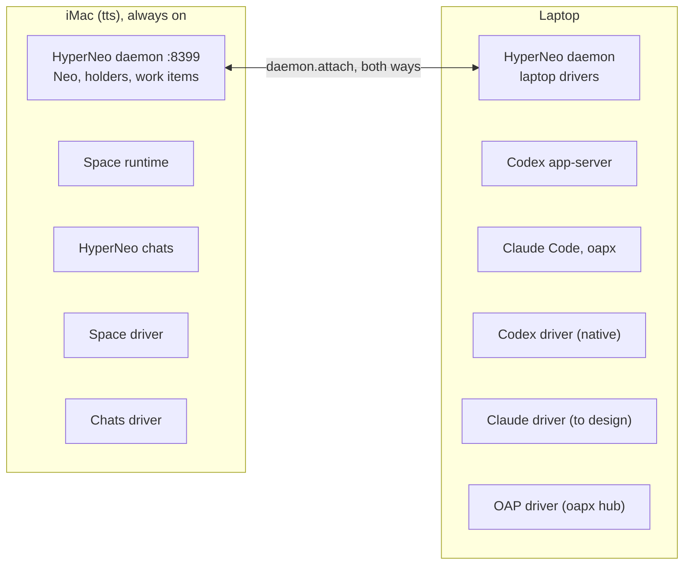

Remote addressing (`daemon:<id>::session:<id>`) already forwards `message.send` between daemons. Driver verbs need the same forwarding for every operation.

## Gaps and fixes

| Gap | What happened | Fix | Status |
| --- | --- | --- | --- |
| G1 Holders can't act | The holder answered a font-size question with an essay about having no file access; its prompt forbids starting work or consulting others. | Holders route and delegate through drivers. | S1 |
| G2 Sends to dead sessions looked successful | Every message to the archived dev-neokai Space chat since 9/21 was stored as failed while Neo reported success. | Reject archived and ended targets, notify the sender, expose delivery status, address agents by name. | Merged: #5580, #5582, #5584, #5586 |
| G3 Neo can't find open work | `daemon.snapshot` showed 2,451 sessions and the 20 most recent, mixed with ended sessions and done tasks. HyperNeo work landed outside the dev-neokai Space. | `work.find`, open work only, grouped by venue; venues on each topic. | S2, S5 |
| G4 Projects named by session id | Scratch work runs in `/var/folders/…/hyperneo-neo-work/<session id>`, and the sidebar names projects after folders. | One named Neo project for no-file sessions. | S3 |
| G5 Work Neo starts is invisible | #2007–#2009 were made with `task.create`; the panel reads `neo_work`, last written 9/29. | Work items recorded at the operations door; the panel reads them. | S5, S6 |
| G6 Nobody follows up | Nothing reports when #2008 finishes; a card has been queued since 9/29. | `watch` updates status and tells the holder. | S7 |
| G7 Space gates block Neo | Cancelling #2007 was denied; `workflow.list` returned `space_not_resolved`; session reads were protected. | Neo can do what the user can. | #5535 merged; S4 |
| G8 All backend knowledge in one prompt | The root prompt is about 18k characters. | A `SKILL.md` per driver, read by the holder that needs it. | S1, S8 |
| G9 The approval path never runs | Neo skips work cards and calls `task.create` directly. | Approval at the driver's `start` and `send`. | S5 |

## Plan

Each slice stays under the 300 production-line limit from ADR 0004, with construction, wiring and deletion in separate PRs.

| Slice | What | Closes | Needs |
| --- | --- | --- | --- |
| S1 | Holder role: route and delegate, never "I can't". A short HyperNeo doc for holders; root Neo keeps a menu. | G1, part of G8 | none |
| S2 | `work.find`: names and the full-text index, open work only, grouped by venue. Neo uses it instead of `daemon.snapshot`. | G3 | none |
| S3 | One named Neo project for no-file sessions, titled by topic. | G4 | none |
| S4 | Lift Space gates for Neo callers on task transitions, workflow reads and preferred workflow. | G7 | none |
| S5 | Venues and work items: records, work effects on operations, recording at the door, approval at start and send. | G3, G5, G9 | none |
| S6 | The work panel reads work items with live status, grouped by topic. | G5 | S5, #5525 |
| S7 | `watch` for Space tasks and HyperNeo sessions, with holder inputs and messages on done, needs you and failed. | G6 | S5 |
| S8 | The drivers subsystem in `lib/drivers`: package format, the two HyperNeo drivers, project and session creation operations. | G8 | S5 |
| S9 | A laptop daemon attached both ways, driver verbs forwarded between daemons, and the native Codex driver from `codex-driver`. | new backend | S8 |
| Spike | A two-session Codex hub with the real binary on the laptop; check Codex Desktop and Claude app visibility. | decides S10, S11 | none |
| S10 | The OAP driver over `oapx hub` (HTTP+SSE via `clients/ts` until the stdio wire has events), adding Pi, OpenCode and ACP agents. | new backends | S8, Spike |
| S11 | Claude Code: a native driver or the OAP driver, as the spike shows. | new backend | S9, Spike |

## Open questions

1. Adopt OAP's six run states as the work-item statuses? This document assumes yes.
2. Which status changes reach the user as a message? The proposal: done, needs you and failed.
3. Claude Code: a native driver for the sessions the desktop app shows, or OAP-managed sessions opened later? The spike answers part of this.
4. Start with names and full-text search, and add vector search over sessions only if it misses too often?
5. Should a topic's venues show in the UI where the user can edit them, or only change through conversation?
