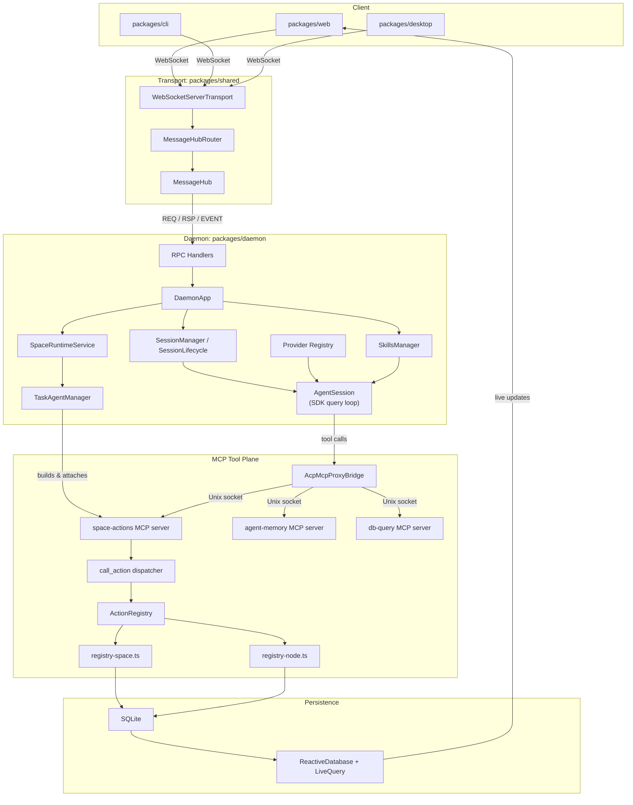
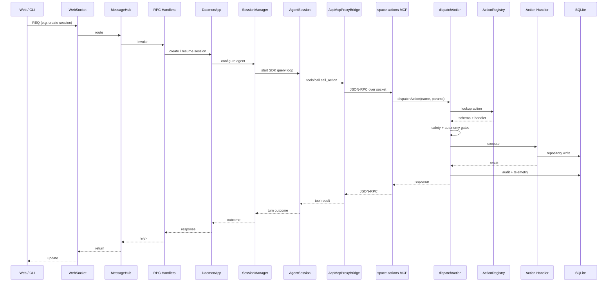

# RPC/MCP Unification — Current Structure

This diagram shows the merged state after the `space-actions` dispatcher became the only Space MCP surface and the typed `node-agent` / `space-agent-tools` servers were removed.

## High-level flow

## `call_action` sequence

## Key points

- `MessageHub` is the northbound RPC/event transport for the web, CLI, and desktop clients.
- `AgentSession` runs the Claude Agent SDK query loop. It receives tool schemas from the daemon and calls them through `AcpMcpProxyBridge`.
- `AcpMcpProxyBridge` exposes the selected SDK MCP servers (`space-actions`, `agent-memory`, `db-query`, and `hyperneo-operations-*`) on a local Unix socket so the SDK can call them as external MCP servers.
- `TaskAgentManager` builds a `space-actions` server for each workflow worker. It composes a `NodeAgentToolsConfig` and a `SpaceAgentToolsConfig` so the worker has access to both node actions and the worker-allowlisted Space actions.
- The `call_action` dispatcher is the only Space MCP surface. It routes through `ActionRegistry`, which combines `registry-space.ts` and `registry-node.ts`, runs safety/autonomy/audit in one pipeline, and executes the handler.
- All state writes go through SQLite repositories; `ReactiveDatabase` and `LiveQuery` push changes back to clients.
