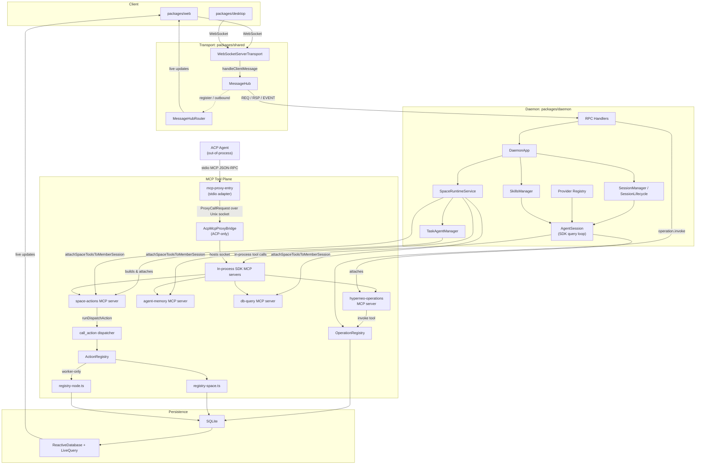
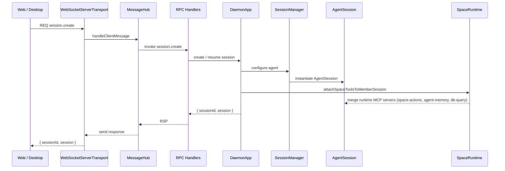
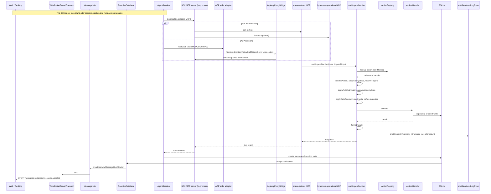

# RPC/MCP Unification — Current Structure

This diagram shows the merged state after the `space-actions` dispatcher became the consolidated Space action-dispatch surface and the typed `node-agent` / `space-agent-tools` MCP servers were removed.

## High-level flow

## `session.create` sequence

`session.create` returns immediately after the session is created and its runtime MCP servers are attached. It does not start an SDK query.

## `call_action` / `invoke` sequence (async agent turn)

The SDK query loop starts later and runs asynchronously. Turn outcomes reach clients through `messages.bySession` and `session.updated` LiveQuery events, not through the original request response.

## Key points

- `MessageHub` is the northbound RPC/event transport for the web and desktop clients. `packages/cli` is the HTTP/server wrapper that installs the daemon's WebSocket upgrade handlers; it does not construct a `WebSocketClientTransport` itself.
- For inbound traffic, `WebSocketServerTransport.handleClientMessage()` delivers messages to the callback installed by `MessageHub.registerTransport()`, which calls `MessageHub.handleIncomingMessage()`. `MessageHubRouter` manages client registration and outbound delivery, not the inbound request path.
- `AgentSession` runs the Claude Agent SDK query loop. For `provider !== 'acp'`, it receives tool schemas from in-process SDK MCP servers (`space-actions`, `agent-memory`, `db-query`, and `hyperneo-operations-*`) and calls them directly. `AcpMcpProxyBridge` is constructed only when `provider === 'acp'`; it hosts a Unix socket that the external `mcp-proxy-entry` stdio adapter connects to, so the ACP agent can call the same daemon-hosted MCP servers out-of-process.
- `SpaceRuntimeService.attachSpaceToolsToMemberSession()` attaches `space-actions` and, when configured, also merges `agent-memory` and a Space-scoped `db-query` server. `space-actions` is therefore the consolidated Space action-dispatch surface, not the only Space MCP surface.
- `TaskAgentManager` builds a `space-actions` server for each workflow worker. `composeRoleActionEntries()` returns only `spaceEntries` whenever the role is not `workflow_worker`; node entries are created and merged with the worker allowlist only for `workflow_worker` sessions.
- The `call_action` dispatcher is the consolidated Space action-dispatch surface. It routes through `runDispatchAction` from `dispatcher-pipeline.ts`, which looks up the action in a role-filtered `ActionRegistry` and runs resolve, safety, target resolution, role admission, autonomy, rate, and audit before executing the handler.
- `applyRateAndAudit` writes the audit entry to the `McpAuditLogRepository` before `executeAction`. Telemetry is emitted after the outcome is known via `emitDispatchTelemetry` → `emitActionDispatchedEvent` → `emitStructuredLogEvent` by default, not to SQLite.
- Some action handlers still perform direct SQLite mutations (for example `update_session_state` in `space-handlers.ts` updates `sessions` through `requireDb().prepare(...).run(...)`); most go through repositories.
- An already-wired operations plane coexists with the dispatcher: `OperationRegistry` (`lib/operations/registry.ts`; 17 operations including `message.send` and `task.*` per `shared operation-names.ts`), the `operation.invoke` RPC handler (`lib/rpc-handlers/operation-handlers.ts`), and the `hyperneo-operations-*` MCP server attached to every agent session (`agent-session.ts`, `query-options-builder.ts`). Both adapters call `invokeOperation` from `lib/operations/invoke.ts`, which resolves the operation, validates input, executes, and validates the result.
- `session.create` returns immediately after creation and tool attachment; it does not start an SDK query. A turn begins later, and its outcomes reach clients through `messages.bySession` LiveQuery events.
- All state writes go to SQLite; `ReactiveDatabase` and `LiveQuery` push changes back to clients.
