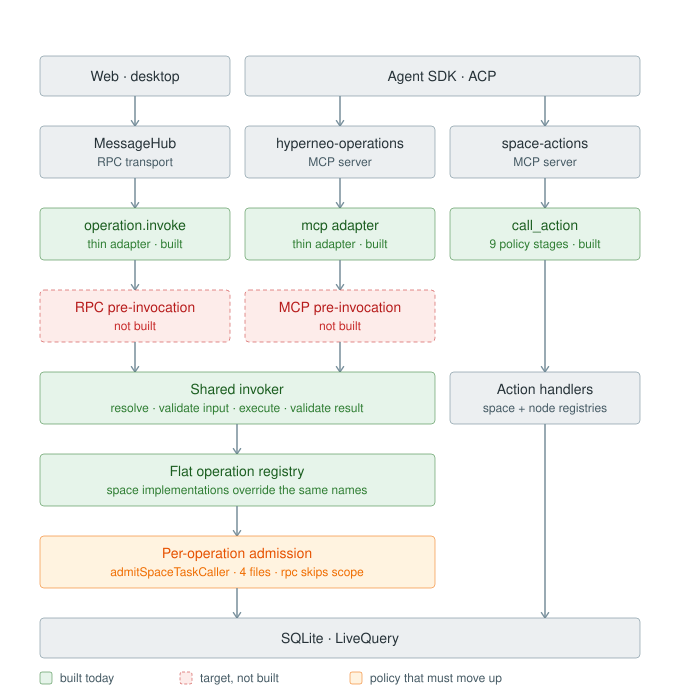

# RPC/MCP unification — the gap between current and target

Companion to [`rpc-mcp-unification-current.md`](./rpc-mcp-unification-current.md) and
[`rpc-mcp-unification-target.md`](./rpc-mcp-unification-target.md). Those describe each end
of the migration; this one marks the delta on a single picture.

Measured against `dev` @ `5d6f88fdb` (2026-09-14).

**How to read it.** Green is built today. Red dashed is in the target and absent from the
code. Amber is policy that exists but sits below the registry and has to move above it.

**One liberty in the drawing:** the red boxes sit in the flow as though the stage existed and
were empty. It does not exist at all — the built path is adapter → shared invoker, one call.
The red boxes are target topology overlaid on built topology, which is the useful shape for
planning but is not a picture of the current call graph. For that, see `-current.md`.

## What is already converged

The spine is real. Both adapters are thin (`lib/operations/rpc-adapter.ts`,
`mcp-adapter.ts`), `invokeOperation` is one superpipe doing resolve → validate input →
execute → validate result, and the registry is genuinely flat: `rpc-handlers/index.ts`
installs `createSpaceOperationRegistryProvider`, which memoizes a single
`createDatabaseOperationCatalog(...)` whose Space implementations are overrides on the same
operation names. `task.transition` is one registry entry, not two.

The target's "no `Space`/`Node` split at this layer" is therefore already satisfied.
`space/operations/` (26 files, 3,012 lines) is an implementation directory, not a parallel
plane, so no restructuring slice is needed ahead of the policy work.

## What is missing

Both pre-invocation columns are empty, not partial:

- `setupOperationHandlers` passes `() => ({})` as the RPC caller resolver, discarding a
  `sessionId` that `CallContext` already carries. None of the target's five RPC stages exist.
- Seven of the target's eight MCP stages are absent. The exception is the autonomy gate,
  which one operation already runs in-plane: `task.resolvePendingCompletion` calls
  `decideAutonomyAdmission` from `owned-pending-completion.ts`. It runs *below* the registry
  like the rest of today's policy, so it is an instance of the inversion rather than a stage
  in place. Notably it already passes an operation name into the `toolName` slot
  (`toolName: 'task.resolvePendingCompletion'`), so lifting the gate is closer to a re-key
  than a redesign — but the requirements table (`TOOL_AUTONOMY_REQUIREMENTS`) is still keyed
  by dispatcher tool names.

## Why this is a tightening, not a refactor

Policy is inverted today — it runs inside operations, below the registry, instead of gating
before the operation is resolved. Two consequences:

- `requireMetadataCallerScope` (`space/operations/task-metadata.ts`) returns allow
  unconditionally when `caller.source === 'rpc'`, so RPC callers skip the same-Space check.
  `admitSpaceTaskCaller` reaches it from 4 source files across 9 call sites.
- The operations plane writes exactly one audit entry, and only for agents:
  `task.resolvePendingCompletion` calls an injected `audit` dependency (wired to
  `McpAuditLogRepository` at `rpc-handlers/index.ts:655`), gated to
  `actor.source === 'mcp'`. No other operation audits, and nothing records an RPC caller.
  The general audit described in `-current.md` belongs to the `call_action` dispatcher
  (`applyRateAndAudit`), not to `operation.invoke`.

So the RPC route is currently unscoped and unaudited — the hazard the target doc names as a
thing convergence must not create. Turning the scope check on will reject calls that succeed
today, which makes it a staged behavior change rather than wiring.

**Suggested order: audit before enforcement.** Nothing records whether real RPC callers cross
Space boundaries, so that question is currently unanswerable. The audit stage is the only
piece here with no behavioral risk, and landing it first turns the unknown into data before
anything starts rejecting traffic.
