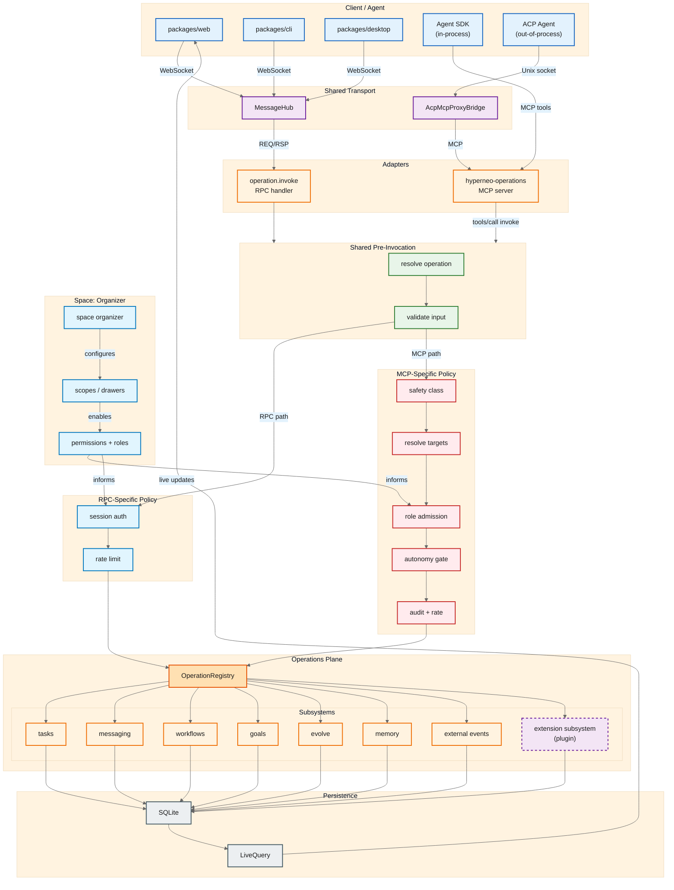

# RPC/MCP Unification — Target Structure

Target architecture after all operations converge on a single `OperationRegistry` and a two-stage pre-invocation pipeline: shared `resolve + validate`, then transport-specific policy.

## Key ideas

- **Two-stage pre-invocation**:
  - **Shared**: resolve the operation and validate input. Same for both RPC and MCP.
  - **Transport-specific policy**: after validation, the RPC adapter runs session auth and rate limits, while the MCP adapter runs the stricter agent policy — safety class, target resolution, role admission, autonomy gate, and audit.
- **Operations plane**: a flat `OperationRegistry` of subsystem operations (`tasks`, `messaging`, `workflows`, `goals`, `evolve`, `memory`, `external events`, plus extension subsystems). No `Space`/`Node` split and no separate `ActionRegistry`.
- **Space as organizer**: scopes, permissions, and roles configure which operations are allowed in a session, especially for the agent/MCP path.
- **Two thin adapters**: `operation.invoke` for MessageHub RPC and `hyperneo-operations` MCP server for the agent SDK and ACP.
- **Extensibility**: a new subsystem registers its operations in `OperationRegistry` without touching the core adapters or policy logic.
- **Persistence unchanged**: all writes still go through SQLite; `ReactiveDatabase` and `LiveQuery` push updates back to clients.
