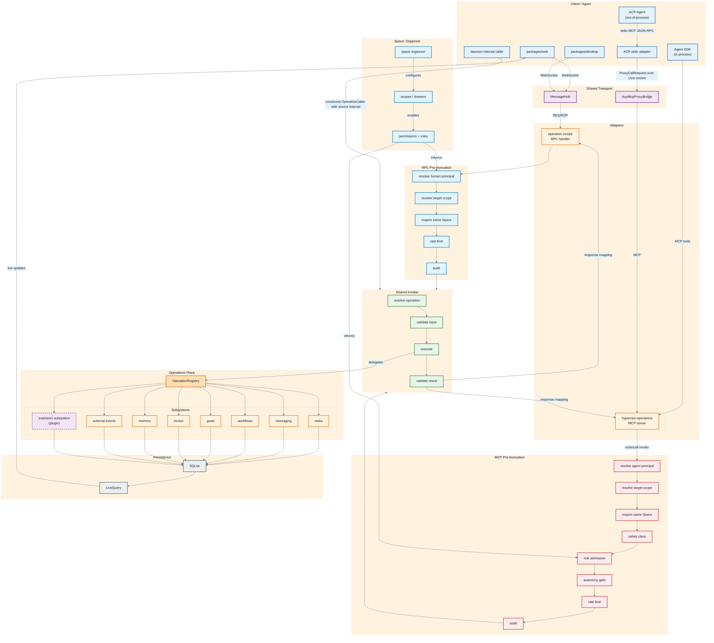

# RPC/MCP Unification — Target Structure

Target architecture after all operations converge on a single `OperationRegistry` and a two-stage pre-invocation pipeline: transport-specific caller policy first, then shared `resolve + parse + execute + validate`.

## Key ideas

- **Two-stage pre-invocation**:
  - **Transport-specific caller policy first.** Each transport's pre-invocation pipeline resolves the caller principal and runs transport-specific policy before the operation is resolved. This matches the ADR 0006 trust boundary: a transport must produce a trusted `OperationCaller` before the shared invoker resolves, validates, executes, and result-validates an operation.
  - **Shared invocation** for both transports: `resolve operation` → `validate input` → `execute` → `validate result`. The `invokeOperation` pipeline already implements this sequence.
  - The pre-invocation pipelines share stages where possible (`resolve target scope`, `require same Space`, `audit`) but keep transport-specific concerns separate (`resolve human principal` for RPC, `resolve agent principal`/`safety class`/`role admission`/`autonomy` for MCP).
- **Internal caller path.** Trusted daemon/runtime code constructs an `OperationCaller` with `source: 'internal'` and enters the shared invoker directly, bypassing both transports. ADR 0006 explicitly includes `internal` as a caller source.
- **Operations plane**: a flat `OperationRegistry` of subsystem operations (`tasks`, `messaging`, `workflows`, `goals`, `evolve`, `memory`, `external events`, plus extension subsystems). No `Space`/`Node` split at this layer. The `ActionRegistry`/`call_action` relationship is left open per ADR 0006 — `call_action` may become a thin front over the MCP pre-invocation pipeline or remain a parallel policy layer — and this target does not present that decision as already made.
- **Space as organizer**: scopes, permissions, and roles configure which operations are allowed in a session, especially for the agent/MCP path. The same shared stages feed both RPC and MCP role/scope decisions.
- **Two thin adapters**: `operation.invoke` for MessageHub RPC and `hyperneo-operations` MCP server for the agent SDK and ACP. Both adapters own only transport concerns (envelope parsing, caller principal, error mapping); they do not duplicate the operation effect or validation logic.
- **Result validation is mandatory.** The shared invoker validates the operation result against its schema and maps `invalid_result` back through the adapter, so malformed output becomes a typed failure rather than an untyped transport response.
- **Auditing and scope admission are not MCP-only.** The target shows `resolve target scope`, `require same Space`, and `audit` in both the RPC and MCP pre-invocation pipelines, so RPC convergence does not create an unaudited cross-scope route.
- **Persistence unchanged**: all writes still go through SQLite; `ReactiveDatabase` and `LiveQuery` push updates back to clients.
