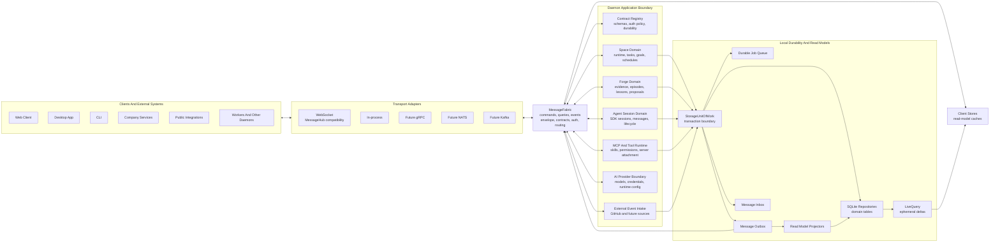
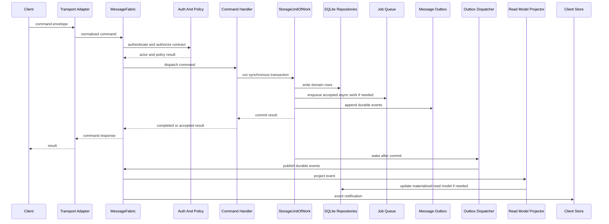
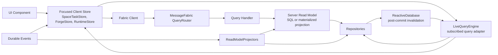
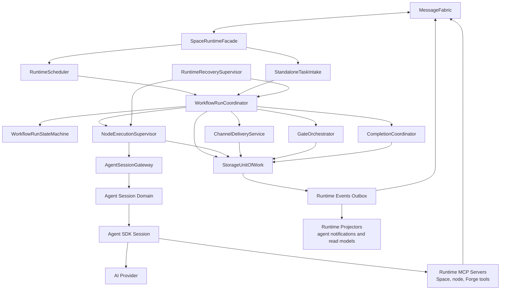
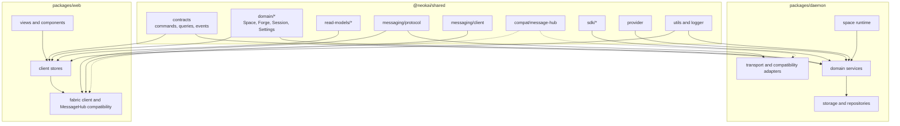
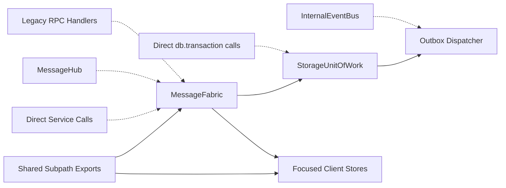
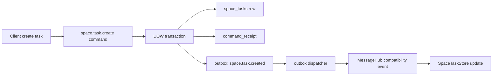

# Target Architecture Overview

**Date:** 2026-05-22
**Status:** Draft Design
**Related:**

- [Unified Message Fabric Architecture Design](./unified-message-fabric-design.md)
- [Space Runtime Decomposition Design](./space-runtime-decomposition.md)
- [Client State And Read Models Design](./client-state-and-read-models.md)
- [Shared Package Boundaries Design](./shared-package-boundaries.md)
- [Storage Unit Of Work And Outbox Design](./storage-unit-of-work-and-outbox.md)

---

## 1. Purpose

This document is the capstone map for the architecture cleanup. It does not introduce a new subsystem. It shows how the accepted target pieces fit together:

- `MessageFabric` as the canonical command, query, and event interface.
- `MessageHub` as a compatibility transport during migration.
- `StorageUnitOfWork` plus outbox/inbox as the durable write boundary.
- Space runtime decomposition as the workflow orchestration boundary.
- Client stores as read-model caches, not command owners.
- Shared package subpaths as the contract and type boundaries.
- Forge as a first-class Space domain slice.

The diagrams are target architecture diagrams. They are intentionally not a graph dump of current imports.

---

## 2. Architecture In One Sentence

NeoKai is a local-first agent runtime where every cross-boundary interaction is a typed command, query, or event on `MessageFabric`, every durable mutation commits through one SQLite-backed unit of work with outbox/inbox semantics, and every client or worker observes the system through read models and fabric events instead of direct service coupling.

---

## 3. High-Level Target Architecture

### Reading The Diagram

- `MessageFabric` is the semantic center. It owns command/query/event contracts and routes across transports.
- Domain modules own business behavior. They do not own WebSocket protocol details.
- `StorageUnitOfWork` is the write center. Durable state, jobs, command receipts, and outbox messages commit together.
- `LiveQuery` is not the event bus. It is an ephemeral subscribed-query mechanism backed by committed DB state.
- `MessageHub` remains behind the WebSocket compatibility adapter until client and daemon call sites migrate.

---

## 4. Slightly Detailed: Daemon Component Architecture

```mermaid
flowchart TB
  subgraph FabricLayer["MessageFabric Layer"]
    ContractRegistry["ContractRegistry<br/>names, schemas, subjects"]
    CommandRouter["CommandRouter"]
    QueryRouter["QueryRouter"]
    EventRouter["EventRouter"]
    AuthPolicy["AuthPolicy<br/>actor and resource checks"]
    TransportRegistry["TransportRegistry<br/>in-process, WebSocket, future brokers"]
  end

  subgraph Compatibility["Compatibility Layer"]
    MessageHubBridge["MessageHub Bridge<br/>legacy RPC and pubsub"]
    InternalBusBridge["InternalEventBus Bridge<br/>legacy daemon events"]
    ClientEventBridge["ClientEventBridge<br/>legacy client event forwarding"]
    LiveQueryCompat["LiveQuery RPC Adapter"]
  end

  subgraph Domains["Domain Modules"]
    SpaceDomain["Space Domain"]
    ForgeDomain["Forge Domain"]
    SessionDomain["Agent Session Domain"]
    ToolDomain["MCP And Skills Domain"]
    ProviderDomain["AI Provider Domain"]
    ExternalDomain["External Event Domain"]
  end

  subgraph SpaceDetail["Space Domain Internals"]
    SpaceFacade["SpaceRuntimeFacade"]
    RuntimeScheduler["RuntimeScheduler"]
    RunCoordinator["WorkflowRunCoordinator"]
    NodeSupervisor["NodeExecutionSupervisor"]
    ChannelDelivery["ChannelDeliveryService"]
    GateOrchestrator["GateOrchestrator"]
    CompletionCoordinator["CompletionCoordinator"]
    RecoverySupervisor["RuntimeRecoverySupervisor"]
  end

  subgraph StorageLayer["Storage And Projection Layer"]
    UOWRunner["StorageUnitOfWorkRunner"]
    Repos["Repositories"]
    JobQueue["JobQueue"]
    OutboxRepo["Outbox"]
    InboxRepo["Inbox"]
    CommandReceipts["CommandReceipts"]
    Projectors["ReadModelProjectors"]
    LiveQueryEngine["LiveQueryEngine"]
  end

  ContractRegistry --> CommandRouter
  ContractRegistry --> QueryRouter
  ContractRegistry --> EventRouter
  AuthPolicy --> CommandRouter
  AuthPolicy --> QueryRouter
  TransportRegistry --> CommandRouter
  TransportRegistry --> QueryRouter
  TransportRegistry --> EventRouter

  MessageHubBridge -.-> CommandRouter
  MessageHubBridge -.-> QueryRouter
  EventRouter -.-> MessageHubBridge
  EventRouter -.-> InternalBusBridge
  InternalBusBridge -.-> ClientEventBridge
  LiveQueryCompat -.-> QueryRouter

  CommandRouter --> SpaceDomain
  CommandRouter --> ForgeDomain
  CommandRouter --> SessionDomain
  CommandRouter --> ToolDomain
  QueryRouter --> SpaceDomain
  QueryRouter --> ForgeDomain
  QueryRouter --> SessionDomain
  QueryRouter --> ToolDomain
  EventRouter --> Projectors

  SpaceDomain --> SpaceFacade
  SpaceFacade --> RuntimeScheduler
  SpaceFacade --> RunCoordinator
  RunCoordinator --> NodeSupervisor
  RunCoordinator --> ChannelDelivery
  RunCoordinator --> GateOrchestrator
  RunCoordinator --> CompletionCoordinator
  RecoverySupervisor --> RunCoordinator

  SpaceDomain --> UOWRunner
  ForgeDomain --> UOWRunner
  SessionDomain --> UOWRunner
  ToolDomain --> UOWRunner
  ExternalDomain --> UOWRunner

  UOWRunner --> Repos
  UOWRunner --> JobQueue
  UOWRunner --> OutboxRepo
  UOWRunner --> InboxRepo
  UOWRunner --> CommandReceipts
  OutboxRepo --> EventRouter
  Repos --> LiveQueryEngine
  OutboxRepo --> Projectors
  Projectors --> Repos
```

### Cleanup Meaning

The target module flow is:

1. Transport adapters enter through fabric routers.
2. Fabric routers call domain modules.
3. Domain modules commit durable mutations through UoW.
4. Durable events leave through outbox and then return to fabric event routing.
5. Compatibility bridges only adapt old protocols to the target flow.

New code should not add new direct dependencies from RPC handlers to broad service internals when a fabric command/query boundary exists.

---

## 5. Slightly Detailed: Command Write Path

### Write Path Rules

- Validation and async preparation can happen before the UoW.
- The UoW transaction body stays synchronous and short.
- Domain writes, job enqueue, command receipt updates, and outbox append happen in one commit.
- Client command responses are not the durable source of truth; committed state plus events are.
- Event dispatch may retry, so event consumers must be idempotent.

---

## 6. Slightly Detailed: Query And Subscription Path

### Query Path Rules

- One-shot queries and live subscriptions share query contracts where practical.
- Components do not call RPC directly once a focused store owns that read model.
- LiveQuery deltas are ephemeral and recoverable by resubscription.
- Server read models may be SQL queries at first and materialized projections later.
- Durable events drive projection replay; they are not replaced by LiveQuery.

---

## 7. Slightly Detailed: Space Runtime And Agent Path

### Runtime Rules

- `SpaceRuntimeFacade` is the boundary; outside modules should not coordinate workflow internals directly.
- Runtime state transitions are decided by runtime components and committed through UoW.
- Agent SDK mechanics are behind `AgentSessionGateway` and the Agent Session domain.
- MCP tools call fabric commands or runtime facade methods, not arbitrary repositories.
- Runtime events that matter for recovery or read models are durable outbox events.

---

## 8. Slightly Detailed: Package And Dependency Boundaries

### Package Rules

- Shared root imports shrink over time.
- Contracts are shared between daemon and clients.
- Domain types are durable entity shapes, not service implementations.
- Read models are UI/query projections, not DB rows by default.
- MessageHub exports move under compatibility paths.
- Daemon-only services, repositories, prompts, and tool implementation details do not leak into shared root exports.

---

## 9. Migration Boundaries

### Cleanup Direction

The migration does not delete legacy surfaces first. It routes them behind the target surfaces, migrates vertical slices, and then removes unused compatibility paths.

Preferred order:

1. Add target primitives beside existing code.
2. Bridge legacy RPC/MessageHub/InternalEventBus paths into the target flow.
3. Migrate one vertical slice at a time.
4. Move clients to focused stores and fabric contracts.
5. Remove direct service and shared-root dependencies once call sites are gone.
6. Add enforcement only after replacement paths exist.

---

## 10. What This Means For The Refactor

The refactor should be organized around vertical slices, not package-wide rewrites.

The first slice should prove the full target path with a small domain:

That slice exercises the architecture without requiring the whole runtime to move at once.

After that, the next slices should be:

1. `space.task.update` and archive/cancel paths.
2. schedule fire path because it already needs transactional job/task/schedule behavior.
3. Forge proposal task creation and rollup application.
4. runtime run/task/node transitions.
5. client focused stores and read models.
6. shared package root export reduction and enforcement.

---

## 11. Architectural Exit Criteria

The cleanup is working when these are true:

- New cross-boundary behavior is registered as a fabric command, query, or event.
- New durable writes use `StorageUnitOfWork`.
- Durable events are appended through outbox before publication.
- Client components depend on focused stores and read models, not broad RPC helpers.
- Space runtime transitions have one owner and are recoverable from durable state.
- Forge has its own contracts, domain types, read models, and events.
- `@neokai/shared` root imports are shrinking, not growing.
- `MessageHub`, `InternalEventBus`, and direct RPC handlers are compatibility paths rather than the place new architecture is invented.
