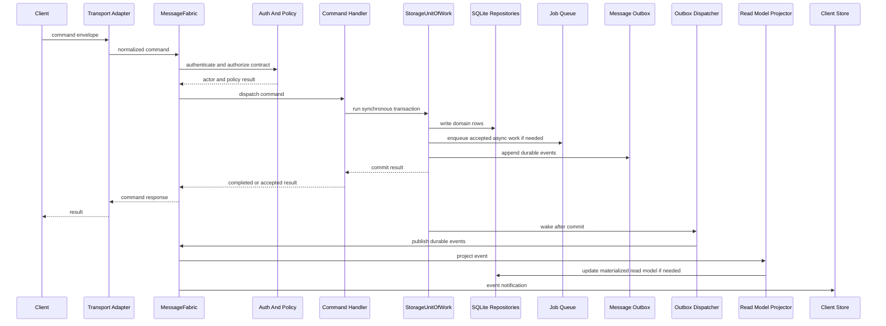
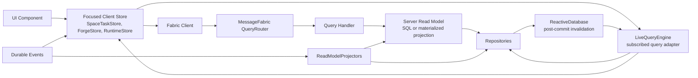
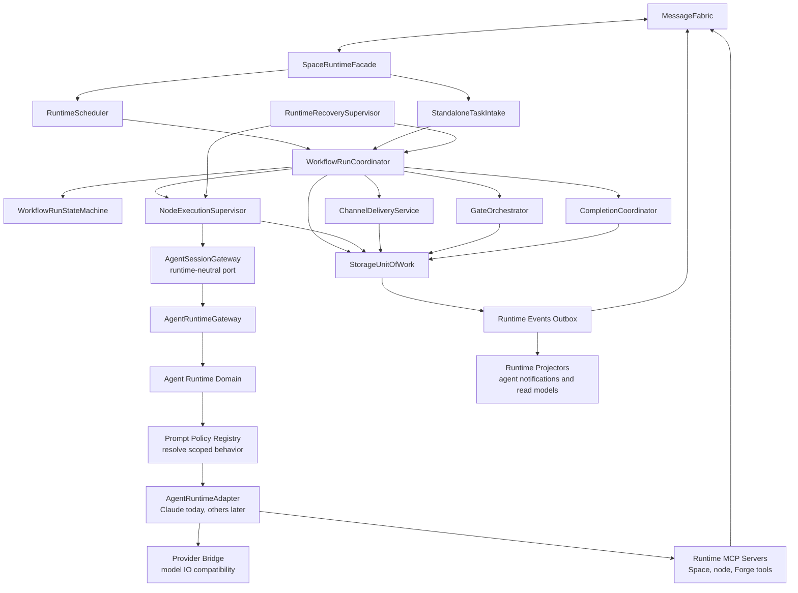
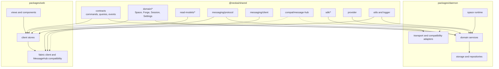
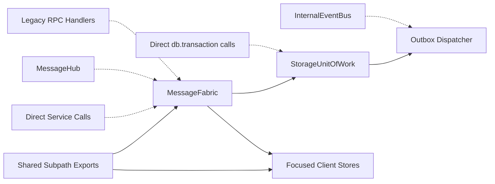
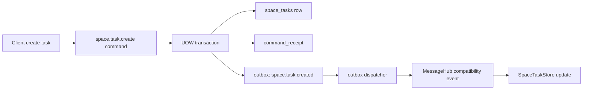

# Target Architecture Overview

**Date:** 2026-05-22
**Status:** Draft Design
**Related:**

- [Unified Message Fabric Architecture Design](./unified-message-fabric-design.md)
- [Space Runtime Decomposition Design](./space-runtime-decomposition.md)
- [Client State And Read Models Design](./client-state-and-read-models.md)
- [Shared Package Boundaries Design](./shared-package-boundaries.md)
- [Storage Unit Of Work And Outbox Design](./storage-unit-of-work-and-outbox.md)
- [Agent Runtime And Provider Compatibility Design](./agent-runtime-and-provider-compatibility.md)
- [Configuration And Extension Resolution Design](./configuration-and-extension-resolution.md)
- [UI Design System Architecture Design](./ui-design-system-architecture.md)
- [Prompt Policy Registry Spec](../../research/token-efficiency/prompt-policy-registry-spec.md)
- [Architecture Refactor Execution Plan](../../plans/architecture-refactor-execution-plan/00-overview.md)

---

## 1. Purpose

This document is the capstone map for the architecture cleanup. It does not introduce a new subsystem. It shows how the accepted target pieces fit together:

- `MessageFabric` as the canonical command, query, and event interface.
- `MessageHub` as a compatibility transport during migration.
- `StorageUnitOfWork` plus outbox/inbox as the durable write boundary.
- Space runtime decomposition as the workflow orchestration boundary.
- Prompt Policy Registry as the scoped prompt-behavior composition boundary.
- Agent Runtime and provider compatibility as independent execution/model axes.
- Configuration and extension resolution as the effective settings, skills, plugins, MCP, hooks, and native SDK settings boundary.
- Client stores as read-model caches, not command owners.
- UI design system boundaries as the frontend component and token authority.
- Shared package subpaths as the contract and type boundaries.
- Forge as a first-class Space domain slice.

The diagrams are target architecture diagrams. They are intentionally not a graph dump of current imports.

---

## 2. Architecture In One Sentence

NeoKai is a local-first agent runtime where every cross-boundary interaction is a typed command, query, or event on `MessageFabric`, every durable mutation commits through one SQLite-backed unit of work with outbox/inbox semantics, effective configuration and extension contributions are resolved before agent behavior is composed through scoped prompt policy and runtime/provider adapters, and every client or worker observes the system through read models and fabric events instead of direct service coupling.

---

## 3. High-Level Target Architecture

```mermaid
flowchart LR
  subgraph Clients["Clients And External Systems"]
    Web["Web Client"]
    Desktop["Desktop App"]
    CLI["CLI"]
    Services["Company Services"]
    Public["Public Integrations"]
    Workers["Workers And Other Daemons"]
  end

  subgraph Transports["Transport Adapters"]
    WS["WebSocket<br/>MessageHub compatibility"]
    InProc["In-process"]
    GRPC["Future gRPC"]
    NATS["Future NATS"]
    Kafka["Future Kafka"]
  end

  Fabric["MessageFabric<br/>commands, queries, events<br/>envelope, contracts, auth, routing"]

  subgraph Daemon["Daemon Application Boundary"]
    Contracts["Contract Registry<br/>schemas, auth policy, durability"]
    Space["Space Domain<br/>runtime, tasks, goals, schedules"]
    Forge["Forge Domain<br/>evidence, episodes, lessons, proposals"]
    Sessions["Agent Runtime Domain<br/>sessions, messages, lifecycle"]
    ConfigExtensions["Config And Extension Resolution<br/>settings, skills, plugins, MCP, hooks"]
    PromptPolicy["Prompt Policy Registry<br/>scoped behavior records, composition, rendering"]
    Tools["MCP And Tool Runtime<br/>skills, permissions, server attachment"]
    Providers["Provider And Bridge Boundary<br/>models, credentials, model IO"]
    ExternalEvents["External Event Intake<br/>GitHub and future sources"]
  end

  subgraph Storage["Local Durability And Read Models"]
    UOW["StorageUnitOfWork<br/>transaction boundary"]
    DB["SQLite Repositories<br/>domain tables"]
    Jobs["Durable Job Queue"]
    Outbox["Message Outbox"]
    Inbox["Message Inbox"]
    LiveQuery["LiveQuery<br/>ephemeral deltas"]
    ReadModels["Read Model Projectors"]
  end

  BrowserState["Client Stores<br/>read-model caches"]

  Clients <--> Transports
  Transports <--> Fabric
  Fabric <--> Contracts
  Fabric <--> Space
  Fabric <--> Forge
  Fabric <--> Sessions
  Fabric <--> ConfigExtensions
  Fabric <--> PromptPolicy
  Fabric <--> Tools
  Fabric <--> Providers
  Fabric <--> ExternalEvents

  Space --> UOW
  Forge --> UOW
  Sessions --> UOW
  ConfigExtensions --> UOW
  PromptPolicy --> UOW
  Tools --> UOW
  ExternalEvents --> UOW
  ConfigExtensions --> PromptPolicy
  ConfigExtensions --> Sessions
  Space --> PromptPolicy
  Forge --> PromptPolicy
  PromptPolicy --> Sessions
  UOW --> DB
  UOW --> Jobs
  UOW --> Outbox
  UOW --> Inbox
  Outbox --> Fabric
  DB --> LiveQuery
  Outbox --> ReadModels
  ReadModels --> DB
  Fabric --> BrowserState
  LiveQuery --> BrowserState
```

### Reading The Diagram

- `MessageFabric` is the semantic center. It owns command/query/event contracts and routes across transports.
- Domain modules own business behavior. They do not own WebSocket protocol details.
- `Config And Extension Resolution` computes effective settings and active contributions for skills, plugins, MCP, hooks, prompt policy, native SDK settings, and runtime options.
- `PromptPolicyRegistry` resolves scoped prompt-behavior records and renders them for Agent Runtime. Space, Forge, Workflow, and Task code may create scoped records, but they do not render prompt policy themselves.
- `StorageUnitOfWork` is the write center. Durable state, jobs, command receipts, and outbox messages commit together.
- `LiveQuery` is not the event bus. It is an ephemeral subscribed-query mechanism backed by committed DB state.
- `MessageHub` remains behind the WebSocket compatibility adapter until client and daemon call sites migrate.

---

## 4. Slightly Detailed: Daemon Component Architecture

```mermaid
flowchart TB
  subgraph FabricLayer["MessageFabric Layer"]
    ContractRegistry["ContractRegistry<br/>names, schemas, subjects"]
    CommandRouter["CommandRouter"]
    QueryRouter["QueryRouter"]
    EventRouter["EventRouter"]
    AuthPolicy["AuthPolicy<br/>actor and resource checks"]
    TransportRegistry["TransportRegistry<br/>in-process, WebSocket, future brokers"]
  end

  subgraph Compatibility["Compatibility Layer"]
    MessageHubBridge["MessageHub Bridge<br/>legacy RPC and pubsub"]
    InternalBusBridge["InternalEventBus Bridge<br/>legacy daemon events"]
    ClientEventBridge["ClientEventBridge<br/>legacy client event forwarding"]
    LiveQueryCompat["LiveQuery RPC Adapter"]
  end

  subgraph Domains["Domain Modules"]
    SpaceDomain["Space Domain"]
    ForgeDomain["Forge Domain"]
    SessionDomain["Agent Runtime Domain"]
    ConfigExtensionDomain["Config And Extension Domain"]
    PromptPolicyDomain["Prompt Policy Domain"]
    ToolDomain["MCP And Skills Domain"]
    ProviderDomain["Provider And Bridge Domain"]
    ExternalDomain["External Event Domain"]
  end

  subgraph PromptPolicyDetail["Prompt Policy Internals"]
    PromptPolicyRegistry["PromptPolicyRegistry"]
    PromptPolicyResolver["PromptPolicyResolver"]
    PromptPolicyComposer["PromptPolicyComposer"]
    PromptPolicyRenderer["PromptPolicyRenderer"]
  end

  subgraph SpaceDetail["Space Domain Internals"]
    SpaceFacade["SpaceRuntimeFacade"]
    RuntimeScheduler["RuntimeScheduler"]
    RunCoordinator["WorkflowRunCoordinator"]
    NodeSupervisor["NodeExecutionSupervisor"]
    ChannelDelivery["ChannelDeliveryService"]
    GateOrchestrator["GateOrchestrator"]
    CompletionCoordinator["CompletionCoordinator"]
    RecoverySupervisor["RuntimeRecoverySupervisor"]
  end

  subgraph StorageLayer["Storage And Projection Layer"]
    UOWRunner["StorageUnitOfWorkRunner"]
    Repos["Repositories"]
    JobQueue["JobQueue"]
    OutboxRepo["Outbox"]
    InboxRepo["Inbox"]
    CommandReceipts["CommandReceipts"]
    Projectors["ReadModelProjectors"]
    LiveQueryEngine["LiveQueryEngine"]
  end

  ContractRegistry --> CommandRouter
  ContractRegistry --> QueryRouter
  ContractRegistry --> EventRouter
  AuthPolicy --> CommandRouter
  AuthPolicy --> QueryRouter
  TransportRegistry --> CommandRouter
  TransportRegistry --> QueryRouter
  TransportRegistry --> EventRouter

  MessageHubBridge -.-> CommandRouter
  MessageHubBridge -.-> QueryRouter
  EventRouter -.-> MessageHubBridge
  EventRouter -.-> InternalBusBridge
  InternalBusBridge -.-> ClientEventBridge
  LiveQueryCompat -.-> QueryRouter

  CommandRouter --> SpaceDomain
  CommandRouter --> ForgeDomain
  CommandRouter --> SessionDomain
  CommandRouter --> ConfigExtensionDomain
  CommandRouter --> PromptPolicyDomain
  CommandRouter --> ToolDomain
  QueryRouter --> SpaceDomain
  QueryRouter --> ForgeDomain
  QueryRouter --> SessionDomain
  QueryRouter --> ConfigExtensionDomain
  QueryRouter --> PromptPolicyDomain
  QueryRouter --> ToolDomain
  EventRouter --> Projectors

  SpaceDomain --> SpaceFacade
  ConfigExtensionDomain --> PromptPolicyRegistry
  ConfigExtensionDomain --> SessionDomain
  PromptPolicyDomain --> PromptPolicyRegistry
  PromptPolicyRegistry --> PromptPolicyResolver
  PromptPolicyResolver --> PromptPolicyComposer
  PromptPolicyComposer --> PromptPolicyRenderer
  SessionDomain --> PromptPolicyRegistry
  SpaceFacade --> RuntimeScheduler
  SpaceFacade --> RunCoordinator
  RunCoordinator --> NodeSupervisor
  RunCoordinator --> ChannelDelivery
  RunCoordinator --> GateOrchestrator
  RunCoordinator --> CompletionCoordinator
  RecoverySupervisor --> RunCoordinator

  SpaceDomain --> UOWRunner
  ForgeDomain --> UOWRunner
  SessionDomain --> UOWRunner
  ConfigExtensionDomain --> UOWRunner
  PromptPolicyDomain --> UOWRunner
  ToolDomain --> UOWRunner
  ExternalDomain --> UOWRunner

  UOWRunner --> Repos
  UOWRunner --> JobQueue
  UOWRunner --> OutboxRepo
  UOWRunner --> InboxRepo
  UOWRunner --> CommandReceipts
  OutboxRepo --> EventRouter
  Repos --> LiveQueryEngine
  OutboxRepo --> Projectors
  Projectors --> Repos
```

### Cleanup Meaning

The target module flow is:

1. Transport adapters enter through fabric routers.
2. Fabric routers call domain modules.
3. Domain modules commit durable mutations through UoW.
4. Durable events leave through outbox and then return to fabric event routing.
5. Compatibility bridges only adapt old protocols to the target flow.

New code should not add new direct dependencies from RPC handlers to broad service internals when a fabric command/query boundary exists.

---

## 5. Slightly Detailed: Command Write Path

### Write Path Rules

- Validation and async preparation can happen before the UoW.
- The UoW transaction body stays synchronous and short.
- Domain writes, job enqueue, command receipt updates, and outbox append happen in one commit.
- Client command responses are not the durable source of truth; committed state plus events are.
- Event dispatch may retry, so event consumers must be idempotent.

---

## 6. Slightly Detailed: Query And Subscription Path

### Query Path Rules

- One-shot queries and live subscriptions share query contracts where practical.
- Components do not call RPC directly once a focused store owns that read model.
- LiveQuery deltas are ephemeral and recoverable by resubscription.
- Server read models may be SQL queries at first and materialized projections later.
- Durable events drive projection replay; they are not replaced by LiveQuery.

---

## 7. Slightly Detailed: Space Runtime And Agent Path

### Runtime Rules

- `SpaceRuntimeFacade` is the boundary; outside modules should not coordinate workflow internals directly.
- Runtime state transitions are decided by runtime components and committed through UoW.
- Agent SDK mechanics are behind `AgentSessionGateway` and the Agent Session domain.
- Prompt behavior is resolved by `PromptPolicyRegistry` before runtime adapter invocation. Space and Workflow scopes can affect the selected records, but the final render happens in the Agent Runtime boundary.
- MCP tools call fabric commands or runtime facade methods, not arbitrary repositories.
- Runtime events that matter for recovery or read models are durable outbox events.

---

## 8. Slightly Detailed: Package And Dependency Boundaries

### Package Rules

- Shared root imports shrink over time.
- Contracts are shared between daemon and clients.
- Domain types are durable entity shapes, not service implementations.
- Read models are UI/query projections, not DB rows by default.
- MessageHub exports move under compatibility paths.
- Daemon-only services, repositories, prompts, and tool implementation details do not leak into shared root exports.

---

## 9. Migration Boundaries

### Cleanup Direction

The migration does not delete legacy surfaces first. It routes them behind the target surfaces, migrates vertical slices, and then removes unused compatibility paths.

Preferred order:

1. Add target primitives beside existing code.
2. Bridge legacy RPC/MessageHub/InternalEventBus paths into the target flow.
3. Migrate one vertical slice at a time.
4. Move clients to focused stores and fabric contracts.
5. Remove direct service and shared-root dependencies once call sites are gone.
6. Add enforcement only after replacement paths exist.

---

## 10. What This Means For The Refactor

The refactor should be organized around vertical slices, not package-wide rewrites.

The first slice should prove the full target path with a small domain:

That slice exercises the architecture without requiring the whole runtime to move at once.

After that, the next slices should be:

1. `space.task.update` and archive/cancel paths.
2. schedule fire path because it already needs transactional job/task/schedule behavior.
3. Forge proposal task creation and rollup application.
4. configuration and extension effective previews.
5. prompt policy records and effective preview.
6. runtime run/task/node transitions.
7. client focused stores and read models.
8. shared package root export reduction and enforcement.

---

## 11. Architectural Exit Criteria

The architecture cleanup is complete when the following gates pass. These are intentionally stricter than design principles: each gate should be checkable by code review, targeted tests, or simple repo searches.

### 11.1 Fabric Boundary Gate

- New cross-boundary daemon behavior is registered as a fabric command, query, or event contract.
- Migrated contracts declare name, kind, subject/addressing, payload schema, result schema when applicable, auth policy, and durability/replay policy.
- The first core vertical slices are fabric-backed: `space.task.create`, `space.task.update`, task archive/cancel, schedule fire, Forge proposal task creation, Forge rollup application, and runtime run/task/node transition events.
- `MessageHub` request/event handlers for migrated slices are compatibility adapters only; they delegate into fabric or fabric-backed services.
- `InternalEventBus`, `InternalCommandBus`, and `InternalQueryBus` are not expanded as new architectural centers. New migrated events flow through MessageFabric/outbox first, with legacy bridges where needed.
- Transport adapters do not invent command/query/event semantics absent from the fabric envelope.

### 11.2 Durability And UoW Gate

- `message_outbox`, `message_inbox`, `command_receipts`, and `read_model_cursors` exist with repositories and targeted tests.
- Migrated durable commands enter through `StorageUnitOfWorkRunner`.
- Domain writes, accepted operation/job state, command receipts, read-model invalidation records, and durable outbox messages commit in one SQLite transaction.
- Rollback tests prove no domain row, command receipt, reactive invalidation, or outbox row survives a failed UoW.
- Idempotency tests prove duplicate commands with the same key/hash return the original completed result or accepted operation, and conflicting duplicate keys are rejected.
- New repository code does not publish events. Services/domain coordinators decide events and append them through the UoW outbox writer.
- New direct `db.transaction(...)` calls are limited to storage infrastructure, migrations, or explicitly marked legacy paths with a migration issue.

### 11.3 Space Runtime Ownership Gate

- `SpaceRuntimeFacade` is the boundary for workflow orchestration from outside the Space runtime module.
- Runtime decisions have single owners:
  - run progression: `WorkflowRunCoordinator`
  - node spawn/recovery: `NodeExecutionSupervisor`
  - gate evaluation/open state: `GateOrchestrator`
  - channel routing: `ChannelDeliveryService`
  - completion/post-approval: `CompletionCoordinator`
- Runtime state transitions for workflow runs, canonical tasks, node executions, gates, pending messages, and completion artifacts use UoW-backed writes where migrated.
- Durable runtime events are emitted through outbox before client/projector/agent notification delivery.
- Active in-memory runtime state is either reconstructable from DB/outbox state or explicitly documented as ephemeral.
- Restart/recovery tests prove active and blocked workflow runs can be rehydrated without relying on stale in-memory maps.

### 11.4 Agent Runtime And Provider Gate

- Source/type audits exist for every implemented agent runtime adapter and provider bridge direction, including Claude Agent SDK, current bridge paths, and any newly selectable runtime.
- The checked-in SDK Capability Matrix states what each runtime/provider/bridge supports, degrades, emulates, or does not support.
- Shared `AgentRuntime*` data types are a documented superset of audited SDK/protocol capabilities, with extension/raw-native preservation points for runtime-specific features.
- New domain code that starts, resumes, sends to, interrupts, or inspects agent execution depends on `AgentRuntimeGateway`, not directly on `AgentSession` or Claude Agent SDK APIs.
- The current Claude Agent SDK path is wrapped by `ClaudeAgentRuntimeAdapter`.
- Runtime profiles can represent today's session config: runtime id, provider id, model id, bridge mode, credentials reference, sandbox/tool policy, and behavior profile reference.
- `CapabilityResolver` can report `native`, `bridged`, `degraded`, or `unsupported` for current provider pairs, including Claude Agent SDK with Anthropic, OpenAI/Codex bridge, OpenRouter, Ollama, and custom endpoints.
- Providers, models, and bridges declare capabilities that affect runtime behavior: streaming, tool use, tool choice, vision, structured output, reasoning/thinking, context window, prompt caching, resumability, and sandbox/tool limitations.
- Adapters preserve SDK-specific lifecycle, stream, tool, approval, sandbox, reasoning, trace, and persistence features where available instead of flattening everything to the common denominator.
- New imports from `@anthropic-ai/claude-agent-sdk` are isolated to the Claude runtime adapter and explicit compatibility internals.
- At least one non-Claude runtime adapter can be added without changing Space runtime orchestration or client store contracts.

### 11.5 Client Read Model Gate

- Space UI state is split into focused stores for route, space list, selected space, tasks, runtime, configure, goals, schedules, sessions, and Forge.
- Migrated components do not call raw `hub.request` or subscribe directly to raw `liveQuery.*` events for Space domain state.
- Stores own command wrappers, query subscriptions, event reducers, stale-response guards, and optimistic rollback behavior for their read-model family.
- Durable state in the UI comes from subscribed queries/read models and fabric events, not from assuming command responses are final truth.
- Forge UI state is owned by `ForgeStore`; component-local Forge state is limited to transient forms, tabs, filters, and dialogs.
- Store tests cover reducer behavior, subscription lifecycle, stale-response handling, and event projection for migrated stores.

### 11.6 Shared Package Boundary Gate

- New cross-boundary request/response/event types live under `@neokai/shared/contracts/*`.
- New durable entity types live under `@neokai/shared/domain/*`.
- New UI/query projection types live under `@neokai/shared/read-models/*`.
- Provider, agent-runtime, messaging protocol, SDK declarations, utilities, and compatibility exports are reachable through explicit subpaths.
- Root `@neokai/shared` imports are compatibility-only and are not added in migrated code.
- Forge has the same domain/contract/read-model split as Space.
- MessageHub runtime classes are under compatibility exports, not the public messaging API used by new code.
- Boundary enforcement exists as either lint, dependency checks, or a documented import allowlist with CI coverage.

### 11.7 Observability And Recovery Gate

- Fabric envelopes include actor, correlation id, causation id, source, timestamps, subject, and traceable delivery metadata for migrated contracts.
- Outbox, inbox, command receipt, job, and runtime profile state can be inspected through targeted queries or admin/debug surfaces.
- Dispatcher retry, duplicate delivery, and crash-after-publish scenarios are covered by targeted tests for at-least-once delivery.
- Materialized read-model projectors have cursors and idempotent replay behavior when introduced.
- LiveQuery remains ephemeral and snapshot-backed; missing deltas can be recovered by resubscription.

### 11.8 UI Design System Gate

- `packages/ui` owns canonical reusable primitives, base components, shared tokens, and public demos.
- `packages/web/src/components/ui` contains product-specific compositions and explicitly temporary compatibility wrappers, not new generic primitives.
- New feature code imports generic controls from `@neokai/ui` or uses product UI compositions that wrap `@neokai/ui`.
- `packages/web/src/lib/design-tokens.ts` is either a compatibility facade over `@neokai/ui` tokens or contains only product-specific tokens.
- Public `@neokai/ui` components have tests and demo/reference coverage.
- Accessibility-sensitive primitives have keyboard, focus, escape, outside-click, and ARIA coverage.

### 11.9 Configuration And Extension Gate

- Effective settings and extension contributions can be previewed with source chains, inherited values, explicit overrides, suppressions, and runtime render targets.
- Skills, plugins, MCP servers, hooks, and prompt policy are separate semantic concepts; plugin remains a packaging/render target, not the generic user-facing capability.
- Native SDK user/project/local settings are imported, projected, or deliberately rendered by Agent Runtime; they are not hidden ambient sources of behavior.
- MCP availability resolves through the MCP registry and scoped enablement; no new path relies on SDK auto-loading project MCP files.
- Hook policies are built-in or declarative until executable third-party hooks have trust, signing, sandboxing, and review UI.
- Prompt-affecting extensions route through PromptPolicyRegistry or explicit slash-command skill invocation; no plugin silently appends always-on behavior outside prompt policy provenance.

### 11.10 Prompt Policy Registry Gate

- Prompt behavior that can vary by global, session, Space, SpaceAgent, workflow, workflow-node, or task scope is represented as `prompt_policy_records`, not feature-specific fields copied across settings, Space, agent, workflow, and session objects.
- `PromptPolicyResolver`, `PromptPolicyComposer`, and `PromptPolicyRenderer` live in the Agent Runtime boundary and are invoked before runtime adapter option construction.
- Space, Forge, Workflow, and Task domains may create or suppress scoped prompt policy records, but they do not directly render prompt fragments into SDK/runtime prompts.
- Effective prompt policy can be queried for preview/debug with applied records, suppressed records, inherited source, active built-ins, and channel preview.
- Built-in policies such as `neokai.output-mode.compressed` are versioned in code and activated by scoped records; arbitrary user-authored content remains internal until provenance, validation, and preview are stable.
- Worktree isolation and workflow runtime contracts are either explicitly retained on existing code paths or migrated into Prompt Policy Registry with tests that prove ordering, suppression, and subagent rendering behavior.

### 11.11 Legacy Exit Gate

- A compatibility surface is allowed only when it has a named target replacement and no new feature depends on its internals.
- Migrated slices have no direct RPC -> service -> repository shortcut that bypasses fabric/UoW for durable cross-boundary behavior.
- `setupRPCHandlers` no longer grows as the service container for new architecture slices.
- Architectural cleanup is not considered complete until the first vertical slice proves the full path:
  `fabric command -> auth/policy -> UoW -> DB/job/receipt/outbox -> dispatcher -> event/projector -> client store`.
