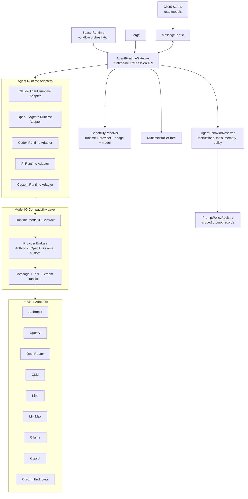
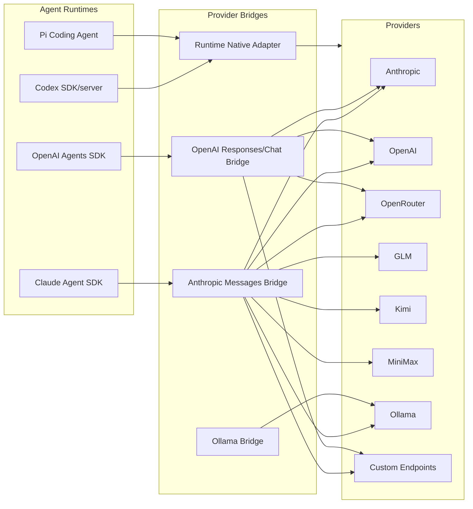

# Agent Runtime And Provider Compatibility Design

**Date:** 2026-05-22
**Status:** Draft Design
**Related:**

- [Target Architecture Overview](./README.md)
- [Unified Message Fabric Architecture Design](./unified-message-fabric-design.md)
- [Space Runtime Decomposition Design](./space-runtime-decomposition.md)
- [Storage Unit Of Work And Outbox Design](./storage-unit-of-work-and-outbox.md)
- [Shared Package Boundaries Design](./shared-package-boundaries.md)
- [Configuration And Extension Resolution Design](./configuration-and-extension-resolution.md)
- [Prompt Policy Registry Spec](../../research/token-efficiency/prompt-policy-registry-spec.md)

---

## 1. Purpose

HyperNeo should be agent-runtime agnostic and provider agnostic.

That means the Space runtime, Forge, client stores, and MessageFabric should not assume Claude Agent SDK is the only execution runtime. They should also not assume a model provider must natively speak the runtime's preferred API.

The target is:

> Any Agent Runtime can be paired with any Provider when technically possible, with explicit compatibility bridges and capability degradation.

The current codebase already proves part of this direction. HyperNeo runs the Claude Agent SDK with providers that are not Anthropic by projecting those providers behind Anthropic-compatible endpoints and process environment routing. That is the correct architectural pattern. This spec generalizes it so future runtimes such as OpenAI Agents SDK, Codex SDK/server, Pi coding agent, or other local/remote agent engines can participate without forcing the rest of the daemon to know their native APIs.

This document is high-level architectural guidance. The TypeScript shapes below describe target boundaries and concepts, not final implementation-ready SDK contracts. Before implementing the real gateway, adapters, compatibility resolver, or shared agent-runtime data types, HyperNeo must audit the source code or type files for each target SDK/runtime and provider protocol. The implementation types should be derived from that audit, not from guesses or a lowest-common-denominator abstraction.

---

## 2. Terminology

### Agent Runtime

An **Agent Runtime** is the execution substrate that runs an agent loop.

Examples:

- Claude Agent SDK
- OpenAI Agents SDK
- Codex SDK/server
- Pi coding agent
- a local custom runtime
- a remote hosted agent service

The runtime owns mechanics such as session start/resume, message streaming, tool invocation protocol, cancellation, process lifecycle, and runtime-specific session state.

### Provider

A **Provider** is the model/inference backend or model gateway.

Examples:

- Anthropic
- OpenAI
- OpenRouter
- GLM
- Kimi
- MiniMax
- Ollama local/cloud
- GitHub Copilot-backed bridge
- custom OpenAI-compatible, Anthropic-compatible, or Ollama-compatible endpoints

### Provider Bridge

A **Provider Bridge** adapts a provider's native API into the API shape expected by a runtime.

Examples already present in the codebase:

- OpenAI Responses API exposed as Anthropic Messages API for Claude Agent SDK.
- OpenAI Chat Completions exposed as Anthropic Messages API for custom endpoints.
- Ollama native `/api/chat` exposed as Anthropic Messages API.
- custom Anthropic Messages pass-through endpoints.

### Model IO Compatibility Layer

The **Model IO Compatibility Layer** is the conceptual boundary that normalizes messages, tools, streams, multimodal inputs, reasoning metadata, and errors between runtimes and providers. In the first implementation it can be implemented by provider bridges and runtime adapters rather than one monolithic module.

### Agent Behavior

**Agent Behavior** is not the runtime. It is the portable description of what the agent should do:

- role and instructions
- workflow node assignment
- tools and MCP servers
- memory scope
- permission policy
- autonomy level
- output expectations
- tool guards

The same behavior should be runnable on different runtimes and providers when capabilities allow.

Prompt policy is the scoped, inspectable mechanism that contributes some of these behavior inputs. A Space, workflow, task, or session may activate policy records such as `neokai.output-mode.compressed`, but the Agent Runtime boundary resolves and renders those records before invoking a runtime adapter.

### Runtime Profile

A **Runtime Profile** is a saved selection of:

- agent runtime
- provider
- model
- bridge mode
- credentials source
- sandbox/process settings
- tool policy
- behavior profile reference

The user-facing UI can call this "Runtime" or "Agent Runtime" depending on space.

---

## 3. Current State

### Provider System

The current provider layer is already extensible:

- `packages/shared/src/provider/types.ts` defines a string-based provider id, provider capabilities, SDK config, provider session config, auth status, and the provider interface.
- `packages/daemon/src/lib/providers/registry.ts` registers and resolves providers.
- `packages/daemon/src/lib/providers/factory.ts` registers built-ins:
  - Anthropic
  - GLM
  - Kimi
  - MiniMax
  - OpenRouter
  - Ollama local/cloud
  - Anthropic-to-Codex bridge
  - Anthropic-to-Copilot bridge
  - synced custom endpoints
- `packages/daemon/src/lib/provider-service.ts` applies provider-specific env vars before Claude Agent SDK query creation.
- `packages/daemon/src/lib/agent/query-options-builder.ts` maps session config into Claude Agent SDK `Options`, including provider-aware model translation, context-window settings, thinking mode, MCP servers, tools, hooks, and sandbox settings.

This is already a runtime-provider compatibility layer, but it is named and shaped around the current Claude Agent SDK runtime.

### Claude Runtime Coupling

The current runtime path is centered on `@anthropic-ai/claude-agent-sdk`:

- `AgentSession` is a facade/orchestrator for Claude Agent SDK sessions.
- `QueryRunner` imports `query`, `Options`, `Query`, `SpawnOptions`, and `SpawnedProcess` from the Claude Agent SDK.
- `QueryOptionsBuilder` emits Claude Agent SDK `Options`.
- `SDKRuntimeConfig` calls runtime methods such as `setPermissionMode`, `mcpServerStatus`, and context usage APIs.
- session messages are stored and rendered as SDK message shapes.

This is expected for the first runtime, but the target architecture should rename the boundary: Claude Agent SDK is one `AgentRuntimeAdapter`, not the whole agent/session architecture.

### Existing Bridge Pattern

The bridge pattern is already present and should be promoted:

- `AnthropicToCodexBridgeProvider` exposes OpenAI-backed models through an Anthropic-compatible bridge.
- `openai-responses-bridge/server.ts` translates Anthropic Messages requests to OpenAI Responses requests and streams Anthropic SSE back.
- `CustomEndpointProvider` can bridge OpenAI Chat, Anthropic Messages, and Ollama native endpoints.
- `provider-anthropic-compat/translator.ts` defines shared Anthropic Messages request/SSE translation helpers.
- provider config can set model-level capabilities so unsupported features are suppressed before they hit upstream APIs.

This proves the desired architecture: a runtime can keep its native model IO shape while HyperNeo bridges providers into that shape.

---

## 4. Design Goals

1. **Independent axes:** runtime selection and provider selection are independent whenever bridges can make them compatible.
2. **Runtime-neutral Space orchestration:** Space runtime talks to `AgentRuntimeGateway`, not Claude Agent SDK directly.
3. **Provider-neutral runtime profiles:** provider/model/credentials are selected through runtime profiles, not hard-coded runtime assumptions.
4. **Bridge-first compatibility:** bridges are first-class, not hacks. They make unsupported native pairs possible.
5. **Explicit capabilities:** every runtime, provider, model, and bridge declares capabilities and limitations.
6. **Graceful degradation:** incompatible features are disabled or surfaced clearly instead of failing deep inside a stream.
7. **Portable behavior:** agent behavior definitions should move across runtimes/providers when capability requirements are met.
8. **Incremental migration:** current Claude Agent SDK sessions and provider bridges remain the first implementation path.

## 5. Non-Goals

- Replacing Claude Agent SDK immediately.
- Guaranteeing every runtime/provider pair has perfect feature parity.
- Hiding meaningful behavior differences across runtimes.
- Rewriting all SDK message rendering in the first slice.
- Making provider bridges distributed services by default. Embedded local bridges are fine.
- Converting HyperNeo into a generic model proxy independent of agent execution.

---

## 6. Target Architecture



### Reading The Diagram

- `AgentRuntimeGateway` is what daemon domains call.
- Runtime adapters hide runtime-specific session mechanics.
- Provider bridges make providers look like the API shape a runtime expects.
- `CapabilityResolver` decides whether a selected runtime/provider/model/bridge pair is native, bridged, degraded, or unsupported.
- `AgentBehaviorResolver` keeps prompts/tools/policy separate from execution mechanics.
- `PromptPolicyRegistry` resolves scoped prompt records and renders prompt fragments into the behavior profile before runtime-native options are built.

---

## 7. Component Responsibilities

### 7.1 AgentRuntimeGateway

The gateway is the daemon boundary for agent execution.

Responsibilities:

- create session
- resume session
- send input messages
- stream output events
- cancel/interrupt
- update runtime config when supported
- attach or refresh tools/MCP servers
- expose runtime status and health
- persist runtime-neutral session metadata
- delegate runtime-specific state to the selected adapter

Target interface:

```ts
export interface AgentRuntimeGateway {
  startSession(input: StartAgentRuntimeSession): Promise<AgentRuntimeSessionRef>;
  resumeSession(input: ResumeAgentRuntimeSession): Promise<AgentRuntimeSessionRef>;
  sendMessage(input: RuntimeInputMessage): Promise<RuntimeSendResult>;
  subscribe(sessionId: string, sink: RuntimeEventSink): RuntimeSubscription;
  interrupt(sessionId: string, reason?: string): Promise<RuntimeInterruptResult>;
  updateConfig(sessionId: string, patch: RuntimeConfigPatch): Promise<RuntimeConfigResult>;
  getStatus(sessionId: string): Promise<AgentRuntimeStatus>;
  listRuntimeMcpServers(sessionId: string): Promise<RuntimeMcpServerInventory>;
  stopSession(sessionId: string): Promise<void>;
}
```

The gateway should expose fabric commands and events over time:

| Contract | Kind | Purpose |
| --- | --- | --- |
| `agentRuntime.session.create` | command | Create a chat/session record and initial runtime metadata. |
| `agentRuntime.session.list` | query | List chat/session records for sidebars and session pages. |
| `agentRuntime.session.get` | query | Read a single chat/session record. |
| `agentRuntime.session.update` | command | Update session metadata, config, or draft fields. |
| `agentRuntime.session.archive` | command | Archive or unarchive a chat/session. |
| `agentRuntime.session.delete` | command | Delete a chat/session and owned artifacts. |
| `agentRuntime.session.start` | command | Start a runtime session. |
| `agentRuntime.session.resume` | command | Resume an existing runtime session. |
| `agentRuntime.message.send` | command | Send input into a runtime session. |
| `agentRuntime.session.interrupt` | command | Interrupt/cancel active execution. |
| `agentRuntime.config.update` | command | Change model, tools, permissions, or runtime config. |
| `agentRuntime.model.get` | query | Read a session's active model and provider selection. |
| `agentRuntime.model.switch` | command | Switch a session's active model. |
| `agentRuntime.coordinator.switch` | command | Switch a session's coordinator mode. |
| `agentRuntime.sandbox.switch` | command | Switch a session's sandbox mode. |
| `agentRuntime.worktreeMode.set` | command | Set a session's worktree mode. |
| `agentRuntime.session.status.get` | query | Read runtime status. |
| `agentRuntime.session.state.get` | query | Read the unified session state snapshot used by chat views. |
| `agentRuntime.sessions.state.list` | query | Read unified session state snapshots for collection views. |
| `agentRuntime.session.thinking.get` | query | Read session thinking-level override. |
| `agentRuntime.session.thinking.set` | command | Persist session thinking-level override. |
| `agentRuntime.session.rateLimitRetry.cancel` | command | Cancel a scheduled rate-limit retry. |
| `agentRuntime.session.rateLimitRetry.retryNow` | command | Retry immediately after a rate-limit cooldown. |
| `agentRuntime.session.sdkResumeChoice.submit` | command | Submit the user's SDK resume choice after a resume conflict. |
| `agentRuntime.session.query.reset` | command | Reset runtime query state for manual recovery. |
| `agentRuntime.session.agentState.get` | query | Read the focused processing-state snapshot for a session. |
| `agentRuntime.session.pendingMessages.list` | query | Read queued, deferred, and pending manual messages. |
| `agentRuntime.session.pendingMessages.countByStatus` | query | Count queued, deferred, and pending manual messages by status. |
| `agentRuntime.session.pendingMessage.remove` | command | Remove a pending message before execution. |
| `agentRuntime.session.pendingMessage.promote` | command | Promote a pending message into the active turn. |
| `agentRuntime.session.pendingMessage.defer` | command | Defer a pending message for later execution. |
| `agentRuntime.session.rewindCheckpoints.list` | query | Read rewind checkpoints for a session. |
| `agentRuntime.session.rewindPreview.get` | query | Preview a rewind before mutating session state. |
| `agentRuntime.session.rewind.execute` | command | Execute full-session rewind. |
| `agentRuntime.session.rewindSelective.preview` | query | Preview selective rewind before deleting chosen messages or files. |
| `agentRuntime.session.rewindSelective.execute` | command | Execute selective rewind for chosen messages or checkpoints. |
| `agentRuntime.messages.list` | query | Page persisted SDK transcript messages for reopened sessions. |
| `agentRuntime.messages.count` | query | Count persisted SDK transcript messages. |
| `agentRuntime.messages.search` | query | Search persisted message history across sessions. |
| `agentRuntime.session.export` | query | Export a session transcript in supported formats. |
| `agentRuntime.message.output.remove` | command | Remove noisy persisted tool output while preserving message history. |
| `agentRuntime.mcpServers.list` | query | Read runtime-attached MCP servers visible to tool panels. |
| `agentRuntime.session.mcp.list` | query | Read effective configured MCP entries and skill linkage for a session. |
| `agentRuntime.agentMemory.write` | command | Store an agent-memory item for memory management/debug callers. |
| `agentRuntime.agentMemory.search` | query | Search agent memory entries by query/scope. |
| `agentRuntime.agentMemory.read` | query | Read a single agent-memory item. |
| `agentRuntime.agentMemory.delete` | command | Delete an agent-memory item. |
| `agentRuntime.agentMemory.list` | query | List agent-memory entries for management and diagnostics. |
| `agentRuntime.question.respond` | command | Submit an answer to a pending AskUserQuestion tool call. |
| `agentRuntime.question.saveDraft` | command | Save draft AskUserQuestion form state before submission. |
| `agentRuntime.question.cancel` | command | Cancel a pending AskUserQuestion tool call. |
| `agentRuntime.reference.search` | query | Search referenceable files/entities for chat mentions. |
| `agentRuntime.reference.resolve` | query | Resolve a selected reference for hover previews or message context. |
| `agentRuntime.capabilities.resolve` | query | Validate runtime/provider/model compatibility. |
| `agentRuntime.event.stream` | event | Normalized output, tool, status, and error events. |
| `agentRuntime.context.updated` | event | Fast context-window/context-source update for chat indicators. |
| `agentRuntime.retryAttempt` | event | Runtime retry-attempt state for SDK retry UI. |

The session collection contracts preserve top-level chat lifecycle RPCs while runtime execution moves
behind Agent Runtime. The compatibility gateway maps `session.create`, `session.list`, `session.get`,
`session.update`, `session.archive`, and `session.delete` to the corresponding `agentRuntime.session.*`
contracts until the Sessions page, sidebar, new-chat flow, and input-draft persistence call the runtime
namespace directly.

The unified session-state contracts preserve the current `state.session` and `state.sessions` snapshots.
Those snapshots include session metadata, agent processing state, slash commands, errors, pending
questions, context, and model/runtime status; `agentRuntime.session.status.get` is not a replacement for
that full read model. The compatibility gateway maps `state.session`, `state.sessions`,
`agent.getState`, `session.thinking.get`, and `session.thinking.set` to the target state/thinking
contracts until the chat view and session collection stores migrate. `agent.getState` remains a focused
alias for `agentRuntime.session.agentState.get` so callers that subscribe to `agent.state` can still
hydrate the initial processing snapshot before moving to the unified state contract.

Session-scoped event aliases must also survive cleanup until the chat store migrates. `context.updated`
maps to `agentRuntime.context.updated` for fast context indicator refreshes, and
`session.retryAttempt` maps to `agentRuntime.retryAttempt` for SDK retry-attempt UI state. These aliases
can later collapse into `agentRuntime.event.stream` only after the client has typed reducers for the
equivalent event payloads.

`agentRuntime.mcpServers.list` preserves the current `session.listRuntimeMcpServers` surface. It returns in-process runtime SDK MCP servers and Space/task tool servers attached to the selected session; it should not be folded into coarse status if tool panels need names, scopes, and capability metadata without polling the full runtime state. `agentRuntime.session.mcp.list` separately preserves `session.mcp.list`, which returns effective configured MCP entries, enablement state, and skill linkage for the selected session. `agentRuntime.session.skillMcpServers.list` preserves `session.getSkillMcpServers` for diagnostics and online MCP verification that need the raw SDK server configs injected by enabled skill-backed AppMcpServers.

Agent memory remains a supported management and diagnostics surface while memory/context sources move into
`AgentBehaviorResolver`. The compatibility gateway maps `agentMemory.write`, `agentMemory.search`,
`agentMemory.read`, `agentMemory.delete`, and `agentMemory.list` to `agentRuntime.agentMemory.*` contracts
until callers migrate or an explicit memory-service namespace replaces these aliases.

The live runtime compatibility gateway maps existing chat controls to the target runtime contracts until
callers move to the runtime namespace: `message.send` -> `agentRuntime.message.send`,
`client.interrupt` -> `agentRuntime.session.interrupt`, `session.model.get` ->
`agentRuntime.model.get`, `session.model.switch` -> `agentRuntime.model.switch`,
`session.coordinator.switch` -> `agentRuntime.coordinator.switch`, `session.sandbox.switch` ->
`agentRuntime.sandbox.switch`, and `session.setWorktreeMode` -> `agentRuntime.worktreeMode.set`.

Recovery controls must remain first-class runtime commands, not ad hoc MessageHub leftovers:
`session.cancelRateLimitRetry` maps to `agentRuntime.session.rateLimitRetry.cancel`,
`session.retryNowAfterRateLimit` maps to `agentRuntime.session.rateLimitRetry.retryNow`,
`session.sdkResumeChoice` maps to `agentRuntime.session.sdkResumeChoice.submit`, and
`session.resetQuery` maps to `agentRuntime.session.query.reset`.

Reference lookup is part of the chat/runtime surface because message composition depends on it. Existing
`reference.search` and `reference.resolve` RPCs map to `agentRuntime.reference.search` and
`agentRuntime.reference.resolve`; the cleanup plan must keep these aliases until mention autocomplete and
hover preview callers migrate.

Workspace, folder-picking, and Git utility RPCs stay outside the Agent Runtime boundary but must remain
contract-backed during MessageHub cleanup. `dialog.pickFolder` maps to a platform dialog contract,
`workspace.history`, `workspace.add`, and `workspace.remove` map to workspace-history queries/commands,
`session.setWorkspace` remains a session workspace-assignment command, and `git.branches` plus
`git.sessionStatus` remain Git workspace queries. `worktree.cleanup` remains an operational cleanup
command for removing orphaned worktrees until that maintenance surface moves to the target utility
namespace. These aliases must be preserved until sidebar, Sessions page, WorkspaceSelector,
SpaceCreateDialog, and branch/status UI callers migrate.

Workspace file RPCs are also part of the compatibility surface while file browsing and direct file reads
remain MessageHub-backed. `file.read`, `file.list`, and `file.tree` map to workspace file read/list/tree
contracts and must stay registered until the online file-handler suite and any file clients migrate to the
target namespace.

The pending-message and rewind contracts preserve current chat controls while the session gateway moves
behind Agent Runtime. The compatibility gateway maps `session.messages.byStatus`,
`session.messages.countByStatus`, `session.messages.removePending`, `session.messages.promotePending`,
`session.messages.deferPending`, `rewind.checkpoints`, `rewind.preview`, `rewind.execute`,
`rewind.previewSelective`, and `rewind.executeSelective` to these target contracts until the UI calls the
Agent Runtime namespace directly. Selective rewind must keep a dry-run query so callers can inspect
affected messages and files before executing the destructive mutation.

The persisted-message contracts preserve transcript history independently from live event streaming. The
compatibility gateway maps `message.sdkMessages`, `message.count`, `message.search`, `session.export`,
and `message.removeOutput` to `agentRuntime.messages.list`, `agentRuntime.messages.count`,
`agentRuntime.messages.search`, `agentRuntime.session.export`, and
`agentRuntime.message.output.remove` until reopened-session pagination, command-palette search,
session export, and ToolResultCard output deletion move to the Agent Runtime namespace.

The AskUserQuestion contracts preserve inline human-input prompts while question handling moves behind
Agent Runtime. The compatibility gateway maps `question.respond`, `question.saveDraft`, and
`question.cancel` to `agentRuntime.question.respond`, `agentRuntime.question.saveDraft`, and
`agentRuntime.question.cancel` until the UI calls the runtime namespace directly.

### 7.2 AgentRuntimeAdapter

Each runtime adapter implements the runtime-native mechanics.

Examples:

- `ClaudeAgentRuntimeAdapter`
- `OpenAIAgentsRuntimeAdapter`
- `CodexRuntimeAdapter`
- `PiRuntimeAdapter`

Responsibilities:

- translate `RuntimeProfile` and `AgentBehavior` into runtime-native options
- start/resume runtime sessions
- normalize runtime output into `AgentRuntimeEvent`
- normalize incoming messages into runtime-native input
- handle runtime-specific cancellation and process/session lifecycle
- report capabilities
- expose runtime-specific diagnostics without leaking them into domain logic

Target interface:

```ts
export interface AgentRuntimeAdapter {
  readonly id: AgentRuntimeId;
  readonly displayName: string;
  readonly nativeModelIo: ModelIoProtocol;
  readonly capabilities: AgentRuntimeCapabilities;

  createSession(input: RuntimeAdapterCreateInput): Promise<RuntimeAdapterSession>;
  resumeSession(input: RuntimeAdapterResumeInput): Promise<RuntimeAdapterSession>;
  resolveOptions(input: RuntimeAdapterOptionsInput): Promise<RuntimeNativeOptions>;
  normalizeEvent(event: unknown): AgentRuntimeEvent;
  shutdown?(): Promise<void>;
}
```

### 7.3 ProviderAdapter

Provider adapters already exist conceptually in `@hyperneo/shared/provider` and `packages/daemon/src/lib/providers`.

Target responsibilities:

- expose model catalog
- expose provider/model capabilities
- expose authentication status
- build provider-native request configuration
- optionally provide direct native clients
- optionally start provider bridge servers
- declare supported bridge targets

The existing `Provider` interface can evolve rather than be replaced.

Provider and model settings stay contract-backed during MessageHub cleanup:

| Contract | Kind | Purpose |
| --- | --- | --- |
| `provider.models.list` | query | Preserve `models.list` for model pickers and workflow editors. |
| `provider.models.clearCache` | command | Preserve `models.clearCache` for explicit catalog invalidation. |
| `provider.registry.list` | query | Preserve `providers.list` for provider settings. |
| `provider.registry.get` | query | Preserve `providers.get` for focused provider editing. |
| `provider.registry.create` | command | Preserve `providers.create`. |
| `provider.registry.update` | command | Preserve `providers.update`. |
| `provider.registry.delete` | command | Preserve `providers.delete`. |
| `provider.registry.setDefault` | command | Preserve `providers.setDefault`. |
| `provider.registry.test` | command | Preserve `providers.test`. |
| `provider.registry.healthCheck` | query | Preserve `providers.healthCheck`. |
| `provider.customEndpoint.list` | query | List saved custom endpoints. |
| `provider.customEndpoint.create` | command | Create a saved custom endpoint and synchronized provider record. |
| `provider.customEndpoint.update` | command | Update a saved custom endpoint and synchronized provider record. |
| `provider.customEndpoint.delete` | command | Delete a saved custom endpoint and synchronized provider record. |
| `provider.customEndpoint.models.list` | query | Probe an arbitrary custom endpoint for model discovery before it is saved. |
| `provider.auth.list` | query | Preserve `auth.providers`. |
| `provider.auth.status` | query | Preserve `auth.status` for focused HyperNeo/Anthropic auth-state checks. |
| `provider.auth.login` | command | Preserve `auth.login`. |
| `provider.auth.logout` | command | Preserve `auth.logout`. |
| `provider.auth.refresh` | command | Preserve `auth.refresh`. |
| `providers.changed` | event | Preserve current plural provider invalidation for model/auth UI until subscribers migrate. |

These contracts may live in a provider/config package rather than under Agent Runtime long term, but M7
must treat them as required compatibility aliases before provider, model, or auth MessageHub RPC cleanup.
`customEndpoints.listModels` maps to `provider.customEndpoint.models.list`; it accepts the unsaved base
URL, endpoint type, API key, and headers from the add/edit-provider flow and must not be collapsed into
`provider.models.list`, which only covers registered provider catalogs.
Saved custom endpoint settings also need explicit aliases: `customEndpoints.list` ->
`provider.customEndpoint.list`, `customEndpoints.add` -> `provider.customEndpoint.create`,
`customEndpoints.update` -> `provider.customEndpoint.update`, and `customEndpoints.remove` ->
`provider.customEndpoint.delete`. These commands preserve the existing settings JSON/provider-record
synchronization semantics until CustomEndpointsSettings migrates to the target provider/config surface.

### 7.4 ProviderBridge

A provider bridge adapts provider-native IO to runtime-expected IO.

Bridge directions:

| Runtime expected IO | Provider native IO | Example |
| --- | --- | --- |
| Anthropic Messages | OpenAI Responses | Current Codex/OpenAI bridge. |
| Anthropic Messages | OpenAI Chat Completions | Current custom endpoint bridge. |
| Anthropic Messages | Ollama `/api/chat` | Current Ollama bridge. |
| OpenAI Responses | Anthropic Messages | Future OpenAI runtime with Anthropic provider. |
| Codex protocol | Anthropic/OpenAI provider APIs | Future Codex runtime bridge. |

Responsibilities:

- translate message roles and content blocks
- translate tool definitions and tool calls
- translate tool results
- translate streaming deltas
- translate reasoning/thinking metadata where possible
- translate multimodal inputs
- map provider errors into runtime-compatible errors
- map usage/context metadata
- expose capability degradation

### 7.5 Model IO Compatibility Layer

The compatibility layer is the abstract model between runtime adapters and provider bridges.

It should define canonical concepts:

```ts
export type ModelIoProtocol =
  | 'anthropic-messages'
  | 'openai-responses'
  | 'openai-chat'
  | 'ollama-chat'
  | 'codex-agent'
  | 'custom';

export interface ModelIoCapabilities {
  streaming: boolean;
  toolUse: boolean;
  toolChoice: boolean;
  parallelToolCalls: boolean;
  vision: boolean;
  fileInputs: boolean;
  structuredOutput: boolean;
  reasoning: 'none' | 'opaque' | 'summary' | 'tokens' | 'signed-blocks';
  promptCaching: boolean;
  resumableContext: boolean;
  maxContextTokens?: number;
  maxOutputTokens?: number;
}
```

It does not have to be one runtime class on day one. The first implementation can keep logic inside existing bridge servers while moving shared types into `@hyperneo/shared/contracts/agent-runtime` or a similar subpath.

### 7.6 CapabilityResolver

The resolver validates a runtime profile before a session starts.

Inputs:

- runtime id
- provider id
- model id
- requested bridge mode
- behavior requirements
- tool policy
- prompt policy requirements
- workspace/session context

Output:

```ts
export interface RuntimeCompatibilityResult {
  status: 'native' | 'bridged' | 'degraded' | 'unsupported';
  runtimeId: string;
  providerId: string;
  modelId: string;
  bridge?: {
    id: string;
    from: ModelIoProtocol;
    to: ModelIoProtocol;
  };
  effectiveCapabilities: ModelIoCapabilities & AgentRuntimeCapabilities;
  disabledFeatures: Array<{
    feature: string;
    reason: string;
    severity: 'info' | 'warning' | 'blocking';
  }>;
  warnings: string[];
}
```

Rules:

- `native`: runtime can call provider/model without a bridge.
- `bridged`: bridge provides full required behavior.
- `degraded`: bridge can run but disables or changes non-required features.
- `unsupported`: required behavior cannot be satisfied.

### 7.7 RuntimeProfileStore

Runtime profiles should be persisted separately from session records.

Example shape:

```ts
export interface RuntimeProfile {
  id: string;
  name: string;
  runtimeId: string;
  providerId: string;
  modelId: string;
  bridgeMode: 'auto' | 'native' | 'force-bridge';
  behaviorProfileId?: string;
  credentialRef?: string;
  sandbox?: RuntimeSandboxConfig;
  toolPolicy?: RuntimeToolPolicy;
  createdAt: number;
  updatedAt: number;
}
```

Resolution precedence:

1. explicit workflow node runtime profile
2. Space agent runtime profile
3. Space default runtime profile
4. user default runtime profile
5. daemon default runtime profile

### 7.8 AgentBehaviorResolver

Agent behavior should be a portable input to runtime adapters.

`AgentBehaviorResolver` consumes effective configuration, active extension contributions, and prompt policy output. It should not inspect raw user/project/local SDK settings files, plugin directories, Space config JSON, or workflow prompt fields directly once those surfaces have migrated to the configuration and extension resolver.

Behavior includes:

- role
- instructions
- system/developer prompt segments
- tool list
- MCP servers
- memory/context sources
- permission policy
- autonomy level
- output schema
- workflow metadata
- prompt provenance

Runtime adapters then map behavior into native runtime concepts:

| Behavior concept | Claude Agent SDK | OpenAI Agents SDK | Codex/Pi future |
| --- | --- | --- | --- |
| instructions | `systemPrompt` | instructions/developer messages | runtime prompt config |
| tools | SDK tools + MCP servers | tools/functions/MCP if supported | runtime tool registry |
| subagents | `agents` + Task tools | agents/handoffs if supported | runtime-specific |
| permissions | `canUseTool`, hooks, permission mode | approval hooks/policy | runtime-specific |
| sandbox | SDK sandbox/options | runtime sandbox | runtime-specific |

### 7.9 PromptPolicyRegistry

Prompt policy is a cross-cutting behavior layer inside Agent Runtime. It must not live inside Space runtime, workflow execution, provider adapters, or UI settings objects.

Responsibilities:

- resolve effective `PromptPolicyRecord` rows for the current global, session, Space, SpaceAgent, workflow, workflow-node, and task scopes
- apply precedence and suppression rules before runtime adapter option construction
- compose ordered prompt fragments by channel, priority, and provenance
- render supported channels into runtime-neutral behavior fields and runtime-native prompt shapes
- copy eligible policies to SDK subagent prompts when `appliesToSubagents` is true
- expose preview/debug metadata without putting provenance into the model prompt

Runtime adapters receive the resolved behavior profile and should not query Space/workflow/task state directly to discover prompt policy. Provider bridges do not own prompt policy; they only preserve or degrade the final rendered prompt according to capability rules.

---

## 8. Runtime And Provider Matrix

The target matrix should be explicit and capability-driven.



The diagram is conceptual: not every line exists today, and not every future line has equal fidelity. The architecture should allow lines to be added without changing Space runtime or client stores.

---

## 9. Message And Tool Normalization

The core compatibility work is model IO translation.

### Messages

Normalize:

- system/developer/user/assistant roles
- runtime-specific system prompt concepts
- multimodal inputs
- file attachments
- tool use blocks
- tool result blocks
- reasoning/thinking blocks
- hidden/internal runtime metadata

Rule: domain modules should not store provider-native request payloads as the authoritative state. They may store runtime-native raw events for diagnostics, but the durable session event stream should include normalized runtime events.

### Tools

Normalize:

- tool name
- input schema
- invocation id
- invocation arguments
- result payload
- error payload
- approval state
- permission decision
- streaming/progress events

Tool compatibility classes:

| Class | Meaning |
| --- | --- |
| `native` | Runtime/provider supports this tool shape directly. |
| `bridged` | Bridge translates tool calls/results. |
| `emulated` | HyperNeo simulates behavior outside provider support. |
| `disabled` | Capability is not available for this runtime/profile. |

### Streaming

Normalize stream events into:

- text delta
- reasoning delta
- tool call start
- tool call delta
- tool call complete
- tool result accepted
- usage update
- error
- session status
- final result

The web renderer can keep rendering SDK-specific messages during migration, but new read models should use normalized event shapes.

---

## 10. Capability Model

Capabilities exist at four levels:

1. runtime capabilities
2. provider capabilities
3. model capabilities
4. bridge capabilities

Effective capability is the intersection plus bridge transformations.

Example:

| Feature | Runtime | Provider/model | Bridge | Effective |
| --- | --- | --- | --- | --- |
| streaming | yes | yes | yes | yes |
| tool use | yes | no | no | disabled |
| thinking tokens | yes | yes | maps to reasoning effort | degraded |
| prompt caching | yes | no | no | disabled |
| signed thinking blocks | yes | provider-specific | not portable | disabled on cross-provider switch |
| resume | runtime local | provider stateless | bridge stores continuation | degraded/native depends on bridge |

Current code already handles a few of these:

- provider-level `thinkingModes`
- model-level custom endpoint capabilities
- context-window overrides for non-native providers
- thinking block stripping on cross-provider model switches
- explicit provider id to avoid ambiguous model ownership

Prompt policy can also affect effective capability. For example, a policy may require normal prose for security/approval clarity, require structured output, or request compact output. `CapabilityResolver` should report whether a runtime/provider/profile can honor those requirements natively, through prompt rendering, through SDK settings, or only with degradation.

The target makes these a formal resolver result.

---

## 11. Session State And Persistence

Current sessions store `sdkSessionId`, SDK-origin path, SDK message rows, and Claude Agent SDK message blobs. That should remain for compatibility, but target session state should separate:

- HyperNeo session id
- runtime id
- provider id
- model id
- runtime profile id
- behavior profile id
- runtime-native session id
- runtime-native resume token/checkpoint
- normalized message/event cursor
- raw runtime diagnostics reference

Target session fields should avoid names that imply only one SDK:

| Current concept | Target concept |
| --- | --- |
| `sdkSessionId` | `runtimeSessionId` or `runtimeState.resumeToken` |
| `SDKMessage` | `RuntimeMessage` plus raw runtime payload |
| `SDKRuntimeConfig` | `AgentRuntimeConfigService` |
| `QueryRunner` | Claude runtime adapter internals |
| `QueryOptionsBuilder` | Claude runtime options builder |

Migration can preserve current field names until read/write paths move.

---

## 12. Agent Runtime Events

Normalized runtime events should be fabric events over time.

Event examples:

| Event | Purpose |
| --- | --- |
| `agentRuntime.session.started` | Runtime session created. |
| `agentRuntime.session.resumed` | Runtime session resumed from state. |
| `agentRuntime.message.received` | Runtime produced a normalized message. |
| `agentRuntime.text.delta` | Streaming text delta. |
| `agentRuntime.reasoning.delta` | Reasoning/thinking delta when available. |
| `agentRuntime.tool.requested` | Runtime requested a tool call. |
| `agentRuntime.tool.completed` | Tool result accepted by runtime. |
| `agentRuntime.usage.updated` | Usage/context/cost update. |
| `agentRuntime.session.interrupted` | Session interrupted. |
| `agentRuntime.session.failed` | Runtime failed. |
| `agentRuntime.capability.degraded` | Profile ran with degraded capabilities. |

Durability policy:

- final messages and tool requests/results should be durable
- stream deltas can remain ephemeral if final message state is durable
- capability degradation events should be durable when they affect behavior
- low-level process lifecycle can remain ephemeral unless needed for recovery

---

## 13. UI Model

The UI should expose runtime and provider as independent choices.

Recommended selection flow:

1. Runtime
2. Provider
3. Model
4. Bridge mode
5. Behavior profile/tool policy

The UI should show compatibility status:

- Native
- Bridged
- Degraded
- Unsupported

Example:

```text
Runtime: Claude Agent SDK
Provider: OpenAI
Model: GPT-5.5
Bridge: Anthropic Messages -> OpenAI Responses
Status: Bridged
Warnings: prompt caching disabled, reasoning mapped to effort
```

Another example:

```text
Runtime: Claude Agent SDK
Provider: Ollama
Model: qwen3-coder
Bridge: Anthropic Messages -> Ollama Chat
Status: Degraded
Warnings: thinking disabled, prompt caching disabled
```

---

## 14. Shared Package Boundaries

New shared subpaths should be explicit:

```text
@hyperneo/shared/contracts/agent-runtime
@hyperneo/shared/domain/agent-runtime
@hyperneo/shared/read-models/agent-runtime
@hyperneo/shared/provider
@hyperneo/shared/sdk/*
```

Rules:

- runtime contracts do not import daemon adapter implementations
- provider contracts remain separate from runtime contracts
- bridge capability types can be shared
- upstream SDK `.d.ts` files stay under explicit SDK subpaths
- `SessionConfig` should eventually reference runtime/provider/profile ids through domain types instead of embedding Claude-specific runtime callbacks

---

## 15. Pre-Implementation SDK Audit

The agent runtime abstraction must be designed from actual SDK surfaces. Before adapter implementation starts beyond a boundary skeleton, the team should inspect each supported runtime's source code, public type files, and protocol documentation, then produce a concrete compatibility matrix and superset type model.

This audit is a hard blocker for stable adapter contracts. A thin wrapper around today's `AgentSession` is allowed only as a compatibility skeleton; it must not freeze Claude-specific assumptions as the generic Agent Runtime API.

Initial runtime audit targets:

- Claude Agent SDK, including the installed package types and the current local SDK declarations.
- OpenAI Agents SDK, including source/types for sessions, tools, handoffs, streaming, tracing, and model configuration.
- Codex SDK/server, including its session protocol, tool protocol, auth model, filesystem/process model, and event stream.
- Pi coding agent or any other target coding-agent runtime before it becomes selectable.
- HyperNeo's existing bridge/provider code, including Anthropic-compatible, OpenAI Responses, OpenAI Chat, Ollama, custom endpoint, Codex, and Copilot bridge paths.

For each runtime, the audit should record support and limitations for:

- session lifecycle: start, resume, fork, checkpoint, restore, stop, and cancellation
- input/output message shape, content blocks, attachments, files, images, and structured outputs
- streaming event taxonomy, final message reconstruction, ordering guarantees, and backpressure behavior
- tool definitions, MCP support, tool call ids, tool result ids, approvals, permission hooks, and parallel tool calls
- subagents, handoffs, task delegation, planning constructs, and multi-agent orchestration
- sandboxing, process isolation, filesystem access, terminal access, and network controls
- reasoning/thinking support, hidden blocks, summaries, signatures, redaction rules, and provider-specific constraints
- model selection, dynamic model switching, context-window configuration, caching, and continuation semantics
- usage, cost, rate-limit, retry, error, trace, and diagnostic metadata
- auth and credential routing, including environment-variable, token, OAuth, local account, and remote service modes
- persistence semantics: what can be stored, replayed, resumed, or only observed live

For each provider protocol or bridge direction, the audit should record:

- native request/response message schema
- tool-call and tool-result fidelity
- streaming fidelity and recoverability
- reasoning/thinking mapping
- structured output support
- multimodal and file support
- prompt caching and context reuse
- usage/error/rate-limit mapping
- protocol-specific features that should be preserved through extension fields

The audit deliverables are:

1. **SDK Capability Matrix:** a checked-in table or generated artifact that states what every supported runtime/provider/bridge can and cannot do.
2. **HyperNeo Superset Agent Runtime Types:** shared discriminated-union data types that can represent the full audited feature set without erasing runtime-specific features.
3. **Adapter Mapping Notes:** for each runtime adapter and provider bridge, a mapping from native SDK/protocol types to the HyperNeo superset types and back.
4. **Unsupported/Degraded Feature Rules:** explicit resolver rules for features that are native, bridged, emulated, degraded, or unsupported.

Superset type design rules:

- The shared types should be additive and capability-driven, not the intersection of all SDKs.
- Runtime-specific features should be preserved through typed extension blocks or raw native references where they matter for full-fidelity use.
- Domain code should use normalized fields for common behavior, but adapters must retain enough native detail to use each SDK fully.
- Unsupported features should be represented as capability results, not silently dropped from requests.
- Capability data must cite audited source/type surfaces or local bridge behavior, especially for non-obvious features such as resume, handoffs, thinking blocks, sandbox policy, and tool approvals.

The architecture can still start with Claude Agent SDK as the first runtime, but the shared type model should be validated against at least one additional runtime surface before it is treated as stable.

---

## 16. Migration Plan

### Phase -1: Runtime And Provider Capability Audit

- Audit source/type files for Claude Agent SDK, OpenAI Agents SDK, Codex SDK/server, Pi coding agent, and existing provider bridge paths before finalizing shared runtime types.
- Produce the SDK Capability Matrix, HyperNeo Superset Agent Runtime Types, adapter mapping notes, and unsupported/degraded feature rules.
- Use the audited matrix to decide which fields belong in common normalized types, which fields belong in typed runtime extensions, and which fields are raw diagnostic/native references.
- Treat this phase as a blocker for stable adapter contracts. Boundary skeletons are fine, but production adapters should not lock the abstraction before the audit.

### Phase 0: Naming And Boundary

- Add `agent-runtime` shared contract/domain types.
- Define `AgentRuntimeId`, `RuntimeProfile`, `AgentBehavior`, and compatibility result types.
- Define prompt policy as part of the Agent Runtime behavior boundary, while keeping durable records and preview contracts under shared prompt-policy contracts/read models.
- Keep current `AgentSession` implementation unchanged.
- Add docs and names that treat Claude Agent SDK as one runtime.

### Phase 1: Prompt Policy Registry Core

- Add `PromptPolicyRecord` shared types, repository, resolver, composer, and renderer.
- Wire prompt policy rendering into the current Claude Agent SDK option path before adapter extraction.
- Ship `neokai.output-mode.compressed` as the first built-in policy.
- Add preview metadata for applied/suppressed policy records.
- Keep worktree isolation and workflow runtime contracts on existing code paths until renderer tests and runtime mileage justify migration.

### Phase 2: Claude Agent Runtime Adapter

- Wrap current `AgentSession`, `QueryRunner`, `QueryOptionsBuilder`, `SDKRuntimeConfig`, and message handling behind `ClaudeAgentRuntimeAdapter`.
- Rename internal interfaces where practical without breaking compatibility.
- Expose runtime-neutral events while still storing raw SDK messages.

### Phase 3: Capability Resolver

- Build resolver on top of current provider registry.
- Include runtime capabilities for Claude Agent SDK.
- Include bridge capabilities from existing provider bridges.
- Surface native/bridged/degraded/unsupported in settings/model selection UI.
- Include prompt policy requirements in compatibility results when policy affects output shape, structured output, or safety/approval clarity.

### Phase 4: Runtime Profiles

- Add runtime profile persistence.
- Store runtime id + provider id + model id + bridge mode.
- Add profile resolution precedence for workflow node, Space agent, Space default, user default, daemon default.
- Ensure existing sessions can be mapped to a default Claude Agent SDK profile.

### Phase 5: Runtime-Neutral Session Commands

- Add fabric commands/queries for runtime session start, send, interrupt, config update, status, and capability resolution.
- Route current session RPC handlers through the gateway.
- Keep MessageHub compatibility for existing clients.

### Phase 6: Normalized Runtime Events

- Add normalized runtime message/event shapes.
- Project current SDK messages into normalized runtime events/read models.
- Keep raw SDK payloads for diagnostics and current UI compatibility.

### Phase 7: Second Runtime Adapter

- Add one non-Claude runtime adapter.
- Codex SDK/server is a strong candidate because the codebase already has Codex bridge/provider work and auth import patterns.
- Validate that Space runtime and client stores do not need runtime-specific changes.

### Phase 8: Provider Bridge Generalization

- Move bridge metadata into provider registry.
- Add bridge selection and compatibility diagnostics.
- Support future bridge directions such as Anthropic provider behind OpenAI runtime expected IO.

### Phase 9: Enforcement

- New domain code calls `AgentRuntimeGateway`, not `AgentSession` or Claude SDK APIs.
- New UI code reads runtime/provider capabilities from read models.
- New provider work declares model/bridge capabilities.
- New runtime work implements `AgentRuntimeAdapter`.
- New direct imports of `@anthropic-ai/claude-agent-sdk` are allowed only inside the Claude adapter or explicitly named compatibility internals.

---

## 17. First Implementation Slice

Do not start by adding a second runtime. Start by creating the boundary around the existing one.

First slice:

1. Audit Claude Agent SDK source/types, existing local SDK declarations, and existing provider bridge paths.
2. Audit at least one additional target runtime surface enough to validate that the shared model is a real superset.
3. Add shared `agent-runtime` types based on the audited superset, including extension/raw-native preservation points.
4. Add `AgentRuntimeAdapter` and `AgentRuntimeGateway` interfaces in daemon.
5. Implement `ClaudeAgentRuntimeAdapter` as a wrapper around current `AgentSession`.
6. Add `CapabilityResolver` for current Claude runtime plus existing providers and bridges.
7. Add a read/query path for compatibility status.
8. Keep existing session RPCs and MessageHub behavior unchanged.

Success criteria:

- SDK Capability Matrix exists for Claude Agent SDK, current provider bridges, and at least one additional target runtime.
- shared runtime data types can represent audited runtime-specific capabilities without flattening them away
- current Claude Agent SDK sessions still work
- current provider bridges still work
- a runtime profile can represent today's session config
- UI/API can ask whether `Claude Agent SDK + OpenAI/Codex/OpenRouter/Ollama/custom` is native, bridged, degraded, or unsupported
- Space runtime can depend on the gateway interface for new code
- provider credential routing no longer relies on hidden global environment mutation for new runtime paths

---

## 18. Open Questions

1. Should runtime profiles be user-global first, or Space-scoped from day one?
2. Should normalized runtime messages be stored beside SDK messages immediately, or projected lazily for read models?
3. Which second runtime should validate the abstraction first: Codex SDK/server, OpenAI Agents SDK, or Pi coding agent?
4. Should bridges be registered by providers, runtimes, or a separate bridge registry?
5. How should runtime-specific behavior gaps be represented in workflow definitions so authors know whether a behavior is portable?
