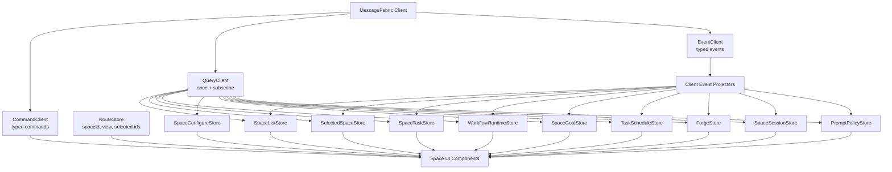

# Client State And Read Models Design

**Date:** 2026-05-21
**Status:** Draft Design
**Related:**
- [Unified Message Fabric Architecture Design](./unified-message-fabric-design.md)
- [Space Runtime Decomposition Design](./space-runtime-decomposition.md)

---

## 1. Overview

This document defines the target frontend state architecture assuming `MessageFabric` and the decomposed Space runtime are already in place.

The client should not preserve the old backend shape by keeping one broad mutable `SpaceStore`. Instead, the web app should consume typed command/query/event contracts and maintain focused read-model stores. Each store owns one domain slice, one subscription lifecycle, and one stale-response policy.

The Forge system must be treated as a first-class Space domain slice. Forge scopes, evidence, metric snapshots, episodes, lessons, task proposals, and rollups are not component-local state. They are read models connected to goals, tasks, workflow runs, and runtime events.

Prompt Policy Registry state should also be a read-model surface. The UI should not infer effective output behavior by inspecting global settings, Space settings, workflow JSON, and session config separately. It should query an effective prompt policy preview that reports applied records, suppressed records, inherited source, and active built-ins.

---

## 2. Current State

The main frontend state surface is `packages/web/src/lib/space-store.ts`. It currently owns:

- global Space list and sidebar task summaries;
- selected Space metadata and runtime state;
- tasks, task commands, paginated task group fetches, and task activity LiveQueries;
- workflow runs and node execution LiveQueries;
- agents, agent templates, workflows, workflow templates, and workflow detail cache;
- Space sessions LiveQuery;
- schedules;
- goals and goal events;
- gate/artifact fetch helpers;
- direct MessageHub RPC command methods;
- event subscription setup and reconnect behavior.

`SpaceForge.tsx` is a newer parallel state island. It owns local Forge scope selection, list loading, request versioning, scope mutation handling, and detail data loading. It calls `evolution.*` RPCs directly through `useMessageHub()` and manually patches adjacent `spaceStore` state when Forge rollups update goals or proposals create tasks.

The current state model works, but it has several architectural problems:

1. **One store owns too many domains.** State lifecycle for spaces, tasks, workflows, goals, schedules, sessions, and runtime execution all share one object.
2. **Command clients and read models are mixed.** Methods such as `createTask`, `listGoals`, `sendTaskMessage`, and `subscribeTaskActivity` live beside signals and event reducers.
3. **LiveQuery is used as an implementation detail, not a contract.** The UI subscribes to query names such as `nodeExecutions.byRun` and then manually composes higher-level state.
4. **Event semantics are inconsistent.** Some events patch stores, some commands patch stores from responses, and some views fetch local snapshots.
5. **Forge is outside the store boundary.** Scope list and detail data are local to `SpaceForge`, while cross-domain effects are patched into `spaceStore`.
6. **Testing encourages broad mocks.** Components mock `spaceStore` directly, which makes domain boundaries harder to see.

---

## 3. Design Goals

1. **Typed MessageFabric client:** every client command, query, and subscription uses typed contracts.
2. **Focused read models:** split frontend state by user-facing domain and data lifecycle.
3. **Forge as first-class state:** Forge scopes and detail entities get dedicated stores and event reducers.
4. **No cross-store hidden mutation:** cross-domain effects flow through fabric events or explicit projections.
5. **Stable route selection:** route state selects a Space and view, but it does not own domain data.
6. **Live and one-shot queries share contracts:** a query can be loaded once or subscribed without changing the read-model shape.
7. **Stale response safety by default:** all selected-space and selected-scope stores reject stale responses after navigation.
8. **Incremental migration:** keep `spaceStore` as a compatibility facade while components move to smaller stores.

## 4. Non-Goals

- Rewriting all Space UI components at once.
- Replacing Preact Signals.
- Introducing a new state management framework.
- Removing MessageHub compatibility immediately.
- Replacing all local component state. Ephemeral UI state such as open dialogs, form drafts, tabs, and pending button state remains local.

---

## 5. Target Architecture



The store layer is not a second backend. It is a cache of read models derived from fabric queries and events.

---

## 6. Core Client Contracts

### 6.1 Command Client

Commands are side-effecting operations. The client should not manually infer domain state from every command response unless the command returns data needed for local UX.

```typescript
export interface CommandClient {
  execute<TInput, TResult>(
    name: string,
    input: TInput,
    options?: { idempotencyKey?: string; subject?: string }
  ): Promise<TResult>;
}
```

Rules:

- Command response data may be returned to the caller for UX.
- Durable state updates should arrive through events/subscribed queries.
- Optimistic updates are allowed only when the store owns rollback behavior.
- Accepted commands return operation IDs and are tracked by an operation/read-model store.

### 6.2 Query Client

Queries are read-only and may be used once or subscribed.

```typescript
export interface QueryClient {
  query<TParams, TResult>(name: string, params: TParams): Promise<TResult>;

  subscribe<TParams, TSnapshot, TDelta>(
    name: string,
    params: TParams,
    handlers: {
      onSnapshot(snapshot: TSnapshot): void;
      onDelta(delta: TDelta): void;
      onError?(error: Error): void;
    }
  ): Promise<() => void>;
}
```

`LiveQuery` remains an implementation detail behind subscribed fabric queries. Components should not know whether a query is backed by SQL LiveQuery, event projection, or a server-side materialized view.

### 6.3 Event Client

Events are facts emitted by the daemon. Client stores subscribe to typed events and apply reducers.

```typescript
export interface EventClient {
  on<TEvent>(name: string, handler: (event: TEvent) => void): () => void;
}
```

Event handlers should be narrow and colocated with the store that owns the affected read model.

---

## 7. Store Boundaries

### 7.0 GlobalStore

Owns application-wide system/settings snapshots that are not scoped to a Space or session.

Read models:

- `state.global.snapshot`
- `state.system`
- `state.settings`

Events:

- `state.system.updated`
- `state.settings.updated`

Notes:

- Current `state.global.snapshot`, `state.system`, and `state.settings` surfaces must remain available behind fabric during migration. They hydrate auth, credential-store health, system health, and global settings on startup, and should not be replaced by each feature independently refetching its own settings.

### 7.1 RouteStore

Owns browser-route-derived state only.

State:

- selected Space ID or slug;
- active Space view: overview, tasks, goals, sessions, forge, configure;
- optional selected task, workflow run, Forge scope, or tab IDs if routed.

Does not fetch domain data. It tells domain stores what selection is active.

### 7.2 SpaceListStore

Owns the global Space list and sidebar summaries.

Read models:

- `space.list`
- `space.listWithActivitySummary`

Commands:

- `space.create`

Events:

- `space.created`
- `space.updated`
- `space.archived`
- `space.deleted`
- `space.task.created`
- `space.task.updated`
- `space.task.archived`
- `space.workflowRun.updated`

Notes:

- Current `spaces` and `spacesWithTasks` move here.
- Sidebar summaries should eventually be a server read model, not local recomposition from task events.

### 7.3 SelectedSpaceStore

Owns the selected Space shell.

Read models:

- `space.detail.get`
- `space.overview`
- `space.runtimeState`

State:

- `space`
- `runtimeState`
- `loading`
- `error`

Events:

- `space.updated`
- `space.archived`
- `space.deleted`

Commands:

- `space.update`
- `space.pause`
- `space.resume`
- `space.stop`
- `space.start`
- `space.archive`
- `space.delete`

Notes:

- `space.get` remains a compatibility alias for `space.detail.get` and preserves the current id-or-slug
  lookup shape used by Space detail hydration and online Space chat assertions. `space.overview` is a
  selected-shell aggregate and must not replace that direct detail lookup unless it explicitly supports the
  same request/response contract.

### 7.4 SpaceTaskStore

Owns tasks and task activity for the selected Space.

Read models:

- `space.task.list`
- `space.task.get`
- `space.task.group`
- `space.task.activity`

State:

- task list for selected Space;
- paginated task group snapshots;
- active task-agent activity by task ID;
- computed active, standalone, scheduled, blocked, review, and completed groups.

Commands:

- `space.task.create`
- `space.task.update`
- `space.task.publish`
- `space.task.recoverWorkflow`
- `space.task.submitForReview`
- `space.task.approvePendingCompletion`
- `space.task.sendMessage`
- `space.task.activateNodeAgent`

Events:

- `space.task.created`
- `space.task.updated`
- `space.task.archived`
- `space.workflowMessage.queued`
- `space.workflowMessage.delivered`
- `space.pendingMessage.queued`
- `space.pendingMessage.delivered`

Forge relationship:

- `TaskProposal.createdTaskId` should be reflected through `forge.taskProposal.updated`.
- Tasks created from Forge proposals still arrive as `space.task.created` and include `evolutionScopeId`.

Notes:

- Existing task RPCs map as follows during migration: `spaceTask.get` -> `space.task.get`, `spaceTask.create` -> `space.task.create`, `spaceTask.update` -> `space.task.update`, `spaceTask.publish` -> `space.task.publish`, `spaceTask.recoverWorkflow` -> `space.task.recoverWorkflow`, `spaceTask.submitForReview` -> `space.task.submitForReview`, and `spaceTask.approvePendingCompletion` -> `space.task.approvePendingCompletion`.
- Existing pending-message queue events map as follows during migration: `space.pendingMessage.queued` -> `space.workflowMessage.queued` and `space.pendingMessage.delivered` -> `space.workflowMessage.delivered`. Until producers are renamed, the compatibility bridge must fan out both legacy and target event names so task activity and delivery audit projections stay fresh.

### 7.5 WorkflowRuntimeStore

Owns workflow run and node execution read models for the selected Space.

Read models:

- `space.workflowRun.list`
- `space.workflowRun.get`
- `space.workflowRun.active`
- `space.workflowNodeExecution.list`
- `space.workflowGate.status`
- `space.workflowGate.data.list`
- `space.workflowRun.artifacts`
- `space.workflowRun.gateArtifacts`
- `space.workflowRun.fileDiff`
- `space.workflowRun.commits`
- `space.workflowRun.commitFiles`
- `space.workflowRun.commitFileDiff`
- `space.workflowRun.hookStates`
- `space.workflowRun.artifactCache`

State:

- workflow runs by ID;
- node executions by run ID and by workflow node ID;
- gate status by run/gate;
- artifacts by run;
- file diffs and commit metadata by run;
- pending hook state by run and hook ID.

Commands:

- `space.workflowRun.start`
- `space.workflowRun.cancel`
- `space.workflowRun.resumeBlocked`
- `space.workflowRun.markFailed`
- `space.workflowNode.activate`
- `space.workflowGate.approve`
- `space.workflowHook.approve`
- `space.workflowHook.retry`
- `space.workflowGate.data.writeForTest`

Events:

- `space.workflowRun.created`
- `space.workflowRun.updated`
- `space.workflowRun.completed`
- `space.workflowRun.blocked`
- `space.workflowRun.reopened`
- `space.workflowNodeExecution.created`
- `space.workflowNodeExecution.started`
- `space.workflowNodeExecution.idle`
- `space.workflowNodeExecution.blocked`
- `space.workflowNodeExecution.restarted`
- `space.workflowGate.opened`
- `space.workflowGate.pendingApproval`
- `space.gateData.updated`
- `space.hookState.updated`
- `space.artifactCache.updated`

Notes:

- Current per-run `nodeExecutions.byRun` subscriptions should be replaced by a space-scoped runtime read model when available.
- Workflow-run creation must emit `space.workflowNodeExecution.created` for pending or gated node-execution rows that exist before a start transition. If a transitional path cannot emit per-row create events yet, it must invalidate `space.workflowNodeExecution.list` on run creation and node activation so the runtime canvas can load pending nodes before they become started, idle, blocked, or restarted.
- Existing raw gate-data RPCs/events map as follows during migration: `spaceWorkflowRun.listGateData` -> `space.workflowGate.data.list`, non-production `spaceWorkflowRun.writeGateData` -> `space.workflowGate.data.writeForTest`, and `space.gateData.updated` remains the canonical event for raw gate-data row updates. `space.workflowGate.status` may include derived gate state, but it must not replace the raw gate-data records needed by banners and gate detail panes.
- Existing artifact RPCs map as follows during migration: `spaceWorkflowRun.getGateArtifacts` -> `space.workflowRun.gateArtifacts`, `spaceWorkflowRun.getFileDiff` -> `space.workflowRun.fileDiff`, `spaceWorkflowRun.getCommits` -> `space.workflowRun.commits`, `spaceWorkflowRun.getCommitFiles` -> `space.workflowRun.commitFiles`, `spaceWorkflowRun.getCommitFileDiff` -> `space.workflowRun.commitFileDiff`, and `spaceWorkflowRun.listArtifacts` -> `space.workflowRun.artifacts`.
- Existing artifact cache invalidation maps as follows during migration: `space.artifactCache.updated` remains the compatibility event for background gate-artifact and commit-cache writes until producers publish a target `space.workflowRun.artifactCache.updated` invalidation event.
- Existing hook RPCs map as follows during migration: `spaceWorkflowRun.listHookStates` -> `space.workflowRun.hookStates`, `spaceWorkflowRun.approveHook` -> `space.workflowHook.approve`, and `spaceWorkflowRun.retryHook` -> `space.workflowHook.retry`.
- Existing hook-state update events map as follows during migration: `space.hookState.updated` remains the compatibility event for hook approval, retry, and runtime hook-state writes until producers publish a target `space.workflowHook.updated` or read-model invalidation event.
- Existing workflow-run control RPCs map as follows during migration: `spaceWorkflowRun.start` -> `space.workflowRun.start`, `spaceWorkflowRun.list` -> `space.workflowRun.list`, `spaceWorkflowRun.get` -> `space.workflowRun.get`, `spaceWorkflowRun.resume` -> `space.workflowRun.resumeBlocked`, `spaceWorkflowRun.cancel` -> `space.workflowRun.cancel`, `spaceWorkflowRun.approveGate` -> `space.workflowGate.approve`, and any reject/deny variant must map to the same gate command with an explicit decision payload.
- Existing failure RPCs map as follows during migration: `spaceWorkflowRun.markFailed` -> `space.workflowRun.markFailed`. This command records unrecoverable runtime failures such as `agentCrash`, `maxIterationsReached`, or `nodeTimeout`; `space.workflowRun.resumeBlocked` is only for recovering an already blocked run and must not replace failure marking.
- The canvas should depend on this store, not raw `spaceStore.nodeExecutions`.

### 7.6 SpaceConfigureStore

Owns configuration surfaces.

Read models:

- `space.agent.list`
- `space.agentTemplate.list`
- `space.agentTemplate.builtin.list`
- `space.agentTemplate.driftReport`
- `space.longHorizonAgent.list`
- `space.longHorizonAgentTemplate.builtin.list`
- `space.longHorizonAgent.reminders.list`
- `space.longHorizonAgent.subscriptions.list`
- `space.workflow.list`
- `space.workflowTemplate.list`
- `space.workflowTemplate.builtin.list`
- `space.workflowTemplate.drift`
- `space.workflowTemplate.duplicateDrift`
- `space.workflow.get`
- `space.mcp.enablement.list`
- `externalEvents.extensions.list`
- `space.externalEvents.deliveries.list`
- `space.github.config.list`
- `space.github.watchedRepos.list`

Commands:

- `space.agent.create`
- `space.agent.update`
- `space.agent.delete`
- `space.agent.syncFromTemplate`
- `space.agent.promotionDraft.get`
- `space.agent.promoteSession`
- `space.longHorizonAgent.create`
- `space.longHorizonAgent.update`
- `space.longHorizonAgent.delete`
- `space.longHorizonAgent.reminder.create`
- `space.longHorizonAgent.reminder.delete`
- `space.longHorizonAgent.subscription.create`
- `space.longHorizonAgent.subscription.update`
- `space.longHorizonAgent.subscription.delete`
- `space.workflow.create`
- `space.workflow.update`
- `space.workflow.delete`
- `space.workflow.syncFromTemplate`
- `space.workflow.resyncDuplicates`
- `space.export.agents`
- `space.export.bundle`
- `space.export.workflows`
- `space.import.preview`
- `space.import.execute`
- `space.mcp.setEnabled`
- `space.mcp.clearOverride`
- `mcp.imports.refresh`
- `externalEvents.extensions.setGlobalEnabled`
- `space.github.config.set`
- `space.github.enable`
- `space.github.disable`
- `space.github.watchedRepos.add`
- `space.github.watchedRepos.remove`
- `space.github.webhook.autoConfigure`
- `space.github.webhook.check`
- `space.github.pollOnce`

Events:

- `space.agent.created`
- `space.agent.updated`
- `space.agent.deleted`
- `space.longHorizonAgent.created`
- `space.longHorizonAgent.updated`
- `space.longHorizonAgent.deleted`
- `space.workflow.created`
- `space.workflow.updated`
- `space.workflow.deleted`
- `space.mcp.enablement.updated`
- `mcp.imports.refreshed`
- `externalEvents.extension.updated`
- `space.externalEvents.delivery.created`
- `space.externalEvents.delivery.updated`

Notes:

- Current workflow detail cache and version map move here.
- External-event source enablement and delivery inspection belong to the configure surface because they drive Space settings. Existing RPCs map as follows during migration: `externalEvents.extensions.list` stays under the same global extension query name, `externalEvents.extensions.setGlobalEnabled` stays under the same global command name, and `space.externalEvents.listDeliveries` maps to `space.externalEvents.deliveries.list`.
- Existing Space agent CRUD RPCs map as follows during migration: `spaceAgent.list` -> `space.agent.list`, `spaceAgent.create` -> `space.agent.create`, `spaceAgent.update` -> `space.agent.update`, and `spaceAgent.delete` -> `space.agent.delete`.
- Existing agent/template RPCs map as follows during migration: `spaceAgent.listBuiltInTemplates` -> `space.agentTemplate.builtin.list`, `spaceAgent.syncFromTemplate` -> `space.agent.syncFromTemplate`, `spaceAgent.getPromotionDraft` -> `space.agent.promotionDraft.get`, and `spaceAgent.promoteSession` -> `space.agent.promoteSession`.
- Existing template drift RPCs map as follows during migration: `spaceAgent.getDriftReport` -> `space.agentTemplate.driftReport`, `spaceWorkflow.detectDrift` -> `space.workflowTemplate.drift`, and `spaceWorkflow.detectDuplicateDrift` -> `space.workflowTemplate.duplicateDrift`.
- Existing workflow CRUD/detail RPCs map as follows during migration: `spaceWorkflow.list` -> `space.workflow.list`, `spaceWorkflow.get` -> `space.workflow.get`, `spaceWorkflow.create` -> `space.workflow.create`, `spaceWorkflow.update` -> `space.workflow.update`, and `spaceWorkflow.delete` -> `space.workflow.delete`.
- Existing workflow-template RPCs map as follows during migration: `spaceWorkflow.listBuiltInTemplates` -> `space.workflowTemplate.builtin.list`, `spaceWorkflow.syncFromTemplate` -> `space.workflow.syncFromTemplate`, and `spaceWorkflow.resyncDuplicates` -> `space.workflow.resyncDuplicates`.
- Existing export/import RPCs map as follows during migration: `spaceExport.agents` -> `space.export.agents`, `spaceExport.bundle` -> `space.export.bundle`, `spaceExport.workflows` -> `space.export.workflows`, `spaceImport.preview` -> `space.import.preview`, and `spaceImport.execute` -> `space.import.execute`.
- Existing long-horizon-agent RPCs map as follows during migration: `spaceLongHorizonAgent.list` -> `space.longHorizonAgent.list`, `spaceLongHorizonAgent.create` -> `space.longHorizonAgent.create`, `spaceLongHorizonAgent.update` -> `space.longHorizonAgent.update`, `spaceLongHorizonAgent.delete` -> `space.longHorizonAgent.delete`, `spaceLongHorizonAgent.listBuiltInTemplates` -> `space.longHorizonAgentTemplate.builtin.list`, `spaceLongHorizonAgent.listReminders` -> `space.longHorizonAgent.reminders.list`, `spaceLongHorizonAgent.createReminder` -> `space.longHorizonAgent.reminder.create`, `spaceLongHorizonAgent.deleteReminder` -> `space.longHorizonAgent.reminder.delete`, `spaceLongHorizonAgent.listSubscriptions` -> `space.longHorizonAgent.subscriptions.list`, `spaceLongHorizonAgent.createSubscription` -> `space.longHorizonAgent.subscription.create`, `spaceLongHorizonAgent.updateSubscription` -> `space.longHorizonAgent.subscription.update`, and `spaceLongHorizonAgent.deleteSubscription` -> `space.longHorizonAgent.subscription.delete`.
- Existing MCP settings paths map as follows during migration: `mcpEnablement.bySpace` -> `space.mcp.enablement.list`, `space.mcp.setEnabled` and `space.mcp.clearOverride` keep their command names, `mcp.imports.refresh` keeps its global import-refresh command name, and `settings.mcp.refreshImports` maps to the same import-refresh target until legacy settings callers migrate.
- Existing per-space GitHub source toggles remain explicit commands during migration: `space.github.enable` enables the GitHub external-event source for a Space and `space.github.disable` disables it. If a later implementation folds these into `space.github.config.set`, that command must preserve the same per-space enablement semantics and the compatibility bridge must continue to expose the existing RPC names until callers migrate.
- Existing GitHub repository settings RPCs map as follows during migration: `space.github.listConfig` -> `space.github.config.list`, `space.github.listWatchedRepos` -> `space.github.watchedRepos.list`, `space.github.watchRepo` -> `space.github.watchedRepos.add`, and `space.github.unwatchRepo` -> `space.github.watchedRepos.remove`. `space.github.watchedRepos.add` must preserve the current upsert/edit semantics of `space.github.watchRepo` for enabled, webhook-enabled, and polling-enabled toggles, or the bridge must expose a separate `space.github.watchedRepos.update` alias before cleanup.
- Existing GitHub webhook RPCs map as follows during migration: `space.github.autoConfigureWebhook` -> `space.github.webhook.autoConfigure` and `space.github.checkWebhook` -> `space.github.webhook.check`.
- Existing GitHub token and polling RPCs map as follows during migration: `space.github.getTokenStatus` -> `space.github.token.status`, `space.github.setToken` -> `space.github.token.set`, `space.github.clearToken` -> `space.github.token.clear`, `space.github.setPollingEnabled` -> `space.github.polling.setEnabled`, and `space.github.pollOnce` keeps the same target command name and triggers an immediate poll for polling-enabled watched repositories.
- Existing configure events map as follows during migration: `spaceAgent.created` -> `space.agent.created`, `spaceAgent.updated` -> `space.agent.updated`, `spaceAgent.deleted` -> `space.agent.deleted`, `spaceLongHorizonAgent.created` -> `space.longHorizonAgent.created`, `spaceLongHorizonAgent.updated` -> `space.longHorizonAgent.updated`, `spaceLongHorizonAgent.deleted` -> `space.longHorizonAgent.deleted`, `spaceWorkflow.created` -> `space.workflow.created`, `spaceWorkflow.updated` -> `space.workflow.updated`, and `spaceWorkflow.deleted` -> `space.workflow.deleted`. Until producers publish the target names directly, either the compatibility bridge must fan out both namespaces or `SpaceConfigureStore` must subscribe to the legacy names as compatibility aliases.

### 7.7 SpaceGoalStore

Owns mission/goal state.

Read models:

- `space.goal.list`
- `space.goal.get`
- `space.goal.events`

Commands:

- `space.goal.create`
- `space.goal.update`
- `space.goal.pause`
- `space.goal.resume`
- `space.goal.archive`
- `space.goal.createImmediateTask`

Events:

- `space.goal.created`
- `space.goal.updated`
- `space.goal.archived`
- `space.goal.event.created`
- `space.task.created`

Forge relationship:

- Forge rollups update recurring goals. The goal store should update from `space.goal.updated`, not from `SpaceForge` manually calling `spaceStore.upsertGoal`.
- Goal-linked Forge scopes should be resolved through `forge.scope.list({ spaceGoalId })` or a denormalized read model, not ad hoc component logic.

Notes:

- Existing goal RPCs map as follows during migration: `spaceGoal.list` -> `space.goal.list`, `spaceGoal.get` -> `space.goal.get`, `spaceGoal.create` -> `space.goal.create`, `spaceGoal.update` -> `space.goal.update`, `spaceGoal.pause` -> `space.goal.pause`, `spaceGoal.resume` -> `space.goal.resume`, `spaceGoal.listEvents` -> `space.goal.events`, and `spaceGoal.createImmediateTask` -> `space.goal.createImmediateTask`.

### 7.8 TaskScheduleStore

Owns task schedules.

Read models:

- `space.taskSchedule.list`
- `space.taskSchedule.get`

Commands:

- `space.taskSchedule.create`
- `space.taskSchedule.update`
- `space.taskSchedule.pause`
- `space.taskSchedule.resume`
- `space.taskSchedule.delete`

Events:

- `space.taskSchedule.created`
- `space.taskSchedule.updated`
- `space.taskSchedule.deleted`

Notes:

- Existing task schedule RPCs map as follows during migration: `taskSchedule.list` -> `space.taskSchedule.list`, `taskSchedule.get` -> `space.taskSchedule.get`, `taskSchedule.create` -> `space.taskSchedule.create`, `taskSchedule.update` -> `space.taskSchedule.update`, `taskSchedule.pause` -> `space.taskSchedule.pause`, `taskSchedule.resume` -> `space.taskSchedule.resume`, and `taskSchedule.delete` -> `space.taskSchedule.delete`.
- The current `space.schedule.updated` event should be normalized under the schedule contract namespace. During migration, schedule producers or the compatibility bridge must fan out `space.schedule.updated` to the target `space.taskSchedule.created`, `space.taskSchedule.updated`, or `space.taskSchedule.deleted` events when the operation is known; otherwise `TaskScheduleStore` must treat the legacy aggregate event as an invalidation for `space.taskSchedule.list`.

### 7.9 SpaceSessionStore

Owns sessions associated with the selected Space.

Read models:

- `space.session.list`

Events:

- `session.created`
- `session.updated`
- `session.deleted`

Notes:

- Current `spaceSessions.bySpace` LiveQuery moves behind `space.session.list` subscribed query.
- The target event namespace remains `session.*`; `space.session.list` filters/project sessions by Space membership instead of requiring new `space.session.*` producers. A bridge may expose Space-scoped invalidation subjects, but canonical durable event contracts stay aligned with current session lifecycle events.

### 7.10 PromptPolicyStore

Owns effective prompt policy preview state and scoped prompt policy commands.

Read models:

- `promptPolicy.effective.preview`
- `promptPolicy.record.list`

State:

- applied records by preview scope;
- suppressed records with reasons;
- inherited source summary, such as global, Space, SpaceAgent, workflow, workflow-node, task, or session;
- active built-ins such as `neokai.output-mode.compressed`;
- channel previews for `system.prepend`, `system.append`, and `agent.prompt.append`;
- loading/error state per preview target.

Commands:

- `promptPolicy.record.create`
- `promptPolicy.record.update`
- `promptPolicy.record.enable`
- `promptPolicy.record.disable`
- `promptPolicy.record.delete`
- `promptPolicy.builtin.activate`
- `promptPolicy.builtin.suppress`

Events:

- `promptPolicy.record.created`
- `promptPolicy.record.updated`
- `promptPolicy.record.deleted`
- `promptPolicy.effective.changed`

Notes:

- The UI should show inherited effective behavior from the preview query rather than duplicating scope precedence logic client-side.
- Session, Space, SpaceAgent, workflow, workflow-node, and task controls should write scoped records through commands; they should not add feature-specific `outputMode` fields to local state.

### 7.11 ForgeStore

Owns Forge evolution read models and commands.

Read models:

- `forge.scope.list`
- `forge.scope.detail`
- `forge.scope.timeline`
- `forge.evidence.list`
- `forge.metricSnapshot.list`
- `forge.reviewBundle.get`
- `forge.episode.list`
- `forge.lesson.list`
- `forge.taskProposal.list`

State:

- scopes by selected Space;
- selected scope ID;
- evidence by scope ID;
- metric snapshots by scope ID;
- review bundles by scope ID;
- active lessons by scope ID;
- proposals by scope ID;
- loading/error state per scope detail section.

Commands:

- `forge.scope.create`
- `forge.scope.createFromGoal`
- `forge.scope.update`
- `forge.evidence.addManualNote`
- `forge.evidence.attachTask`
- `forge.evidence.attachWorkflowRun`
- `forge.metricSnapshot.create`
- `forge.episode.createFromEvidence`
- `forge.episode.update`
- `forge.lesson.update`
- `forge.taskProposal.create`
- `forge.taskProposal.update`
- `forge.taskProposal.createTask`
- `forge.rollup.apply`

Events:

- `forge.scope.created`
- `forge.scope.updated`
- `forge.evidence.created`
- `forge.metricSnapshot.created`
- `forge.episode.created`
- `forge.episode.updated`
- `forge.lesson.created`
- `forge.lesson.updated`
- `forge.taskProposal.created`
- `forge.taskProposal.updated`
- `forge.rollup.applied`

Cross-domain events:

- `forge.taskProposal.taskCreated` should cause `space.task.created`.
- `forge.rollup.applied` should cause `space.goal.updated`.
- `space.task.updated` may cause `forge.evidence.created` when a task transitions to completed and completed-task evidence capture is enabled.

Notes:

- `SpaceForge.tsx` should become mostly view state: active tab, dialogs, forms, and selected evidence checkboxes.
- Scope list request-version guards move into `ForgeStore`.
- The store must handle selected-space changes by clearing scope detail immediately, matching existing tests that prevent stale Space A scopes from appearing in Space B.
- Existing Forge RPCs remain compatibility aliases until the UI migrates: `evolution.scope.get` ->
  `forge.scope.detail`, `evolution.scope.list` -> `forge.scope.list`,
  `evolution.scope.create` -> `forge.scope.create`, `evolution.scope.update` ->
  `forge.scope.update`, `evolution.evidence.list` -> `forge.evidence.list`,
  `evolution.evidence.addManualNote` -> `forge.evidence.addManualNote`,
  `evolution.metricSnapshot.list` -> `forge.metricSnapshot.list`,
  `evolution.metricSnapshot.create` -> `forge.metricSnapshot.create`,
  `evolution.review.get` -> `forge.review.get`, `evolution.episode.update` ->
  `forge.episode.update`, `evolution.episode.createFromEvidence` ->
  `forge.episode.createFromEvidence`, `evolution.lesson.list` -> `forge.lesson.list`,
  `evolution.lesson.update` -> `forge.lesson.update`, `evolution.taskProposal.update` ->
  `forge.taskProposal.update`, `evolution.taskProposal.createTask` ->
  `forge.taskProposal.createTask`, and `evolution.rollup.apply` -> `forge.rollup.apply`.

---

## 8. Forge Read-Model Shape

Forge has nested data and cross-domain side effects, so it needs a stronger read-model shape than a single array.

```typescript
export interface ForgeScopeReadModel {
  scope: EvolutionScope;
  linkedGoal?: SpaceGoal | null;
  counts: {
    evidence: number;
    episodes: number;
    activeLessons: number;
    proposedTasks: number;
  };
  latestEpisode?: EvolutionEpisode | null;
  updatedAt: number;
}

export interface ForgeReviewBundleReadModel {
  episodes: EvolutionEpisode[];
  lessons: EvolutionLesson[];
  proposals: TaskProposal[];
}

export interface ForgeScopeDetailReadModel {
  scope: EvolutionScope;
  version: number;
  updatedAt: number;
  linkedGoal?: SpaceGoal | null;
  evidence: EvidenceRef[];
  metricSnapshots: MetricSnapshot[];
  reviewBundle: ForgeReviewBundleReadModel;
}
```

Initial implementation can compose this on the client from narrower queries. Target implementation should offer server read models:

- `forge.scope.list` returns enough summary data for the left rail.
- `forge.scope.detail` returns evidence, metrics, review bundle, and linked goal in one consistent snapshot.
- `forge.scope.timeline` returns a chronological timeline for audit/history views.

The detail snapshot should be versioned so deltas can be applied safely.

---

## 9. Selection And Stale Response Policy

Every selected-space store follows the same lifecycle:

1. Capture the selected `spaceId` and local request generation before fetch.
2. Clear stale detail state immediately when the selection changes.
3. Apply response only if the current generation and `spaceId` still match.
4. Merge local mutations that occurred while a list request was in flight.
5. Unsubscribe from old subscribed queries before subscribing to new ones.

Forge adds one more level:

1. Capture selected `scopeId` and scope-detail generation.
2. Clear old scope detail before loading the new scope.
3. Apply response only if both `spaceId` and `scopeId` still match.
4. Preserve newly created scopes/proposals/episodes against older list responses.

This policy should be implemented once in a small helper rather than repeatedly by each store.

---

## 10. Read Query Strategy

### Current Queries To Preserve Behind Fabric

| Current surface | Target query/command |
| --- | --- |
| `state.global.snapshot` | `state.global.snapshot` |
| `state.system` | `state.system` subscribed |
| `state.settings` | `state.settings` subscribed |
| `space.listWithTasks` | `space.listWithActivitySummary` |
| `space.overview` | `space.overview` |
| `spaceTask.list` | `space.task.group` / `space.task.list` |
| `nodeExecution.list` | `space.workflowNodeExecution.list` |
| `nodeExecutions.byRun` | `space.workflowNodeExecution.list` subscribed |
| `spaceTaskActivity.byTask` | `space.task.activity` subscribed |
| `spaceTaskMessages.byTask` | `space.task.thread.messages` subscribed |
| `spaceTaskMessages.byTask.compact` | `space.task.thread.messages.compact` subscribed |
| `spaceTaskActiveTurn.byTask` | `space.task.thread.activeTurn` subscribed |
| `actorMessages.byTask` | `space.task.actorMessages` subscribed |
| `actorMessages.byWorkflowRun` | `space.workflowRun.actorMessages` subscribed |
| `spaceSessions.bySpace` | `space.session.list` subscribed |
| `nodeExecution.create` | `space.workflowNodeExecution.createForTest` non-production command |
| `nodeExecution.update` | `space.workflowNodeExecution.updateForTest` non-production command |
| `spaceGoal.list` | `space.goal.list` |
| `spaceGoal.listEvents` | `space.goal.events` |
| `taskSchedule.list` | `space.taskSchedule.list` |
| `evolution.scope.list` | `forge.scope.list` |
| `evolution.evidence.list` | `forge.evidence.list` |
| `evolution.metricSnapshot.list` | `forge.metricSnapshot.list` |
| `evolution.review.get` | `forge.reviewBundle.get` |
| prompt/output behavior assembled from settings, Space, workflow, and session state | `promptPolicy.effective.preview` |

### New Queries To Add

| Query | Purpose |
| --- | --- |
| `space.workflowRun.summaryBySpace` | Single subscribed query for runs plus node execution summary. |
| `space.task.board` | Task badge counts and grouped summaries for the task view. |
| `forge.scope.detail` | Consistent scope detail snapshot. |
| `forge.scope.timeline` | Evidence, metric, episode, lesson, and proposal timeline. |
| `forge.scope.byGoal` | Resolve recurring goal to scope without manual client filtering. |
| `promptPolicy.effective.preview` | Applied/suppressed prompt policy records and inherited source for a session/task/scope chain. |
| `promptPolicy.record.list` | Inspect scoped prompt policy rows for settings/debug UI. |

---

## 11. Event Projection Rules

1. Stores apply only events for their current scope.
2. Events must include enough identity to route without extra queries: `spaceId`, entity ID, and parent IDs.
3. Events should carry full read-model rows when cheap and stable.
4. Events that only carry IDs must trigger targeted query refresh, not a full Space refresh.
5. Cross-domain effects are emitted explicitly. For example, `forge.rollup.applied` does not replace `space.goal.updated`; it complements it.

Example Forge rollup event sequence:

```text
forge.episode.updated
forge.rollup.applied
space.goal.updated
space.goal.event.created
```

Example task proposal conversion sequence:

```text
forge.taskProposal.updated
space.task.created
```

Example completed task evidence capture:

```text
space.task.updated
forge.evidence.created
```

---

## 12. Compatibility Facade

`spaceStore` should remain temporarily as a facade to avoid a risky UI rewrite.

Facade rules:

- Signals forward to the new stores.
- Methods forward to command clients or domain stores.
- New components should not import `spaceStore`.
- Existing components migrate one view at a time.
- Tests for migrated components mock the specific store/command client instead of the global facade.

Suggested facade mapping:

| Current `spaceStore` member | Target owner |
| --- | --- |
| `spaces`, `spacesWithTasks`, `initGlobalList` | `SpaceListStore` |
| `spaceId`, `space`, `runtimeState`, `selectSpace` | `RouteStore` + `SelectedSpaceStore` |
| `tasks`, `taskActivity`, task commands | `SpaceTaskStore` |
| `workflowRuns`, `nodeExecutions` | `WorkflowRuntimeStore` |
| `agents`, `workflows`, templates | `SpaceConfigureStore` |
| `sessions` | `SpaceSessionStore` |
| `goals`, `goalEvents` | `SpaceGoalStore` |
| `schedules` | `TaskScheduleStore` |
| Forge local state in `SpaceForge` | `ForgeStore` |
| output/prompt behavior controls and previews | `PromptPolicyStore` |

---

## 13. Suggested File Layout

```text
packages/web/src/lib/fabric/
  command-client.ts
  query-client.ts
  event-client.ts
  subscription.ts
  stale-guard.ts

packages/web/src/lib/stores/
  route-store.ts
  space-list-store.ts
  selected-space-store.ts
  space-task-store.ts
  workflow-runtime-store.ts
  space-configure-store.ts
  space-goal-store.ts
  task-schedule-store.ts
  space-session-store.ts
  forge-store.ts
  prompt-policy-store.ts
  space-store-facade.ts
```

Keep Preact Signals as the store primitive. The main change is ownership, not the reactive library.

---

## 14. Migration Plan

### Phase 0: Contracts And Client Kernel

- Add typed fabric client wrappers around existing MessageHub request/event/LiveQuery behavior.
- Preserve raw `liveQuery.subscribe` and `liveQuery.unsubscribe` requests plus `liveQuery.snapshot` and
  `liveQuery.delta` events until every production caller moves to the subscribed-query wrapper. This is a
  migration precondition for cleanup because existing stores still use raw LiveQuery names for session
  messages, task threads, app MCP servers, skills, global/session snapshots, and related read models.
- Add shared stale-response and subscription helpers.
- Do not change components yet.

### Phase 1: SpaceStore Facade Split

- Create `SpaceListStore`, `SelectedSpaceStore`, and `SpaceTaskStore`.
- Make `spaceStore` forward existing members to those stores.
- Keep existing component imports working.

### Phase 2: Runtime Store

- Move workflow runs, node execution subscriptions, gate data, and artifact fetches into `WorkflowRuntimeStore`.
- Replace per-run subscription setup with the target subscribed query when daemon support exists.

### Phase 3: Configure, Goals, Schedules, Sessions

- Extract configuration data, goal state, schedules, and Space sessions.
- Normalize events and remove local command-response patches where events are available.

### Phase 4: Forge Store

- Introduce `ForgeStore`.
- Move scope list/detail loading out of `SpaceForge.tsx`.
- Add Forge event reducers.
- Route Forge rollup and proposal-created-task effects through events into `SpaceGoalStore` and `SpaceTaskStore`.
- Keep component-local form/dialog state in `SpaceForge`.

### Phase 5: Prompt Policy Store

- Introduce `PromptPolicyStore`.
- Add effective policy preview queries for session, Space, SpaceAgent, workflow, workflow-node, and task scopes.
- Move compressed-output controls to scoped prompt policy commands.
- Show inherited source and suppressed records from the preview query instead of reimplementing precedence in UI state.

### Phase 6: Component Migration

- Migrate Space views one at a time:
  1. Forge view.
  2. Goals view.
  3. Tasks view and task pane.
  4. Runtime canvas.
  5. Configure view.
  6. Overview/sidebar.

Forge should move early because it is new, self-contained, and currently duplicates store patterns that will otherwise harden into another monolith.

### Phase 7: Remove Facade

- Block new imports from `packages/web/src/lib/space-store.ts`.
- Remove migrated members from the facade.
- Delete facade once all components depend on domain stores.

---

## 15. Design Rules

1. Components do not call raw `hub.request` for Space domain state.
2. Components do not subscribe directly to raw `liveQuery.*` events.
3. A store owns exactly one read-model family.
4. Command responses may inform UX, but durable state comes from events or subscribed queries.
5. Cross-domain state updates happen through explicit events, not direct store imports.
6. Forge data is not component-local except for transient form and tab state.
7. Prompt policy UI reads effective previews from `PromptPolicyStore`; it does not duplicate precedence or suppression logic.
8. Every selected-space or selected-scope fetch has a stale-response guard.
9. Store tests should assert reducer behavior and stale-response behavior independently from component rendering.

---

## 16. Open Questions

1. Should `forge.scope.detail` be one server snapshot or separate subscribed queries for evidence, metrics, review bundle, and timeline?
2. Should selected Forge scope ID be routed so deep links can open a specific scope?
3. Should task group pagination stay local per component or become a shared read model with cached pages?
4. Which Space sidebar summaries should be materialized server-side instead of projected in the client?
5. Should operation tracking for accepted commands be a global store or per-domain store concern?
