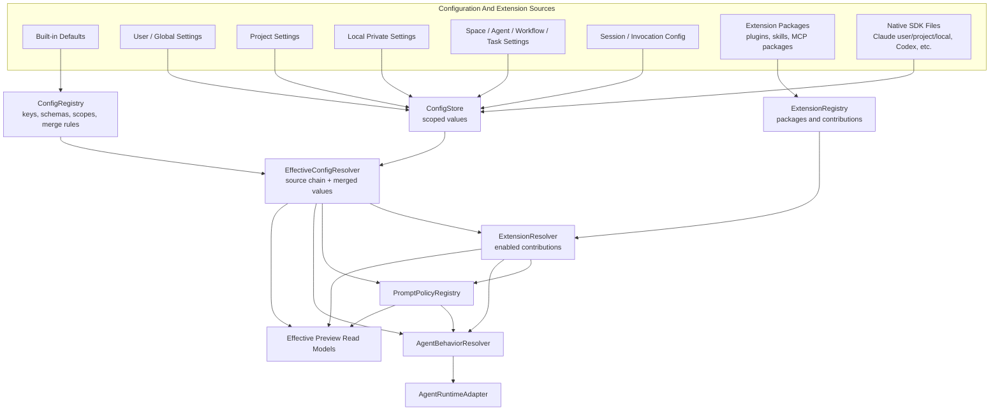

# Configuration And Extension Resolution Design

**Date:** 2026-05-27
**Status:** Draft Design
**Related:**

- [Target Architecture Overview](./README.md)
- [Agent Runtime And Provider Compatibility Design](./agent-runtime-and-provider-compatibility.md)
- [Shared Package Boundaries Design](./shared-package-boundaries.md)
- [Client State And Read Models Design](./client-state-and-read-models.md)
- [Prompt Policy Registry Spec](../../research/token-efficiency/prompt-policy-registry-spec.md)
- [Skills Registry Architecture Design](../skills-registry-design.md)
- [Unify MCP Configuration Model](../../plans/unify-mcp-config-model/00-overview.md)

---

## 1. Overview

NeoKai needs one coherent model for configuration and runtime extension. Today several concepts overlap:

- Claude Agent SDK settings can come from user, project, and local settings files.
- NeoKai has global settings, session config, Space settings, workflow settings, task/run overrides, provider settings, and runtime-only session config.
- Skills can be local SDK plugin directories, built-in `SKILL.md` directories, or wrappers around MCP servers.
- A plugin can be only packaging for a Markdown skill file, even when the user thinks they enabled a capability.
- Hooks can be built-in safety middleware, workflow tool guards, SDK lifecycle hooks, or future extension points.
- Prompt fragments can be system prompt appends, slash-command instructions, workflow agent prompts, or scoped prompt policy records.

The target architecture separates these concerns so users can understand what is active and developers can render the right SDK/provider shape without leaking one runtime's vocabulary into the whole product.

The goal is not to hide native SDK features. The goal is to make NeoKai own the semantic model and then render that model into Claude Agent SDK, Codex SDK/server, OpenAI Agents SDK, Pi, or other runtimes.

---

## 2. Design Goals

1. **Effective config first:** users see the active value and where it came from before seeing the full hierarchy.
2. **Typed config keys:** every configurable behavior declares allowed scopes, merge strategy, secrecy, exportability, and runtime render targets.
3. **Packaging is not semantics:** plugin, Markdown file, MCP server, and hook module describe delivery mechanics; they do not decide what user-facing capability means.
4. **Runtime-neutral extension model:** skills, MCP, hooks, prompt policy, and runtime settings resolve into a single `AgentBehavior` input before adapter rendering.
5. **Explicit native file handling:** user/project/local SDK settings are imported, projected, or deliberately allowed; they are not ambient hidden state.
6. **No hidden prompt mutation:** prompt-affecting extensions must be represented as prompt policy, slash-command skills, or explicit agent/workflow prompts with preview and provenance.
7. **Scoped overrides without confusion:** missing value means inherit; explicit override and explicit suppression are visible and resettable.
8. **Release-safe migration:** existing settings and skills keep working through compatibility adapters while new registries and resolvers land.

## 3. Non-Goals

- Replacing every existing settings table in one migration.
- Supporting arbitrary third-party executable hooks in the first implementation.
- Making every SDK native setting user-editable.
- Removing SDK plugin support. NeoKai should still render SDK plugins when that is the right adapter target.
- Treating prompt-only Markdown as safe user-authored global behavior before provenance, validation, and preview exist.

---

## 4. Terminology

### Configuration Key

A typed value NeoKai can resolve across scopes. Examples:

- default agent runtime profile
- provider/model selection
- SDK setting sources
- permission mode
- MCP enablement
- skill enablement
- hook policy enablement
- worktree isolation mode
- prompt policy activation

Each key defines its schema, allowed scopes, merge strategy, visibility, and renderer.

### Extension Package

A deliverable bundle. It may contain files, manifests, scripts, MCP server definitions, prompt templates, hook declarations, or metadata.

Examples:

- local SDK plugin directory
- built-in skill directory under `packages/skills/*`
- MCP server package or command
- future NeoKai extension bundle

An extension package does not automatically become enabled behavior. It must declare contributions, and those contributions must be activated by config.

### Contribution

A semantic capability an extension package offers.

Contribution types:

| Contribution | Meaning | Runtime render target |
| --- | --- | --- |
| `tool.mcp` | Tools exposed through an MCP server. | SDK `mcpServers` or runtime-native tool server. |
| `tool.native` | Runtime-native tool/function definition. | Runtime adapter tool registry. |
| `skill.command` | User-invoked slash command or skill. | SDK plugin/slash command, runtime command, or NeoKai command surface. |
| `prompt.policy` | Scoped always-on prompt behavior. | PromptPolicyRegistry -> AgentBehavior prompt fields. |
| `hook.policy` | Runtime middleware that observes, allows, denies, mutates, or adds context. | SDK hooks/callbacks or runtime middleware. |
| `runtime.setting` | Runtime/provider option. | SDK settings/options or provider bridge config. |
| `ui.surface` | Optional settings/read-model UI contribution. | NeoKai web UI, not model prompt. |

### Skill

A user-visible capability that an agent or user can intentionally invoke. A skill may be backed by an SDK plugin, a `SKILL.md` file, an MCP server, or a future runtime-native command.

Skill is the product concept. Plugin is only one possible delivery mechanism.

### Plugin

A runtime-specific packaging adapter, such as Claude Agent SDK `plugins: [{ type: 'local', path }]`.

A plugin can contain a skill, command, prompt files, or scripts. NeoKai should not use "plugin" as the generic user-facing word for all extension behavior.

### Hook

Runtime middleware that participates in lifecycle events such as pre-tool-use, post-tool-use, user prompt submission, task creation, or worktree lifecycle.

Hooks are powerful and can affect safety. Built-in hooks and declarative hook policies are allowed first. Arbitrary extension-provided executable hooks require a stronger trust and permissions model.

### Prompt Policy

Always-on or scoped prompt behavior resolved by PromptPolicyRegistry. Prompt policy is not the same as a slash-command skill. A Markdown file that silently appends instructions to every session is prompt policy, even if it is physically packaged inside a plugin.

---

## 5. Target Architecture



### Reading The Diagram

- `ConfigRegistry` defines what can be configured and how values merge.
- `ConfigStore` stores scoped values. It does not understand runtime-specific SDK rendering.
- `ExtensionRegistry` stores extension packages and declared contributions.
- `EffectiveConfigResolver` computes values for a concrete context: user, project, local machine, Space, workflow node, task, session, invocation.
- `ExtensionResolver` answers what contributions are active for that context.
- `PromptPolicyRegistry` owns always-on prompt behavior. It receives scoped activation state and renders prompt fragments through Agent Runtime.
- `AgentBehaviorResolver` turns effective config and active contributions into runtime-neutral behavior.
- `AgentRuntimeAdapter` renders behavior into Claude Agent SDK, Codex SDK/server, OpenAI Agents SDK, Pi, or future runtime-native fields.
- Preview read models show users why a value or contribution is active.

---

## 6. Scope Model

NeoKai should use one common scope chain for configuration and extensions. Individual keys can opt into a subset.

| Precedence | Scope | Meaning |
| --- | --- | --- |
| 1 | Invocation | One call/turn/run override. |
| 2 | Session | Long-lived session override. |
| 3 | Task / run | One Space task, workflow run, or job. |
| 4 | Workflow node | A specific workflow slot/agent. |
| 5 | Workflow | Reusable workflow definition. |
| 6 | Space agent | Reusable agent inside a Space. |
| 7 | Space | Project/product workspace in NeoKai. |
| 8 | Project / workspace | Repository or filesystem workspace. |
| 9 | Local private | Machine/user-private setting, not exported. |
| 10 | User / global | User-level app default. |
| 11 | Built-in default | NeoKai default. |

This order is generic. Some keys need a custom chain. For example, prompt policy currently puts task above session because a task/run override is narrower than the session that executes it. That is acceptable, but the key must declare the override order explicitly.

Missing value means inherit. Suppression must be explicit when a narrower scope wants to turn off a broader contribution.

---

## 7. Config Key Contract

Every configurable key should be registered with metadata like:

```typescript
export interface ConfigKeyDefinition<TValue> {
  key: string;
  version: number;
  schema: unknown;
  allowedScopes: ConfigScopeType[];
  mergeStrategy: 'replace' | 'deepMerge' | 'appendOrdered' | 'enablement' | 'custom';
  defaultValue?: TValue;
  secret: boolean;
  exportable: boolean;
  userVisible: boolean;
  runtimeTargets: Array<'agent-runtime' | 'provider' | 'mcp' | 'prompt-policy' | 'ui'>;
}
```

Examples:

| Key | Allowed scopes | Merge strategy | Notes |
| --- | --- | --- | --- |
| `agent.runtime.defaultProfile` | user, project, Space, workflow node, session | replace | Selects runtime/provider/model profile. |
| `agent.permissionMode` | user, project, Space, session | replace | Rendered to runtime permission mode. |
| `sdk.settingSources` | user, project, local, Space, session | replace | Controls native SDK file loading, when allowed. |
| `mcp.server.enablement` | user, project, Space, session | enablement | Resolved by MCP registry/enablement table. |
| `skill.enablement` | user, Space, session | enablement | Enables user-visible skills. |
| `hook.loopDetector` | built-in, user, project, Space, session | replace/deepMerge | Built-in safeguard with scoped tuning. |
| `promptPolicy.record` | global, session, Space, SpaceAgent, workflow, workflow-node, task | custom | Owned by PromptPolicyRegistry. |
| `ui.theme` | user, local | replace | Client-only; no runtime render. |

## 8. Native SDK Settings

Claude Agent SDK has user, project, and local settings. Codex SDK/server and other runtimes will likely have equivalent levels. NeoKai should treat native settings files as integration sources, not as hidden state.

Target rules:

1. Native settings may be imported into `ConfigStore`, previewed, and rendered back when necessary.
2. Runtime adapters decide which native file/settings mechanism they support.
3. Agent Runtime should prefer explicit options over ambient SDK auto-load.
4. If a runtime needs native settings files, NeoKai writes or selects them deliberately and shows the source in preview.
5. `local` settings are private and not exported with Space/workflow templates.
6. Project settings are exportable only when the key allows export.
7. Secrets never flow through project/workflow export.

For Claude Agent SDK specifically:

- `settingSources` is a runtime render setting, not the source of truth for NeoKai config.
- `strictMcpConfig` should stay true for all sessions so MCP servers come from NeoKai's resolver, not ambient `.mcp.json` auto-load.
- Project `.mcp.json` should be imported into the MCP registry and accepted/enabled explicitly.
- Prompt-affecting SDK settings such as `outputStyle` should not become the semantic source for NeoKai prompt behavior. Use PromptPolicyRegistry for behavior; render SDK-native settings only when they are a faithful adapter target.

`settingSources` policy must be consistent across the codebase. If NeoKai allows non-MCP native settings to load from SDK files, the effective preview must show the source chain and runtime adapter target. If a slice disables native SDK file loading with `settingSources: []`, it must explain how equivalent settings such as project instructions, output style, hooks, and local private values enter NeoKai's resolver instead.

---

## 9. Skills, Plugins, MCP, Hooks, And Prompt Policy

### Skills

Skills are user-visible capabilities. They can be:

- built into NeoKai;
- installed from a package;
- backed by a local SDK plugin directory;
- backed by a `SKILL.md` file;
- backed by an MCP server;
- backed by runtime-native command APIs in future runtimes.

Activation should be config-scoped. The current app-global plus per-room disable model should migrate to the common enablement model over time.

### Plugins

Plugins are packaging and runtime adapter targets.

The Claude Agent SDK local plugin wrapper for built-in skills is a good example: NeoKai may generate a plugin directory because the SDK requires that shape, but the user enabled a skill, not "a plugin."

Target rules:

- UI says "skill" or "extension" unless the user is managing a runtime-native plugin package.
- Plugin path/config is stored as package metadata or render target metadata.
- A plugin may declare multiple contributions.
- A plugin that only contains prompt text must declare whether that text is a `skill.command` or `prompt.policy`.

### MCP

MCP is tool transport and server lifecycle. MCP server availability should be resolved by the MCP registry and scoped enablement, then rendered into the runtime.

Target rules:

- MCP server definitions live in the MCP registry.
- Skills can reference MCP servers, but they do not duplicate MCP config.
- Runtime-attached coordination servers, such as Space agent tools, are internal runtime contributions and may be non-overridable.
- The effective preview should distinguish user-enabled MCP tools from runtime-required MCP tools.
- All import paths must preserve the same trust rule. A legacy scanner that imports `.mcp.json` servers as enabled violates this boundary and must be removed or aligned before broad config migration.

### Hooks

Hooks are runtime middleware and need stronger governance than skills.

Hook contribution metadata should include:

| Field | Meaning |
| --- | --- |
| event | Runtime lifecycle event, such as `PreToolUse`, `PostToolUse`, `UserPromptSubmit`, or runtime-specific equivalent. |
| matcher | Optional tool/event matcher. |
| effect | `observe`, `allow`, `deny`, `mutateInput`, `addContext`, `stop`, or runtime-specific effect. |
| trust | `builtin`, `signed`, `workspace`, `user-local`, or future org policy. |
| scopes | Allowed activation scopes. |
| preview | Human-readable explanation of what it can affect. |

Built-in hooks:

- loop detector;
- output limiter if retained;
- workflow declarative tool guards;
- permission and approval policy adapters.

First implementation should allow built-in hooks and declarative hook policies. Third-party executable hooks should stay disabled until signing, provenance, review UI, and sandboxing are designed.

### Prompt Policy

Prompt policy is the only path for always-on prompt behavior.

Target rules:

- A `SKILL.md` used as a slash command is a skill.
- A Markdown file that silently appends instructions to every matching session is prompt policy.
- Workflow or Space agent prompts remain domain config until migrated, but their effective output should be visible in the same preview family.
- Prompt policy records declare scope, source, channel, ordering, suppression, and provenance.
- The renderer, not the plugin loader, decides how prompt behavior maps to SDK `systemPrompt`, subagent prompts, or future runtime-native fields.

---

## 10. User Experience Model

Settings UI should not ask users to understand all scopes first. It should show:

```text
Current: Enabled
Source: Space override
Inherited from: User default enabled
Rendered as: Claude Agent SDK local plugin + MCP server "playwright"
Actions: Use inherited default / Override here / Disable here
```

For runtime/profile settings:

```text
Current: Claude Agent SDK + OpenAI model via bridge
Source: Workflow node override
Fallback: Space default
Capability: native tools supported, structured output degraded
```

For prompt behavior:

```text
Current: Compressed output active
Source: Workflow policy
Suppressed: Global normal-prose policy by narrower workflow policy
Rendered as: system.append + subagent prompt append
```

Advanced view can show the full chain:

```text
Invocation: inherit
Session: inherit
Task: inherit
Workflow node: disabled
Workflow: enabled
Space agent: inherit
Space: inherit
Project: inherit
Local: inherit
User: enabled
Built-in: disabled
```

Users need three consistent actions:

- **Use inherited default:** remove this scope's row.
- **Override here:** write this scope's explicit value.
- **Suppress here:** write this scope's explicit off/suppress value when a broader contribution is active.

---

## 11. Read Models And Events

The client should consume effective previews rather than reconstruct precedence.

Target queries:

| Query | Purpose |
| --- | --- |
| `config.effective.preview` | Effective values and source chains for selected config keys. |
| `extension.effective.preview` | Active contributions, package source, trust, and render targets. |
| `skill.effective.list` | Skills active for a Space/session with inherited/overridden source. |
| `hook.effective.list` | Hook policies active for a runtime/session. |
| `runtime.behavior.preview` | Final runtime-neutral behavior before adapter rendering. |

Target commands:

| Command | Purpose |
| --- | --- |
| `config.value.set` | Write or override one scoped config value. |
| `config.value.clear` | Remove this scope's row and fall back to inherited/default value. |
| `config.value.suppress` | Write an explicit off/suppress value for an inherited contribution. |
| `config.values.patch` | Transactionally patch multiple scoped values. |
| `extension.package.install` | Install or register an extension/skill package. |
| `extension.package.update` | Update extension/skill package metadata or manifest. |
| `extension.package.delete` | Delete an extension/skill package. |
| `extension.package.setEnabled` | Enable or disable an extension/skill package at a scope. |
| `skill.installFromGit` | Install a skill from a git repository and register its package metadata. |
| `skill.create` | Compatibility command for creating a user skill. |
| `skill.update` | Compatibility command for editing a user skill. |
| `skill.delete` | Compatibility command for removing a user skill. |
| `skill.setEnabled` | Compatibility command for toggling a user skill. |

Compatibility mappings:

- `settings.global.update` and `settings.global.save` map to `config.values.patch` at global scope.
- `settings.session.update` maps to `config.values.patch` at session scope.
- `config.model.update`, `config.systemPrompt.update`, `config.tools.update`, `config.agents.update`,
  `config.sandbox.update`, `config.mcp.update`, `config.outputFormat.update`, `config.betas.update`,
  `config.env.update`, and `config.permissions.update` map to `config.value.set` or
  `config.values.patch` for the corresponding key family.
- `tools.save` maps to `config.values.patch` at session scope.
- `globalTools.saveConfig` maps to `config.values.patch` at global tools scope.
- `skill.create`, `skill.update`, `skill.delete`, `skill.setEnabled`, and `skill.installFromGit`
  remain compatibility aliases over the extension/skill package commands until the Skills settings UI
  uses the target package/skill contract directly.

Target events:

| Event | Meaning |
| --- | --- |
| `config.value.changed` | A scoped config value changed. |
| `extension.package.changed` | Package metadata or declared contributions changed. |
| `extension.effective.changed` | Active contributions may differ for a scope chain. |
| `skill.effective.changed` | Skill availability changed for a scope chain. |
| `hook.policy.changed` | Hook policy changed for a scope chain. |

Prompt policy keeps its own `promptPolicy.*` events because prompt behavior has specialized provenance, ordering, and rendering requirements.

---

## 12. Storage Model

The target can start with narrow tables instead of one generic table for everything. The architectural rule is that every table must resolve through the same effective-config vocabulary.

Possible foundation:

```sql
CREATE TABLE config_values (
  id TEXT PRIMARY KEY,
  key TEXT NOT NULL,
  scope_type TEXT NOT NULL
    CHECK(scope_type IN ('global', 'user', 'project', 'local', 'session', 'space', 'space_agent', 'workflow', 'workflow_node', 'task')),
  scope_id TEXT,
  value_json TEXT NOT NULL,
  source_kind TEXT NOT NULL,
  secret INTEGER NOT NULL DEFAULT 0,
  created_at INTEGER NOT NULL,
  updated_at INTEGER NOT NULL,
  CHECK(value_json IS NOT NULL AND json_valid(value_json)),
  CHECK(
    (scope_type = 'global' AND scope_id IS NULL)
    OR (scope_type <> 'global' AND scope_id IS NOT NULL AND length(scope_id) > 0)
  )
);

CREATE INDEX idx_config_values_key_scope
  ON config_values(key, scope_type, scope_id);

CREATE UNIQUE INDEX idx_config_values_unique_scoped_key
  ON config_values(key, scope_type, COALESCE(scope_id, ''));

CREATE TABLE extension_packages (
  id TEXT PRIMARY KEY,
  package_type TEXT NOT NULL,
  name TEXT NOT NULL,
  version TEXT,
  source_kind TEXT NOT NULL,
  source_ref TEXT,
  trust_level TEXT NOT NULL
    CHECK(trust_level IN ('builtin', 'signed', 'workspace', 'user-local')),
  manifest_json TEXT NOT NULL,
  enabled INTEGER NOT NULL DEFAULT 0,
  created_at INTEGER NOT NULL,
  updated_at INTEGER NOT NULL,
  CHECK(manifest_json IS NOT NULL AND json_valid(manifest_json) AND json_type(manifest_json) = 'object')
);

CREATE TABLE extension_contributions (
  id TEXT PRIMARY KEY,
  package_id TEXT NOT NULL REFERENCES extension_packages(id) ON DELETE CASCADE,
  contribution_type TEXT NOT NULL
    CHECK(contribution_type IN ('tool.mcp', 'tool.native', 'skill.command', 'prompt.policy', 'hook.policy', 'runtime.setting', 'ui.surface')),
  name TEXT NOT NULL,
  manifest_json TEXT NOT NULL,
  created_at INTEGER NOT NULL,
  updated_at INTEGER NOT NULL,
  CHECK(manifest_json IS NOT NULL AND json_valid(manifest_json) AND json_type(manifest_json) = 'object')
);
```

Existing specialized tables can remain:

- `app_mcp_servers`
- MCP enablement table
- `skills`
- skill enablement/overrides
- `prompt_policy_records`
- runtime profiles
- settings tables

The first implementation should not force all of them into `config_values`. It should introduce shared resolver concepts and migrate one area at a time.

Each `config_values` row is a replace-style value for one key at one scope. Mergeable or ordered multi-value settings should use an explicit dimension in the key, such as `agent.runtime.profile.<profileId>`, instead of storing duplicate rows for the same `(key, scope_type, scope_id)`.

---

## 13. Security And Trust

Configuration and extension resolution is a security boundary.

Rules:

1. Prompt-affecting contributions must show provenance before activation.
2. Executable hooks require explicit trust and should not be installed from arbitrary packages in v1.
3. MCP servers imported from project files are disabled until accepted.
4. Local/private settings are never exported into shared Space/workflow templates.
5. Secrets are redacted in previews and excluded from prompt/context.
6. Plugin paths are local-machine config unless they are packaged and signed.
7. Runtime-required internal MCP servers are visible in preview but not user-disableable unless the runtime can still function safely.
8. Extension packages cannot mutate other packages' config except through declared commands with authorization.

---

## 14. Migration Plan

### Phase 0: Vocabulary And Previews

- Add this design to target architecture.
- Update user/developer docs to distinguish skills, plugins, MCP, hooks, and prompt policy.
- Add preview language to new settings work: current value, source, inherited from, rendered as.

### Phase 1: Config Key Registry Skeleton

- Add shared types for config keys, scopes, source chain, and effective preview.
- Register existing high-value keys without changing storage yet.
- Add `config.effective.preview` for read-only diagnostics.

### Phase 2: Extension Contribution Model

- Add shared types for extension packages and contributions.
- Map existing skills into contribution terminology.
- Keep the current `skills` table and SDK plugin wrapper.
- Add preview showing that built-in `SKILL.md` directories render as SDK local plugin wrappers.

### Phase 3: MCP Alignment

- Align with the unified MCP configuration model.
- Ensure MCP enablement uses the common source-chain vocabulary.
- Show native/project `.mcp.json` imports as disabled contributions until accepted.

### Phase 4: Hook Policy Registry

- Register built-in hooks and workflow declarative tool guards as hook policies.
- Add effective hook preview.
- Keep arbitrary executable hook contributions disabled.

### Phase 5: Prompt Policy Integration

- Ensure prompt-affecting extension contributions create or reference prompt policy records.
- Prevent prompt-only plugin packages from silently appending always-on instructions outside PromptPolicyRegistry.

### Phase 6: Agent Runtime Rendering

- Make `AgentBehaviorResolver` consume effective config, active contributions, and prompt policy.
- Runtime adapters render behavior to Claude Agent SDK, Codex SDK/server, OpenAI Agents SDK, Pi, or future runtimes.
- Add diagnostics that show runtime-native render targets.

### Phase 7: Cleanup And Enforcement

- Remove duplicated setting fields once equivalent config keys and previews exist.
- Enforce no new prompt-affecting extension path bypasses PromptPolicyRegistry.
- Enforce no new MCP auto-load path bypasses MCP registry and enablement.

---

## 15. Design Rules

1. A plugin is a package/render target, not a product-level capability.
2. A skill is intentionally invoked; always-on prompt behavior is prompt policy.
3. Hook policies are middleware and require explicit trust, scope, and preview.
4. Native SDK user/project/local settings are integration sources, not hidden sources of truth.
5. Every config key declares allowed scopes and merge behavior.
6. Missing value means inherit; explicit off/suppress must be visible.
7. Client UI reads effective previews; it does not implement precedence.
8. Runtime adapters render effective behavior; domain modules do not write SDK-native files directly.
9. Secrets and local private config never export through Space/workflow templates.
10. Compatibility adapters may preserve old behavior during migration, but new extension paths must choose one semantic contribution type.

---

## 16. Open Questions

1. Should the user-facing umbrella term be "Extensions" for packages/contributions, with "Skills" as one contribution type?
2. Which settings should remain native SDK settings versus NeoKai config rendered to native settings?
3. Should project-level config be stored in NeoKai DB, project files, or both with explicit sync?
4. What trust model is required before third-party executable hooks are allowed?
5. Should prompt-only `SKILL.md` files be importable as prompt policy templates, slash-command skills, or both depending on manifest metadata?
