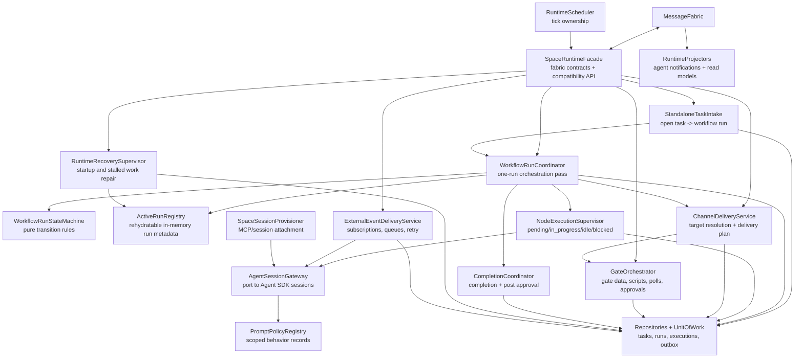

# Space Runtime Decomposition Design

**Date:** 2026-05-21
**Status:** Draft Design
**Related:**
- [Unified Message Fabric Architecture Design](./unified-message-fabric-design.md)
- [Space Actor Communication Design](../../design/space-actor-communication-design.md)
- [Internal Event, Command, and Query Architecture](../../plans/internal-event-command-query-architecture.md)

---

## 1. Overview

This document decomposes the Space runtime assuming the `MessageFabric` architecture already exists and is the canonical cross-boundary interface for commands, queries, and events.

The Space runtime should become the workflow domain module for Spaces. It should own workflow run orchestration, node execution lifecycle, channel and gate rules, recovery, and runtime events. It should not own WebSocket/RPC compatibility, generic client transport, low-level Agent SDK session mechanics, or broad session provisioning concerns.

The goal is an incremental extraction from the current `SpaceRuntime`, `SpaceRuntimeService`, `TaskAgentManager`, and `ChannelRouter` structure into focused components with explicit interfaces. The first implementation can stay in-process and SQLite-backed. The important change is ownership, contracts, and transaction boundaries.

---

## 2. Current State

The current implementation is functional but concentrated.

| Component | Current role |
| --- | --- |
| `SpaceRuntime` | Tick loop, active run registry, workflow run start, standalone task intake, completion handling, run recovery, node execution supervision, agent crash/stuck recovery, gate polls, external event delivery, notification callbacks, channel interests, and assorted runtime helpers. |
| `SpaceRuntimeService` | Constructs `SpaceRuntime`, starts/stops it, provisions Space chat/member/long-term agent MCP servers, handles session reset hooks, recovers long-term inboxes, exposes public runtime methods, and bridges runtime callbacks to internal events. |
| `TaskAgentManager` | Creates and rehydrates workflow node agent sessions, injects messages, manages runtime MCP servers, tracks liveness, handles pending peer messages, registers completion callbacks, and owns several recovery/self-heal paths. |
| `ChannelRouter` | Activates workflow nodes, checks/delivers channel messages, evaluates gates, tracks cyclic channels, persists gate-open state, and reopens terminal runs for valid post-completion activity. |
| `SpaceAgentNotificationService` | Converts runtime/internal events into agent-facing messages in Space chat sessions. |
| Space MCP tools | Call runtime/service/manager methods directly for workflow activation, gate updates, messages, task updates, artifacts, subscriptions, and schedules. |

The main architectural issue is not file size by itself. The problem is that lifecycle decisions, transport-like delivery, persistence writes, recovery policy, session provisioning, and agent supervision are all coupled through direct object references. This creates circular dependencies and makes it hard to reason about which component owns a state transition.

---

## 3. Design Goals

1. **Clear ownership:** every runtime state transition has one component responsible for deciding and applying it.
2. **MessageFabric boundaries:** cross-component actions are commands, queries, or events. Private helper calls inside a component can remain normal method calls.
3. **Agent-centric progression preserved:** agents still advance workflows through messages and reported status; the runtime supervises lifecycle and correctness.
4. **Small, testable units:** scheduling, run processing, node supervision, gate evaluation, and external event delivery can be tested independently.
5. **No big-bang rewrite:** existing RPC handlers, MCP tools, and `SpaceRuntimeService` keep compatibility facades while internals move.
6. **Transactional state and events:** important writes are grouped with outbox events once the storage unit-of-work exists.
7. **Rehydratable runtime:** in-memory state is an optimization only. A daemon restart can reconstruct active work from durable state.

## 4. Non-Goals

- Replacing the current workflow schema.
- Turning every intra-runtime helper call into a fabric message.
- Rewriting the Agent SDK session implementation.
- Introducing Kafka/NATS/gRPC as part of this decomposition.
- Event-sourcing Space workflows.
- Removing `SpaceRuntimeService` or `TaskAgentManager` in one step.

---

## 5. Target Architecture



`SpaceRuntimeFacade` is the module boundary. Everything outside the runtime talks to the facade through MessageFabric contracts or temporary compatibility methods. Inside the module, components may call each other directly when they are in the same consistency boundary.

Prompt policy is intentionally outside the Space runtime core. Space, workflow, node-agent, and task code can create or suppress scoped `prompt_policy_records`, but `PromptPolicyRegistry` resolves and renders those records through the Agent Runtime boundary when a concrete session starts or resumes.

---

## 6. Component Responsibilities

### 6.1 SpaceRuntimeFacade

Registers and implements the Space runtime fabric contracts. It replaces direct access to `SpaceRuntime` as the public integration point.

Responsibilities:

- Register runtime command/query handlers.
- Validate contract payloads and idempotency keys.
- Enforce coarse auth policy before delegating to domain components.
- Expose temporary compatibility methods for existing RPC handlers and MCP tools.
- Publish runtime events through MessageFabric, not callback properties.

Example contracts:

| Kind | Name | Purpose |
| --- | --- | --- |
| Command | `space.workflowRun.start` | Start a workflow run, optionally attached to an existing task. |
| Command | `space.workflowRun.process` | Process one run once. Internal command used by the scheduler. |
| Command | `space.workflowRun.recover` | Run explicit recovery for stalled runtime state. |
| Command | `space.workflowNode.activate` | Ensure pending node executions exist for a workflow node. |
| Command | `space.workflowMessage.deliver` | Route an agent message through workflow channel rules. |
| Command | `space.workflowGate.dataChanged` | Re-evaluate a gate after gate data changes. |
| Query | `space.runtime.health` | Runtime scheduler and recovery status. |
| Query | `space.workflowRun.active` | Active/recoverable workflow runs. |

### 6.2 RuntimeScheduler

Owns timers and single-flight execution. It does not contain business logic.

Responsibilities:

- Start and stop the runtime tick.
- Prevent overlapping ticks.
- Trigger startup recovery once.
- Dispatch internal fabric commands for scheduled work.
- Report scheduler health.

The scheduler tick should become a small sequence:

1. Ask `RuntimeRecoverySupervisor` to perform first-run rehydration if needed.
2. Ask `StandaloneTaskIntake` to attach eligible open tasks.
3. Ask `WorkflowRunCoordinator` to process active and blocked runs.
4. Ask `RuntimeRecoverySupervisor` to reconcile terminal/inconsistent state.
5. Ask a notification projector to check standalone task timeout/block notices if that remains a runtime concern.

### 6.3 WorkflowRunCoordinator

Owns one orchestration pass for one workflow run. It is the main replacement for `processRunTick`.

Responsibilities:

- Load the run, workflow, canonical task, node executions, and space.
- Enforce the "one workflow run == one canonical Space task" invariant.
- Delegate allowed transitions to `WorkflowRunStateMachine`.
- Invoke `NodeExecutionSupervisor` for pending/in-progress/idle/blocked execution handling.
- Invoke `CompletionCoordinator` when completion is detected.
- Invoke `ChannelDeliveryService` or `GateOrchestrator` only through narrow interfaces.
- Write task/run/execution changes through `RuntimeUnitOfWork`.
- Emit durable runtime events for important state changes.

This component should not know how Agent SDK sessions are constructed, how MCP servers are attached, how WebSocket clients subscribe, or how Space chat notifications are formatted.

### 6.4 WorkflowRunStateMachine

Pure domain rules for run and canonical task transitions.

Responsibilities:

- Validate workflow run status transitions.
- Validate canonical task status transitions caused by runtime work.
- Decide whether a run is processable, terminal, blocked, reopenable, or recoverable.
- Classify failures into runtime block reasons.
- Keep policy such as "archived task is a tombstone" in one place.

This should be mostly pure functions with table-driven tests.

### 6.5 ActiveRunRegistry

Owns in-memory active run metadata that can be reconstructed from repositories.

Responsibilities:

- Track active run IDs and workflow metadata.
- Rehydrate from in-progress/blocked DB rows.
- Store ephemeral execution helpers only when they are reconstructable.
- Avoid storing durable state that cannot survive daemon restart.

The current `executors`, `executorMeta`, and `workflowChannelsMap` maps move here. Long-term target: `WorkflowExecutor` becomes a graph helper rather than a state owner.

### 6.6 StandaloneTaskIntake

Owns conversion of open standalone tasks into workflow-backed runs.

Responsibilities:

- Scan active spaces.
- Respect task dependency, priority, pause/stopped state, and concurrency caps.
- Select a workflow using explicit preference, LLM selector, then deterministic fallback.
- Start a workflow run through `WorkflowRunCoordinator`.
- Attach the original task as the run's canonical task.

This extracts `attachStandaloneTasksToWorkflows`, workflow selection, priority sorting, and concurrency calculations out of the central runtime loop.

### 6.7 NodeExecutionSupervisor

Owns workflow node execution lifecycle. This is the core extraction from the Task Agent section of `processRunTick`.

Responsibilities:

- Spawn pending node executions through `AgentSessionGateway`.
- Probe session liveness for in-progress executions.
- Reset transient crashes to pending.
- Block executions/runs after retry policy is exhausted.
- Detect alive-but-stuck sessions and choose nag, restart, or block.
- Preserve non-terminal idle sessions and emit attention events.
- Handle waiting-rebind/tool-continuation recovery.
- Quiesce sibling executions after completion.
- Repair queued workflow handoffs to node agents.

Retry counters that affect correctness should move from in-memory maps into durable execution data or a small recovery table. Notification dedupe can remain in-memory because repeated notification after restart is acceptable.

### 6.8 AgentSessionGateway

A port between workflow runtime policy and Agent SDK/session implementation.

Responsibilities:

- Spawn a workflow node agent for a node execution.
- Rehydrate known workflow node sessions.
- Inject runtime, peer, recovery, and external-event messages.
- Interrupt, cancel, or restart a session by ID.
- Answer liveness checks.
- Attach node-agent MCP servers and memory/db-query servers via an implementation detail.
- Pass Space, workflow, node execution, and task scope IDs to Agent Runtime so Prompt Policy Registry can resolve effective behavior.

`TaskAgentManager` initially implements this gateway. Over time, SDK-specific setup, MCP merging, worktree setup, and session registration stay behind the gateway so `WorkflowRunCoordinator` and `NodeExecutionSupervisor` do not depend on `TaskAgentManager` directly.

The gateway must not render prompt policy itself. It supplies scope context and delegates behavior composition to Agent Runtime.

### 6.9 ChannelDeliveryService

Owns workflow channel routing and target resolution. The existing `ChannelRouter` is the seed implementation, but gate details should move behind `GateOrchestrator`.

Responsibilities:

- Resolve target agent or node names.
- Enforce open topology and declared channel rules.
- Enforce cyclic channel limits.
- Produce a delivery plan for direct message or fan-out.
- Request lazy node activation when a channel opens.
- Emit channel delivery, queued, blocked, and failed events.

Message injection itself should happen through `AgentSessionGateway`; channel routing should decide where delivery goes, not how an SDK session receives text.

### 6.10 GateOrchestrator

Owns gates as runtime state machines.

Responsibilities:

- Evaluate field-based and script-based gates.
- Own gate-open cache and persisted gate-open state.
- Own gate polling lifecycle.
- Apply autonomy-based auto-approval.
- Re-evaluate channels after gate data changes.
- Mark tasks as pending human approval when appropriate.
- Emit gate opened, gate blocked, gate pending approval, and gate script failed events.

This consolidates gate behavior currently spread across `ChannelRouter`, `GatePollManager`, gate script helpers, and `SpaceRuntimeService.notifyGateDataChanged`.

### 6.11 CompletionCoordinator

Owns workflow completion and post-approval routing.

Responsibilities:

- Use `CompletionDetector` to identify completed runs.
- Resolve completion summaries.
- Transition workflow runs to done.
- Drive `PostApprovalRouter`.
- Update canonical task result/status.
- Ask `NodeExecutionSupervisor` to quiesce sibling executions.
- Emit workflow completed, task approved, task done, and post-approval routed events.

This keeps post-approval policy from being embedded in the general tick loop.

### 6.12 RuntimeRecoverySupervisor

Owns daemon restart and inconsistent-state recovery.

Responsibilities:

- Rehydrate active runs into `ActiveRunRegistry`.
- Rehydrate workflow node agent sessions through `AgentSessionGateway`.
- Requeue persisted pending deliveries.
- Redispatch durable external events without deliveries.
- Repair terminal runs without executors.
- Repair duplicate canonical tasks.
- Recover blocked/stalled runs according to explicit policy.

Recovery should be idempotent. Each recovery operation should have a durable marker or derive from current DB state so `RuntimeScheduler` and daemon startup can both safely call it.

### 6.13 ExternalEventDeliveryService

Owns workflow subscriptions to external events.

Responsibilities:

- Register static and dynamic event interests for workflow targets.
- Match `externalEvent.published` fabric events by topic.
- Rate-limit and digest deliveries.
- Queue deliveries for not-yet-active node agents.
- Retry delivery and expire stale queued deliveries.
- Persist delivery attempts through the external event store.
- Inject matched messages through `AgentSessionGateway`.

This extracts topic trie, pending queues, retry timers, digesting, rate limits, and external event store logic out of `SpaceRuntime`.

### 6.14 SpaceSessionProvisioner

Owns Space session tooling, not workflow orchestration.

Responsibilities:

- Provision Space chat sessions.
- Attach generic Space MCP tools to member sessions.
- Attach long-term Space agent tools.
- Re-provision reset sessions.
- Manage db-query MCP server lifetime.
- Recover long-term agent inboxes.
- Wire `SpaceAgentNotificationService` or its replacement projectors.

This is the narrowed future of much of `SpaceRuntimeService`. It may live near session/space integration rather than inside the workflow runtime core.

### 6.15 Runtime Projectors

Convert runtime events into consumer-specific effects.

Responsibilities:

- Project runtime events into LiveQuery/read models.
- Notify Space chat agents.
- Notify UI clients.
- Produce audit logs.

Projectors subscribe to MessageFabric events. The runtime should not call notification callbacks directly.

---

## 7. Fabric Contracts

These contracts are internal first. Some can become public later after auth, schema, and compatibility are stable.

### Commands

| Name | Subject example | Owner |
| --- | --- | --- |
| `space.workflowRun.start` | `space/{spaceId}/workflow/{workflowId}` | `SpaceRuntimeFacade` |
| `space.workflowRun.process` | `space/{spaceId}/workflowRun/{runId}` | `WorkflowRunCoordinator` |
| `space.workflowRun.cancel` | `space/{spaceId}/workflowRun/{runId}` | `WorkflowRunCoordinator` |
| `space.workflowRun.resumeBlocked` | `space/{spaceId}/workflowRun/{runId}` | `RuntimeRecoverySupervisor` |
| `space.workflowRun.recover` | `space/{spaceId}/workflowRun/{runId}` | `RuntimeRecoverySupervisor` |
| `space.workflowNode.activate` | `space/{spaceId}/workflowRun/{runId}/node/{nodeId}` | `ChannelDeliveryService` |
| `space.workflowMessage.deliver` | `space/{spaceId}/workflowRun/{runId}` | `ChannelDeliveryService` |
| `space.workflowGate.dataChanged` | `space/{spaceId}/workflowRun/{runId}/gate/{gateId}` | `GateOrchestrator` |
| `space.workflowGate.approve` | `space/{spaceId}/workflowRun/{runId}/gate/{gateId}` | `GateOrchestrator` |
| `space.workflowHook.approve` | `space/{spaceId}/workflowRun/{runId}/hook/{hookId}` | `GateOrchestrator` |
| `space.workflowHook.retry` | `space/{spaceId}/workflowRun/{runId}/hook/{hookId}` | `GateOrchestrator` |
| `space.workflowAgent.spawn` | `space/{spaceId}/workflowRun/{runId}/execution/{executionId}` | `NodeExecutionSupervisor` |
| `space.workflowAgent.injectMessage` | `space/{spaceId}/session/{sessionId}` | `AgentSessionGateway` |

### Queries

| Name | Purpose |
| --- | --- |
| `space.runtime.health` | Scheduler, recovery, and queue health. |
| `space.workflowRun.list` | Workflow runs for a space, including history needed by runtime views. |
| `space.workflowRun.get` | Workflow run plus canonical task and node execution summary. |
| `space.workflowRun.active` | Active/recoverable workflow runs for a space or daemon. |
| `space.workflowNodeExecution.list` | Node execution rows for a workflow run. |
| `space.workflowGate.status` | Gate data, open state, and pending approval state. |
| `space.workflowRun.artifacts` | Materialized artifacts produced by a workflow run. |
| `space.workflowRun.gateArtifacts` | Worktree changes and diff summary for a human gate. |
| `space.workflowRun.fileDiff` | Unified diff for an uncommitted workflow-run file. |
| `space.workflowRun.commits` | Commits produced by a workflow run. |
| `space.workflowRun.commitFiles` | Files changed by a workflow-run commit. |
| `space.workflowRun.commitFileDiff` | Unified diff for a file in a workflow-run commit. |
| `space.workflowRun.hookStates` | Pending hook state snapshots for a workflow run. |

### Events

| Name | Notes |
| --- | --- |
| `space.workflowRun.created` | Durable. |
| `space.workflowRun.updated` | Durable when status changes; ephemeral for debug-only metadata. |
| `space.workflowRun.completed` | Durable. |
| `space.workflowRun.blocked` | Durable. |
| `space.workflowRun.reopened` | Durable. |
| `space.workflowRun.needsAttention` | Durable. |
| `space.workflowNodeExecution.created` | Durable enough to reconstruct pending/gated node execution history. |
| `space.workflowNodeExecution.started` | Durable. |
| `space.workflowNodeExecution.idle` | Durable. |
| `space.workflowNodeExecution.blocked` | Durable. |
| `space.workflowNodeExecution.restarted` | Durable. |
| `space.workflowGate.opened` | Durable when it changes routing state. |
| `space.workflowGate.blocked` | Ephemeral or durable by gate policy. |
| `space.workflowGate.pendingApproval` | Durable enough for UI/task state. |
| `space.workflowMessage.queued` | Durable when backed by pending message repo. |
| `space.workflowMessage.delivered` | Durable for queued messages; ephemeral for direct successful sends is acceptable. |
| `space.externalEvents.delivery.created` | Durable queued-delivery row creation. |
| `space.externalEvents.delivery.updated` | Durable delivery status/progress update, including delivered and failed outcomes. |

Runtime events should include `correlationId` from the originating task/run command and `causationId` from the command or event that caused the transition.

---

## 8. Persistence And Transactions

The decomposition depends on clearer write boundaries. The initial implementation can still use current repositories, but the target should introduce a runtime unit of work.

```typescript
export interface RuntimeUnitOfWork {
  runs: SpaceWorkflowRunRepository;
  tasks: SpaceTaskRepository;
  nodeExecutions: NodeExecutionRepository;
  pendingMessages: PendingAgentMessageRepository;
  gates: GateDataRepository;
  outbox: MessageOutboxRepository;

  commit(): Promise<void>;
  rollback(): Promise<void>;
}
```

Rules:

1. A run status update and its canonical task status update happen in the same unit of work.
2. Node execution status changes that emit durable events write those events to the outbox in the same unit of work.
3. Accepted async commands persist an operation/job row before returning `accepted`.
4. Retry counters that affect state decisions are durable.
5. In-memory registries are updated only after durable writes succeed.

Important durable state:

| State | Target owner | Durability |
| --- | --- | --- |
| Workflow run status | `WorkflowRunCoordinator` | DB row + outbox event |
| Canonical task status/result | `WorkflowRunCoordinator` / `CompletionCoordinator` | DB row + outbox event |
| Node execution status | `NodeExecutionSupervisor` | DB row + outbox event |
| Pending workflow handoff | `NodeExecutionSupervisor` | DB queue |
| Gate data/open state | `GateOrchestrator` | DB row |
| External event delivery attempt | `ExternalEventDeliveryService` | DB row |
| Notification dedupe | Runtime projector | In-memory acceptable |
| Active run metadata | `ActiveRunRegistry` | Rehydratable in-memory |

---

## 9. Key Flows

### 9.1 Startup

1. `SpaceSessionProvisioner` re-attaches Space chat/member/long-term agent tools.
2. `RuntimeRecoverySupervisor` rehydrates active runs into `ActiveRunRegistry`.
3. `AgentSessionGateway` rehydrates workflow node sessions.
4. `ExternalEventDeliveryService` requeues pending deliveries.
5. `RuntimeScheduler` marks itself ready and starts ticks.

Daemon bootstrap should wait for provisioner and recovery readiness before serving runtime queries.

### 9.2 Starting A Workflow Run

1. Caller sends `space.workflowRun.start`.
2. `SpaceRuntimeFacade` validates auth and payload.
3. `WorkflowRunCoordinator` creates the run.
4. Coordinator creates or attaches the canonical task.
5. Coordinator creates pending node executions for the start node.
6. `GateOrchestrator` starts applicable polls.
7. Events are written to outbox: run created, task updated, node executions created.
8. Command returns the run and canonical task.

### 9.3 Processing A Run

1. `RuntimeScheduler` dispatches `space.workflowRun.process`.
2. `WorkflowRunCoordinator` loads fresh state.
3. `WorkflowRunStateMachine` classifies the run.
4. `NodeExecutionSupervisor` handles liveness, stuck sessions, queued handoffs, and pending spawns.
5. `CompletionCoordinator` resolves completion when detected.
6. Durable events are published for status changes.

### 9.4 Agent-To-Agent Message

1. Tool handler sends `space.workflowMessage.deliver`.
2. `ChannelDeliveryService` resolves the target and channel.
3. `GateOrchestrator` evaluates gate state if required.
4. `ChannelDeliveryService` activates the target node if needed.
5. `AgentSessionGateway` injects the message or `NodeExecutionSupervisor` queues it.
6. Delivery events are emitted.

### 9.5 Gate Data Changed

1. Tool/RPC handler sends `space.workflowGate.dataChanged`.
2. `GateOrchestrator` merges or reads gate data.
3. Gate is evaluated once per run/gate.
4. If open, affected channels request lazy node activation.
5. If waiting on human approval, canonical task moves to review/pending approval.
6. Gate events are emitted.

### 9.6 Completion And Post Approval

1. `CompletionCoordinator` observes completion through `CompletionDetector`.
2. Run transitions to done.
3. Completion summary is resolved.
4. `PostApprovalRouter` decides no route, inline route, spawn route, or already routed.
5. Canonical task transitions to done or approved.
6. `NodeExecutionSupervisor` quiesces sibling executions when appropriate.
7. Completion/post-approval events are emitted.

### 9.7 External Event Delivery

1. External integration publishes `externalEvent.published`.
2. `ExternalEventDeliveryService` matches subscriptions by topic.
3. Delivery is direct, queued, digested, or retried according to policy.
4. `AgentSessionGateway` injects direct deliveries.
5. Delivery state and events are persisted.

---

## 10. Suggested File Layout

This is a target structure, not a required first patch.

```text
packages/daemon/src/lib/space/runtime/
  contracts.ts
  space-runtime-facade.ts
  scheduler/runtime-scheduler.ts
  runs/active-run-registry.ts
  runs/workflow-run-coordinator.ts
  runs/workflow-run-state-machine.ts
  intake/standalone-task-intake.ts
  nodes/node-execution-supervisor.ts
  agents/agent-session-gateway.ts
  agents/task-agent-manager-gateway.ts
  channels/channel-delivery-service.ts
  gates/gate-orchestrator.ts
  completion/completion-coordinator.ts
  recovery/runtime-recovery-supervisor.ts
  external-events/external-event-delivery-service.ts
  provisioning/space-session-provisioner.ts
```

Existing files can move gradually. For example, `ChannelRouter` can first become the implementation behind `ChannelDeliveryService`, and `TaskAgentManager` can first implement `AgentSessionGateway` without moving its internals.

---

## 11. Migration Plan

### Phase 0: Contract And Characterization

- Add fabric contracts for runtime commands, queries, and events.
- Add characterization tests around current `SpaceRuntime.processRunTick` behavior through public methods.
- Identify the minimal event set that must be durable from day one.

### Phase 1: Facade Without Behavior Change

- Introduce `SpaceRuntimeFacade`.
- Register fabric handlers that delegate to current `SpaceRuntimeService` and `SpaceRuntime`.
- Keep existing RPC and MCP calls working through compatibility methods.

### Phase 2: Scheduler And Registry

- Extract timer/single-flight logic into `RuntimeScheduler`.
- Extract `executors`, `executorMeta`, and channel metadata into `ActiveRunRegistry`.
- Make startup rehydrate explicit.

### Phase 3: Standalone Task Intake

- Move open-task scanning, dependency checks, workflow selection, priority sorting, and concurrency caps into `StandaloneTaskIntake`.
- Keep the same DB writes and events.

### Phase 4: Workflow Run Coordinator

- Move one-run processing out of `SpaceRuntime` into `WorkflowRunCoordinator`.
- Introduce `WorkflowRunStateMachine` for transition decisions.
- Keep `TaskAgentManager` and `ChannelRouter` as adapters.

### Phase 5: Node Execution Supervision

- Introduce `AgentSessionGateway`.
- Make `TaskAgentManager` implement the gateway.
- Move crash retry, alive-stuck recovery, waiting-rebind handling, idle preservation, sibling quiescing, and queued handoff repair into `NodeExecutionSupervisor`.

### Phase 6: Gate And Channel Split

- Keep `ChannelRouter` compatibility but split gate evaluation/polling into `GateOrchestrator`.
- Move channel delivery planning into `ChannelDeliveryService`.
- Route tool calls through `space.workflowMessage.deliver` and `space.workflowGate.dataChanged`.

### Phase 7: External Event Delivery

- Move topic trie, subscriptions, pending external queues, digest/rate-limit, retry timers, and delivery persistence into `ExternalEventDeliveryService`.
- Subscribe to MessageFabric `externalEvent.published` instead of the legacy internal bus.

### Phase 8: Projectors And Provisioner

- Replace runtime callback properties with MessageFabric events and projectors.
- Narrow `SpaceRuntimeService` into `SpaceSessionProvisioner` plus compatibility facade.
- Move Space chat/member/long-term MCP provisioning out of the workflow runtime core.

### Phase 9: Unit Of Work And Outbox

- Introduce runtime unit-of-work wrappers for run/task/execution writes.
- Write durable runtime events to the MessageFabric outbox in the same transaction.
- Convert accepted runtime commands to operation/job-backed acknowledgements where needed.

---

## 12. Design Rules

1. `WorkflowRunCoordinator` is the only component that decides overall run progression.
2. `NodeExecutionSupervisor` is the only component that decides node execution recovery and spawn policy.
3. `GateOrchestrator` is the only component that evaluates gates or mutates gate-open state.
4. `ChannelDeliveryService` decides routing; `AgentSessionGateway` performs session delivery.
5. Session provisioning is not workflow orchestration.
6. Runtime state changes emit fabric events; projectors decide who needs to hear about them.
7. In-memory state must be reconstructable or explicitly marked ephemeral.
8. Fabric contracts are the boundary between Space runtime and the rest of the daemon.
9. Space runtime may write scoped prompt policy records, but Agent Runtime owns effective prompt policy resolution and rendering.
10. Existing public behavior must migrate behind facades before direct call sites are changed.

---

## 13. Open Questions

1. Should crash/stuck retry counters be stored on `node_executions.data` or in a dedicated `runtime_recovery_attempts` table?
2. Should long-term Space agent inbox recovery live in `SpaceSessionProvisioner`, a future actor module, or `ExternalEventDeliveryService`?
3. Should `WorkflowExecutor` remain as a graph helper, or should its remaining responsibilities move into pure workflow graph utilities?
4. Which runtime events are required for durable replay in the first MessageFabric implementation?
5. Should standalone task timeout/block notifications remain runtime work, or move entirely into a projector over task state?
