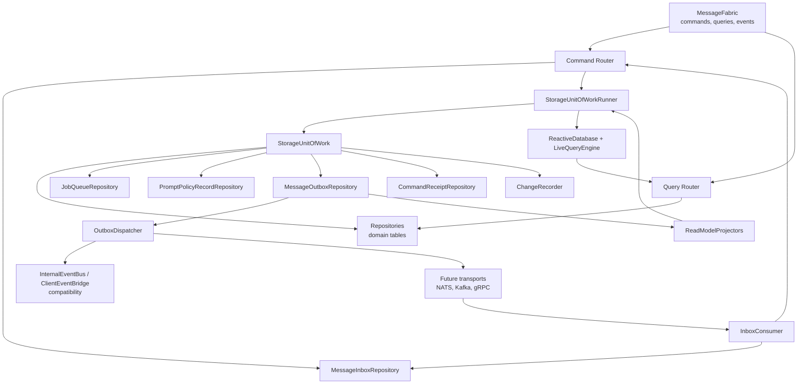
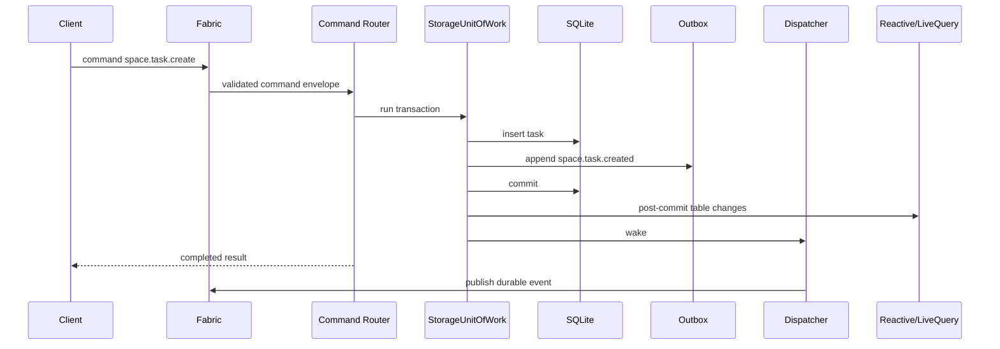
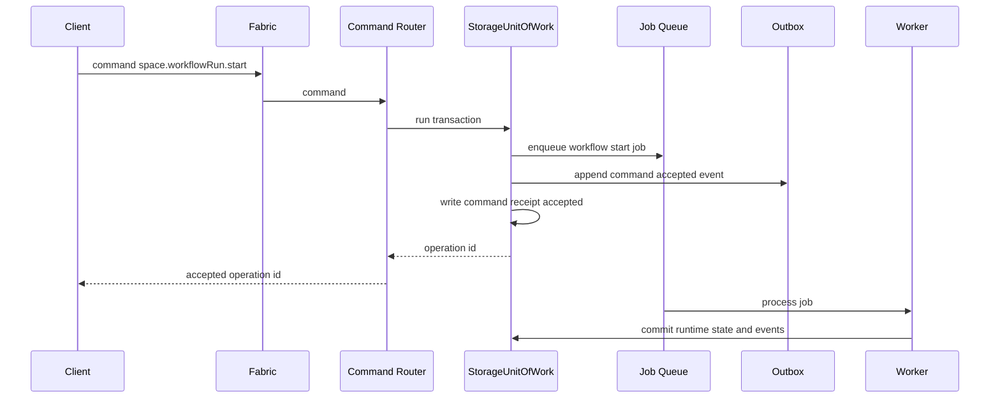
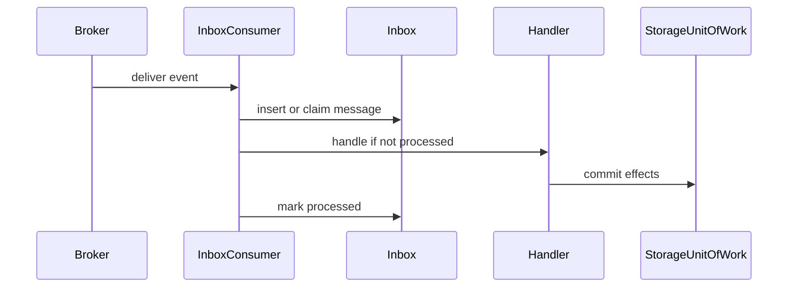

# Storage Unit Of Work And Outbox Design

Status: proposed

This spec assumes the target `MessageFabric` exists and the current `MessageHub` is a compatibility layer. It also assumes the Space runtime decomposition, client read-model split, and shared package boundary work are accepted.

The goal is to define the persistence boundary that lets commands, runtime transitions, Forge writes, read-model updates, jobs, and durable events move together without losing consistency.

Prompt policy records are part of this durability boundary. Global, session, Space, SpaceAgent, workflow, workflow-node, and task scoped prompt behavior should be stored as `prompt_policy_records` rows and mutated through UoW-backed repositories, not copied into feature-specific settings fields.

## Why This Exists

The daemon already has substantial persistence infrastructure:

- `packages/daemon/src/storage/database-core.ts` owns SQLite startup, WAL mode, migrations, locking, backups, and shutdown checkpointing.
- `packages/daemon/src/storage/index.ts` is the broad `Database` facade that composes repositories.
- `packages/daemon/src/storage/repositories/*` contains table-specific repositories.
- `packages/daemon/src/storage/reactive-database.ts` and `packages/daemon/src/storage/live-query.ts` provide in-process table invalidation and live query deltas.
- `packages/daemon/src/storage/repositories/job-queue-repository.ts` and `packages/daemon/src/storage/job-queue-processor.ts` provide a durable local job queue.
- `packages/daemon/src/lib/internal-event-bus.ts` and `packages/daemon/src/lib/client-event-bridge.ts` move in-process events to client-visible events.
- `packages/daemon/src/lib/external-events/external-event-store.ts` already models source event dedupe and delivery state for workflow external events.

The missing piece is a single architectural rule for writes:

> A command that changes durable state must commit its domain writes, accepted operation state, queued jobs, read-model invalidations, and durable outgoing messages in one SQLite transaction.

Without that rule, the daemon can commit a state change but fail to emit the event, emit an event for a rolled-back change, enqueue a job without the state it depends on, or notify live queries before a transaction actually commits.

## Current State

### Database Core

`DatabaseCore` opens one Bun SQLite connection, enables WAL, sets `busy_timeout`, enables foreign keys, runs migrations, creates missing tables, and checkpoints WAL on close.

That foundation is good. The target design keeps SQLite as the local durability boundary.

### Database Facade

`Database` currently composes many repositories and preserves a broad backward-compatible method surface. Some repositories receive the raw `BunDatabase`; some also receive `ReactiveDatabase`.

This made incremental decomposition possible, but it blurs whether a caller is doing:

- a plain read
- a single write
- a multi-table atomic mutation
- a mutation that should emit events
- a mutation that should wake live queries
- a mutation that should enqueue durable work

### Transactions

Transactions are currently direct `db.transaction(...)` calls in services and repositories. Examples include:

- goal service mutations
- schedule fire handling
- workflow recovery
- channel routing
- repository-local operations such as task number allocation
- export/import
- artifact and memory writes

This means the transaction owner is inconsistent. Sometimes a repository owns it. Sometimes a service owns it. Sometimes events are emitted after the transaction. Sometimes reactive notifications happen inside repository methods.

### Reactive Database And Live Query

`ReactiveDatabase` wraps selected `Database` facade methods and increments table versions after successful calls. It also supports manual `notifyChange(table)` for direct repository writes.

`LiveQueryEngine` subscribes named SQL queries to table invalidation and sends snapshots/deltas over the existing MessageHub RPC path.

This is useful and should remain, but it is not a durability mechanism. It is an in-process invalidation cache. After daemon restart, table versions and pending invalidations are gone, which is fine for live clients because they resubscribe and get a fresh snapshot.

### Event Publication

Current event publication is spread across:

- `InternalEventBus.publish(...)`
- `InternalEventBus.publishAsync(...)`
- direct event bridge forwarding to clients
- handler-local `eventHub.publish(...)` calls
- `ClientEventGateway`
- live query push events
- domain-specific stores such as external events

Many publishers emit after a DB write and intentionally swallow errors. That is acceptable for ephemeral UI hints, but not for durable domain facts.

### Job Queue

The local `job_queue` table is already a durable command/job mechanism. It supports pending, processing, completed, failed, and dead states with retries and stale processing reclamation.

It does not currently give us a general command receipt model, nor does it guarantee that job enqueue and event publication are tied to the originating command result unless each handler manually does the right thing.

### Domain-Specific Idempotency

The codebase already has useful idempotency patterns:

- `pending_agent_messages` uses idempotency keys for workflow handoff dedupe.
- `space_agent_inbox_messages` uses idempotency keys for agent inbox dedupe.
- task schedules use `pendingJobId` as a compare-and-swap fence.
- external events use `(space_id, source, dedupe_key)`.
- node executions use a unique `(workflow_run_id, workflow_node_id, agent_name)` slot.

Those should stay. The target adds a platform-level command receipt and inbox boundary so idempotency does not have to be reinvented for every fabric command.

## Target Principles

1. **One write boundary:** every durable command enters a `StorageUnitOfWork`.
2. **Synchronous transactions:** the SQLite transaction body does not perform async IO, network calls, agent calls, broker calls, or filesystem-heavy work.
3. **Events follow state:** durable events are appended to the outbox in the same transaction as the state change they describe.
4. **Accepted work is durable:** async commands return an accepted operation only after the operation/job row is committed.
5. **At-least-once delivery:** outbox and inbox provide retries and dedupe. Exactly-once delivery is not promised.
6. **Idempotent commands:** command handlers with side effects must define idempotency behavior.
7. **Read models are projections:** live query invalidation and read-model projection are downstream of committed writes.
8. **Repositories do not publish:** repositories mutate tables. Services decide domain events.
9. **Compatibility first:** existing `InternalEventBus`, `MessageHub`, `ReactiveDatabase`, and `JobQueue` stay while new fabric-backed write paths land incrementally.

## Non-Goals

- Replacing SQLite as the local daemon database.
- Making all events durable. Some lifecycle and UI events remain ephemeral.
- Making every repository pure in one migration.
- Introducing distributed transactions across SQLite and Kafka/NATS.
- Guaranteeing exactly-once side effects for external systems.
- Moving long-running agent work inside DB transactions.

## Target Components



### `StorageUnitOfWorkRunner`

Owns transaction execution and post-commit hooks.

Responsibilities:

- open a short SQLite write transaction
- provide repositories bound to the same DB connection
- collect table changes and scopes
- collect durable messages for outbox append
- collect command receipt changes
- collect job queue writes
- commit or roll back atomically
- flush reactive table changes only after commit
- wake the outbox dispatcher only after commit

The transaction callback must be synchronous. Async work happens before the transaction or after commit.

Target interface:

```ts
export interface StorageUnitOfWorkRunner {
  run<T>(
    options: UnitOfWorkOptions,
    fn: (uow: StorageUnitOfWork) => T
  ): T;
}

export interface UnitOfWorkOptions {
  name: string;
  actor?: ActorRef;
  command?: CommandEnvelopeRef;
  clock?: Clock;
}
```

If a command handler needs async preparation, the shape is:

```ts
const prepared = await prepareOutsideTransaction(input);

const result = uowRunner.run({ name: 'space.task.create', actor, command }, (uow) => {
  const task = uow.spaceTasks.create(prepared.task);
  uow.outbox.appendEvent('space.task.created', { spaceId: task.spaceId, taskId: task.id }, task);
  return { task };
});

return result;
```

### `StorageUnitOfWork`

Provides the write-scoped dependencies.

```ts
export interface StorageUnitOfWork {
  readonly db: BunDatabase;
  readonly now: number;

  readonly spaces: SpaceRepository;
  readonly spaceTasks: SpaceTaskRepository;
  readonly workflowRuns: SpaceWorkflowRunRepository;
  readonly nodeExecutions: NodeExecutionRepository;
  readonly goals: SpaceGoalRepository;
  readonly schedules: TaskScheduleRepository;
  readonly forge: EvolutionRepository;
  readonly sessions: SessionRepository;
  readonly promptPolicyRecords: PromptPolicyRecordRepository;
  readonly jobs: JobQueueRepository;

  readonly outbox: MessageOutboxWriter;
  readonly inbox: MessageInboxWriter;
  readonly commandReceipts: CommandReceiptRepository;
  readonly changes: ChangeRecorder;

  afterCommit(fn: () => void): void;
}
```

The exact repository list can be composed by domain. The important point is that writes use a context that makes transaction, outbox, jobs, and change recording available together.

### `ChangeRecorder`

`ChangeRecorder` replaces scattered `reactiveDb.notifyChange(...)` calls for new UoW-backed paths.

Responsibilities:

- record changed table names
- record optional scope metadata such as `spaceId`, `taskId`, `sessionId`, `workflowRunId`
- merge compatible scopes
- flush a single post-commit batch to `ReactiveDatabase`

The current `ReactiveDatabase` supports batching, but the target should make the batch part of the write boundary rather than requiring every repository to remember notification calls.

### `MessageOutboxRepository`

Persists durable fabric messages that must be delivered after commit.

The outbox is used for:

- durable domain events
- accepted command operation events
- durable async command dispatch to local jobs or remote workers
- future broker publication to NATS/Kafka
- replayable audit streams

It is not used for:

- one-shot queries
- ephemeral UI hints
- in-memory only lifecycle notifications

### `MessageInboxRepository`

Persists inbound durable messages before handling.

The inbox is used for:

- deduping fabric commands received from clients or external transports
- deduping durable events received from broker adapters
- recording processing status for redelivered messages
- preserving enough metadata to resume processing after daemon restart

The initial implementation can use inbox for fabric command ingress and future broker adapters. Legacy internal direct calls can keep bypassing it until they migrate to MessageFabric.

### `CommandReceiptRepository`

Persists command idempotency and accepted/completed command results.

Responsibilities:

- claim an idempotency key
- reject same key with different request hash
- return previous result for duplicate completed command
- return accepted operation for duplicate accepted command
- record failure when the command contract chooses durable failure semantics

Command receipts are not a replacement for domain constraints. They are the fabric-level retry boundary.

### `PromptPolicyRecordRepository`

Persists scoped prompt behavior records used by the Agent Runtime prompt policy resolver.

Responsibilities:

- create, update, enable, disable, and suppress policy records in global, session, Space, SpaceAgent, workflow, workflow-node, and task scopes
- enforce row shape for `template`, `content`, and `suppress` records
- reject stored `user.prepend` records until message-level rendering exists
- prevent same-scope conflicts for enabled rows targeting the same template or suppression target
- return records by scope chain for effective policy preview and Agent Runtime resolution

Repository methods mutate only durable rows. They do not render prompts, resolve precedence, or query Space/workflow state outside the scope IDs they are given.

### `OutboxDispatcher`

Drains committed outbox rows.

Initial dispatcher:

- polls or is woken after commit
- claims due rows with a lock token
- publishes to in-process MessageFabric handlers
- bridges compatible events to `InternalEventBus` / `ClientEventBridge`
- marks rows published, retryable failed, or dead

Future dispatcher:

- sends to NATS/Kafka/gRPC adapters
- tracks per-transport delivery rows if one outbox message has multiple external destinations
- supports replay by subject, name, or cursor

### `InboxConsumer`

Handles durable inbound messages from external transports.

Initial daemon may only need inbox for fabric command ingress. Once broker adapters exist, the consumer should:

- insert or claim `message_inbox`
- skip already processed messages
- execute the command/event handler
- mark processed only after handler commit
- retry failed rows with backoff

## Schema

The schema below is intentionally explicit. It can be split into migration helpers later.

### `message_outbox`

```sql
CREATE TABLE message_outbox (
  id TEXT PRIMARY KEY,
  sequence INTEGER NOT NULL UNIQUE,
  message_id TEXT NOT NULL UNIQUE,
  kind TEXT NOT NULL CHECK(kind IN ('command', 'event')),
  name TEXT NOT NULL,
  subject TEXT NOT NULL,
  partition_key TEXT,
  correlation_id TEXT,
  causation_id TEXT,
  idempotency_key TEXT,
  actor_id TEXT,
  actor_type TEXT,
  space_id TEXT,
  envelope_json TEXT NOT NULL,
  payload_json TEXT NOT NULL,
  headers_json TEXT NOT NULL DEFAULT '{}',
  status TEXT NOT NULL DEFAULT 'pending'
    CHECK(status IN ('pending', 'publishing', 'published', 'failed', 'dead')),
  attempts INTEGER NOT NULL DEFAULT 0,
  max_attempts INTEGER NOT NULL DEFAULT 12,
  next_attempt_at INTEGER NOT NULL,
  locked_by TEXT,
  locked_until INTEGER,
  last_error TEXT,
  created_at INTEGER NOT NULL,
  updated_at INTEGER NOT NULL,
  published_at INTEGER
);

CREATE INDEX idx_message_outbox_status_next
  ON message_outbox(status, next_attempt_at, sequence);

CREATE INDEX idx_message_outbox_subject_created
  ON message_outbox(subject, sequence);

CREATE INDEX idx_message_outbox_name_created
  ON message_outbox(name, sequence);

CREATE INDEX idx_message_outbox_correlation
  ON message_outbox(correlation_id);
```

Notes:

- `message_id` is the durable fabric message id.
- `sequence` is a monotonically increasing local commit-order key allocated by the storage layer.
- `name` is the semantic contract name, such as `space.task.created`.
- `subject` is the routable resource subject, such as `space/{spaceId}/task/{taskId}`.
- `partition_key` is the ordering key for broker adapters. Usually it is `subject` or `spaceId`.
- `payload_json` is duplicated outside `envelope_json` so common admin/debug queries do not need to parse the full envelope.

### `message_inbox`

```sql
CREATE TABLE message_inbox (
  id TEXT PRIMARY KEY,
  message_id TEXT NOT NULL,
  consumer TEXT NOT NULL,
  kind TEXT NOT NULL CHECK(kind IN ('command', 'event')),
  name TEXT NOT NULL,
  subject TEXT NOT NULL,
  source_transport TEXT,
  idempotency_key TEXT,
  dedupe_scope TEXT,
  dedupe_key TEXT,
  correlation_id TEXT,
  causation_id TEXT,
  actor_id TEXT,
  actor_type TEXT,
  envelope_json TEXT NOT NULL,
  payload_json TEXT NOT NULL,
  status TEXT NOT NULL DEFAULT 'received'
    CHECK(status IN ('received', 'processing', 'processed', 'failed', 'dead')),
  attempts INTEGER NOT NULL DEFAULT 0,
  max_attempts INTEGER NOT NULL DEFAULT 12,
  next_attempt_at INTEGER NOT NULL,
  locked_by TEXT,
  locked_until INTEGER,
  result_json TEXT,
  error_json TEXT,
  received_at INTEGER NOT NULL,
  started_at INTEGER,
  processed_at INTEGER,
  updated_at INTEGER NOT NULL,
  CHECK(dedupe_key IS NULL OR (dedupe_scope IS NOT NULL AND length(dedupe_scope) > 0)),
  UNIQUE(consumer, message_id)
);

CREATE INDEX idx_message_inbox_status_next
  ON message_inbox(status, next_attempt_at);

CREATE INDEX idx_message_inbox_subject_received
  ON message_inbox(subject, received_at);

CREATE UNIQUE INDEX idx_message_inbox_dedupe
  ON message_inbox(consumer, dedupe_scope, dedupe_key)
  WHERE dedupe_key IS NOT NULL;
```

`MessageInboxRepository` computes `dedupe_scope` and `dedupe_key` from the message contract before insert. The normalized key must include the fields required by the contract's idempotency scope, such as message name, subject, actor/source identity, and `idempotency_key`.

This means a broker redelivery with a fresh `message_id` but the same logical idempotency key is rejected before the handler runs, while contracts with different actor/source scopes do not collide accidentally.

### `command_receipts`

```sql
CREATE TABLE command_receipts (
  id TEXT PRIMARY KEY,
  command_name TEXT NOT NULL,
  subject TEXT NOT NULL,
  actor_id TEXT NOT NULL,
  actor_type TEXT NOT NULL,
  idempotency_key TEXT NOT NULL,
  receipt_scope TEXT NOT NULL,
  receipt_key TEXT NOT NULL,
  request_hash TEXT NOT NULL,
  status TEXT NOT NULL
    CHECK(status IN ('accepted', 'completed', 'failed')),
  operation_id TEXT,
  result_json TEXT,
  error_json TEXT,
  created_at INTEGER NOT NULL,
  updated_at INTEGER NOT NULL,
  completed_at INTEGER,
  CHECK(receipt_scope IN ('actor+subject', 'subject', 'global')),
  UNIQUE(command_name, receipt_scope, receipt_key)
);

CREATE INDEX idx_command_receipts_operation
  ON command_receipts(operation_id);
```

Behavior:

- `receipt_scope` stores the command contract's declared idempotency scope: `actor+subject`, `subject`, or `global`
- `receipt_key` is a normalized key derived from `idempotency_key` plus only the fields required by `receipt_scope`
- duplicate `(command_name, receipt_scope, receipt_key)` with the same `request_hash` returns the existing receipt
- duplicate with a different `request_hash` is a command conflict
- commands without explicit idempotency are allowed only when the command contract marks idempotency as not required
- system or anonymous commands use explicit non-null sentinels, such as `actor_type = 'system'` with `actor_id = 'system'`
- nullable actor identity is not allowed because SQLite treats `NULL` values as distinct in unique indexes

### `read_model_cursors`

```sql
CREATE TABLE read_model_cursors (
  projector TEXT PRIMARY KEY,
  last_message_id TEXT,
  last_outbox_sequence INTEGER,
  last_outbox_created_at INTEGER,
  updated_at INTEGER NOT NULL
);
```

This table supports asynchronous durable projectors later. Synchronous SQL-backed live queries do not need it, but server-side materialized read models will.

### `prompt_policy_records`

```sql
CREATE TABLE prompt_policy_records (
  id TEXT PRIMARY KEY,
  scope_type TEXT NOT NULL
    CHECK(scope_type IN ('global', 'session', 'space', 'space_agent', 'workflow', 'workflow_node', 'task')),
  scope_id TEXT,
  record_type TEXT NOT NULL CHECK(record_type IN ('template', 'content', 'suppress')),
  template_id TEXT,
  suppresses_template_id TEXT,
  channel TEXT NOT NULL CHECK(channel IN ('system.prepend', 'system.append', 'agent.prompt.append')),
  priority INTEGER NOT NULL CHECK(priority BETWEEN 500 AND 799),
  enabled INTEGER NOT NULL DEFAULT 1 CHECK(enabled IN (0, 1)),
  content TEXT,
  source_kind TEXT NOT NULL
    CHECK(source_kind IN ('settings', 'session', 'space', 'space-agent', 'workflow', 'task', 'runtime')),
  source_ref TEXT,
  constraints TEXT,
  created_at INTEGER NOT NULL,
  updated_at INTEGER NOT NULL,
  CHECK(
    (scope_type = 'global' AND scope_id IS NULL)
    OR (scope_type <> 'global' AND scope_id IS NOT NULL AND length(scope_id) > 0)
  ),
  CHECK(
    (record_type = 'template' AND template_id IS NOT NULL AND suppresses_template_id IS NULL AND content IS NULL)
    OR (record_type = 'content' AND template_id IS NULL AND suppresses_template_id IS NULL AND content IS NOT NULL AND length(content) > 0)
    OR (record_type = 'suppress' AND template_id IS NULL AND suppresses_template_id IS NOT NULL AND content IS NULL)
  ),
  CHECK(constraints IS NULL OR (json_valid(constraints) AND json_type(constraints) = 'object'))
);

CREATE INDEX idx_prompt_policy_records_scope
  ON prompt_policy_records(scope_type, scope_id, enabled);

CREATE INDEX idx_prompt_policy_records_template
  ON prompt_policy_records(template_id, enabled);

CREATE INDEX idx_prompt_policy_records_suppresses
  ON prompt_policy_records(suppresses_template_id, enabled);

CREATE UNIQUE INDEX idx_prompt_policy_records_enabled_target
  ON prompt_policy_records(
    scope_type,
    COALESCE(scope_id, ''),
    COALESCE(template_id, suppresses_template_id)
  )
  WHERE enabled = 1
    AND record_type IN ('template', 'suppress');
```

This table stores activation, suppression, and future internal content records. Built-in prompt text stays in code; rows reference stable template IDs such as `neokai.output-mode.compressed`.

Enabled built-in activation and suppression rows are unique per scope and target template. A transaction that replaces an activation with suppression, or suppression with activation, must update/disable the existing enabled row before inserting the replacement.

### Optional `message_outbox_deliveries`

Do not add this until multiple durable delivery targets are required.

```sql
CREATE TABLE message_outbox_deliveries (
  outbox_id TEXT NOT NULL,
  target TEXT NOT NULL,
  status TEXT NOT NULL
    CHECK(status IN ('pending', 'publishing', 'published', 'failed', 'dead')),
  attempts INTEGER NOT NULL DEFAULT 0,
  next_attempt_at INTEGER NOT NULL,
  last_error TEXT,
  updated_at INTEGER NOT NULL,
  PRIMARY KEY(outbox_id, target),
  FOREIGN KEY(outbox_id) REFERENCES message_outbox(id) ON DELETE CASCADE
);
```

## Transaction Semantics

### Basic Durable Command



Rules:

1. The event is not visible until the DB commit succeeds.
2. If the transaction rolls back, there is no outbox row and no live query invalidation.
3. If event dispatch fails after commit, the outbox row remains retryable.
4. If the dispatcher publishes but crashes before marking published, the event may be delivered again. Consumers must be idempotent.

### Accepted Async Command



Rules:

1. "Fire and forget" means acknowledged acceptance, not untracked work.
2. The accepted response returns only after the job/operation is durable.
3. Duplicate command with the same idempotency key returns the same operation id or completed result.
4. Job completion commits domain state and completion events in a new UoW.

### Durable Inbound Event



For initial in-process-only delivery, the broker participant is absent. The schema and repository still exist so the external transport path does not require a later redesign.

## Repository Rules

### New Code

New write code should follow these rules:

1. Top-level command handlers own the UoW.
2. Domain services accept a `StorageUnitOfWork` or domain-specific write context.
3. Repositories do not call `InternalEventBus`, `MessageHub`, `ClientEventGateway`, or `MessageFabric`.
4. Repositories do not call `reactiveDb.notifyChange(...)` when invoked through UoW-scoped write paths.
5. Repositories may still enforce local constraints, allocate IDs, and use small internal transactions only for legacy paths.
6. Service-level methods produce durable events based on domain decisions, not repository side effects.

### UoW-Safe Repository Mode

Migrated repositories need an explicit UoW-safe binding before they are reused inside `StorageUnitOfWork`.

Rules:

1. A UoW-bound repository must not call `reactiveDb.notifyChange(...)`; it records table and scope changes through `ChangeRecorder`.
2. A UoW-bound repository must not publish `InternalEventBus`, `MessageHub`, `ClientEventGateway`, or fabric events directly.
3. A UoW-bound repository must not open an independent write transaction unless it is proven savepoint-safe and coordinated by the runner.
4. Legacy repository methods may keep existing notify/publish/transaction behavior until migrated.
5. Public services should expose either a legacy method or a UoW-scoped method, not one method whose side effects depend on hidden ambient state.

The first migrated slice should bind only the repositories it needs, such as `SpaceTaskRepository` and `JobQueueRepository`, and prove rollback suppresses domain rows, outbox rows, receipt completion, and live-query invalidation together.

### Legacy Code

Existing repositories can keep their current behavior while migration proceeds.

Compatibility adapters:

- `LegacyReactiveDatabaseAdapter` keeps existing `notifyChange` behavior for old paths.
- `InternalEventBusOutboxAdapter` republishes durable outbox events to the current internal event names.
- `MessageHubCompatibilityBridge` forwards client-visible fabric events to the existing MessageHub event protocol.

The target is to shrink these adapters over time, not to remove them immediately.

## Command Idempotency

Every command contract should declare one of:

```ts
type CommandIdempotency =
  | { required: true; scope: 'actor+subject' | 'subject' | 'global' }
  | { required: false; reason: string };
```

Recommended defaults:

| Command category | Idempotency |
| --- | --- |
| Create with client-generated id | Required |
| Create with server-generated id | Required unless command is explicitly interactive |
| Update by id | Required |
| Delete/archive by id | Required |
| Retry/resume/replay | Required |
| User text message send | Required if client can retry |
| Read query | Not applicable |

Request hash:

- canonical JSON serialization of command payload
- excludes transport-only headers
- includes target subject and actor when part of semantics

Conflict behavior:

- same key, same hash, completed: return saved result
- same key, same hash, accepted: return operation id
- same key, same hash, failed: return saved failure if contract marks failures durable, otherwise allow retry
- same key, different hash: reject as conflict

## Event Durability Classes

Not every event belongs in the outbox.

| Class | Examples | Durability |
| --- | --- | --- |
| Domain fact | `space.task.created`, `space.workflowRun.completed`, `forge.episode.accepted` | Durable |
| Accepted operation | `command.accepted`, `job.accepted` | Durable |
| Cross-process integration | external event routed, schedule fired | Durable |
| UI cache hint | tab-local loading, transient connection state | Ephemeral |
| Agent lifecycle hint | local spawn started, process heartbeat | Ephemeral unless needed for recovery |
| Live query delta | `liveQuery.delta` | Ephemeral, derived from DB snapshot |

Durable events should contain enough identifiers for replay and projection. They should not require consumers to parse large embedded objects unless the contract intentionally carries a snapshot.

## Space Runtime Integration

The Space runtime decomposition introduced `RuntimeUnitOfWork`. This spec generalizes it as `StorageUnitOfWork`.

Runtime writes that should use UoW:

- create workflow run
- attach standalone task to workflow run
- create node executions
- transition node execution status
- transition workflow run status
- update canonical task status/result
- enqueue pending agent messages
- update gate data that affects run progress
- write completion artifacts
- record recovery decisions that affect behavior

Runtime events that should be durable early:

| Event | Reason |
| --- | --- |
| `space.workflowRun.created` | run appears in runtime/read models |
| `space.workflowRun.updated` | run status/progress changed |
| `space.workflowRun.completed` | terminal fact, replayable |
| `space.workflowRun.blocked` | human/operator attention |
| `space.workflowRun.needsAttention` | retry exhaustion/operator escalation and Space-agent notification |
| `space.workflowRun.reopened` | terminal/blocked run reopened for valid follow-up activity |
| `space.task.created` | task board/read model |
| `space.task.updated` | task state/read model |
| `space.workflowNodeExecution.created` | pending/gated node appears in runtime canvas/projection |
| `space.workflowNodeExecution.started` | runtime canvas/projection |
| `space.workflowNodeExecution.idle` | runtime canvas/projection |
| `space.workflowNodeExecution.blocked` | runtime canvas/projection |
| `space.workflowNodeExecution.restarted` | runtime canvas/projection |
| `space.workflowGate.opened` | gate open-state changed and must be replayable for runtime projections |
| `space.workflowGate.pendingApproval` | human approval UI state |
| `space.gateData.updated` | raw gate-data row update and replayable gate-detail invalidation |
| `space.hookState.updated` | hook approval, retry, and runtime hook-state invalidation |
| `space.artifactCache.updated` | artifact-cache row persisted and replayable artifact-panel invalidation |
| `space.workflowMessage.queued` | recovery and diagnostics |
| `space.workflowMessage.delivered` | delivery audit |
| `space.schedule.updated` | schedule fire/update bookkeeping and replayable task-schedule invalidation until target schedule events fan out |

Runtime events that can remain ephemeral:

- local process spawn started
- SDK stream chunk available
- in-memory scheduler tick
- temporary retry timer started

## Forge Integration

Forge is a good early consumer because it crosses goals, tasks, episodes, lessons, and proposals.

Forge writes that should use UoW:

- create/update scope
- add evidence
- create/update episode
- create/update lesson
- create/update proposal
- create task from proposal
- apply rollup to a goal

Durable Forge events:

| Event | When |
| --- | --- |
| `forge.scope.created` | scope row committed |
| `forge.scope.updated` | scope metadata changed |
| `forge.evidence.created` | evidence row committed |
| `forge.metricSnapshot.created` | snapshot row committed |
| `forge.episode.created` | episode row committed |
| `forge.episode.updated` | episode row changed |
| `forge.lesson.created` | lesson row committed |
| `forge.lesson.updated` | lesson row changed |
| `forge.taskProposal.created` | proposal row committed |
| `forge.taskProposal.updated` | proposal row changed |
| `forge.taskProposal.taskCreated` | proposal linked to a created task |
| `forge.rollup.applied` | goal update and episode acceptance committed together |

`createTaskFromProposal` should commit:

- new `space_tasks` row
- proposal `created_task_id` and status update
- `space.task.created` event
- `forge.taskProposal.updated` event
- `forge.taskProposal.taskCreated` event
- live query invalidations for `space_tasks` and Forge tables

`applyRollupGoalUpdate` should commit:

- goal update
- goal event row
- episode status and `rollup_applied_at`
- `space.goal.updated` event
- `space.goal.event.created` event
- `forge.episode.updated` event
- `forge.rollup.applied` event

## Job Queue Integration

The existing `job_queue` table stays.

Changes:

1. Job enqueue from a command should happen inside UoW.
2. Job handlers that mutate domain state should start a new UoW.
3. Job completion/failure can stay in `JobQueueProcessor`, but domain results should be written by the handler UoW.
4. Accepted command receipts should point to `operation_id`, which may be the job id or a higher-level operation id.
5. Job retries must rely on idempotent domain writes and command/job fences.

The schedule fire handler already shows the right pattern: create task, enqueue next job, and advance schedule in one transaction. The target moves event append and reactive invalidation into the same UoW instead of publishing best-effort after commit.

## Read Models And Live Query

### Live Query

`LiveQueryEngine` remains the immediate reactive SQL mechanism.

Changes:

- UoW records table changes during the transaction.
- UoW flushes table changes after commit.
- New UoW-backed repositories do not directly call `reactiveDb.notifyChange`.
- Live query events remain ephemeral and snapshot-backed.

This keeps live query simple: if a client misses deltas, it can resubscribe and get a fresh snapshot.

### Materialized Read Models

Server-side read models should use projectors when the query becomes too expensive or needs cross-domain denormalization.

Projector rules:

1. Projectors consume durable outbox events or run synchronously inside the originating UoW.
2. Projectors maintain `read_model_cursors` when asynchronous.
3. Projector writes use UoW and produce their own table changes.
4. Projectors are idempotent by message id.

Initial candidates:

- selected Space dashboard summary
- workflow runtime canvas by run
- Forge scope detail/read bundle
- effective prompt policy preview by session/task/scope chain
- task board sidebar groups
- global schedule overview

## Authorization And Audit

Authorization should happen in two layers:

1. Fabric ingress validates transport identity and coarse command policy.
2. Command handler checks resource authorization against current DB state.

Resource checks that depend on current DB state should happen inside or immediately before the UoW. If the check and write must be race-free, do it inside the transaction.

Outbox, inbox, and command receipts should store:

- actor id
- actor type
- trust/source metadata
- correlation id
- causation id
- subject
- command/event name

This gives durable audit trails without turning every domain table into an audit log.

Prompt policy commands should emit durable events when records change. Suggested events:

| Event | Meaning |
| --- | --- |
| `promptPolicy.record.created` | A scoped prompt policy row was created. |
| `promptPolicy.record.updated` | A scoped prompt policy row changed. |
| `promptPolicy.record.deleted` | A scoped prompt policy row was removed. |
| `promptPolicy.effective.changed` | A scope chain may resolve to a different effective policy. |

The effective-change event can be coarse-grained by scope because clients and Agent Runtime can recompute previews from committed records.

## Ordering

Local SQLite commit order is the source of truth.

Outbox ordering rules:

1. `sequence` defines global local order.
2. `partition_key` defines broker partition/order key.
3. Consumers that need per-subject ordering should process by `subject` or `partition_key`.
4. The first dispatcher can publish due rows by `sequence`.
5. Strict per-subject ordering can be added by not publishing a newer row for a subject while an older row for that subject is pending or failed.

Kafka mapping:

- topic can come from message name prefix or contract configuration
- key should be `partition_key`
- headers carry `name`, `subject`, `message_id`, `correlation_id`, `causation_id`

NATS mapping:

- subject can be the fabric `subject` projection or a contract-configured subject
- headers carry semantic `name` and envelope metadata

## Failure Semantics

| Failure point | Result |
| --- | --- |
| Validation fails before UoW | no DB write, no outbox |
| Transaction callback throws | rollback, no outbox dispatch, no live invalidation |
| Commit succeeds, live invalidation fails | DB is source of truth; clients can resubscribe; log error |
| Commit succeeds, outbox wake fails | dispatcher poll picks up pending row |
| Dispatcher publish fails | row remains retryable with backoff |
| Dispatcher publishes, mark-published fails | possible duplicate later; consumer idempotency required |
| Job handler fails before commit | retry job; no domain partial write |
| Job handler commits then throws | job may retry; domain writes must be idempotent |
| Inbox handler commits, mark-processed fails | message may replay; command receipt/domain idempotency suppresses duplicate side effects |

## Testing Strategy

Unit tests:

- command receipt duplicate same hash
- command receipt duplicate different hash
- outbox append inside UoW
- rollback discards outbox rows
- rollback suppresses reactive notifications
- post-commit flush emits one table change batch
- dispatcher retry/backoff
- inbox duplicate message handling

Integration tests:

- `space.task.create` commits task and `space.task.created` outbox row atomically
- duplicate `space.task.create` idempotency key returns the same result
- schedule fire creates task, advances schedule, enqueues next job, and appends events atomically
- Forge proposal task creation commits task/proposal/events together
- workflow run status transition commits run/task/node events together
- simulated dispatcher crash after publish causes duplicate-safe replay

Do not run the repo root `bun test`. Use targeted scripts following the repository guidance.

## Migration Plan

### Phase 0: Schema And Repositories

- Add migrations for `message_outbox`, `message_inbox`, `command_receipts`, `read_model_cursors`, and `prompt_policy_records`.
- Add repositories for those tables.
- Add low-level claim/retry helpers for outbox and inbox.
- No behavior changes yet.

### Phase 1: UoW Runner

- Add `StorageUnitOfWorkRunner`.
- Add `ChangeRecorder`.
- Add UoW-scoped repository factory.
- Support post-commit reactive change flushing.
- Keep legacy repository paths working.

### Phase 2: MessageFabric Durability

- Wire durable fabric command ingress through inbox and command receipts.
- Wire durable fabric event publication through outbox.
- Add in-process `OutboxDispatcher`.
- Bridge outbox-dispatched events to current `InternalEventBus` and MessageHub compatibility.

### Phase 3: First Space Task Slice

Migrate one narrow command path:

- `space.task.create`
- `space.task.update`
- `space.task.archive` or equivalent terminal mutation

For each:

- write through UoW
- append durable task events
- flush reactive changes post-commit
- keep existing client behavior through compatibility bridge

### Phase 4: Schedule Fire Slice

Move the already-transactional schedule fire path to UoW:

- task creation
- schedule advancement
- next job enqueue
- goal claim/update
- durable task/schedule/goal events

This is high value because the handler already cares about duplicate work and retry safety.

### Phase 5: Forge Slice

Migrate Forge cross-domain writes:

- create task from proposal
- apply rollup to goal
- add evidence/episode/lesson/proposal events

This validates that UoW works for multi-domain writes without forcing the whole Space runtime at once.

### Phase 6: Space Runtime Transitions

Migrate decomposed runtime components:

- `WorkflowRunCoordinator`
- `NodeExecutionSupervisor`
- `CompletionCoordinator`
- `GateOrchestrator`
- `StandaloneTaskIntake`

Events for run/task/node state changes become outbox-backed.

### Phase 7: Read Model Projectors

- Add projector cursor support.
- Move expensive client-composed read models to server projections.
- Keep LiveQuery as the subscribed query transport.
- Use durable events for replayable projection updates.

### Phase 8: External Transports

- Add broker adapters behind MessageFabric.
- Use outbox for outbound broker messages.
- Use inbox for inbound broker messages.
- Add per-transport delivery table only when one outbox row needs independent delivery state per adapter.

### Phase 9: Enforcement

- Ban new direct `db.transaction(...)` calls outside storage/UoW infrastructure and migrations.
- Ban event publication from repositories.
- Ban direct `reactiveDb.notifyChange(...)` in new domain services.
- Add lint or review checklist rules for durable command handlers.

## First Implementation Slice

The smallest valuable slice should be:

1. Add schema and repositories for outbox, inbox, and command receipts.
2. Add `StorageUnitOfWorkRunner` and `ChangeRecorder`.
3. Add an in-process `OutboxDispatcher` that republishes durable outbox events to `InternalEventBus`.
4. Migrate `space.task.create` to UoW and outbox.
5. Keep the external client contract unchanged through the MessageHub compatibility bridge.

Success criteria:

- creating a task commits exactly one task row and one durable `space.task.created` outbox row
- rollback creates neither
- duplicate command idempotency returns the same task
- existing web client still sees `space.task.created`
- live queries still update after task creation

## Open Questions

1. Should command receipts store completed results for all successful commands, or only for commands with explicit idempotency keys?
2. Should outbox dispatch to local handlers mark `published` after all handlers complete, or after the message is accepted by the local fabric router?
3. Which runtime events need strict per-subject ordering in the first implementation?
4. Should `job_queue` status changes also emit durable fabric events, or remain operational state until there is a UI/debug need?
5. Should the first materialized read model be Forge scope detail or workflow runtime canvas?
