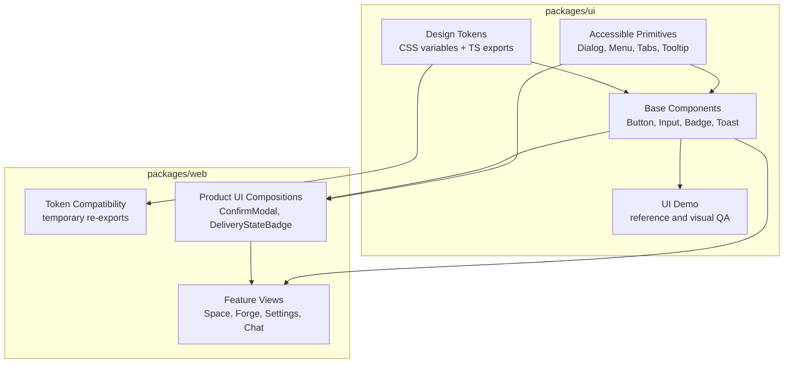

# UI Design System Architecture Design

**Date:** 2026-05-24
**Status:** Draft Design
**Related:**

- [Target Architecture Overview](./README.md)
- [Client State And Read Models Design](./client-state-and-read-models.md)
- [Shared Package Boundaries Design](./shared-package-boundaries.md)

---

## 1. Purpose

NeoKai needs a real UI design system boundary before large frontend refactors.

The repository already has strong pieces:

- `packages/ui` as a reusable Preact component package with demos and tests.
- `packages/web/src/components/ui` as the product UI component layer used by the app.
- `packages/web/src/lib/design-tokens.ts` as app-level TypeScript design tokens.
- `packages/web/src/styles.css` as Tailwind v4 theme variables and global utilities.

Those pieces are not yet one coherent design system. The target is to make `packages/ui` the canonical UI system package while keeping product-specific NeoKai compositions in `packages/web`.

This is not a redesign mandate. The first design-system migration should preserve NeoKai's current product language: dark operational surfaces, dense workflow-oriented layouts, current app shell proportions, and the established Space/Forge/chat feel. The current app is the source of truth for initial tokens and component variants. `packages/ui/demo` is a reference harness, not a replacement visual direction.

---

## 2. Current State

### 2.1 `packages/ui`

`packages/ui` currently exports reusable primitives and base components through `@neokai/ui`.

Examples:

- `Button`
- `IconButton`
- `Dialog`
- `Tabs`
- `Menu`
- `Combobox`
- `Listbox`
- `Popover`
- `Tooltip`
- `Toast`
- `Spinner`
- `Skeleton`
- `Badge`
- `Avatar`
- `Alert`

The package also has:

- component tests under `packages/ui/tests`
- a demo/reference app under `packages/ui/demo`
- Tailwind v4 support for the demo

This is a good foundation, but it is not currently the product UI authority.

### 2.2 Web-Local UI Layer

The app mostly uses `packages/web/src/components/ui`.

Current local app UI components include:

- `Button`
- `IconButton`
- `Modal`
- `ConfirmModal`
- `RejectModal`
- `Dropdown`
- `Tooltip`
- `Toast`
- `Spinner`
- `Skeleton`
- `ContentContainer`
- `ActionBar`
- `DeliveryStateBadge`
- `MobileMenuButton`
- `EmptyState`

This layer is product-aware and deeply integrated with `packages/web/src/lib/design-tokens.ts`.

### 2.3 Import Reality

As of this review:

- `packages/web` imports `@neokai/ui` in only two app files:
  - `packages/web/src/islands/CommandPalette.tsx`
  - `packages/web/src/components/space/SpaceConfigurePage.tsx`
- `packages/web` has many more imports from local `components/ui/*`.

So the app is configured to consume `@neokai/ui`, but it has not standardized on it.

### 2.4 Tokens And Styling

Current token ownership is split:

- Tailwind theme variables and global utilities live in `packages/web/src/styles.css`.
- TypeScript tokens live in `packages/web/src/lib/design-tokens.ts`.
- `packages/ui` components generally expose behavior and styling hooks, but do not yet own the NeoKai product tokens.
- Feature components still use many direct Tailwind class strings.

This makes it easy for new UI work to drift.

---

## 3. Design Goals

1. **One canonical UI system package:** `packages/ui` should become the default source for reusable primitives, base components, and shared tokens.
2. **Thin product layer:** `packages/web/src/components/ui` should keep only NeoKai-specific compositions.
3. **Token ownership clarity:** color, radius, spacing, focus, motion, and typography tokens should have a canonical owner.
4. **Accessible primitives by default:** dialog, menu, listbox, combobox, tabs, tooltip, toast, and popover behavior should come from tested primitives.
5. **No big-bang rewrite:** migrate surfaces gradually while preserving existing product behavior.
6. **Feature UI consistency:** new feature components should compose system components instead of creating one-off controls.
7. **Visual reference:** the UI demo should remain the living reference for primitives, base components, and app composition examples.
8. **Visual parity first:** initial migrations should keep the current NeoKai look and feel unless a visual change is explicitly approved.

## 4. Non-Goals

- Redesigning NeoKai's visual language as part of the design-system extraction.
- Rewriting the entire web app in one pass.
- Forcing product-specific components such as `DeliveryStateBadge` into `packages/ui` before they are reusable.
- Making `packages/ui` React-compatible. NeoKai is Preact-first.
- Freezing the visual language before product workflows settle.
- Removing all Tailwind classes from feature components. Layout-specific Tailwind remains acceptable.

---

## 5. Target Package Boundary

### Boundary Rules

- `packages/ui` owns generic reusable primitives, base components, tokens, and demo references.
- `packages/web/src/components/ui` owns product-specific compositions that mention NeoKai domain concepts or app shell behavior.
- Feature components may use `@neokai/ui` directly for generic controls.
- Feature components should use product UI compositions for domain-specific UI.
- New generic UI controls should not be added under `packages/web/src/components/ui` unless there is a documented reason they cannot live in `packages/ui`.

---

## 6. Component Layers

### 6.1 Primitives

Primitives own behavior, accessibility, focus management, keyboard navigation, portals, layering, and ARIA state.

Examples:

- `Dialog`
- `Menu`
- `Listbox`
- `Combobox`
- `Popover`
- `Tooltip`
- `Tabs`
- `Transition`

These should live in `packages/ui`.

### 6.2 Base Components

Base components own reusable visual treatments and simple variants.

Examples:

- `Button`
- `IconButton`
- `Input`
- `Textarea`
- `Select`
- `Badge`
- `Alert`
- `Toast`
- `Spinner`
- `Skeleton`
- `ProgressBar`
- `Stepper`

These should live in `packages/ui`, consume shared tokens, and remain domain-neutral.

### 6.3 Product Compositions

Product compositions combine primitives/base components with NeoKai product semantics.

Examples:

- `ConfirmModal`
- `RejectModal`
- `DeliveryStateBadge`
- `ContentContainer`
- `MobileMenuButton`
- app shell panels
- Space/Forge-specific status cards

These can remain in `packages/web/src/components/ui` when they are product-specific. If a composition becomes generic, move it down into `packages/ui`.

### 6.4 Feature Views

Feature views own layout, data binding, state subscriptions, and domain workflows.

Examples:

- Space task pane
- Forge scope detail
- Settings pages
- Chat surfaces
- Workflow editor

Feature views should not invent reusable controls. They should compose `@neokai/ui` and product UI components.

---

## 7. Token Model

### Current Token Sources

| Source | Current Role |
| --- | --- |
| `packages/web/src/styles.css` | Tailwind theme variables, app globals, surface utilities. |
| `packages/web/src/lib/design-tokens.ts` | TypeScript token object for colors, spacing, radius, transitions, message styling. |
| `packages/ui/demo/styles.css` | Demo-local Tailwind import. |
| Feature Tailwind classes | Local layout and one-off styling. |

### Target Token Ownership

`packages/ui` should own:

- CSS custom properties for color, surface, text, border, radius, shadow, spacing, typography, focus, and motion.
- TypeScript token exports for component APIs and app code.
- Tailwind-compatible naming conventions used by both demo and web.

`packages/web` should own:

- product-specific semantic tokens when they are not reusable yet
- temporary compatibility re-exports during migration
- app shell global constraints such as safe viewport handling

Token migration should be additive first:

1. Add canonical token exports in `packages/ui`.
2. Re-export or mirror them from `packages/web/src/lib/design-tokens.ts`.
3. Migrate base components to consume the canonical tokens.
4. Remove duplicate web-local tokens only after app call sites move.

---

## 8. Design System Contracts

The design system should define contracts at three levels.

### 8.1 Visual Tokens

Required token groups:

- surfaces
- text
- borders
- accents
- semantic states
- tool/domain category colors
- spacing
- radius
- typography
- focus rings
- elevation/shadow
- motion durations and easing

### 8.2 Component APIs

Component APIs should be stable and small:

- `variant`
- `size`
- `tone`
- `disabled`
- `loading`
- `icon`
- `class`/`className` compatibility where needed
- explicit ARIA props for accessibility-sensitive controls

The Preact app currently uses both `class` and `className` patterns. Migration should support both where it avoids churn, but new public APIs should document the preferred prop.

### 8.3 Layout And Composition Patterns

The demo/reference should include canonical examples for:

- app shell
- settings pages
- dense operational tables/lists
- modal forms
- confirmation flows
- empty states
- loading/skeleton states
- command palette
- Space/Forge-style multi-panel workflows

The design system is not just atomic components. It should include the patterns needed for real NeoKai screens.

---

## 9. Migration Strategy

### Phase 0: Inventory And Classification

- Classify every `packages/web/src/components/ui` component as `generic`, `product-composition`, or `legacy`.
- Classify current `packages/ui` exports as `primitive`, `base`, or `demo-only`.
- Document visual/token gaps between local web components and `@neokai/ui`.
- Capture current screenshots or visual references for the first migrated surfaces so parity can be reviewed.

### Phase 1: Token Authority

- Add canonical token exports under `packages/ui`.
- Keep `packages/web/src/lib/design-tokens.ts` as a compatibility facade.
- Move only stable, cross-product tokens first.
- Leave message-specific or domain-specific tokens in web until their reuse is clear.

### Phase 2: Core Component Alignment

Align the most-used controls first:

1. `Button`
2. `IconButton`
3. `Dialog`/`Modal`
4. `Tooltip`
5. `Spinner`
6. `Skeleton`
7. `Tabs`
8. `Toast`

For each component:

- define the canonical `@neokai/ui` API
- compare current web-local behavior and visual variants
- add missing variants to `packages/ui`
- derive initial styling from current NeoKai web components, not from demo-only examples
- migrate one narrow app surface
- keep the local wrapper only if product behavior remains

### Phase 3: Product Composition Cleanup

- Convert generic local wrappers into thin re-exports or remove them.
- Keep product compositions in web with names that reveal product semantics.
- Move domain-neutral compositions into `packages/ui`.

### Phase 4: Feature Surface Migration

Migrate feature areas one at a time:

1. Space settings/configure pages.
2. Command palette.
3. Chat controls and composer actions.
4. Space task pane.
5. Forge surfaces.
6. Workflow editor controls.

### Phase 5: Enforcement

- Add lint/dependency checks for new generic UI components in `packages/web/src/components/ui`.
- Add import guidance so new feature code prefers `@neokai/ui`.
- Add visual/demo coverage for every public `@neokai/ui` component.
- Add accessibility tests for interactive primitives.

---

## 10. First Implementation Slice

Do not start by migrating every component. Start with a narrow, high-signal slice.

Recommended first slice:

1. Classify `Button`, `IconButton`, `Dialog`/`Modal`, `Tooltip`, `Spinner`, and `Tabs`.
2. Decide which variants are required by current web call sites.
3. Add missing variants or compatibility props to `packages/ui`.
4. Migrate one contained surface such as `SpaceConfigurePage` or one settings dialog.
5. Keep local web wrappers where needed, but make their dependency on `@neokai/ui` explicit.

Success criteria:

- the migrated surface has no local one-off implementations for migrated controls
- visual behavior matches the existing app; any intentional visual difference is listed in the PR
- before/after screenshots are reviewed for layout, spacing, color, focus, and interaction parity
- `packages/ui` tests cover the canonical behavior
- web tests for the migrated surface still pass
- the migration pattern is documented for the next surface

---

## 11. Exit Criteria

The UI design system cleanup is complete when:

- `packages/ui` owns canonical tokens, primitives, base components, and public component demos.
- `packages/web/src/lib/design-tokens.ts` is either a compatibility facade over `@neokai/ui` tokens or contains only product-specific tokens.
- Generic controls such as button, icon button, dialog, tooltip, tabs, menu, popover, toast, spinner, skeleton, input, and badge are imported from `@neokai/ui` in new feature code.
- `packages/web/src/components/ui` contains product-specific compositions only, plus explicitly temporary compatibility wrappers.
- New feature components do not create reusable one-off controls with raw Tailwind class strings.
- Initial migrations preserve the current NeoKai product look and feel unless a visual change is explicitly approved.
- PRs that migrate UI components list any intentional visual or interaction differences.
- Public `@neokai/ui` components have tests and demo/reference coverage.
- Accessibility-sensitive primitives have keyboard, focus, escape, outside-click, and ARIA coverage.
- The design system package can be evolved without editing Space, Forge, or chat feature code except where product composition changes are intentional.

---

## 12. Open Questions

1. Should `packages/ui` own NeoKai brand tokens directly, or should it expose generic primitives while a future `packages/web-design` layer owns app branding?
2. Should local web wrappers be converted to re-export wrappers first, or should feature code import `@neokai/ui` directly?
3. Should the UI demo include NeoKai-specific product compositions, or only domain-neutral components and patterns?
4. Should token enforcement be lint-based, screenshot-based, or only code-review-based in the first migration phase?
5. Which surface should validate the first slice: `SpaceConfigurePage`, settings dialogs, or Command Palette?
