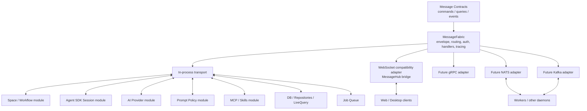

# Unified Message Fabric Architecture Design

**Date:** 2026-05-21
**Status:** Draft Design
**Related:**
- [Internal Event, Command, and Query Architecture](../../plans/internal-event-command-query-architecture.md)
- [Live Query and Job Queue Architecture](../../adr/0001-live-query-and-job-queue.md)
- [Space Actor Communication Design](../../design/space-actor-communication-design.md)

---

## 1. Overview

NeoKai is moving toward a single messaging interface that can connect local daemon modules, agents, clients, workers, other daemons, organization-local services, and eventually public internet integrations.

The interface is based on three semantic message kinds:

- **Command:** an authenticated request to do something. Commands may mutate state and may complete immediately or return an accepted asynchronous operation.
- **Query:** an authenticated request to read state. Queries may be one-shot or subscribed/live, but they must not mutate state.
- **Event:** a fact emitted by a trusted producer after something happened. Events may be ephemeral or durable/replayable depending on their contract.

This document defines a new `MessageFabric` architecture. `MessageHub` remains as a compatibility and client transport layer during migration. Existing `InternalEventBus`, `InternalCommandBus`, `InternalQueryBus`, `LiveQuery`, and `JobQueue` concepts are progressively folded behind the fabric rather than removed in one rewrite.

The goal is not to turn every private method call into a message. The goal is to make every cross-boundary interaction use one consistent semantic contract.

---

## 2. Current State

The daemon currently has multiple communication planes:

| Plane | Current role |
| --- | --- |
| `MessageHub` | Client-facing WebSocket RPC/pubsub protocol and routing infrastructure. |
| `InternalEventBus` | In-process daemon domain events. |
| `InternalCommandBus` | In-process daemon command dispatch. |
| `InternalQueryBus` | In-process point-in-time reads. |
| `ReactiveDatabase` / `LiveQueryEngine` | DB-backed reactive query subscriptions and client deltas. |
| `JobQueueRepository` / `JobQueueProcessor` | Durable background work execution. |
| Direct service references | Constructor-injected method calls, especially in `setupRPCHandlers`. |

These pieces are useful, but the semantic model is duplicated across several implementations. The architecture has drifted from the original hub/fabric idea: `MessageHub` is mostly client-facing, while internal modules coordinate through a mix of direct calls, buses, LiveQuery invalidation, and job queue entries.

The target architecture keeps the useful pieces but introduces one canonical contract layer.

---

## 3. Design Goals

1. **One semantic interface:** commands, queries, and events are first-class across local, process, network, and public boundaries.
2. **Transport independence:** in-process, WebSocket, gRPC, NATS, Kafka, and future transports are adapters over the same envelope and contracts.
3. **Compatibility first:** existing WebSocket clients and MessageHub handlers keep working while slices migrate.
4. **Typed contracts:** message names, payload schemas, result schemas, auth policy, durability, and addressing rules are registered centrally.
5. **Explicit read lifecycle:** one-shot queries and live subscriptions share query contracts, with different delivery modes.
6. **Durability by policy:** events and accepted commands declare whether they are ephemeral or durable. Durable delivery starts with a local outbox and grows into broker-backed outbox/inbox later.
7. **Layered authorization:** transport authentication, fabric policy enforcement, and handler-level resource checks all remain distinct.
8. **Operational visibility:** every envelope carries correlation, causation, actor, source, timestamps, and traceable delivery metadata.

## 4. Non-Goals

- Rewriting `SpaceRuntime` internals to use messages for every private interaction.
- Removing `MessageHub` immediately.
- Replacing SQLite repositories with event sourcing.
- Requiring Kafka, NATS, or gRPC in the first implementation.
- Making all events durable. Some events are intentionally ephemeral UI or lifecycle hints.

---

## 5. Target Architecture



The fabric owns the canonical envelope and semantics. Transports only project fabric messages onto their native addressing and delivery model.

---

## 6. Core Message Model

### 6.1 Message Envelope

All messages use one envelope. Individual contracts specialize the `kind`, `name`, `data`, and result shape.

```typescript
export type MessageKind = 'command' | 'query' | 'event';

export interface MessageEnvelope<TData = unknown> {
  /** Globally unique envelope ID. */
  id: string;
  /** command, query, or event. */
  kind: MessageKind;
  /** Stable semantic contract name, e.g. "space.task.create". */
  name: string;
  /** Contract version. */
  version: number;
  /** Resource or stream address, e.g. "space/space_123/task/task_456". */
  subject?: string;
  /** Producing component, client, worker, or external integration. */
  source: MessageSource;
  /** Authenticated actor, if known. */
  actor?: MessageActor;
  /** Correlates a workflow of related messages. */
  correlationId?: string;
  /** Points to the message that caused this one. */
  causationId?: string;
  /** Optional reply address for request/reply transports. */
  replyTo?: string;
  /** Wall-clock creation time in Unix ms. */
  timestamp: number;
  /** Transport-provided trust classification. */
  trust: 'local' | 'authenticated' | 'external' | 'anonymous';
  /** Message payload validated by the contract registry. */
  data: TData;
  /** Optional transport and delivery metadata. */
  meta?: Record<string, unknown>;
}
```

`name` and `subject` are intentionally separate:

- `name` answers: what semantic contract is this?
- `subject` answers: what resource, stream, or routing scope is this about?

Examples:

```typescript
{
  kind: 'command',
  name: 'space.task.create',
  subject: 'space/space_123/tasks'
}

{
  kind: 'event',
  name: 'space.task.created',
  subject: 'space/space_123/task/task_456'
}

{
  kind: 'query',
  name: 'space.task.list',
  subject: 'space/space_123/tasks'
}
```

### 6.2 Command Results

Commands return either a completed result or an accepted asynchronous operation.

```typescript
export type CommandResult<TData = unknown> =
  | {
      status: 'completed';
      data: TData;
    }
  | {
      status: 'accepted';
      operationId: string;
      jobId?: string;
      subject?: string;
    };
```

Accepted commands are not "fire and forget" in the unsafe sense. The fabric acknowledges that the command was validated, authorized, and durably or ephemerally accepted according to the contract policy.

### 6.3 Query Results

Queries share one contract but support multiple delivery modes:

```typescript
export type QueryDeliveryMode = 'once' | 'subscribe';

export interface QuerySnapshot<TRow = unknown, TMeta = unknown> {
  type: 'snapshot';
  rows: TRow[];
  version?: number;
  metadata?: TMeta;
}

export interface QueryDelta<TRow = unknown, TMeta = unknown> {
  type: 'delta';
  rows: TRow[];
  added?: TRow[];
  updated?: TRow[];
  removed?: TRow[];
  version?: number;
  metadata?: TMeta;
}
```

A fabric user should see:

```typescript
await fabric.query('space.task.list', params);

const sub = await fabric.subscribeQuery('space.task.list', params, {
  onSnapshot,
  onDelta,
});
```

`LiveQueryEngine` remains the implementation backend for DB-backed subscribed queries. The public contract remains a named query, not arbitrary SQL.

### 6.4 Events

Events are facts. Event names should be past-tense or state-fact names:

```text
space.task.created
space.task.updated
space.workflowRun.completed
agent.session.interrupted
externalEvent.published
```

Event contracts declare delivery class:

```typescript
export type EventDurability = 'ephemeral' | 'durable';
export type EventReplay = 'none' | 'bySubject' | 'byTime' | 'bySequence';
```

Ephemeral events are delivered best-effort in-process or over connected transports. Durable events are written to an outbox before or during publication so they can be retried and replayed according to policy.

---

## 7. Contract Registry

The contract registry is the source of truth for message semantics.

```typescript
export interface MessageContract<TInput = unknown, TOutput = unknown> {
  kind: MessageKind;
  name: string;
  version: number;
  input: Schema<TInput>;
  output?: Schema<TOutput>;
  subject?: SubjectPolicy<TInput>;
  auth: AuthPolicy<TInput>;
  durability?: DurabilityPolicy;
  idempotency?: IdempotencyPolicy<TInput>;
}
```

Contracts should live in `packages/messaging` or a successor package such as `@neokai/messaging`, with narrow exports:

```text
packages/messaging/src/
  envelope.ts
  contracts/
    space.ts
    session.ts
    prompt-policy.ts
    agent.ts
    provider.ts
    mcp.ts
  transport/
    in-process.ts
    websocket-bridge.ts
```

The daemon imports contracts and registers handlers. Clients import the same contracts for typed calls. AsyncAPI generation should read the registry rather than a separate hand-written spec.

---

## 8. Addressing and Transport Projection

The fabric's canonical address is not Kafka-specific or NATS-specific. It consists of:

- `name`: stable semantic contract name.
- `subject`: resource or stream address.

Each transport adapter maps those fields to its native addressing model.

| Transport | Projection |
| --- | --- |
| In-process | Look up handler by `kind + name`. Use `subject` for resource policy, tracing, and subscription filtering. |
| WebSocket / MessageHub | Send the full JSON envelope over the socket. Existing `method` maps to `name` during compatibility. |
| gRPC | Map service/method to `name`; carry envelope metadata in request headers or wrapper messages. |
| NATS | Use NATS subject for routing; carry `name`, `kind`, and `version` in headers. |
| Kafka | Use coarse topic; use `subject` as record key; carry `name`, `kind`, and `version` in headers. |

### 8.1 NATS Example

NATS has fine-grained subjects, so the adapter can project resource routing directly:

```text
fabric.name:    space.task.created
fabric.subject: space/space_123/task/task_456

nats.subject:   neokai.space.space_123.task.task_456.event.space.task.created
nats.headers:
  name:         space.task.created
  kind:         event
  version:      1
```

The adapter may also choose a coarser subject:

```text
nats.subject: neokai.space.space_123.events
headers.name: space.task.created
```

That choice is a transport configuration decision. The fabric contract does not change.

### 8.2 Kafka Example

Kafka topics should be coarse and stable. Do not create a topic per resource or per message name.

```text
fabric.name:    space.task.created
fabric.subject: space/space_123/task/task_456

kafka.topic:    neokai.space.events
kafka.key:      space/space_123/task/task_456
kafka.headers:
  name:         space.task.created
  kind:         event
  version:      1
  correlationId: ...
kafka.value:
  full envelope or envelope data
```

Kafka is a good fit for durable events and asynchronous commands. It is not the default transport for low-latency one-shot queries.

---

## 9. Authorization Model

Authorization is layered. No single layer is enough.

### 9.1 Transport Authentication

The transport authenticates the caller and produces a `MessageActor`.

Examples:

- WebSocket session token -> user actor.
- Local daemon module -> trusted service actor.
- External webhook -> external integration actor with limited trust.
- Future gRPC/NATS/Kafka credentials -> service or organization actor.

### 9.2 Fabric Envelope Validation

The fabric normalizes every envelope:

- Assigns missing `id`, `timestamp`, `correlationId`, and `source`.
- Resolves actor and trust level from the transport.
- Rejects malformed names, versions, subjects, and payloads.
- Applies contract-level auth policy before dispatch.

### 9.3 Contract-Level Policy

Each contract declares required capability and resource derivation.

```typescript
export interface AuthPolicy<TInput> {
  action: string;
  resource: 'global' | 'space' | 'session' | 'task' | 'workflowRun' | 'provider' | 'mcp';
  resourceIdFrom?: (input: TInput, envelope: MessageEnvelope<TInput>) => string | null;
  allowLocalService?: boolean;
  allowExternal?: boolean;
}
```

Example:

```typescript
auth: {
  action: 'space.task.create',
  resource: 'space',
  resourceIdFrom: (input) => input.spaceId,
}
```

### 9.4 Handler-Level Resource Checks

Handlers still check concrete resource access using current database state. Contract policy catches broad invalid access. Handler checks catch resource-specific rules and race conditions.

For example, a `space.task.create` command may pass contract auth for `space_123`, but the handler still verifies that the space exists, is not archived, and allows task creation by that actor.

### 9.5 Broker ACLs

Future NATS/Kafka/gRPC ACLs provide coarse access control, but they are not the source of truth. They should prevent obviously wrong producers/consumers from connecting, while the fabric and handlers enforce message-level authorization.

---

## 10. Durability and Delivery

Durability is a contract policy, not a transport accident.

```typescript
export interface DurabilityPolicy {
  delivery: 'ephemeral' | 'durable';
  replay: 'none' | 'bySubject' | 'byTime' | 'bySequence';
  ordering?: 'none' | 'bySubject';
  dedupeKey?: string;
}
```

### 10.1 Ephemeral Delivery

Use ephemeral delivery for:

- WebSocket connection state.
- UI-only lifecycle hints.
- Local progress notifications that can be reconstructed from state.
- Best-effort activity pings.

### 10.2 Durable Outbox

Use durable delivery for:

- Domain facts needed by workers or remote subscribers.
- External event lifecycle.
- Accepted commands that must survive daemon restart.
- Integration events that should be replayable.

Initial durable outbox shape:

```sql
CREATE TABLE message_outbox (
  id TEXT PRIMARY KEY,
  kind TEXT NOT NULL,
  name TEXT NOT NULL,
  version INTEGER NOT NULL,
  subject TEXT,
  envelope_json TEXT NOT NULL,
  status TEXT NOT NULL DEFAULT 'pending',
  attempts INTEGER NOT NULL DEFAULT 0,
  next_attempt_at INTEGER,
  created_at INTEGER NOT NULL,
  published_at INTEGER
);

CREATE INDEX idx_message_outbox_status_next
  ON message_outbox(status, next_attempt_at);

CREATE INDEX idx_message_outbox_subject_created
  ON message_outbox(subject, created_at);
```

The first implementation can publish durable messages in-process after writing the outbox row. Later broker adapters can drain the same outbox to NATS, Kafka, or other transports.

### 10.3 Inbox and Dedupe

Inbox/deduplication is needed when external transports can redeliver messages.

```sql
CREATE TABLE message_inbox (
  id TEXT PRIMARY KEY,
  source TEXT NOT NULL,
  name TEXT NOT NULL,
  subject TEXT,
  envelope_json TEXT NOT NULL,
  status TEXT NOT NULL DEFAULT 'received',
  received_at INTEGER NOT NULL,
  handled_at INTEGER
);
```

Inbox can be deferred until the first cross-process durable transport, but the envelope must include enough identity and idempotency metadata from day one.

---

## 11. Relationship to Existing Systems

| Existing system | Target role |
| --- | --- |
| `MessageHub` | Compatibility/client transport bridge. It should eventually speak fabric envelopes over WebSocket instead of owning daemon semantics. |
| `InternalEventBus` | Facade over fabric event publish/subscribe for migrated internal code. Existing call sites can migrate gradually. |
| `InternalCommandBus` | Facade over fabric command dispatch. |
| `InternalQueryBus` | Facade over fabric one-shot queries. |
| `LiveQueryEngine` | Backend for subscribed DB-backed named queries. Not exposed as arbitrary SQL over the fabric. |
| `JobQueueProcessor` | Durable command execution backend for accepted async commands. |
| `ExternalEventService` | Producer and normalizer of trusted `externalEvent.*` domain events. |
| `PromptPolicyRegistry` | Domain module for scoped prompt behavior records, effective policy preview, and policy-change events. |
| `setupRPCHandlers` | Should shrink into module registration. Each module registers contracts, handlers, and compatibility aliases. |
| Direct service calls | Still allowed within a cohesive module. Cross-module and cross-process boundaries should move to fabric contracts. |

---

## 12. Module Registration Model

Instead of a single `setupRPCHandlers` function constructing nearly everything, modules should register their fabric surface.

```typescript
export interface FabricModule {
  name: string;
  register(registry: MessageContractRegistry): void;
  start?(context: ModuleRuntimeContext): Promise<void>;
  stop?(): Promise<void>;
}
```

Example:

```typescript
export const SpaceMessagingModule: FabricModule = {
  name: 'space',
  register(registry) {
    registry.command(spaceTaskCreateContract, createSpaceTaskHandler);
    registry.query(spaceTaskListContract, listSpaceTasksHandler);
    registry.event(spaceTaskCreatedContract);
  },
};
```

Compatibility aliases let old MessageHub methods call new fabric names:

```typescript
compat.alias('space.task.create', {
  fromMessageHubMethod: 'space.task.create',
  toFabricName: 'space.task.create',
});
```

---

## 13. Example Contracts

### 13.1 Command: `space.task.create`

```typescript
export const spaceTaskCreate = defineCommand({
  name: 'space.task.create',
  version: 1,
  input: SpaceTaskCreateSchema,
  output: SpaceTaskSchema,
  subject: {
    fromInput: (input) => `space/${input.spaceId}/tasks`,
  },
  auth: {
    action: 'space.task.create',
    resource: 'space',
    resourceIdFrom: (input) => input.spaceId,
  },
  durability: {
    delivery: 'durable',
    replay: 'none',
    ordering: 'bySubject',
  },
});
```

### 13.2 Query: `space.task.list`

```typescript
export const spaceTaskList = defineQuery({
  name: 'space.task.list',
  version: 1,
  input: SpaceTaskListSchema,
  output: SpaceTaskListResultSchema,
  subject: {
    fromInput: (input) => `space/${input.spaceId}/tasks`,
  },
  auth: {
    action: 'space.task.list',
    resource: 'space',
    resourceIdFrom: (input) => input.spaceId,
  },
  supportsSubscribe: true,
});
```

The one-shot query uses a repository read. The subscribed query can use `LiveQueryEngine` with a named SQL definition behind the handler.

### 13.3 Event: `space.task.created`

```typescript
export const spaceTaskCreated = defineEvent({
  name: 'space.task.created',
  version: 1,
  input: SpaceTaskCreatedEventSchema,
  subject: {
    fromInput: (event) => `space/${event.spaceId}/task/${event.taskId}`,
  },
  auth: {
    action: 'space.task.created.publish',
    resource: 'space',
    resourceIdFrom: (event) => event.spaceId,
    allowLocalService: true,
  },
  durability: {
    delivery: 'durable',
    replay: 'bySubject',
    ordering: 'bySubject',
    dedupeKey: 'eventId',
  },
});
```

### 13.4 Prompt Policy Contracts

Prompt policy is managed through the same command/query/event surface as other cross-boundary state. Settings UI, Space configuration, workflow editors, and task-run options should not write feature-specific prompt fields; they should create or suppress scoped policy records.

Example command:

```typescript
export const promptPolicyBuiltinActivate = defineCommand({
  name: 'promptPolicy.builtin.activate',
  version: 1,
  input: PromptPolicyBuiltinActivateSchema,
  output: PromptPolicyRecordSchema,
  subject: {
    fromInput: (input) => `promptPolicy/${input.scopeType}/${input.scopeId ?? 'global'}`,
  },
  auth: {
    action: 'promptPolicy.record.write',
    resource: 'space',
    resourceIdFrom: (input) => input.spaceId ?? null,
  },
  durability: {
    delivery: 'durable',
    replay: 'none',
    ordering: 'bySubject',
  },
});
```

Example query:

```typescript
export const promptPolicyEffectivePreview = defineQuery({
  name: 'promptPolicy.effective.preview',
  version: 1,
  input: PromptPolicyPreviewSchema,
  output: PromptPolicyPreviewResultSchema,
  subject: {
    fromInput: (input) => `promptPolicy/preview/${input.sessionId ?? input.spaceId ?? 'global'}`,
  },
  auth: {
    action: 'promptPolicy.preview',
    resource: 'space',
    resourceIdFrom: (input) => input.spaceId ?? null,
  },
  supportsSubscribe: true,
});
```

Example events:

| Event | Durability | Purpose |
| --- | --- | --- |
| `promptPolicy.record.created` | Durable | A scoped policy record was created. |
| `promptPolicy.record.updated` | Durable | A scoped policy record changed. |
| `promptPolicy.record.deleted` | Durable | A scoped policy record was removed. |
| `promptPolicy.effective.changed` | Durable or ephemeral by scope | A scope chain may resolve to a different effective policy. |

Handlers store and mutate `prompt_policy_records`; the Agent Runtime prompt policy resolver performs precedence, suppression, and rendering.

---

## 14. Migration Strategy

### Phase 0: Spec and Contracts

- Add this design spec.
- Define envelope, contract, subject, auth, and result types in `packages/messaging`.
- Add a small contract registry with no transport changes.
- Add lint or review guidance: new cross-boundary APIs should define contracts.

### Phase 1: In-Process Fabric

- Implement `MessageFabric` with in-process transport only.
- Register handlers by `kind + name`.
- Add tracing, correlation, validation, and auth hooks.
- Keep `MessageHub` unchanged.

### Phase 2: Facades for Existing Internal Buses

- Make `InternalEventBus` publish through fabric events.
- Make `InternalCommandBus` dispatch through fabric commands.
- Make `InternalQueryBus` execute through fabric queries.
- Preserve current public methods so existing code does not churn all at once.

### Phase 3: MessageHub Compatibility Bridge

- Bridge MessageHub RPC calls to fabric command/query dispatch.
- Bridge fabric events/query deltas back to current MessageHub event delivery.
- Keep existing WebSocket client payloads working through aliases.

### Phase 4: First Vertical Slice

Migrate one bounded slice, preferably `space.task.*`:

- Define command/query/event contracts.
- Register handlers in a Space module.
- Route existing RPC methods through fabric.
- Emit durable `space.task.*` events through the fabric.
- Keep repository and `LiveQueryEngine` behavior intact.

### Phase 5: Durable Outbox

- Add `message_outbox` for durable events and accepted async commands.
- Publish in-process from the outbox first.
- Add retry and status tracking.
- Connect accepted command results to existing `JobQueueProcessor` where useful.

### Phase 6: Prompt Policy Slice

- Define `promptPolicy.*` command/query/event contracts.
- Route compressed-output settings through scoped `prompt_policy_records`.
- Add effective preview query and `promptPolicy.effective.changed` event.
- Keep prompt rendering inside Agent Runtime; fabric only manages commands, queries, events, and durable state changes.

### Phase 7: Module Lifecycle Cleanup

- Split `setupRPCHandlers` into module registration and module startup.
- Move Space, Session, Provider, MCP, External Event, and Job surfaces into modules.
- Reduce direct cross-module references where fabric contracts are the intended boundary.

### Phase 8: External Transports

- Add NATS or gRPC before Kafka if low-latency request/reply is the first need.
- Add Kafka for durable event streams and async commands.
- Add inbox/dedup when redelivery from external transports is introduced.
- Generate AsyncAPI documentation from the registry.

---

## 15. Design Rules

1. New cross-boundary daemon APIs must be commands, queries, or events.
2. Domain events are not automatically client events. Client exposure is explicit.
3. Queries must not mutate state.
4. Commands must declare whether they complete synchronously or may return `accepted`.
5. Events must declare durability and replay policy.
6. Message names are stable API contracts. Do not use dynamic IDs in names.
7. Subjects may contain resource IDs and should be usable for routing, ACLs, partition keys, and replay filters.
8. Transport adapters must not invent semantics that are absent from the fabric envelope.
9. Handler-level authorization remains required even when contract-level auth passes.
10. Direct method calls are allowed within module internals, but cross-module integration should prefer fabric contracts as the module boundary matures.

---

## 16. Open Questions

1. Which vertical slice migrates first: `space.task.*`, `session.*`, or `externalEvent.*`?
2. Should `message_outbox` land with Phase 1 or wait until the first durable event slice?
3. Which schema library should contracts standardize on for runtime validation?
4. Should AsyncAPI generation be part of the initial registry or a follow-up tool?
5. What is the exact actor/capability model for local service actors versus user actors?
