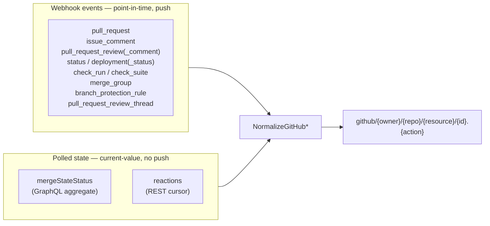

# GitHub Events — Merge-Blocking Event/State Coverage Spec

Status: Active (contract)
Date: 2026-08-02
Tracking issue: [#2320](https://github.com/lsm/HyperNeo/issues/2320)

## Purpose

This document is the **contract** for comprehensive ingestion of every GitHub
signal that can block a PR from merging. It locks the **event-kind and topic
taxonomy** so the nine cookie-cutter ingestion issues (#2321–#2329) do not drift.

Each of those issues cites this spec ("see spec #2320"). If a sibling PR proposes
a topic name, kind, or blocking classification that disagrees with this document,
**this document wins** — update the spec here first (in its own change), then
re-derive the implementation.

Related docs:

- `docs/design/pr-review-workflow.md` — the multi-round review loop these events feed.
- `docs/plans/design-external-event-bus-for-space-workflow-nodes.md` — the
  extension/dumb-pipe architecture this ingestion lives inside.

## Scope

**In scope:** expanding **event ingestion** across both the **webhook** and
**poll** pipelines in `packages/daemon/src/lib/external-events/github/` — new
event kinds, their topics, blocking classification, dedupe/transition semantics,
and the cross-cutting infra (SHA→PR resolution, transition tracking) the new
sources require.

**Out of scope:**

- **Gate evaluation.** Synchronous merge-readiness decisions remain the job of
  `built-in-validators/pr-ready-validator.ts` (see
  [Relationship to gate-time evaluation](#relationship-to-gate-time-evaluation)).
  This spec produces cached/observed events; it does **not** judge them.
- **Workflow-engine generalization / connector spike** — tracked separately as #2299.
- **Consumer behavior** — what a workflow node does when it receives one of these
  topics is a workflow-runtime concern, not an ingestion concern.

## The two views of merge-readiness

GitHub exposes merge-blockers through two fundamentally different surfaces, and
this spec ingests from both:



- **Webhook events** are incremental: GitHub pushes one payload when something
  happens. Each maps to a `GitHubEventKind` and a normalizer.
- **Polled state** (notably `mergeStateStatus`) is a *current value*, not an
  event stream. GitHub sends **no webhook** when it changes. The poller must emit
  a topic **only on transition** (see
  [Transition tracking](#cross-cutting-infra)).

`mergeStateStatus` is the single highest-leverage addition: one polled read covers
every **state-only** blocker — BEHIND (up-to-date rule), BLOCKED (reviews,
code-owner, latest-push approval, required-signatures, protection rules), UNSTABLE
(failing/pending checks), DRAFT — that no individual webhook fully represents.

## Coverage matrix

The contract. Every row is one sibling issue. **Tier** drives sequencing; the
matrix itself is the authoritative topic source each PR must match.

| # | Title | Signal | Pipeline | Kind | Topic(s) | Blocks? | Issue |
|---|---|---|---|---|---|---|---|
| 1 | status webhook | `status` event; state pending/success/failure/error | webhook | `status` | `pull_request/{id}.status_{state}` | failure/error block; pending = waiting; success clears | [#2321](https://github.com/lsm/HyperNeo/issues/2321) |
| 2 | review-thread webhook | `pull_request_review_thread`; actions resolved/unresolved | webhook | `pull_request_review_thread` | `pull_request/{id}.thread_resolved` / `.thread_unresolved` | unresolved blocks; resolved clears | [#2322](https://github.com/lsm/HyperNeo/issues/2322) |
| 3 | mergeStateStatus poller | GraphQL `mergeStateStatus` transition | poll | `merge_state` | `pull_request/{id}.merge_blocked` / `.mergeable` | blocking set below | [#2323](https://github.com/lsm/HyperNeo/issues/2323) |
| 4 | deployment webhooks | `deployment` + `deployment_status` (state-bearing) | webhook | `deployment`, `deployment_status` | `pull_request/{id}.deployment_created` / `.deployment_status_{state}` | failure/error block; pending/in_progress = waiting; success clears | [#2324](https://github.com/lsm/HyperNeo/issues/2324) |
| 5 | check_suite webhook | `check_suite` completed | webhook | `check_suite` | `pull_request/{id}.suite_failed` | failed conclusions only | [#2325](https://github.com/lsm/HyperNeo/issues/2325) |
| 6 | merge_group webhook | `merge_group`; actions checks_requested/destroyed | webhook (app-only) | `merge_group` | `pull_request/{id}.merge_group_checks_requested` / `.merge_group_destroyed` | enqueued blocks; dequeued/destroyed clears | [#2326](https://github.com/lsm/HyperNeo/issues/2326) |
| 7 | branch_protection_rule webhook | actions created/edited/deleted | webhook | `branch_protection_rule` | `repo/{branch}.branch_protection_{action}` | never blocks directly (re-signal to re-poll) | [#2327](https://github.com/lsm/HyperNeo/issues/2327) |
| 8 | distinct draft/queue topics | existing `pull_request` actions | webhook | `pull_request` (extends `mapEventType`) | `pull_request/{id}.draft_opened` / `.ready_for_review` / `.enqueued` / `.dequeued` | draft/enqueue block; ready/dequeue clears | [#2328](https://github.com/lsm/HyperNeo/issues/2328) |
| 9 | health panel | — | — | — | (no topic; UI + health snapshot) | — | [#2329](https://github.com/lsm/HyperNeo/issues/2329) |

### mergeStateStatus classification (row 3)

GraphQL `mergeStateStatus` value set and this spec's classification:

| `mergeStateStatus` | Class | Emits |
|---|---|---|
| `BLOCKED` | blocking | `.merge_blocked` |
| `BEHIND` | blocking | `.merge_blocked` |
| `UNSTABLE` | blocking | `.merge_blocked` |
| `DRAFT` | blocking | `.merge_blocked` |
| `DIRTY` | conflict (not a generic block) | tracked separately — see [DIRTY](#dirty) |
| `CLEAN` | clear | `.mergeable` |
| `HAS_HOOKS` | clear | `.mergeable` |
| `UNKNOWN` | transient | no emit (GitHub still computing) |

Blocking set = **{BLOCKED, BEHIND, UNSTABLE, DRAFT}**. Clear set = **{CLEAN,
HAS_HOOKS}**.

> **`BLOCKED` is special at the gate.** The synchronous `pr-ready-validator`
> treats `BLOCKED` as *mergeable* — it independently re-checks `mergeable` and
> unresolved review threads directly (`built-in-validators/pr-ready-validator.ts`;
> the same rule is now also declared in `connectors/presets.ts`). So a
> `.merge_blocked` event does **not** mean the gate will block the PR. Consumers
> must **not** treat `.merge_blocked` as a hard gate; it is an observed signal,
> not a decision. See
> [Relationship to gate-time evaluation](#relationship-to-gate-time-evaluation).

## Topic grammar

All GitHub external events use one topic shape, built by `toExternalEvent()`
(`github-normalizer.ts`):

```text
github/{owner}/{repo}/{resource}/{entityId}.{action}
```

- `{owner}` / `{repo}` — **lowercased** (see `toExternalEvent`, lines ~633–644).
- `{resource}` — the entity namespace. PR-scoped events use `pull_request`.
  Row 7 introduces the first **repo-scoped** resource: `repo`.
- `{entityId}` — for PR-scoped events, the PR number. For row 7, the protected
  branch name.
- `{action}` — a stable, matchable suffix. For most webhook events this is a
  fixed verb (`check_failed`, `thread_resolved`); for state-bearing events it
  embeds the GitHub state (`status_failure`, `deployment_status_error`).

### Resource/action map (the locked taxonomy)

This is the exhaustive list of `{kind, action} → topic-action` mappings the nine
PRs must produce. Existing rows are marked **(current)**; new rows are the
deliverable of the cited issue.

| Kind | Input `action` / state | Topic `action` | Source |
|---|---|---|---|
| `issue_comment` | `{action}` | `comment_{action}` | (current) |
| `pull_request_review` | `{action}` | `review_{action}` | (current) |
| `pull_request_review_comment` | `{action}` | `review_comment_{action}` | (current) |
| `reaction` | `added` | `reaction_added` | (current) |
| `check_run` | completed | `check_failed` | (current) |
| `pull_request` | generic `{action}` | `{action}` (passthrough) | (current) |
| `pull_request` | `converted_to_draft` | `draft_opened` | #2328 |
| `pull_request` | `ready_for_review` | `ready_for_review` | #2328 |
| `pull_request` | `enqueued` | `enqueued` | #2328 |
| `pull_request` | `dequeued` | `dequeued` | #2328 |
| `status` | `{state}` | `status_{state}` | #2321 |
| `pull_request_review_thread` | `resolved` / `unresolved` | `thread_resolved` / `thread_unresolved` | #2322 |
| `merge_state` | transition into blocking set | `merge_blocked` | #2323 |
| `merge_state` | transition into clear set | `mergeable` | #2323 |
| `deployment` | (create) | `deployment_created` | #2324 |
| `deployment_status` | `{state}` | `deployment_status_{state}` | #2324 |
| `check_suite` | completed (failed) | `suite_failed` | #2325 |
| `merge_group` | `checks_requested` / `destroyed` | `merge_group_checks_requested` / `merge_group_destroyed` | #2326 |
| `branch_protection_rule` | `created` / `edited` / `deleted` | `branch_protection_{action}` (**resource = `repo`**) | #2327 |

### Passthrough decision (#2328)

The four re-expressed `pull_request` actions get **distinct** topics so consumers
can branch directly. **Only one of them needs a real `mapEventType` remap** —
`converted_to_draft` → `draft_opened`. The other three (`ready_for_review`,
`enqueued`, `dequeued`) already produce their desired topic verbatim under the
existing passthrough (`action` → `{action}`), so they need no code change; they
are listed in the map above so consumers know these distinct topics exist. All
other `pull_request` actions (e.g. `opened`, `synchronize`, `closed`,
`reopened`, `labeled`) keep the existing raw passthrough topic
`pull_request/{id}.{action}`. **Do not** drop passthrough — existing consumers
rely on it. The critical step is the single `converted_to_draft → draft_opened`
remap — without it the draft-blocking signal never fires.

## Per-row acceptance criteria

Each sibling issue already lists its own checklist. The contract-level
requirements common to every ingestion row:

1. **Webhook rows** (1, 2, 4, 5, 6, 7): add the event to `WEBHOOK_EVENTS` and
   (except where noted) `REQUIRED_WEBHOOK_EVENTS` in
   `github-event-extension.ts`.
2. Add the kind to the `GitHubEventKind` union in `github-normalizer.ts`.
3. Add a `normalizeGitHub*` function and a `mapEventType` case producing the
   exact topic action from the table above.
4. Produce a `dedupeKey` / `externalId` consistent with the existing convention
   (`{owner}/{repo}:{kind}:{id}[:{version}]`, lowercased owner/repo).
5. Unit test covering at least: the happy path, one blocking and one non-blocking
   variant (where applicable), and the dedupe key.

Row-specific notes that are easy to get wrong:

- **Row 1 (`status`, #2321):** the `status` webhook has **no `action` field**;
  the state lives at `state` (pending/success/failure/error). Requires
  **SHA→PR resolution** (`commit.sha` → open PR with matching head). Surface
  `pending` (blocked-waiting-on-check), not just failures.
- **Row 3 (`merge_state`, #2323):** emit on **transition only** — persist
  last-seen status per `(repo, prNumber)` and skip when unchanged. No webhook
  exists; this is GraphQL `mergeStateStatus` polled per watched PR.
- **Row 4 (`deployment*`, #2324):** `deployment` has no action and
  `deployment_status` fires **no event for inactive states**. Map deployment
  `ref`/`sha` → PR. The state-bearing, merge-relevant signal is
  `deployment_status_{state}`; `deployment_created` is the lower-signal kickoff.
- **Row 5 (`check_suite`, #2325):** failed-conclusions only — **reuse**
  `isFailedCheckConclusion` from `github-normalizer.ts` so `check_suite` and
  `check_run` agree on what "failed" means.
- **Row 6 (`merge_group`, #2326):** **app-only webhook** — `merge_group` is
  delivered by GitHub **App** webhooks, not repo/org webhooks. Verify our auth
  model can receive it before implementing. If it is not deliverable with our
  current PAT/repo-webhook auth, document the caveat and rely on the
  `pull_request` `enqueued`/`dequeued` actions (row 8) as the fallback signal.
  **`REQUIRED_WEBHOOK_EVENTS` rule:** add `merge_group` to `WEBHOOK_EVENTS` but
  **exclude it from `REQUIRED_WEBHOOK_EVENTS`** when app-webhook auth is
  unavailable. `REQUIRED_WEBHOOK_EVENTS` drives the health-completeness check
  (`missingEvents = REQUIRED_WEBHOOK_EVENTS.filter(...)`, ~line 3418 in
  `github-event-extension.ts`); since GitHub never delivers `merge_group` through
  a repo/org webhook, marking it required would make the health panel report a
  missing subscription for **all** users. This is the "(except where noted)"
  case in acceptance criterion 1.
- **Row 7 (`branch_protection_rule`, #2327):** **first repo-scoped event** — no
  PR id. `entityId` = protected branch name; `resource` = `repo`. **`prNumber`
  contract:** set `NormalizedGitHubEvent.prNumber = 0` (the existing "no PR"
  sentinel — `getNumber` defaults to 0) and **keep `prNumber` required** — do not
  make it optional, which would ripple through every normalizer and consumer.
  **`prUrl` contract:** `prUrl` is also required, but do **not** call the
  `prUrl(owner, repo, number)` helper — with `prNumber = 0` it would emit a bogus
  `https://github.com/{owner}/{repo}/pull/0` (a 404) verbatim into the payload.
  Instead set `prUrl` to the repo URL (`https://github.com/{owner}/{repo}`) and
  `externalUrl` to the branch-protection settings page
  (`https://github.com/{owner}/{repo}/settings/branches`). Consumers must **not**
  assume `prUrl` is a `/pull/{n}` URL or that a PR exists — `prNumber === 0` is
  the repo-scoped marker. The PR-requiring null-guard in `normalizeGitHubWebhook`
  (`if (!repo.owner || !repo.repo || !prNumber) return null`) does **not** apply
  to repo-scoped kinds: implement a dedicated `normalizeGitHubBranchProtection`
  normalizer, dispatched early in `normalizeGitHubWebhook` **before** that guard
  exactly as `normalizeGitHubCheckRun` is today (`check_run` returns at the top of
  the function, ahead of the `!prNumber` check), validating on repo + branch
  only. It never blocks a merge directly; it signals that *what blocks a merge
  may have changed*, so a consumer should re-poll `mergeStateStatus` (row 3).
- **Row 8 (#2328):** extends the existing `pull_request` `mapEventType` case; no
  new kind, no new webhook subscription. See the [passthrough decision](#passthrough-decision-2328).
- **Row 9 (#2329):** depends on rows 1–8. Extends
  `packages/web/src/components/space/GitHubHealthPanel.tsx` and the health
  snapshot in the extension.

## Cross-cutting infra

Three pieces of shared infrastructure are introduced or formalized by this spec.
Implement them as reusable primitives, not one-offs inside a single normalizer.

### SHA → PR resolution

Rows 1 (`status`) and 4 (`deployment*`) arrive keyed by a real PR **head commit
SHA**, not a PR number. Resolve SHA → open PR by indexing the `head.sha` of PRs
already fetched by the existing `/pulls` poll (`recentPullRequestNumbers` and the
`/pulls` page walk in `github-event-extension.ts`). Emit a single shared helper;
do not duplicate the index per normalizer.

**Row 6 (`merge_group`) does NOT use this index.** The `merge_group` webhook's
`head_sha` is the merge queue's *synthetic* commit (the queue-branch tip), not
the PR's head — it will never match a `/pulls` `head.sha`, so the shared helper
would silently drop every `merge_group` event. Resolve row 6 by parsing the PR
number from `head_ref` (`refs/heads/gh-readonly-queue/<base>/pr-<N>-<sha>`). A
merge group is queue-scoped and corresponds to the single PR being processed, so
this resolution is best-effort and pairs with the row-8 `enqueued`/`dequeued`
fallback.

### Transition tracking

Row 3 (`mergeStateStatus`) is the first **current-state** signal (vs. the
existing cursor/timestamp polls for comments/reactions, which are incremental).
Persist the last-seen status per `(repo, prNumber)` and emit a topic **only on
change**. Implement as a generic **poll-state-transition helper** (a key, an
observed value, a persisted "last-seen" map on the poll cursor) with
`mergeStateStatus` as its first consumer — future state-polls (e.g. required
review state) reuse it. Reuse the existing per-repo `pollCursor` for persistence
rather than introducing a new store.

### Failed-conclusion predicate

`check_run` and `check_suite` (rows current + 5) must agree on what "failed"
means. Both call the existing `isFailedCheckConclusion(conclusion)` helper. Do
not redefine the set per-kind.

## Relationship to gate-time evaluation

Two systems observe merge-readiness. They are deliberately separate and must not
collapse into one:

| | Event ingestion (this spec) | Gate evaluation |
|---|---|---|
| Where | `packages/daemon/src/lib/external-events/github/` | `packages/daemon/src/lib/space/runtime/built-in-validators/pr-ready-validator.ts` |
| When | async, whenever GitHub signals a change | synchronous, at handoff (`send_message` to Review) |
| Source | webhooks + GraphQL poll | `gh pr view --json state,mergeable,mergeStateStatus` + GraphQL `reviewThreads` |
| Role | cached/observed state for consumers (workflow nodes, health panel) | authoritative decision at the moment of handoff |

The validator reads `state`, `mergeable`, and `mergeStateStatus` directly and
treats `mergeStateStatus ∈ {CLEAN, HAS_HOOKS, BLOCKED}` as mergeable and
everything else as blocked (except `UNKNOWN`, which is a `retryable_block`).
**Events are a complement, not a replacement** — they let consumers observe
merge-blocking changes *between* gate evaluations without re-running `gh pr view`.
Do not add gate-decision logic to the ingestion path.

### DIRTY

`DIRTY` (`mergeStateStatus`) means a merge conflict — text-level, resolvable by
the author. It is tracked **separately** from the generic blocking set because
the remediation differs (rebase vs. wait for CI/review). A future change may add a
distinct `pull_request/{id}.merge_conflict` topic; until then the poller records
`DIRTY` in persisted state without emitting a `merge_blocked` topic.

## Sequencing

Tiers from the tracking issue, restated as the recommended order:

1. **Do first — this spec (#2320).** Locks the taxonomy. (No hard dependents, but
   high-priority so the cookie-cutter PRs do not drift.)
2. **Core** — rows 1, 2, 3. The highest-leverage coverage; `mergeStateStatus`
   (row 3) subsumes most state-only blockers on its own.
3. **Full** — rows 4, 5, 6, 7. Complete the webhook matrix.
4. **Polish** — rows 8, 9. Distinct topics for ergonomics; health visibility.

## Authoritative sources

- Webhook events & payloads — https://docs.github.com/en/webhooks/webhook-events-and-payloads
- `mergeStateStatus` (GraphQL `PullRequest`) — https://docs.github.com/en/graphql/reference/pulls
- About protected branches — https://docs.github.com/en/repositories/configuring-branches-and-merges-in-your-repository/managing-protected-branches/about-protected-branches

## Code map

Where the contract lives in code today:

- `packages/daemon/src/lib/external-events/github/github-normalizer.ts`
  - `GitHubEventKind` union (add kinds here)
  - `NormalizedGitHubEvent` (the normalized shape every new normalizer returns)
  - `normalizeGitHubWebhook` / `normalizeGitHubPollingRow` / `normalizeGitHubCheckRun` / `normalizeGitHubReaction`
  - `mapEventType` (the `kind × action → topic-action` switch — extend per the table above)
  - `toExternalEvent` (assembles `github/{owner}/{repo}/{resource}/{id}.{action}`)
  - `isFailedCheckConclusion` (failed-conclusion predicate — reuse for `check_suite`)
- `packages/daemon/src/lib/external-events/github/github-event-extension.ts`
  - `WEBHOOK_EVENTS` / `REQUIRED_WEBHOOK_EVENTS` (add webhook event names here)
  - the `/pulls` poll + `pollCursor` (extend for SHA→PR index and transition tracking)
  - the health snapshot (`buildHealthSnapshot`) consumed by the web panel
- `packages/daemon/src/lib/space/runtime/built-in-validators/pr-ready-validator.ts`
  - the synchronous gate complement (do not replicate its logic in ingestion)
- `packages/web/src/components/space/GitHubHealthPanel.tsx`
  - row 9's UI surface
