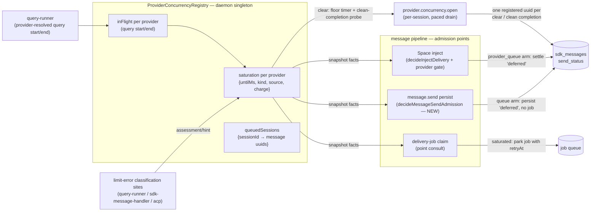

# Provider-Concurrency Admission Gate — Design (ADR 0004 Phase 2, chain C5)

Status: Proposed (design pass — doc only, no production code in this change)
Date: 2026-08-23
Task: #1313. Sources: `docs/reports/providers-area-survey.md` chain C5 (PR #2722) and
ADR 0004 Roadmap Phase 2 (`docs/adr/0004-superpipe-decision-pipelines.md`).
Consumes: the limit-error classifier from #2661 (merged 2026-08-22, `667d53a1`) and
the LLM classification tier from #2664 (merged 2026-08-23, `ae179427`); both are in
`dev` at this branch's base, so the chain's sequencing precondition is satisfied.

## Purpose

Design the **provider-concurrency admission gate**: a `decisionRun` admission gate in
the message pipeline that **queues a message before it enters the session's delivery
pipeline** when its provider is at a concurrency/account limit (e.g. GLM returning
429), instead of letting concurrent calls from sibling sessions pile up at the
provider. Per ADR 0004 Phase 2:

> The message-admission pipeline — sequenced behind the in-flight delivery-ordering
> fixes in the turn lifecycle — is also the landing spot for a provider-concurrency
> admission gate: when a provider (e.g. GLM) is at its concurrency limit, the
> admission decision queues the message before it is persisted to the session,
> instead of letting concurrent calls pile up at the provider.

This document specifies the **gate order**, **state ownership**, and **test plan**,
following ADR 0004's pilot conventions (characterization pins → pure core →
composition → apply; boundary caveats recorded; every core export production-consumed
or test-pinned).

## Scope

**In scope (v1):**

- A daemon-scoped, provider-keyed saturation registry fed by the existing limit-error
  classification sites, deriving waits from the existing backoff ladder
  (`fallback-recovery.ts`) and parsed resets (`limit-error-classifier.ts`).
- An admission gate at three decision points in the message pipeline: message-send
  persistence (new `decisionRun` core), the Space inject pipeline
  (`decideInjectDelivery`), and the delivery-job claim (a point consult).
- A wake path that promotes provider-queued messages when saturation lifts.
- The test plan and PR sequence for the implementation chain.

**Out of scope (recorded as follow-ups, not silently dropped):**

- **Configured per-provider concurrency caps** (proactive admission against a known
  N). v1 is reactive: saturation is armed by observed limit errors only. The
  in-flight counter the registry maintains is the seam a later cap plugs into.
- **Persisting saturation across restarts.** Registry state is in-memory; recovery
  from a restart during saturation is one re-armed 429 (bounded, see caveats).
- **Provider-level UI surfacing** (a `providers.changed`-style status event, picker
  badges). Queued messages are visible as pending (deferred) rows in the existing UI.
- **Falling back on provider queueing.** The per-session fallback ladder
  (`RateLimitWatchdog` → `selectNextFallback`) is unchanged; a queued session waits,
  it does not switch providers (rationale under Decisions).
- **`getModels()` probe 429s** (survey ACUTE-1 cause C) — those flow through provider
  listing, not the query error paths; chain C1 owns that neighborhood.
- **E2E coverage.** Daemon unit/integration suites only, per repository convention.

## Problem — current behavior (pinned facts)

All paths `packages/daemon` (D). Line numbers verified against this branch's base.

1. **Nothing provider-scoped exists between message send and the provider call.**
   `message.send` (`D/src/lib/rpc-handlers/session-handlers.ts:527-560`) validates
   only `deliveryMode` and session existence, then persists.
   `MessagePersistence.persist` decides the initial send status from exactly two
   facts — `queryMode === 'manual'` and a busy check of `processing | queued`
   (`D/src/lib/session/message-persistence.ts:180-192`) — then, for the dispatch
   case, the same transaction inserts the row as `'enqueued'` **and** a durable
   `message_delivery` job (`D/src/lib/agent/message-delivery-outbox.ts:36-82`). No
   provider, limit, or concurrency input exists at this seam.

2. **Cooldown state is per-session.** The limit pipeline is:
   query error / error result → `assessLimitError`
   (`D/src/lib/agent/query-runner.ts:1258`, `D/src/lib/agent/sdk-message-handler.ts:1215`,
   `D/src/lib/acp/acp-query-runner.ts:1009`) → `onRateLimitExhausted`
   (`D/src/lib/agent/agent-session.ts:1399-1405`) → that **one session's**
   `RateLimitWatchdog` (`D/src/lib/agent/rate-limit-watchdog.ts:75`, constructed per
   `AgentSession` at `agent-session.ts:380`), which arms a per-session cooldown
   (`ProcessingStateManager.setRateLimitCooldown`,
   `D/src/lib/agent/processing-state-manager.ts:225-236`) and retries that session's
   own episode. A 429 in session A does not stop session B on the same provider from
   dispatching a new query.

3. **The only cross-session limit aggregation is task-scoped.**
   `TaskAgentManager.limitedSessionsByTask`
   (`D/src/lib/space/runtime/task-agent-manager.ts:309`, fed by
   `session.rate_limit_pause` events at `:361-388`) restricts a Space *task* whose
   sub-sessions are limited. It keys by task, not provider, and reacts after
   sessions have already entered their own cooldown episodes.

4. **The only concurrency gate is global, cold-start-only, and provider-blind.**
   `SdkStartupConcurrencyGate` (`D/src/lib/agent/sdk-startup-gate.ts:35-111`,
   singleton `:113-118`; acquired at `query-runner.ts:713`) caps concurrent SDK
   subprocess *startups* at 3 and releases at the first SDK message
   (`query-runner.ts:820`). It bounds no steady-state provider load and carries no
   provider key. Survey area map: "Concurrency limits | none at provider level
   (ADR Phase 2 explicitly open); session-level startup gate only (#2552)".

5. **Even a session's own cooldown does not gate at persist.** During
   `rate_limit_cooldown`, `message.send` still persists `'enqueued'` + a delivery
   job (the busy check at `message-persistence.ts:181-182` does not include
   `rate_limit_cooldown`); the job is claimed and later **parked** by
   `driveDeliveryTurn`'s recovery-pending arm
   (`D/src/lib/agent/agent-session.ts:1762-1773` →
   `D/src/lib/job-handlers/message-delivery.handler.ts:121-123`). That
   persist-then-park churn — a claimed job, a session flipped to queued, a retry
   scheduled — is exactly the shape the admission gate removes, one layer earlier.

**Net effect (the GLM scenario):** N sessions on one GLM account; the account's
concurrency cap is exceeded; each session independently 429s, arms its own ≥10-minute
ladder cooldown, retries its own message, and possibly runs its own fallback chain —
while siblings keep firing fresh queries into the saturated provider. The provider
sees a thundering herd; the daemon sees N uncoordinated recovery episodes.

## Design overview



Three properties carry the design:

1. **One pure admission core, many interpreters.** A single pure function
   (`decideProviderAdmission`) decides admit vs queue; each decision point maps the
   decision onto its local mechanism (deferred row without a job / inject defer
   outcome / parked job / skipped retry). No decision point duplicates the policy.
2. **The queue is the existing durable one.** A provider-queued message is an
   ordinary `sdk_messages` row with `send_status = 'deferred'` — the state the
   manual query mode and busy-defer already produce, with existing UI, existing
   transitions (`delivery-status-routing.ts:17-27`), and existing replay paths.
   The registry adds only the wake linkage, plus a persisted origin marker so the
   linkage survives restarts.
3. **Claim-time re-check is the enforcement backstop.** Racing wakes and in-flight
   saturations are convergent because every delivery-job claim re-runs admission
   before any provider call — the same belt-and-braces shape as pilot 7's
   reservation behind the spawn gates.

## The admission gate — order

### P1 — `decideMessageSendAdmission` (new `decisionRun`, at persist)

Extract the inline status cascade at `message-persistence.ts:180-192` into a
`decisionRun` core (module `D/src/lib/agent/message-send-admission.ts`), composed of
ordered gates — first decision wins, per `decisionRun` semantics:

| # | Gate | Decision | Today's equivalent |
| --- | --- | --- | --- |
| 1 | `applyManualModeGate` | `queue` (reason `manual_mode`) | `isManualMode` → `'deferred'` |
| 2 | `applyBusyDeferGate` | `queue` (reason `busy_defer`) | `deliveryMode === 'defer' && isBusy` → `'deferred'` |
| 3 | `applyProviderConcurrencyGate` | `queue` (reason `provider_saturated`, `untilMs`) | **new** — today dispatches |
| 4 | `applyDispatchFinalGate` | `dispatch` | `'enqueued'` + outbox job |

The queue arm's interpreter is the **existing** non-outbox persist branch: insert the
row with `send_status='deferred'` (and, for the `provider_saturated` reason, the
`provider_queue` origin marker — see Queue and wake), publish
`messages.statusChanged`, and register the `{sessionId, messageUuid}` with the
registry. `shouldDispatchToQuery` is false, so no `message_delivery` job is created
and the session is not flipped to queued. This is precisely the manual-mode code
path today (`message-persistence.ts:227-229`); the gate adds a third way to reach it.

**"Before it is persisted to the session," interpreted.** The ADR's phrase is
realized as: the admission decision runs **before the persist transaction chooses
the send status and (critically) before the outbox job is enqueued** — a queued
message never enters the session's delivery pipeline, so nothing downstream of it
can start a provider call. The message *content* is still persisted immediately as a
`'deferred'` row: holding user input only in memory would lose it on crash, and the
deferred state already renders as a pending message the user can promote, defer, or
remove (`session.messages.promotePending` et al.,
`D/src/lib/rpc-handlers/session-handlers.ts:1058-1182`). Queueing-before-persistence
and durability are reconciled by queueing *as* the persisted-but-not-dispatched
state.

Gate order rationale: gates 1–2 reproduce today's precedence exactly (parity), and
the provider gate narrows only flows that today dispatch — the standard
pilot-convention placement for a new gate (pilot 5's arg-before-target rule: a new
gate inherits the documented order; existing outcomes are unchanged).

### P2 — provider gate in `decideInjectDelivery` (Space inject pipeline)

Insert `applyInjectProviderConcurrencyGate` into the existing composition
(`D/src/lib/agent/message-delivery-pipeline.ts:79-85`), giving the gate list:

```
applyAlreadyConsumedGate          → noop            (unchanged)
applyFailedReopenGate             — marks reopen    (unchanged)
applyDeferAdmissionGate           → defer           (unchanged: session cooldown /
                                                     parent-task-limited / defer-busy)
applyInjectProviderConcurrencyGate → provider_queue {untilMs}   (NEW)
applyInjectContextResetGate       → clear_*         (unchanged)
applyInjectFinalGate              → deliver         (unchanged)
```

Placement **after** the defer-admission gate is deliberate: `decideDeferAdmission`
(`D/src/lib/agent/message-ownership-gates.ts:112-126`) already defers for
session-scoped and task-scoped reasons; the provider gate only intercepts flows that
would otherwise deliver. A session already in its own cooldown keeps today's
behavior; a clean sibling session on a saturated provider — the GLM scenario — gets
the new arm. The `provider_queue` arm's interpreter reuses the existing defer
effects verbatim (`task-agent-manager.ts:3383-3398`:
`markDeliveryDeferredByUuid` / `settleDeliveryRowStatus` with status `'deferred'`)
and adds the registry registration; `settleDeliveryRowStatus`'s insert path carries
the `provider_queue` origin marker the same way. A distinct arm (rather than
folding a boolean into `decideDeferAdmission`) keeps the `untilMs` payload and the
wake obligation typed, and leaves the pinned defer decision table untouched.

### P3 — delivery-start consults (point decisions, enforcement)

**V2 (default):** consult `decideProviderAdmission` in the delivery handler at the
existing skip cluster (`D/src/lib/job-handlers/message-delivery.handler.ts:81-84`):
if the row is deliverable but the provider is saturated, return the same parked
shape the recovery-pending arm already produces (`requeue(job.id, retryAt)` →
`{ parked: 'provider_saturated', retryAt }`), with `retryAt` = the saturation
deadline (bounded by the same floor the session arm uses). Because the consult
sits ahead of `driveDeliveryTurn`, the session lock is never taken and no turn
state is touched; the interpreter obligation it adds is restoring an idle session
that persist had flipped to queued via `setQueuedIfIdle`
(`message-persistence.ts:224-226`) — pinned in the test plan.

**V1 (`HYPERNEO_MESSAGE_DELIVERY_V2=0`):** there is no job claim — chat dispatches
inline through `startQueryAndEnqueue` (`message-persistence.ts:271-275`), so the
V2 consult never runs and a message that passed P1 just before a sibling armed
saturation would start its provider call anyway. The same point consult therefore
sits at `startQueryAndEnqueue`'s entry; when saturated there is no job to park, so
the interpreter settles the row back to `'deferred'`
(`markDeliveryDeferredByUuid`) with the `provider_queue` origin marker and
registers it. Without this arm, the documented rollback mode
(`docs/features/message-delivery-v2.md`) would silently void the gate's
enforcement claim.

Together these are the backstop that makes races convergent:

- messages persisted before saturation armed (already `'enqueued'` + job),
- flush-path promotions that outran a re-saturation,
- sessions fed by the direct persist callers (`D/src/lib/rpc-handlers/index.ts:804,872`,
  `D/src/lib/space/runtime/space-runtime-service.ts:530,573`),
- the V1 inline path.

A point consult, not a pipeline: a single boolean-shaped precondition at each
delivery-start boundary, the ADR's sanctioned inline shape (pilot 4's point
decisions at the tail).

### P4 — watchdog auto-retry consult (point decision)

`executeRateLimitAutoRetry` (`D/src/lib/agent/agent-session.ts:931-970`) starts a
query directly, bypassing the message pipeline. It consults the same core; when
saturated, it skips the start, settles the episode's row back to `'deferred'`, and
registers it, letting the wake path re-promote. This closes the last uncoordinated
provider-call starter. (The fallback arm — `switchAndRetryForFallback` — is exempt
by construction: it has already switched the session's provider, and admission is
always evaluated against the *current* `session.config.provider`, so a
fallback-switched session escapes the saturated provider's queue on its next
admission.)

### The pure core

Module `D/src/lib/agent/provider-admission-gates.ts`:

```ts
interface ProviderAdmissionFacts {
  providerId: string;
  now: number;
  configuredCap: number | null;     // v1: always null (reactive only)
  inFlight: number;                 // registry snapshot
  saturationUntilMs: number | null; // registry snapshot
}
type ProviderAdmission =
  | { action: 'admit' }
  | { action: 'queue_until'; untilMs: number; reason: 'saturated' | 'slot_pressure' };
```

`decideProviderAdmission(facts)` is pure and synchronous (`.end`, never
`.endAsync` — Decision item 5): saturated → `queue_until` with the registry's
deadline; else if `configuredCap !== null && inFlight >= configuredCap` →
`queue_until` (reason `slot_pressure`, until = null-safe probe tick); else `admit`.
The two `apply*Gate` wrappers above adapt it to their pipelines' ctx shapes
(`(ctx) => ctx`, pass-through identity per Decision item 6(b)).

Hot-path check: this core runs once per message send / inject / job claim — the
same frequency class as `AgentMessageRouter`, whose awaited repository reads are
millisecond-scale against `decisionRun`'s ~2 µs. GO by the ADR benchmark; no
microtask-profile obligation beyond the sync-core rule (pinned anyway, cheaply, in
the send-admission suite).

## State ownership

### `ProviderConcurrencyRegistry` — daemon singleton

Module `D/src/lib/agent/provider-concurrency-registry.ts`; class with a
module-level singleton + `resetForTests()`, following the `getSdkStartupGate`
(`sdk-startup-gate.ts:113-120`) and provider-registry precedents. It is a class,
not a pipeline: it owns timers and an event publisher, and pipelines/cores receive
only its snapshots (the ADR resource-ownership rule).

Per **provider key = resolved provider id** (the same identity
`query-runner.ts:665` resolves and the fallback tried-keys use,
`` `${provider}/${model}` `` aside — concurrency caps attach to the account, hence
the provider id; one credential store entry per provider):

| State | Type | Written by | Read by |
| --- | --- | --- | --- |
| `saturation` | `{ untilMs, kind, source, armedAtMs, charge } \| null` per provider | `reportLimitError` (classification sites ×3) | admission facts, wake timer |
| `inFlight` | count per provider | `reportQueryStart` / `reportQueryEnd` (query-runner) | admission facts (cap follow-up), probe-clear condition |
| `queuedMessages` | `Map<sessionId, messageUuid[]>` (insertion-ordered) | queue arms (P1/P2/P4), delivery-start park (P3) | paced drain, registration cleanup |
| `lastCleanCompletionAtMs` + `chargeResetArmed` | per provider | `reportQueryEnd(success)`, clears | probe rule, charge reset |
| wake/floor timers | one unref'd `setTimeout` per armed provider | arming/clearing/refinement | — |

Everything is in-memory; no schema change, no new table.

### Saturation derivation — consuming the classifier and the ladder

`reportLimitError(providerId, assessment, now)` arms saturation from an
`assessLimitError` result (`LimitErrorAssessment` from
`D/src/lib/agent/limit-error-classifier.ts:114-183`), reusing exactly the
primitives #2661/#2664 shipped — **not** the watchdog's trip gate (whose
`give-up`/`surface-billing` arms encode episode-retry semantics the registry must
not inherit):

- `assessment.billingTerminal` → **do not arm** (no `untilMs` exists; the session
  watchdog owns surfacing the manual-retry pause).
- `resetAtMs` present (bounded by `MAX_RESET_HORIZON_MS`, the same check
  `decideRateLimitTrip` makes) → `untilMs = cooldownFromReset(resetAtMs).retryAtMs`
  (`limit-error-classifier.ts:185-194`). Authoritative: nothing clears it early.
- no reset → ladder: `computeCooldown(rawText, charge, now)`
  (`fallback-recovery.ts:188-221`; first step 10 min, jitter included). A **probe
  rule** may clear it early. The clear condition is: the floor
  (`PROBE_FLOOR_MS` ≈ 60 s) has elapsed since `armedAtMs` **and** a clean query
  completion has been observed (`reportQueryEnd(success)`, recorded as
  `lastCleanCompletionAtMs` — the completion may precede the arm: a slot-freed
  completion during the 429 episode is capacity evidence too). Both edges are
  evented: arming schedules a floor timer, and a clean completion while armed
  re-evaluates; whichever fires second clears, wakes the drain, and admits one
  probe message — if the provider is still capped, its 429 re-arms with the next
  charge. Without the completion-before-arm half, a concurrency cap whose only
  in-flight requests all finished before the floor would impose the full jittered
  10-minute first step for want of any later completion. Self-correcting, and
  honest about the classifier's limit: `assessLimitError` cannot distinguish a
  concurrency-cap 429 from an RPM 429 (the GLM brackets `[1305]/[1308]/[1313]` and
  the framed-429 regex are limit markers, not concurrency-specific), so short
  concurrency waits must not pay the full 10-minute first ladder step forever.
- **LLM refinements feed the registry.** The watchdog's refinement tier
  (`fireLlmRefinement`, `rate-limit-watchdog.ts:256-317`) can upgrade an ambiguous
  ladder-armed error to a multi-hour parsed reset — but as wired it extends only
  the originating session's cooldown. The accepted refinement is forwarded to the
  registry (`reportRefinedReset(providerId, resetAtMs)` from the same wiring that
  owns `classifyUnknownLimit`): it replaces a ladder-derived `untilMs` (never
  shortening a structured/parsed reset) and reschedules the wake timer, so sibling
  sessions are not woken into a limit the system already knows is still active.
  This is the design's full consumption of #2664's tier, not just its
  deterministic half.

**Charging is per saturation episode, not per report.** N sibling sessions 429ing
within the same window produce N `reportLimitError` calls; reports arriving while
saturated extend `untilMs` to the max but do **not** advance `charge` — otherwise
ten concurrent 429s would jump straight to the ladder's 4-hour cap
(`ladderIndex = min(retryCount, lastIndex)`) off one transient blip. `charge`
advances when arming from a clear state, and resets on the **first clean
completion observed after any clear** — probe-clear *or* timer-expiry (a
`chargeResetArmed` flag set at clear time; the next clean completion consumes it).
Resetting only on probe-clears would miss the common path: timer expiry clears
first, the drained request then succeeds on an already-clear registry, and nothing
resets — later unrelated episodes would march to the 4-hour cap. Mirrors the
watchdog's `retryCount` / `freeWait` distinction at provider scope.

### Queue and wake

- **Registering:** every queue arm records `{sessionId → [messageUuid]}` (insertion
  order = drain order). Scope is per message, not per session, so the wake never
  promotes a user's deliberately deferred (manual-mode) rows —
  `handleQueryTrigger`'s blanket deferred→enqueued flip
  (`D/src/lib/agent/query-mode-handler.ts:39-108`) is *not* the wake path. The
  queue arm also persists the row with a distinguishable **origin marker
  (`origin: 'provider_queue'`)** — an existing column on `saveUserMessage`, no
  schema change — so the linkage survives restarts (below).
- **Waking, routed per session:** the internal event bus routes by
  `data.sessionId ?? data.namespaceId ?? __global__`
  (`D/src/lib/internal-event-bus.ts:116-135`), while session handlers are
  subscribed under their session id — so the registry does **not** publish one
  provider-wide event (it would land in `__global__` and reach zero per-session
  subscribers). When saturation clears, the registry enumerates its registered
  session ids and publishes `provider.concurrency.open {sessionId, providerId}`
  **once per registered session**; `event-subscription-setup.ts` (the wiring that
  binds `query.trigger` at `:103-110`) subscribes each session, and the handler
  replays the session's registered uuids through the existing per-uuid promotion
  path (the mechanism behind `session.messages.promotePending`,
  `session-handlers.ts:1126-1182`: deferred → enqueued → delivery job). A single
  `__global__` subscriber enumerating the registry is the equivalent alternative;
  per-session publish is chosen because the registry already holds exactly that
  set.
- **Paced drain — one at a time.** A clear promotes exactly **one** registered
  message (the oldest); each clean completion of a drained message promotes the
  next; a 429 during the drain re-arms saturation and the remainder stays queued.
  Releasing the whole backlog at once would let every promoted message pass the
  claim consult on the clear snapshot and start before the first re-arming 429 —
  recreating the herd the gate exists to prevent (v1 has no configured cap to
  absorb it). Fresh `message.send`s during a drain are not backlog; they admit as
  single arrivals, and their 429s re-arm saturation for the remainder.
- **Restart reconstruction:** the origin marker rebuilds the queue. At session
  startup, beside `scheduleInitialPendingMessageReplay`
  (`agent-session.ts:671-682`), rows with `origin: 'provider_queue'` are
  re-registered and re-admitted through the promotion path; rows without the
  marker (manual-mode, user-deferred) are untouched. Saturation *state* is still
  lost (fresh registry = no saturation), so the first drained message pays the
  discovery 429 and re-arms — bounded, one charge.
- **Deregistering:** lazily — after a drain promotion that finds no deliverable
  registered rows for the session, on terminal row status, and on session destroy.
  Bounded memory by construction.

### What does NOT change

- `RateLimitWatchdog` and `ProcessingStateManager` keep owning the *session's*
  cooldown, banner, fallback ladder, and episode retries, unchanged. The registry
  is additive provider-scoped state consulted at admission; it never writes session
  state.
- `TaskAgentManager.limitedSessionsByTask` keeps its task-scoped role (it reacts to
  sessions that did hit limits; the gate makes those rarer, it does not replace
  them).
- The startup gate (`sdk-startup-gate.ts`) stays global and cold-start-only —
  orthogonal load shaping (unifying the two gates is a recorded follow-up, not a
  v1 concern).
- `decideDeferAdmission` and its pinned decision table are untouched.

## Decisions (with rationale)

1. **Queue, don't switch.** Provider queueing does not engage the fallback ladder:
   a fallback switch persists a new `session.config.model/provider`
   (`model-switch-handler.ts:212-273`) — a wrong response to a transient
   concurrency cap. Waiting preserves the session's configured model; users who
   prefer escape keep their configured chains, which the session's *own* 429 still
   triggers exactly as today.
2. **All classified limits arm the registry** (`rate_limit` and `usage_limit`
   alike): an account-wide GLM 5-hour cap 429s sibling sessions just as hard; the
   kind only changes clearability (reset-bearing usage limits are authoritative,
   ladder-armed rate limits are probe-clearable).
3. **Reactive v1.** No configured caps; the registry never blocks on its own — it
   answers admission questions and publishes wakes. A blocking semaphore at the
   query-runner was rejected: it would duplicate queue policy in a second place and
   hide saturation behind silently-blocked queries; claim-time consults at each
   message-pipeline decision point are the correct single home.
4. **The registry is non-blocking bookkeeping at the query seam.**
   `reportQueryStart/End` maintain `inFlight` (and the clean-completion signal for
   the probe rule) at the exact sites the startup permit already brackets
   (`query-runner.ts:713` acquire … `:820/:867/:1316` release) — but keyed by
   `resolvedProviderId` and held for the whole query, not just the cold-start
   window.

## Sequencing

- **Behind #2661 / #2664:** satisfied — both merged to `dev` and contained in this
  branch's base. The design consumes their exported surface
  (`assessLimitError`, `cooldownFromReset`, `LimitRetryHint`,
  `computeCooldown`/ladder); no further coupling.
- **Versus chain I (pilot 8, pending-drain + injection shell, tasks #1243+):** the
  ADR sequences the message-admission pipeline behind "the in-flight
  delivery-ordering fixes in the turn lifecycle" — chain I, not yet landed (pilot 8
  is reserved). This design targets the *current* seams (`MessagePersistence`,
  `decideInjectDelivery`, the delivery handler) and its cores take plain inputs, so
  chain I can adopt or relocate the consults without re-deriving policy. If chain I
  lands first, P2's gate list moves with `decideInjectDelivery` wherever it lands;
  P1's core is unaffected (persist seam is not chain I's territory). Implementation
  order should follow whichever chain lands first; the cores are seam-agnostic by
  construction.
- **Versus chain C1 (stuck-provider recovery):** disjoint files except
  `model-service`/provider listing, which this design does not touch. C1-PR3's
  provider retry timers and this registry are siblings (both daemon-scoped
  provider health state) but independent; unification, if ever, is a follow-up.

## PR plan (pilot conventions)

| PR | Scope | Contents |
| --- | --- | --- |
| **C5-PR1 (pins)** | Characterization | Pin today's matrix: (a) the persist status decision at `message-persistence.ts:180-192` (manual/busy/defer × outbox-job presence, archived race); (b) the sibling non-communication — session A 429 → A cooldown armed, session B on the same provider still persists `'enqueued'` + job and starts a query; (c) the recovery-pending park (`agent-session.ts:1762-1773` → handler `:121-123`); (d) the `decideInjectDelivery` decision table extension for the arms P2 touches. |
| **C5-PR2 (extract, parity)** | P1 core | Extract `decideMessageSendAdmission` + gates (`message-send-admission.ts`), interpret at `MessagePersistence.persist` with the provider gate **absent** (gate list: manual → busy → dispatch). Zero behavior change; PR1 pins green unchanged; every export production-consumed (knip clean, no dead copy left inline). |
| **C5-PR3 (apply)** | Gate + registry + wiring | Add `provider-admission-gates.ts` (core + gate wrappers) and `provider-concurrency-registry.ts`; insert the provider gate into P1 and `decideInjectDelivery`; add the delivery-start consults — V2 claim and V1 `startQueryAndEnqueue` (P3) — and the retry consult (P4); wire `reportLimitError`/`reportQueryStart(End)`/`reportRefinedReset`; the `provider_queue` origin marker with its startup reconstruction; per-session wake publishes + paced drain + subscription. Flip PR1's sibling pin to the new behavior; add the scenario suites. |
| **C5-PR4 (sweep + record)** | Docs | ADR 0004 Phase-2 note (caveats below), survey C5 status update, this doc's status → Implemented; dead-copy sweep; knip/oxlint/tsc/format/no-comments clean. |

Rough cost (pilot-style ledger): cores ≈ +180 lines (send-admission ~70,
admission-gates ~60, registry ~250 incl. timers/wake), interpreter deltas ≈ ±120,
tests ≈ +1,300 across four PRs. The value, as in pilots 4/9, is expected to be
incident-shaped: writing the PR1 pins against two live sessions is the first time
the sibling non-communication is asserted anywhere.

## Test plan

Following Decision item 6 (parity harness + gate unit tests + interpreter coverage
by pre-existing suites):

1. **Decision tables — `provider-admission-gates.test.ts`:** the full facts matrix
   (saturated with reset / saturated ladder / cap-null vs set / inFlight boundary),
   `untilMs` propagation (reset + `RESET_BUFFER_MS`; ladder step + jitter bounds
   via injected jitter/now), precedence (`saturated` beats `slot_pressure`; admit
   pass-through), and per-gate identity pins (`gate(ctx) === ctx`).
2. **Decision table — `message-send-admission.test.ts`:** the four-arm table and
   precedence (manual beats busy beats provider beats dispatch), parity against the
   PR1-pinned inline matrix for the three pre-existing arms; the provider arm's
   `untilMs` payload; sync-core pin (no async executor).
3. **Registry suite — `provider-concurrency-registry.test.ts`:** arming from reset
   vs ladder; **episode charging** (10 concurrent reports → charge 1, `untilMs` =
   max); charge reset after **both** clear kinds (probe-clear and timer-expiry,
   via the `chargeResetArmed` flag — the timer path is the one that would silently
   march to the 4-hour cap); billing-terminal exclusion; probe rule both-edges
   (completion before arm + floor timer; completion after floor; no clear before
   floor; no clear for reset-bearing saturation); `reportRefinedReset` replaces a
   ladder `untilMs` and never shortens a parsed one; **wake routing** — one
   session-scoped `provider.concurrency.open` per registered session (a
   provider-wide payload reaches zero per-session subscribers;
   `internal-event-bus.ts:116-135`); **paced drain** — one uuid promoted per
   clear, the next per clean completion, drain halted by a re-arming 429;
   registration add/lookup/lazy cleanup; timer lifecycle (destroy clears;
   unref'd); clock and jitter injection throughout (the pilot-9 purity
   convention: every time check against an injected `now`).
4. **Interpreter — persist:** provider-saturated `message.send` → row persisted
   `'deferred'`, **no** `message_delivery` job, no `setQueuedIfIdle`,
   `messages.statusChanged` published, registry registered; unsaturated → outbox
   path byte-for-byte today's behavior (PR1 pins).
5. **Interpreter — inject:** `provider_queue` arm settles the row deferred and
   registers; precedence over deliver; parity of the earlier arms (pipeline suite
   extension).
6. **Interpreter — delivery-start parks (P3):** V2 — saturated claim → job
   requeued at `retryAt`, session restored to idle if persist had queued it, no
   `driveDeliveryTurn` call; after clear, re-claim delivers. V1 — saturated
   `startQueryAndEnqueue` → no query start, row settled back to `'deferred'` with
   the `provider_queue` origin marker, registered; after clear, re-dispatch
   delivers.
7. **Interpreter — retry consult (P4):** saturated auto-retry skips the start,
   settles the row deferred, registers; fallback-switched session (different
   provider) unaffected.
8. **Scenario — the GLM herd, mocked SDK:** two sessions, one provider; A's query
   429s with a GLM-bracket message → registry armed (charge 1) → B's subsequent
   `message.send` queues at persist → probe/timer clears → paced drain promotes
   B's uuid → row deferred→enqueued→submitted→consumed → exactly one provider
   query start for B (stubbed start count); a many-session variant pins the drain
   pace (N queued → one start, then one per clean completion). Restart variant:
   fresh registry (no saturation) → the `provider_queue` marker re-registers B's
   row at startup → first drained message 429s → re-arms at charge 1 (not 2) — the
   bounded-recovery pin, now with the marker-based reconstruction asserted.
9. **No-regression:** the pre-existing agent-session / delivery / inject suites
   pass unchanged except the PR1 pins deliberately flipped in PR3 — the parity
   proof, as in every pilot.

## Boundary caveats (recorded, per pilot convention)

1. **Restart loses saturation state, not queue linkage.** The `provider_queue`
   origin marker rebuilds the registration at startup (see Queue and wake), so
   queued rows are re-admitted; only `untilMs` is lost, and the first drained
   message pays one discovery 429 at charge 1 to relearn it. Durable saturation
   state (persisted `untilMs`) was considered and rejected for v1 — no consumer
   exists for it, and the marker + one bounded re-arm cover the user-visible harm.
2. **The persist seam still ignores the session's own cooldown.** The busy check at
   `message-persistence.ts:181-182` excludes `rate_limit_cooldown`; a message sent
   during the session's own cooldown still persists `'enqueued'` and parks at claim
   (today's behavior, now pinned). Folding session-cooldown into gate 2 is a
   one-line extension of P1 with its own pins — deliberately not smuggled into this
   chain's parity extraction.
3. **The wake path trusts the claim-time consult.** A wake that races a
   re-saturation promotes rows to `'enqueued'` whose jobs then park (P3) — one
   bounded job churn per race, never a provider call. Acceptable by design;
   the alternative (wake-time CAS on saturation) duplicates the consult.
4. **`provider_queue` at inject does not precede session-scoped defers.** A session
   in its own cooldown defers with today's reason and is not wake-registered; its
   own watchdog owns recovery. Recorded so the gate list is not read as a complete
   saturation policy — same caveat class as pilot 7's parked-task asymmetry.
5. **The registry is provider-keyed, not endpoint- or model-keyed.** Custom
   endpoints (many base URLs under one provider id) and per-model caps share one
   saturation record. The key is the seam a refinement changes; v1 accepts the
   coarse key because credentials — the thing concurrency caps attach to — are
   per-provider.
6. **`inFlight` is bookkeeping until caps exist.** v1 never gates on it
   (`configuredCap` is null); it exists so the cap follow-up changes one constant
   plus a settings reader, and so the probe rule has a completion signal.
7. **Steer-role messages ride the turn's admission.** A steer enqueued behind a
   live turn on a saturated provider is not separately gated (it cannot start a
   provider call); its claim consult is the P3 one. Recorded to preempt a
   "why doesn't steer check" review round.
8. **P3's consult does not touch `rate_limit_cooldown` session state** — a
   parked-for-provider job leaves the session idle, not cooldown; the session's
   watchdog never learns about sibling 429s. That isolation is deliberate (the
   session has no episode to recover); the observability follow-up owns surfacing
   provider state to the UI.

## ADR classification

- P1/P2 are **P3 guard/validation gates + P7 functional sandwich** composed with
   the blessed `decisionRun` combinator — the ADR's named landing spot for Phase 2.
  P3/P4 are point decisions over the same pure core (sanctioned; no pipeline
  ceremony at claim boundaries).
- The registry is a class-owned state store with injected clock/jitter — pipelines
  receive snapshots only (resource-ownership rule). Not `stagedRun`: no multi-write
  transactional effect sequences exist here; each interpreter site owns its single
  write through existing guarded mechanisms (delivery-status transitions, job
  requeue).
- Hot-path: GO by the ADR benchmark (per-message frequency class, ~2 µs core).
- Promotion rule: if a second provider-scoped admission surface appears (the
  configured-cap follow-up is the named candidate), extract any recurring raw shape
  per the rule of three; v1 adds no new combinator.

## References

- ADR 0004 Roadmap Phase 2 and pilot conventions:
  `docs/adr/0004-superpipe-decision-pipelines.md` (Phase 2 entry; Decision items
  1–7; pilots 4/7/9 for the gate/point-decision/caveat patterns).
- Survey: `docs/reports/providers-area-survey.md` — C5 (ranked chains), area map
  row "Concurrency limits", GLM 429 causes.
- Classifier + ladder: `packages/daemon/src/lib/agent/limit-error-classifier.ts`,
  `fallback-recovery.ts`, `rate-limit-watchdog-gates.ts` (#2661, #2664).
- Message pipeline seams: `message-persistence.ts`, `message-delivery-pipeline.ts`,
  `message-ownership-gates.ts`, `message-delivery.handler.ts`,
  `delivery-status-routing.ts`, `query-mode-handler.ts`.
- Concurrency-gate precedent: `sdk-startup-gate.ts` (#2552).
