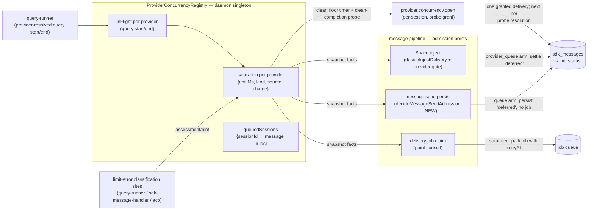

# Provider-Concurrency Admission Gate — Design (ADR 0004 Phase 2, chain C5)

Status: Proposed (design pass — doc only, no production code in this change)
Date: 2026-08-23
Task: #1313. Sources: `docs/reports/providers-area-survey.md` chain C5 (PR #2722) and
ADR 0004 Roadmap Phase 2 (`docs/adr/0004-superpipe-decision-pipelines.md`).
Consumes: the limit-error classifier from #2661 (merged 2026-08-22, `667d53a1`) and
the LLM classification tier from #2664 (merged 2026-08-23, `ae179427`); both are in
`dev` at this branch's base, so the chain's sequencing precondition is satisfied.

## Purpose

Design the **provider-concurrency admission gate**: a `decisionRun` admission gate in
the message pipeline that **queues a message before it enters the session's delivery
pipeline** when its provider is at a concurrency/account limit (e.g. GLM returning
429), instead of letting concurrent calls from sibling sessions pile up at the
provider. Per ADR 0004 Phase 2:

> The message-admission pipeline — sequenced behind the in-flight delivery-ordering
> fixes in the turn lifecycle — is also the landing spot for a provider-concurrency
> admission gate: when a provider (e.g. GLM) is at its concurrency limit, the
> admission decision queues the message before it is persisted to the session,
> instead of letting concurrent calls pile up at the provider.

This document specifies the **gate order**, **state ownership**, and **test plan**,
following ADR 0004's pilot conventions (characterization pins → pure core →
composition → apply; boundary caveats recorded; every core export production-consumed
or test-pinned).

## Scope

**In scope (v1):**

- A daemon-scoped, provider-keyed saturation registry fed by the existing limit-error
  classification sites (plus the provider-retry branch), deriving waits from the
  existing backoff ladder (`fallback-recovery.ts`) and parsed resets
  (`limit-error-classifier.ts`).
- An admission gate at the message pipeline's decision points: message-send
  persistence (new `decisionRun` core), the Space inject pipeline
  (`decideInjectDelivery`), delivery start in both delivery modes (V2 claim, V1
  inline start — point consults), and the watchdog auto-retry.
- A wake path that promotes provider-queued messages when saturation lifts, paced
  by a one-at-a-time probing release.
- The test plan and PR sequence for the implementation chain.

**Out of scope (recorded as follow-ups, not silently dropped):**

- **Configured per-provider concurrency caps** (proactive admission against a known
  N). v1 is reactive: saturation is armed by observed limit errors only. The
  in-flight counter the registry maintains is the seam a later cap plugs into.
- **Persisting saturation across restarts.** Registry state is in-memory; recovery
  from a restart during saturation is one re-armed 429 (bounded, see caveats).
- **Provider-level UI surfacing** (a `providers.changed`-style status event, picker
  badges). Queued messages are visible as pending (deferred) rows in the existing UI.
- **Falling back on provider queueing.** The per-session fallback ladder
  (`RateLimitWatchdog` → `selectNextFallback`) is unchanged; a queued session waits,
  it does not switch providers (rationale under Decisions).
- **`getModels()` probe 429s** (survey ACUTE-1 cause C) — those flow through provider
  listing, not the query error paths; chain C1 owns that neighborhood.
- **E2E coverage.** Daemon unit/integration suites only, per repository convention.

## Problem — current behavior (pinned facts)

All paths `packages/daemon` (D). Line numbers verified against this branch's base.

1. **Nothing provider-scoped exists between message send and the provider call.**
   `message.send` (`D/src/lib/rpc-handlers/session-handlers.ts:527-560`) validates
   only `deliveryMode` and session existence, then persists.
   `MessagePersistence.persist` decides the initial send status from exactly two
   facts — `queryMode === 'manual'` and a busy check of `processing | queued`
   (`D/src/lib/session/message-persistence.ts:180-192`) — then, for the dispatch
   case, the same transaction inserts the row as `'enqueued'` **and** a durable
   `message_delivery` job (`D/src/lib/agent/message-delivery-outbox.ts:36-82`). No
   provider, limit, or concurrency input exists at this seam.

2. **Cooldown state is per-session.** The limit pipeline is:
   query error / error result → `assessLimitError`
   (`D/src/lib/agent/query-runner.ts:1258`, `D/src/lib/agent/sdk-message-handler.ts:1215`,
   `D/src/lib/acp/acp-query-runner.ts:1009`) → `onRateLimitExhausted`
   (`D/src/lib/agent/agent-session.ts:1399-1405`) → that **one session's**
   `RateLimitWatchdog` (`D/src/lib/agent/rate-limit-watchdog.ts:75`, constructed per
   `AgentSession` at `agent-session.ts:380`), which arms a per-session cooldown
   (`ProcessingStateManager.setRateLimitCooldown`,
   `D/src/lib/agent/processing-state-manager.ts:225-236`) and retries that session's
   own episode. A 429 in session A does not stop session B on the same provider from
   dispatching a new query.

3. **The only cross-session limit aggregation is task-scoped.**
   `TaskAgentManager.limitedSessionsByTask`
   (`D/src/lib/space/runtime/task-agent-manager.ts:309`, fed by
   `session.rate_limit_pause` events at `:361-388`) restricts a Space *task* whose
   sub-sessions are limited. It keys by task, not provider, and reacts after
   sessions have already entered their own cooldown episodes.

4. **The only concurrency gate is global, cold-start-only, and provider-blind.**
   `SdkStartupConcurrencyGate` (`D/src/lib/agent/sdk-startup-gate.ts:35-111`,
   singleton `:113-118`; acquired at `query-runner.ts:713`) caps concurrent SDK
   subprocess *startups* at 3 and releases at the first SDK message
   (`query-runner.ts:820`). It bounds no steady-state provider load and carries no
   provider key. Survey area map: "Concurrency limits | none at provider level
   (ADR Phase 2 explicitly open); session-level startup gate only (#2552)".

5. **Even a session's own cooldown does not gate at persist.** During
   `rate_limit_cooldown`, `message.send` still persists `'enqueued'` + a delivery
   job (the busy check at `message-persistence.ts:181-182` does not include
   `rate_limit_cooldown`); the job is claimed and later **parked** by
   `driveDeliveryTurn`'s recovery-pending arm
   (`D/src/lib/agent/agent-session.ts:1762-1773` →
   `D/src/lib/job-handlers/message-delivery.handler.ts:121-123`). That
   persist-then-park churn — a claimed job, a session flipped to queued, a retry
   scheduled — is exactly the shape the admission gate removes, one layer earlier.

**Net effect (the GLM scenario):** N sessions on one GLM account; the account's
concurrency cap is exceeded; each session independently 429s, arms its own ≥10-minute
ladder cooldown, retries its own message, and possibly runs its own fallback chain —
while siblings keep firing fresh queries into the saturated provider. The provider
sees a thundering herd; the daemon sees N uncoordinated recovery episodes.

## Design overview



Three properties carry the design:

1. **One pure admission core, many interpreters.** A single pure function
   (`decideProviderAdmission`) decides admit vs queue; each decision point maps the
   decision onto its local mechanism (deferred row without a job / inject defer
   outcome / parked job / skipped retry). No decision point duplicates the policy.
2. **The queue is the existing durable one.** A provider-queued message is an
   ordinary `sdk_messages` row with `send_status = 'deferred'` — the state the
   manual query mode and busy-defer already produce, with existing UI, existing
   transitions (`delivery-status-routing.ts:17-27`), and existing replay paths.
   The registry adds only the wake linkage, plus a persisted `queue_reason` marker so
   the linkage survives restarts.
3. **Claim-time re-check is the enforcement backstop.** Racing wakes and in-flight
   saturations are convergent because every delivery-job claim re-runs admission
   before any provider call — the same belt-and-braces shape as pilot 7's
   reservation behind the spawn gates.

## The admission gate — order

### P1 — `decideMessageSendAdmission` (new `decisionRun`, at persist)

Extract the inline status cascade at `message-persistence.ts:180-192` into a
`decisionRun` core (module `D/src/lib/agent/message-send-admission.ts`), composed of
ordered gates — first decision wins, per `decisionRun` semantics:

| # | Gate | Decision | Today's equivalent |
| --- | --- | --- | --- |
| 1 | `applyManualModeGate` | `queue` (reason `manual_mode`) | `isManualMode` → `'deferred'` |
| 2 | `applyBusyDeferGate` | `queue` (reason `busy_defer`) | `deliveryMode === 'defer' && isBusy` → `'deferred'` |
| 3 | `applyProviderConcurrencyGate` — skipped when the session has a live turn (`liveTurnActive`): the send is a *steer candidate* (the outbox resolves the steer role later, and the claim-level `liveTurnSteer` bypass governs); queueing it here would park input the live turn is waiting on | `queue` (reason `provider_saturated`, `untilMs`) | **new** — today dispatches |
| 4 | `applyDispatchFinalGate` | `dispatch` | `'enqueued'` + outbox job |

The queue arm's interpreter is the **existing** non-outbox persist branch: insert the
row with `send_status='deferred'` (and, for the `provider_saturated` reason, the
`queue_reason` marker — see Queue and wake), publish `messages.statusChanged`, and
register the `{sessionId, messageUuid}` with the registry. No `message_delivery` job
is created and the session is not flipped to queued — but unlike the manual-mode
path it extends, the provider-queue arm **still publishes `message.persisted` with
`skipQueryStart: true`** (the event fires only under `shouldDispatchToQuery` today,
`message-persistence.ts:276-294`, and it is what clears the submitted composer
draft and enqueues initial title generation — suppressing it would leave stale
composer state on every saturated send; the subscriber's `skipQueryStart` guard
already prevents a query start). One side effect is deliberately deferred:
`needsWorkspaceInit` is published **false** for a provider-queued send, because
title generation runs its own SDK query outside the message pipeline
(`session-title.handler.ts:4-20` → `generateTitleWithSdk`,
`session-lifecycle.ts:926-979`, which invokes the SDK directly) — N new
sessions on a saturated account would otherwise each fire a title query the
gate never sees. Re-flagging and admission are two separate rules:

- **Re-flag** happens only after the granted delivery's probe turn completes
  cleanly (not at promotion, which happens while the provider is still
  probing), when the session still needs a title.
- **The title job has its own admission interpreter.** Title generation is
  lowest-priority background work: it admits **only when the account is fully
  open — not saturated and not probing** — and never holds or competes for a
  probe grant (its consult uses the synthetic identity
  `(sessionId, 'title')`; one such job per session, idempotent). The consult
  sits at `handleSessionTitleGeneration`'s entry, before any lifecycle work;
  denial returns the same parked shape P3 uses — `requeue(job.id, retryAt)`
  with `retryAt` = the saturation deadline, or the probe tick while probing —
  so the job retries through the ordinary queue instead of throwing into the
  job-queue default retry. This keeps background titling strictly behind the
  user-visible drain: chat deliveries consume grants and wake each other;
  title jobs wait for full openness. This is the
manual-mode code path today
(`message-persistence.ts:227-229`) plus that event; the gate adds a third way to
reach it.

**"Before it is persisted to the session," interpreted.** The ADR's phrase is
realized as: the admission decision runs **before the persist transaction chooses
the send status and (critically) before the outbox job is enqueued** — a queued
message never enters the session's delivery pipeline, so nothing downstream of it
can start a provider call. The message *content* is still persisted immediately as a
`'deferred'` row: holding user input only in memory would lose it on crash, and the
deferred state already renders as a pending message the user can promote, defer, or
remove (`session.messages.promotePending` et al.,
`D/src/lib/rpc-handlers/session-handlers.ts:1058-1182`). Queueing-before-persistence
and durability are reconciled by queueing *as* the persisted-but-not-dispatched
state.

Gate order rationale: gates 1–2 reproduce today's precedence exactly (parity), and
the provider gate narrows only flows that today dispatch — the standard
pilot-convention placement for a new gate (pilot 5's arg-before-target rule: a new
gate inherits the documented order; existing outcomes are unchanged).

### P2 — provider gate in `decideInjectDelivery` (Space inject pipeline)

Insert `applyInjectProviderConcurrencyGate` into the existing composition
(`D/src/lib/agent/message-delivery-pipeline.ts:79-85`). Like P1, the gate is
**skipped when the target session has a live turn** (`liveTurnActive`): an
immediate injection into a processing session is a steer candidate whose role
the delivery layer resolves after admission, and queueing it here could
withhold input the active turn needs to finish and clear saturation — the same
pre-gate ordering obligation as P1. Gate list:

```
applyAlreadyConsumedGate          → noop            (unchanged)
applyFailedReopenGate             — marks reopen    (unchanged)
applyDeferAdmissionGate           → defer           (unchanged: session cooldown /
                                                     parent-task-limited / defer-busy)
applyInjectProviderConcurrencyGate → provider_queue {untilMs}   (NEW)
applyInjectContextResetGate       → clear_*         (unchanged)
applyInjectFinalGate              → deliver         (unchanged)
```

Placement **after** the defer-admission gate is deliberate: `decideDeferAdmission`
(`D/src/lib/agent/message-ownership-gates.ts:112-126`) already defers for
session-scoped and task-scoped reasons; the provider gate only intercepts flows that
would otherwise deliver. A session already in its own cooldown keeps today's
behavior; a clean sibling session on a saturated provider — the GLM scenario — gets
the new arm. The `provider_queue` arm's interpreter reuses the existing defer
effects verbatim (`task-agent-manager.ts:3383-3398`:
`markDeliveryDeferredByUuid` / `settleDeliveryRowStatus` with status `'deferred'`)
and adds the registry registration; `settleDeliveryRowStatus`'s insert path carries
the `queue_reason` marker the same way. A distinct arm (rather than
folding a boolean into `decideDeferAdmission`) keeps the `untilMs` payload and the
wake obligation typed, and leaves the pinned defer decision table untouched.

### P3 — delivery-start consults (point decisions, enforcement)

**V2 (default):** consult `decideProviderAdmission` in the delivery handler at the
existing skip cluster (`D/src/lib/job-handlers/message-delivery.handler.ts:81-84`):
if the row is deliverable but the provider is saturated **or probing without a
grant for this delivery**, return the same parked shape the recovery-pending arm
already produces (`requeue(job.id, retryAt)` →
`{ parked: 'provider_saturated', retryAt }`), with `retryAt` = the saturation
deadline for the first park and a short probe tick afterwards — parked jobs
re-consult on every claim, so the probing release admits them one probe at a time
instead of releasing a 64-wide claim wave at the shared deadline
(`D/src/app.ts:307-318`). Because the consult sits ahead of `driveDeliveryTurn`,
the session lock is never taken and no turn state is touched; the interpreter
obligation it adds is restoring an idle session that persist had flipped to queued
via `setQueuedIfIdle` (`message-persistence.ts:224-226`) — pinned in the test plan.

**V1 (`HYPERNEO_MESSAGE_DELIVERY_V2=0`) and every direct-start path:** the V1
surface is not one call site — `startQueryAndEnqueue`
(`message-persistence.ts:271-275`), `deliverRowsViaMemoryQueue`, and the V1 branch
of `deliverInjectedMessage` all reach `ensureQueryStarted()` directly
(`D/src/lib/agent/query-lifecycle-manager.ts:432-525`). Rather than enumerating
them, the consult sits at **`ensureQueryStarted` itself — the common provider-start
boundary every delivery path crosses** — with the handler-level V2 consult kept as
the cheaper early park. `ensureQueryStarted` today takes only an optional
`AbortSignal`, and `deliverRowsViaMemoryQueue` calls it once before iterating a
batch — so the boundary gains an **optional delivery-identity parameter** (the
message uuid / batch head the start serves): it is what names the grant holder
on admit and the row to defer-and-register on denial, and batch callers pass
their per-uuid identity (calling the boundary per row where they currently call
it once). **Identity-less callers are exempt**: `ensureQueryStarted` is not
exclusively a delivery boundary — `AskUserQuestionHandler` calls it before
injecting an unpersisted tool result into the live query, and context-reset /
restart paths call it with no message row; those starts ride existing
turn-lifecycle mechanics (no new admission), and their limit errors still arm
the registry through the classifier like any others. A denial there has no job to park: the delivery settles its row back to
`'deferred'` with the `queue_reason` marker and registers it (V2 surfaces this as
the recovery-pending park instead, upstream). A delivery holding the probe grant
passes. Without the boundary consult, startup/manual pending replay and a Space
injection that passed P2 just before a sibling armed saturation could still start
their provider calls — voiding the enforcement claim in the documented rollback
mode (`docs/features/message-delivery-v2.md`) and the replay paths alike.

Together these are the backstop that makes races convergent:

- messages persisted before saturation armed (already `'enqueued'` + job),
- flush-path promotions that outran a re-saturation,
- sessions fed by the direct persist callers (`D/src/lib/rpc-handlers/index.ts:804,872`,
  `D/src/lib/space/runtime/space-runtime-service.ts:530,573`),
- the V1 inline path.

A point consult, not a pipeline: a single boolean-shaped precondition at each
delivery-start boundary, the ADR's sanctioned inline shape (pilot 4's point
decisions at the tail).

### P4 — watchdog auto-retry consult (point decision)

`executeRateLimitAutoRetry` (`D/src/lib/agent/agent-session.ts:931-970`) starts a
query directly, bypassing the message pipeline. It consults the same core; when
saturated, it skips the start, settles the episode's row back to `'deferred'` with
the marker, and registers it, letting the wake path re-promote. The retry
callback's boolean contract (started / not-started) cannot express this —
`false` would push the watchdog into its startup-retry loop and eventually
`startupExhausted`, `true` would `notifyResume` as though a query started — so
the callback's result widens to `started | parked`, and `parked` makes the
watchdog relinquish its cooldown timer without startup retries and without
`notifyResume`: the registry now owns that row's wake. This closes the last
uncoordinated provider-call starter. (The fallback arm — `switchAndRetryForFallback`
— is exempt by construction: it has already switched the session's provider, and
admission is always evaluated against the *current* `session.config.provider`, so
a fallback-switched session escapes the saturated provider's queue on its next
admission.)

### The pure core

Module `D/src/lib/agent/provider-admission-gates.ts`:

```ts
interface ProviderAdmissionFacts {
  providerId: string;
  now: number;
  configuredCap: number | null;     // v1: always null (reactive only)
  inFlight: number;                 // registry snapshot
  saturationUntilMs: number | null; // registry snapshot
  probing: boolean;                 // post-clear / post-restart: a probe grant
                                    // is outstanding and unresolved
  holdsProbeGrant: boolean;         // this delivery owns the grant
  liveTurnSteer: boolean;           // feeds an already-live provider turn —
                                    // adds no concurrency
}
type ProviderAdmission =
  | { action: 'admit' }
  | { action: 'queue_until'; untilMs: number; reason: 'saturated' | 'probing' | 'slot_pressure' };
```

`decideProviderAdmission(facts)` is pure and synchronous (`.end`, never
`.endAsync` — Decision item 5): `liveTurnSteer` → `admit` unconditionally (a
steer fed into a live turn via `feedDeliverySteer` rides the turn's existing
provider call; it adds none — and parking it while the live turn waits on that
very input would deadlock the turn whose completion could clear saturation);
else saturated → `queue_until` with the registry's deadline; else probing
without the grant → `queue_until` (reason `probing`, until = the probe tick);
else if `configuredCap !== null && inFlight >= configuredCap` → `queue_until`
(reason `slot_pressure`, until = null-safe probe tick); else `admit`. The first admitting consult after a clear mints the grant
(the registry, not the core, owns it — the core only reads `holdsProbeGrant`);
grant minting, consumption at query start, and release are registry state-machine
steps. The two `apply*Gate` wrappers above adapt the core to their pipelines' ctx
shapes (`(ctx) => ctx`, pass-through identity per Decision item 6(b)).

Hot-path check: this core runs once per message send / inject / job claim — the
same frequency class as `AgentMessageRouter`, whose awaited repository reads are
millisecond-scale against `decisionRun`'s ~2 µs. GO by the ADR benchmark; no
microtask-profile obligation beyond the sync-core rule (pinned anyway, cheaply, in
the send-admission suite).

## State ownership

### `ProviderConcurrencyRegistry` — daemon singleton

Module `D/src/lib/agent/provider-concurrency-registry.ts`; class with a
module-level singleton + `resetForTests()`, following the `getSdkStartupGate`
(`sdk-startup-gate.ts:113-120`) and provider-registry precedents. It is a class,
not a pipeline: it owns timers and an event publisher, and pipelines/cores receive
only its snapshots (the ADR resource-ownership rule).

Per **provider key = resolved provider id + account fingerprint**. The base is the
identity `query-runner.ts:665` resolves; but sessions may override
`session.config.providerConfig` (`apiKey`, `baseUrl`), and two sessions on one
provider id with different overrides reach **independent upstream accounts** —
keying those together would queue healthy account B's traffic behind account A's
429 for the full reset/ladder. The key therefore appends a non-secret fingerprint
of the **normalized effective configuration** — hash what the provider
normalizer actually routes by, not the raw user object: every endpoint-affecting
field after normalization (`baseUrl` canonicalized, `region` casing-collapsed —
e.g. `KimiProvider.buildSdkConfig` selects distinct China/global endpoints from
it — and a keyed digest of the API key, never the key itself). An absent
`providerConfig` and an effectively-default one must hash equal, so the
common case (one credential-store entry per provider, no overrides) shares one
key instead of splitting traffic that reaches the same account.

| State | Type | Written by | Read by |
| --- | --- | --- | --- |
| `saturation` | `{ untilMs, kind, source, armedAtMs, charge } \| null` per provider | `reportLimitError` (classification sites ×3 + provider-retry branch) | admission facts, wake timer |
| `inFlight` | count per provider **turn** — start when the query consumes the delivery's prompt, end at that turn's terminal result (the SDK query outlives turns: `messageGenerator` keeps it alive for later prompts, so query spawn/teardown is the wrong seam and a successful turn would otherwise stay unresolved until interrupt) | `reportQueryStart` / `reportQueryEnd` at the turn boundary (SDK `QueryRunner` + ACP runner) | admission facts (cap follow-up), probe evidence |
| `queuedMessages` | `Map<sessionId, insertion-ordered uuid set>` (idempotent adds — a parked job re-consulting every probe tick must not accumulate duplicates) | queue arms (P1/P2/P4), delivery-start park (P3) | probing release, registration cleanup, provider-change re-admission |
| `probeGrant` | `{ sessionId, messageUuid, leaseUntilMs } \| null` per provider (composite identity — message uuids are session-scoped and explicit injected ids can collide across sessions) | first admitting consult after a clear; consumed at query start; **the lease bounds only the unconsumed grant** (mint → start) — a consumed grant resolves solely on its query's termination; unconsumed-grant expiry re-mints for the next consult | downstream consults (same delivery passes), probe resolution |
| `lastCleanCompletionAtMs` + `chargeResetArmed` | per provider | `reportQueryEnd(success)`, clears | probe rule (floor evidence), charge reset |
| wake/floor timers | one unref'd `setTimeout` per armed provider | arming/clearing/refinement | — |

Registry state is in-memory; the one durable addition is the `queue_reason`
column on `sdk_messages` (migration) that makes queue linkage restart-safe.

### Saturation derivation — consuming the classifier and the ladder

`reportLimitError(accountKey, assessment, now)` — the **effective
provider-account key** of State ownership, not the bare provider id — arms
saturation from an
`assessLimitError` result (`LimitErrorAssessment` from
`D/src/lib/agent/limit-error-classifier.ts:114-183`), reusing exactly the
primitives #2661/#2664 shipped — **not** the watchdog's trip gate (whose
`give-up`/`surface-billing` arms encode episode-retry semantics the registry must
not inherit):

- `assessment.billingTerminal` → **do not arm** (no `untilMs` exists; the session
  watchdog owns surfacing the manual-retry pause).
- `resetAtMs` present (bounded by `MAX_RESET_HORIZON_MS`, the same check
  `decideRateLimitTrip` makes) → `untilMs = cooldownFromReset(resetAtMs).retryAtMs`
  (`limit-error-classifier.ts:185-194`). Authoritative: nothing clears it early.
- no reset → ladder: `computeCooldown(rawText, charge, now)`
  (`fallback-recovery.ts:188-221`; first step 10 min, jitter included). A **probe
  rule** may clear it early. The clear condition is: the floor
  (`PROBE_FLOOR_MS` ≈ 60 s) has elapsed since `armedAtMs` **and** a clean query
  completion has been observed — recorded as `lastCleanCompletionAtMs`, which may
  precede the arm but only **freshly**: evidence older than
  `armedAtMs − PROBE_EVIDENCE_WINDOW_MS` (≈ 2 min, a couple of query durations)
  is discarded at arm time, so a completion from hours before the episode cannot
  clear a fresh limit at the floor. Both edges are evented: arming schedules a
  floor timer, and a clean completion while armed re-evaluates; whichever fires
  second clears and starts the probing release (below) — if the provider is still
  capped, the probe's 429 re-arms with the next charge. Without the
  completion-before-arm half, a concurrency cap whose only in-flight requests all
  finished before the floor would impose the full jittered 10-minute first step
  for want of any later completion. **A clean completion means a genuinely
  successful provider turn**: the query seam reports `success` only when the
  turn's top-level result was successful — no `is_error`, no limit
  classification. An `is_error`/error *result message* 429 does not throw; the
  stream loop can fulfill normally (`sdk-message-handler.ts:1198-1234` classifies
  it from the message), so the outcome flag is derived from the turn/result
  classification, not from mere iteration fulfillment — a limited turn reports
  `limited` (it arms/re-arms saturation, never probe evidence). Floor evidence
  and probe resolution are **different events**: pre-clear in-flight completions
  may satisfy the floor condition, but only the completion of a query **started
  after the clear** — the outstanding probe itself — ends probing. A second
  pre-arm completion arriving while the probe runs is more floor evidence, never
  a second release.
  Self-correcting, and honest about the classifier's limit: `assessLimitError`
  cannot distinguish a concurrency-cap 429 from an RPM 429 (the GLM brackets
  `[1305]/[1308]/[1313]` and the framed-429 regex are limit markers, not
  concurrency-specific), so short concurrency waits must not pay the full
  10-minute first ladder step forever.
- **LLM refinements feed the registry, correlated to their episode.** The
  watchdog's refinement tier (`fireLlmRefinement`,
  `rate-limit-watchdog.ts:256-317`) can upgrade an ambiguous ladder-armed error
  to a multi-hour parsed reset — but as wired it extends only the originating
  session's cooldown. The accepted refinement is forwarded to the registry
  (`reportRefinedReset(accountKey, episodeToken, resetAtMs)` from the same
  wiring that owns `classifyUnknownLimit`): `reportLimitError` returns an
  **episode token**, and the refinement must carry it — a refinement landing
  after the 60-second early clear, or after a newer episode occupies the
  account, is **discarded** rather than overwriting whatever episode is now
  live (a stale multi-hour deadline would queue siblings against a limit that
  may have lifted). A matching refinement converts the ladder episode to
  authoritative reset state: `untilMs` is replaced (never shortened for an
  already-authoritative reset), the wake timer reschedules, and any outstanding
  probe grant is revoked (its delivery returns to the queue) so the next
  admission waits for the known reset. This is the design's full consumption of
  #2664's tier, not just its deterministic half.

**Feed sites — including the provider-retry branch.** `reportLimitError` is
wired at the three existing classification sites (`query-runner.ts:1258`,
`sdk-message-handler.ts:1215`, `acp-query-runner.ts:1009`) **and at the
provider-retry branch** (`query-runner.ts:1090-1174`): that branch retries
whatever `isRetryableProviderError` accepts — a taxonomy-data-driven predicate
(`error-taxonomy.ts:369-391`) — up to `maxProviderRetries` (default 3) recursive
attempts *before* the `:1258` site is ever reached, so a bracketed GLM limit
carrying no literal 4xx code could burn four calls per session while the
registry stays clear. The branch classifies the raw message before deciding the
retry: a limit assessment reports to the registry immediately, and the consult
gates only the **recursive re-entry** — a denial must not skip-and-return (the
branch tail-returns `runQuery(...)`, so a bare skip would return from the outer
catch and swallow the error before the `:1258` assessment ever arms the session
watchdog or restores the consumed message); it falls through to the existing
error-path assessment, exactly as an exhausted retry does. Lifecycle reporting
is wired symmetrically at the **provider-turn boundary** — start when the query
consumes the granted delivery's prompt, end at the turn's terminal result,
already classified — on the SDK `QueryRunner` **and** the ACP runner (saturation
arms from `acp-query-runner.ts:1009`, so an ACP probe's completion must be
reportable too, or an ACP-cleared saturation would probe once and stay probing
forever).

**Charging is per saturation episode, not per report.** N sibling sessions 429ing
within the same window produce N `reportLimitError` calls; reports arriving while
saturated never extend an **authoritative** (parsed/structured-reset) episode —
  a later reset-less report's ladder deadline is computed from its own later
  timestamp and could slide a reset two minutes out to ten; only a newer
  reset-bearing report may extend an authoritative episode — and do **not**
  advance `charge` — otherwise
ten concurrent 429s would jump straight to the ladder's 4-hour cap
(`ladderIndex = min(retryCount, lastIndex)`) off one transient blip. A
**reset-bearing report upgrades a ladder episode**: it converts the active
episode to authoritative, non-probe-clearable reset state (extending only
`untilMs` would keep the 60-second probe clear armed against a limit now known
to carry a reset). `charge` advances when arming from a clear state, and
`chargeResetArmed` — set at any clear — is consumed **only by the outstanding
probe's own clean completion**, the same identity check probe resolution uses: a
pre-arm sibling completing after the clear must not erase the episode's charge
before the granted probe's verdict, or a re-arm under continued saturation would
fall back to the first ladder step instead of escalating. The timer-expiry path
still resets: expiry clears → successor probe granted → its clean completion
consumes the flag. Mirrors the watchdog's `retryCount` / `freeWait` distinction
at provider scope.

### Queue and wake

- **Registering:** every queue arm appends a composite `(sessionId, messageUuid)`
  entry to a **single global insertion-ordered queue** (per-session indices exist
  only for wake routing and deregistration). Release order is the global arrival
  order: per-session grouping alone would let a session with a large backlog
  monopolize the one-at-a-time drain while earlier messages from other sessions
  wait. Scope is per message, not per session, so the wake never
  promotes a user's deliberately deferred (manual-mode) rows —
  `handleQueryTrigger`'s blanket deferred→enqueued flip
  (`D/src/lib/agent/query-mode-handler.ts:39-108`) is *not* the wake path. The
  queue arm also stamps the row with a **`queue_reason` marker** — a new nullable
  `queue_reason` column on `sdk_messages` (`'provider_saturated'` when queued by
  this gate, NULL otherwise), one migration. The existing `origin` column cannot
  carry it: the schema constrains `origin` to `NULL | 'human' | 'system'`
  (`D/src/storage/schema/index.ts:199`), so a new value would fail the CHECK, and
  overloading it would discard the row's human/system semantics anyway.
- **Waking, routed per session:** the internal event bus routes by
  `data.sessionId ?? data.namespaceId ?? __global__`
  (`D/src/lib/internal-event-bus.ts:116-135`), while session handlers are
  subscribed under their session id — so the registry does **not** publish one
  provider-wide event (it would land in `__global__` and reach zero per-session
  subscribers). When saturation clears, the registry enumerates its registered
  session ids and publishes `provider.concurrency.open {sessionId, providerId}`
  **once per registered session**; `event-subscription-setup.ts` (the wiring that
  binds `query.trigger` at `:103-110`) subscribes each session, and the handler
  re-runs the **full P1 admission per registered uuid** — manual-mode gate
  included: a session switched to manual after queueing keeps its registrations
  deferred and retained, and drain selection **scans past retained entries**
  (a skipped manual row consumes neither the successor grant nor the wake; the
  earliest *eligible* entry is selected) — then promotes through the existing
  per-uuid promotion
  path (the mechanism behind `session.messages.promotePending`,
  `session-handlers.ts:1126-1182`: deferred → enqueued → delivery job). A single
  `__global__` subscriber enumerating the registry is the equivalent alternative;
  per-session publish is chosen because the registry already holds exactly that
  set.
- **Probing release — one probe grant, carried end-to-end, pushing the drain.**
  After **any** clear (probe rule, timer expiry, or startup reconstruction), the
  provider mints a single **probe grant**. The first admitting consult receives
  it, keyed by that delivery's message uuid; every downstream consult for the
  *same* delivery — the V2 claim, the V1 start, the retry — admits on the grant,
  so one logical delivery passes all backstops instead of deadlocking against its
  own probing state. The grant is consumed **at the prompt yield — the turn
  boundary — and that consumption is the authoritative grant check**: the
  boundary-level consults are advisory early parks, and a grant whose lease
  lapsed during SDK startup (mint → yield longer than the lease) does not start
  a turn — the prompt is not yielded, the delivery returns to the queue, and
  the successor proceeds. The probe resolves exactly three ways:
  its turn's clean completion **mints the successor grant and wakes the next
  queued delivery** (the drain is *pushed* — the remaining deferred rows have no
  jobs polling, so nothing else would ever re-run their admission; the pace
  continues one-at-a-time until no registrations remain, then the provider is
  fully open), its classified 429 re-arms saturation (whose timer wakes the
  queue), and any other termination — interrupt, session destroy, non-limit
  error — **likewise mints the successor grant and wakes the next queued
  delivery**: in a deferred-only backlog no consult would ever arrive to claim a
  bare release, stranding the queue. A **lease bounds only the unconsumed
  grant** (mint → turn start): provider turns legitimately stream for long, so a
  consumed grant resolves solely on its own turn's termination — lease-expiring
  a running probe would stack concurrent probes and defeat the one-at-a-time
  recovery; unconsumed-grant expiry re-mints and wakes the next, same as any
  termination. All other consults while probing queue at a short
  probe tick. Without this rule, every path that consults a clear snapshot
  simultaneously recreates the herd the gate exists to prevent: N parked V2 jobs
  requeued to one deadline and claimed up to 64-wide by the delivery processor
  (`D/src/app.ts:307-318`), a backlog wake promoting every registered uuid, or
  post-restart reconstruction firing independently in several sessions.
- **Restart reconstruction — a daemon-level marker scan.** At daemon startup
  (not per-session: a jobless `'deferred'` row never causes its lazy
  `SessionCache` session to load, so a startup hook beside
  `scheduleInitialPendingMessageReplay` would never run for inactive sessions),
  one scan enumerates `sdk_messages WHERE queue_reason IS NOT NULL` and
  re-registers every marker row — both `'deferred'` rows and **`'enqueued'`
  rows parked by a P3 denial** (a parked V2 job stays `'enqueued'` with a
  durable requeued job and no deferred twin, so a deferred-only filter would
  miss exactly the rows whose shared `retryAt` could otherwise release as a
  64-wide post-restart wave); rows without the marker are untouched, and
  historical rows are invisible because the marker is cleared on exit (below).
  The wake path likewise resolves sessions on demand (`getSessionAsync`) rather
  than relying on already-subscribed sessions. The first reconstructed
  registration mints the probe grant, so the restart drain is serialized by the
  same one-at-a-time release. Saturation *state* is still lost, so that probe
  may pay one discovery 429 — bounded, one charge.
- **The enqueued wake arm addresses the existing job.** Waking a
  reconstructed/P3-parked `'enqueued'` row must NOT go through the deferred-row
  promotion path — `promotePending` cannot select it, and its durable job sits
  at a stale `retryAt` (potentially hours out), which would leave the grant
  minting and expiring against a registration that never claims. The enqueued
  arm instead makes the row's existing delivery job claimable immediately
  (requeue with `retryAt = now` under the same claim token rules); the claim's
  P3 consult then applies the grant. Deferred rows keep the promotion path.
- **Marker clearing on exit.** Every transition that moves a provider-queued row
  out of its queued state — promotion to `'enqueued'`, terminal `'consumed'` /
  `'failed'`, **and an explicit user defer of a P3-parked `'enqueued'` row**
  (`session.messages.deferPending` → `deferEnqueuedUserMessage`): leaving the
  marker there would let a later provider wake auto-promote a row the user just
  deferred — clears `queue_reason` and deregisters the uuid in the same
  statement as the `send_status` flip — **and `session.messages.removePending`
  (row deletion via `revokePendingDelivery(..., 'remove')`) deregisters the
  same way**: a deleted row's composite identity must leave the registry with
  the row, or repeated send/remove cycles during a long reset window grow stale
  registrations whose wakes burn grants on nonexistent deliveries (the chain-B
  status-plan interpreter's instructions are the natural carrier), so
  reconstruction never registers history the user or the pipeline retired. A stale marker on a retired row
  would otherwise mint a probe grant with nothing deliverable to resolve it.
- **Provider changes re-admit their queue.** Any change of a session's
  effective account key while its rows are registered behind the old key
  deregisters them and immediately re-runs admission against the new key —
  session-local changes (`switchModel`/`handleModelSwitch` and
  `SessionConfigHandler.updateConfig`, which Space long-horizon refresh and
  provider clearing use, never `switchModel`) **and shared credential changes**
  (`providers.update` credential resync, `auth.login`/`auth.logout` mutating
  the registered provider's credentials — these change the effective
  fingerprint for every session on the provider's default credentials without
  touching any `session.config`): otherwise queued rows wait on a wake for an
  account key the session no longer uses, while newer messages on the new key
  run ahead of them.
- **Deregistering:** lazily — after a promotion that finds no deliverable
  registered rows for the session, on terminal row status, and on session destroy.
  Registrations are idempotent insertion-ordered sets, so a parked job
  re-consulting every probe tick cannot accumulate duplicates. Bounded memory by
  construction.

### What does NOT change

- `RateLimitWatchdog` and `ProcessingStateManager` keep owning the *session's*
  cooldown, banner, fallback ladder, and episode retries, unchanged. The registry
  is additive provider-scoped state consulted at admission; it never writes session
  state.
- `TaskAgentManager.limitedSessionsByTask` keeps its task-scoped role (it reacts to
  sessions that did hit limits; the gate makes those rarer, it does not replace
  them).
- The startup gate (`sdk-startup-gate.ts`) stays global and cold-start-only —
  orthogonal load shaping (unifying the two gates is a recorded follow-up, not a
  v1 concern).
- `decideDeferAdmission` and its pinned decision table are untouched.

## Decisions (with rationale)

1. **Queue, don't switch.** Provider queueing does not engage the fallback ladder:
   a fallback switch persists a new `session.config.model/provider`
   (`model-switch-handler.ts:212-273`) — a wrong response to a transient
   concurrency cap. Waiting preserves the session's configured model; users who
   prefer escape keep their configured chains, which the session's *own* 429 still
   triggers exactly as today.
2. **All classified limits arm the registry** (`rate_limit` and `usage_limit`
   alike): an account-wide GLM 5-hour cap 429s sibling sessions just as hard; the
   kind only changes clearability (reset-bearing usage limits are authoritative,
   ladder-armed rate limits are probe-clearable).
3. **Reactive v1.** No configured caps; the registry never blocks on its own — it
   answers admission questions and publishes wakes. A blocking semaphore at the
   query-runner was rejected: it would duplicate queue policy in a second place and
   hide saturation behind silently-blocked queries; claim-time consults at each
   message-pipeline decision point are the correct single home.
4. **The registry is non-blocking bookkeeping at the provider-turn seam.**
   `reportQueryStart/End` maintain `inFlight` (and the clean-completion signal
   for the probe rule) at the **turn boundary** — start when the query yields
   the delivery's prompt, end at that turn's terminal result — not at the
   startup-permit sites and not for the whole streaming query, which stays
   alive across turns. Every report is keyed by the **effective
   provider-account key** (provider id + normalized endpoint fingerprint),
   never the bare `resolvedProviderId`.

## Sequencing

- **Behind #2661 / #2664:** satisfied — both merged to `dev` and contained in this
  branch's base. The design consumes their exported surface
  (`assessLimitError`, `cooldownFromReset`, `LimitRetryHint`,
  `computeCooldown`/ladder); no further coupling.
- **Versus chain I (pilot 8, pending-drain + injection shell, tasks #1243+):** the
  ADR sequences the message-admission pipeline behind "the in-flight
  delivery-ordering fixes in the turn lifecycle" — chain I, not yet landed (pilot 8
  is reserved). This design targets the *current* seams (`MessagePersistence`,
  `decideInjectDelivery`, the delivery handler) and its cores take plain inputs, so
  chain I can adopt or relocate the consults without re-deriving policy. If chain I
  lands first, P2's gate list moves with `decideInjectDelivery` wherever it lands;
  P1's core is unaffected (persist seam is not chain I's territory). Implementation
  order should follow whichever chain lands first; the cores are seam-agnostic by
  construction.
- **Versus chain C1 (stuck-provider recovery):** disjoint files except
  `model-service`/provider listing, which this design does not touch. C1-PR3's
  provider retry timers and this registry are siblings (both daemon-scoped
  provider health state) but independent; unification, if ever, is a follow-up.

## PR plan (pilot conventions)

| PR | Scope | Contents |
| --- | --- | --- |
| **C5-PR1 (pins)** | Characterization | Pin today's matrix: (a) the persist status decision at `message-persistence.ts:180-192` (manual/busy/defer × outbox-job presence, archived race); (b) the sibling non-communication — session A 429 → A cooldown armed, session B on the same provider still persists `'enqueued'` + job and starts a query; (c) the recovery-pending park (`agent-session.ts:1762-1773` → handler `:121-123`); (d) the `decideInjectDelivery` decision table extension for the arms P2 touches. |
| **C5-PR2 (extract, parity)** | P1 core | Extract `decideMessageSendAdmission` + gates (`message-send-admission.ts`), interpret at `MessagePersistence.persist` with the provider gate **absent** (gate list: manual → busy → dispatch). Zero behavior change; PR1 pins green unchanged; every export production-consumed (knip clean, no dead copy left inline). |
| **C5-PR3 (apply)** | Gate + registry + wiring | Add `provider-admission-gates.ts` (core + gate wrappers) and `provider-concurrency-registry.ts` (account-fingerprint keying, probe grant + lease); insert the provider gate into P1 (incl. the `message.persisted` skipQueryStart publish) and `decideInjectDelivery`; the delivery-start consults — V2 claim plus the `ensureQueryStarted` boundary covering every direct-start path (P3) — the retry consult (P4), and the title-job consult at `handleSessionTitleGeneration` (fully-open-only, synthetic identity, park-on-denial); wire `reportLimitError` (×3 sites + provider-retry branch with fall-through), `reportQueryStart(End)` (SDK + ACP), `reportRefinedReset`; the `queue_reason` migration with clearing-on-exit and startup reconstruction of marker rows in both states (deferred + P3-parked enqueued); per-session wake publishes (deferred promotion + enqueued requeue arms) + grant lifecycle + provider-change re-admission (session-local and shared-credential) + episode-token refinement wiring + subscription. Flip PR1's sibling pin to the new behavior; add the scenario suites. |
| **C5-PR4 (sweep + record)** | Docs | ADR 0004 Phase-2 note (caveats below), survey C5 status update, this doc's status → Implemented; dead-copy sweep; knip/oxlint/tsc/format/no-comments clean. |

Rough cost (pilot-style ledger): cores ≈ +180 lines (send-admission ~70,
admission-gates ~60, registry ~250 incl. timers/wake), interpreter deltas ≈ ±120,
tests ≈ +1,300 across four PRs. The value, as in pilots 4/9, is expected to be
incident-shaped: writing the PR1 pins against two live sessions is the first time
the sibling non-communication is asserted anywhere.

## Test plan

Following Decision item 6 (parity harness + gate unit tests + interpreter coverage
by pre-existing suites):

1. **Decision tables — `provider-admission-gates.test.ts`:** the full facts matrix
   (saturated with reset / saturated ladder / probing / cap-null vs set / inFlight
   boundary), `untilMs` propagation (reset + `RESET_BUFFER_MS`; ladder step +
   jitter bounds via injected jitter/now; probe tick), precedence (`saturated`
   beats `probing` beats `slot_pressure`; admit pass-through), and per-gate
   identity pins (`gate(ctx) === ctx`).
2. **Decision table — `message-send-admission.test.ts`:** the four-arm table and
   precedence (manual beats busy beats provider beats dispatch), parity against the
   PR1-pinned inline matrix for the three pre-existing arms; the provider arm's
   `untilMs` payload; sync-core pin (no async executor).
3. **Registry suite — `provider-concurrency-registry.test.ts`:** arming from reset
   vs ladder; **episode charging** (10 concurrent reports → charge 1, `untilMs` =
   max); charge reset after **both** clear kinds (probe-clear and timer-expiry,
   via the `chargeResetArmed` flag — the timer path is the one that would silently
   march to the 4-hour cap); billing-terminal exclusion; probe rule both-edges
   (completion before arm + floor timer; completion after floor; no clear before
   floor; no clear for reset-bearing saturation); `reportRefinedReset` replaces a
   ladder `untilMs` and never shortens a parsed one; **wake routing** — one
   session-scoped `provider.concurrency.open` per registered session (a
   provider-wide payload reaches zero per-session subscribers;
   `internal-event-bus.ts:116-135`); **probe grant lifecycle** — mint at first
   admitting consult, honored by downstream consults for the same delivery
   (the end-to-end pass that prevents the self-deadlock), consumed at query
   start, ended by its own query's clean completion (a second pre-arm completion
   arriving mid-probe must NOT release), re-armed by its 429, and released by
   non-limit termination; the lease applies only to an unconsumed grant (a
   running probe is never lease-expired into stacking concurrent probes); a
   clean completion **mints the successor grant and wakes the next queued
   delivery** until the backlog is exhausted (the drain is pushed, not
   rediscovered); a reset-bearing report **upgrades an active ladder episode**
   to non-probe-clearable reset state; an authoritative episode is never
   extended by a reset-less report; `reportRefinedReset` is episode-token
   correlated (stale/delayed refinements discarded; a matching one converts to
   authoritative and revokes an outstanding probe grant); `chargeResetArmed` is
   consumed only by the outstanding probe's completion; evidence expiry at arm
   time; the
   clean-completion flag derived from turn classification, not iteration
   fulfillment; **keying** — distinct effective `providerConfig` (apiKey /
   baseUrl / region, normalized) produces distinct provider keys, absent ≡
   effectively-default; **idempotent registration** — a parked job
   re-consulting every probe tick never duplicates its uuid, grant identity is
   the composite `(sessionId, messageUuid)`, drain order is global arrival
   order (cross-session FIFO: A1, B1, A2), scan-past-manual never lets a
   retained row consume a wake, user defer AND row removal (`removePending`)
   both deregister atomically, and the enqueued wake arm requeues the existing
   job to `retryAt = now`; registration add/lookup/lazy cleanup; timer
   lifecycle (destroy clears;
   unref'd); clock and jitter injection throughout (the pilot-9 purity
   convention: every time check against an injected `now`).
4. **Interpreter — persist:** a send during a live turn skips the provider
   gate (steer candidate — the claim-level `liveTurnSteer` bypass governs, and
   the yield-boundary check admits only input the unresolved turn waits on; a
   steer queued for the NEXT turn consults there);
   provider-saturated `message.send` → row persisted
   `'deferred'`, **no** `message_delivery` job, no `setQueuedIfIdle`,
   `messages.statusChanged` published, `message.persisted` published **with
   `skipQueryStart: true`** (composer draft cleared; title generation deferred —
   `needsWorkspaceInit: false`, re-flagged only after the granted delivery's
   clean probe turn); the title-job interpreter — denial at
   `handleSessionTitleGeneration` parks at the saturation deadline (probe tick
   while probing), no grant is held or consumed, admission only when fully
   open, and the re-enqueued job succeeds once open,
   registry registered; unsaturated → outbox path byte-for-byte today's behavior
   (PR1 pins).
5. **Interpreter — inject:** `provider_queue` arm settles the row deferred and
   registers; the gate is skipped for a live-turn target (steer candidate,
   same ordering as P1); precedence over deliver; parity of the earlier arms
   (pipeline suite extension).
6. **Interpreter — delivery-start parks (P3):** live-turn steers admit
   unconditionally (`liveTurnSteer` fact — a parked steer would starve the
   waiting turn); a turn-boundary lifecycle pin — a granted probe resolves at
   its turn's terminal result while the SDK query stays alive for later prompts.
   V2 — saturated claim → job
   requeued at `retryAt`, session restored to idle if persist had queued it, no
   `driveDeliveryTurn` call; after clear, re-claim delivers; a parked-job wave
   variant (N jobs requeued to one deadline) pins the probing re-park at the probe
   tick — one delivers per probe resolution, not N at the deadline. Boundary
   (`ensureQueryStarted`, carrying the delivery identity) — a saturated denial
   settles the row back to `'deferred'` with the `queue_reason` marker and
   registers it, for every direct-start path (V1 `startQueryAndEnqueue`,
   `deliverRowsViaMemoryQueue`, V1 `deliverInjectedMessage`); a grant-holding
   delivery passes. **Parked-row linkage** — the P3 park stamps the marker on
   the parked `'enqueued'` row, and restart reconstruction registers marker rows
   in both states, so a post-restart claim wave still meets a minted probe
   grant. **Marker exit** — promotion, terminal transitions, and an explicit
   user defer of a parked row (`deferPending` → `deferEnqueuedUserMessage`)
   clear `queue_reason` and deregister in the same statement; a later wake must
   never undo the user's defer.
7. **Interpreter — retry consult (P4):** saturated auto-retry returns the
   widened `parked` callback outcome — the watchdog relinquishes its timer
   without startup retries and without `notifyResume` — settles the row deferred
   with the marker, registers; fallback-switched session (different provider)
   unaffected; the **provider-retry branch** classifies before deciding
   the retry — a bracketed GLM limit reports to the registry at attempt 0, a
   consult denial falls through to the existing `:1258` assessment (the watchdog
   arms; no bare skip-and-return), and each recursive re-entry consults admission.
8. **Interpreter — wake and provider change:** one per-session publish per
   registered session; a turn-boundary grant-revalidation pin (a grant whose
   lease lapses during SDK startup does not start a turn); the handler re-runs the full P1 admission per uuid — a
   session switched to manual mode after queueing is skipped and retained,
   delivered only by manual promotion; a **model switch** with rows queued behind
   the old provider deregisters them and immediately re-admits against the new
   key (no waiting on the old provider's wake; no newer-message overtake).
9. **Scenario — the GLM herd, mocked SDK:** two sessions, one provider; A's query
   429s with a GLM-bracket message → registry armed (charge 1) → B's subsequent
   `message.send` queues at persist → probe/timer clears → the granted delivery
   passes P1 and the claim consult end-to-end → row deferred→enqueued→
   submitted→consumed → exactly one provider query start for B (stubbed start
   count); a many-session variant pins the release pace (N queued → one start,
   then one per probe resolution). Restart variant: fresh registry (no
   saturation) → the daemon-level marker scan (which finds rows of sessions
   never lazily loaded) re-registers the queued rows → with several sessions
   reconstructed, exactly one probe starts, the rest wait → the probe 429s →
   re-arms at charge 1 (not 2) — the bounded-recovery and restart-serialization
   pins; an enqueued-row wake pin — the existing job is requeued to
   `retryAt = now`, never left at its stale deadline. An ACP variant pins the
   symmetric lifecycle wiring: saturation armed from an ACP limit clears and the
   ACP probe's completion is reported (no permanently-probing ACP provider).
10. **No-regression:** the pre-existing agent-session / delivery / inject suites
    pass unchanged except the PR1 pins deliberately flipped in PR3 — the parity
    proof, as in every pilot.

## Boundary caveats (recorded, per pilot convention)

1. **Restart loses saturation state, not queue linkage.** The `queue_reason`
   marker rebuilds the registration at startup (see Queue and wake), so queued
   rows are re-admitted through the probing release — one probe first, the rest
   behind it; only `untilMs` is lost, and that probe may pay one discovery 429 at
   charge 1 to relearn it. Durable saturation state (persisted `untilMs`) was
   considered and rejected for v1 — no consumer exists for it, and the marker +
   one bounded re-arm cover the user-visible harm.
2. **The persist seam still ignores the session's own cooldown.** The busy check at
   `message-persistence.ts:181-182` excludes `rate_limit_cooldown`; a message sent
   during the session's own cooldown still persists `'enqueued'` and parks at claim
   (today's behavior, now pinned). Folding session-cooldown into gate 2 is a
   one-line extension of P1 with its own pins — deliberately not smuggled into this
   chain's parity extraction.
3. **The wake path trusts the claim-time consult.** A wake that races a
   re-saturation promotes rows to `'enqueued'` whose jobs then park (P3) — one
   bounded job churn per race, never a provider call. Acceptable by design;
   the alternative (wake-time CAS on saturation) duplicates the consult.
4. **`provider_queue` at inject does not precede session-scoped defers.** A session
   in its own cooldown defers with today's reason and is not wake-registered; its
   own watchdog owns recovery. Recorded so the gate list is not read as a complete
   saturation policy — same caveat class as pilot 7's parked-task asymmetry.
5. **The account key is still coarser than endpoint- or model-level.** The
   fingerprint distinguishes `providerConfig` apiKey/baseUrl overrides — the
   case where one provider id fronts independent accounts — but custom
   endpoints sharing one configured key and per-model caps under one account
   still share a saturation record. Every registry method takes the same
   effective account key (computed once per query beside `resolvedProviderId`),
   so no caller can mix bare-provider and account-scoped records.
6. **`inFlight` is bookkeeping until caps exist.** v1 never gates on it
   (`configuredCap` is null); it exists so the cap follow-up changes one constant
   plus a settings reader, and so the probe rule has a completion signal.
7. **The steer bypass is scoped to input the live turn waits on.** A steer fed
   into a live turn adds no provider call — it rides the turn's existing
   request via `feedDeliverySteer` — so it admits unconditionally
   (`liveTurnSteer` fact); parking it while the unresolved turn waits on that
   input would deadlock the turn whose completion could clear saturation. But
   a steer arriving while the session is merely *processing* (not
   input-blocked) queues in the persistent `MessageQueue` and becomes the
   **next** turn's prompt — it starts a provider call, so the bypass must not
   cover it. The authoritative admission check at the prompt-yield boundary
   (the grant-consumption site) therefore applies to **every non-internal
   prompt**: a queued steer with no valid grant is not yielded; it returns to
   the queue. A steer with no live turn (session idle) is an ordinary
   turn-role delivery and consults normally. Recorded to preempt a "why
   doesn't steer check" review round.
8. **P3's consult does not touch `rate_limit_cooldown` session state** — a
   parked-for-provider job leaves the session idle, not cooldown; the session's
   watchdog never learns about sibling 429s. That isolation is deliberate (the
   session has no episode to recover); the observability follow-up owns surfacing
   provider state to the UI.

## ADR classification

- P1/P2 are **P3 guard/validation gates + P7 functional sandwich** composed with
   the blessed `decisionRun` combinator — the ADR's named landing spot for Phase 2.
  P3/P4 are point decisions over the same pure core (sanctioned; no pipeline
  ceremony at claim boundaries).
- The registry is a class-owned state store with injected clock/jitter — pipelines
  receive snapshots only (resource-ownership rule). Not `stagedRun`: no multi-write
  transactional effect sequences exist here; each interpreter site owns its single
  write through existing guarded mechanisms (delivery-status transitions, job
  requeue).
- Hot-path: GO by the ADR benchmark (per-message frequency class, ~2 µs core).
- Promotion rule: if a second provider-scoped admission surface appears (the
  configured-cap follow-up is the named candidate), extract any recurring raw shape
  per the rule of three; v1 adds no new combinator.

## References

- ADR 0004 Roadmap Phase 2 and pilot conventions:
  `docs/adr/0004-superpipe-decision-pipelines.md` (Phase 2 entry; Decision items
  1–7; pilots 4/7/9 for the gate/point-decision/caveat patterns).
- Survey: `docs/reports/providers-area-survey.md` — C5 (ranked chains), area map
  row "Concurrency limits", GLM 429 causes.
- Classifier + ladder: `packages/daemon/src/lib/agent/limit-error-classifier.ts`,
  `fallback-recovery.ts`, `rate-limit-watchdog-gates.ts` (#2661, #2664).
- Message pipeline seams: `message-persistence.ts`, `message-delivery-pipeline.ts`,
  `message-ownership-gates.ts`, `message-delivery.handler.ts`,
  `delivery-status-routing.ts`, `query-mode-handler.ts`.
- Concurrency-gate precedent: `sdk-startup-gate.ts` (#2552).
