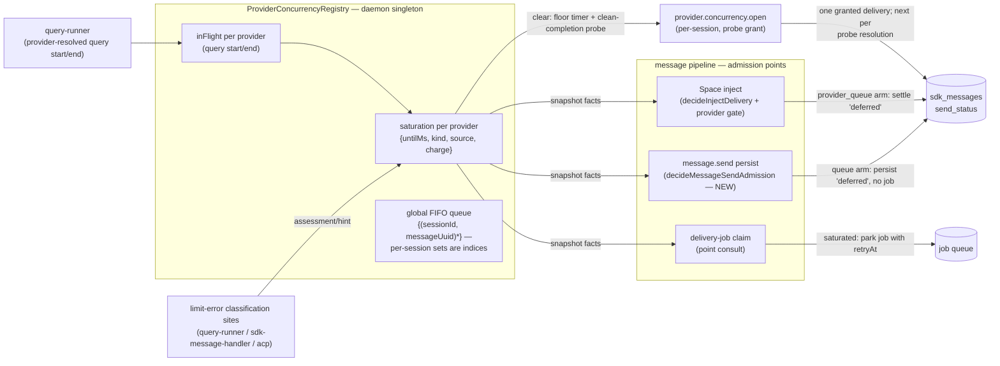

# Provider-Concurrency Admission Gate — Design (ADR 0004 Phase 2, chain C5)

Status: Proposed (design pass — doc only, no production code in this change)
Date: 2026-08-23
Task: #1313. Sources: `docs/reports/providers-area-survey.md` chain C5 (PR #2722) and
ADR 0004 Roadmap Phase 2 (`docs/adr/0004-superpipe-decision-pipelines.md`).
Consumes: the limit-error classifier from #2661 (merged 2026-08-22, `667d53a1`) and
the LLM classification tier from #2664 (merged 2026-08-23, `ae179427`); both are in
`dev` at this branch's base, so the chain's sequencing precondition is satisfied.

## Purpose

Design the **provider-concurrency admission gate**: a `decisionRun` admission gate in
the message pipeline that **queues a message before it enters the session's delivery
pipeline** when its provider is at a concurrency/account limit (e.g. GLM returning
429), instead of letting concurrent calls from sibling sessions pile up at the
provider. Per ADR 0004 Phase 2:

> The message-admission pipeline — sequenced behind the in-flight delivery-ordering
> fixes in the turn lifecycle — is also the landing spot for a provider-concurrency
> admission gate: when a provider (e.g. GLM) is at its concurrency limit, the
> admission decision queues the message before it is persisted to the session,
> instead of letting concurrent calls pile up at the provider.

This document specifies the **gate order**, **state ownership**, and **test plan**,
following ADR 0004's pilot conventions (characterization pins → pure core →
composition → apply; boundary caveats recorded; every core export production-consumed
or test-pinned).

## Scope

**In scope (v1):**

- A daemon-scoped, provider-keyed saturation registry fed by the existing limit-error
  classification sites (plus the provider-retry branch), deriving waits from the
  existing backoff ladder (`fallback-recovery.ts`) and parsed resets
  (`limit-error-classifier.ts`).
- An admission gate at the message pipeline's decision points: message-send
  persistence (new `decisionRun` core), the Space inject pipeline
  (`decideInjectDelivery`), delivery start in both delivery modes (V2 claim, V1
  inline start — point consults), and the watchdog auto-retry.
- A wake path that promotes provider-queued messages when saturation lifts, paced
  by a one-at-a-time probing release.
- The test plan and PR sequence for the implementation chain.

**Out of scope (recorded as follow-ups, not silently dropped):**

- **Configured per-provider concurrency caps** (proactive admission against a known
  N). v1 is reactive: saturation is armed by observed limit errors only. The
  in-flight counter the registry maintains is the seam a later cap plugs into.
- **Persisting saturation across restarts.** Registry state is in-memory; recovery
  from a restart during saturation is one re-armed 429 (bounded, see caveats).
- **Provider-level UI surfacing** (a `providers.changed`-style status event, picker
  badges). Queued messages are visible as pending (deferred) rows in the existing UI.
- **Falling back on provider queueing.** The per-session fallback ladder
  (`RateLimitWatchdog` → `selectNextFallback`) is unchanged; a queued session waits,
  it does not switch providers (rationale under Decisions).
- **`getModels()` probe 429s** (survey ACUTE-1 cause C) — those flow through provider
  listing, not the query error paths; chain C1 owns that neighborhood.
- **E2E coverage.** Daemon unit/integration suites only, per repository convention.

## Problem — current behavior (pinned facts)

All paths `packages/daemon` (D). Line numbers verified against this branch's base.

1. **Nothing provider-scoped exists between message send and the provider call.**
   `message.send` (`D/src/lib/rpc-handlers/session-handlers.ts:527-560`) validates
   only `deliveryMode` and session existence, then persists.
   `MessagePersistence.persist` decides the initial send status from exactly two
   facts — `queryMode === 'manual'` and a busy check of `processing | queued`
   (`D/src/lib/session/message-persistence.ts:180-192`) — then, for the dispatch
   case, the same transaction inserts the row as `'enqueued'` **and** a durable
   `message_delivery` job (`D/src/lib/agent/message-delivery-outbox.ts:36-82`). No
   provider, limit, or concurrency input exists at this seam.

2. **Cooldown state is per-session.** The limit pipeline is:
   query error / error result → `assessLimitError`
   (`D/src/lib/agent/query-runner.ts:1258`, `D/src/lib/agent/sdk-message-handler.ts:1215`,
   `D/src/lib/acp/acp-query-runner.ts:1009`) → `onRateLimitExhausted`
   (`D/src/lib/agent/agent-session.ts:1399-1405`) → that **one session's**
   `RateLimitWatchdog` (`D/src/lib/agent/rate-limit-watchdog.ts:75`, constructed per
   `AgentSession` at `agent-session.ts:380`), which arms a per-session cooldown
   (`ProcessingStateManager.setRateLimitCooldown`,
   `D/src/lib/agent/processing-state-manager.ts:225-236`) and retries that session's
   own episode. A 429 in session A does not stop session B on the same provider from
   dispatching a new query.

3. **The only cross-session limit aggregation is task-scoped.**
   `TaskAgentManager.limitedSessionsByTask`
   (`D/src/lib/space/runtime/task-agent-manager.ts:309`, fed by
   `session.rate_limit_pause` events at `:361-388`) restricts a Space *task* whose
   sub-sessions are limited. It keys by task, not provider, and reacts after
   sessions have already entered their own cooldown episodes.

4. **The only concurrency gate is global, cold-start-only, and provider-blind.**
   `SdkStartupConcurrencyGate` (`D/src/lib/agent/sdk-startup-gate.ts:35-111`,
   singleton `:113-118`; acquired at `query-runner.ts:713`) caps concurrent SDK
   subprocess *startups* at 3 and releases at the first SDK message
   (`query-runner.ts:820`). It bounds no steady-state provider load and carries no
   provider key. Survey area map: "Concurrency limits | none at provider level
   (ADR Phase 2 explicitly open); session-level startup gate only (#2552)".

5. **Even a session's own cooldown does not gate at persist.** During
   `rate_limit_cooldown`, `message.send` still persists `'enqueued'` + a delivery
   job (the busy check at `message-persistence.ts:181-182` does not include
   `rate_limit_cooldown`); the job is claimed and later **parked** by
   `driveDeliveryTurn`'s recovery-pending arm
   (`D/src/lib/agent/agent-session.ts:1762-1773` →
   `D/src/lib/job-handlers/message-delivery.handler.ts:121-123`). That
   persist-then-park churn — a claimed job, a session flipped to queued, a retry
   scheduled — is exactly the shape the admission gate removes, one layer earlier.

**Net effect (the GLM scenario):** N sessions on one GLM account; the account's
concurrency cap is exceeded; each session independently 429s, arms its own ≥10-minute
ladder cooldown, retries its own message, and possibly runs its own fallback chain —
while siblings keep firing fresh queries into the saturated provider. The provider
sees a thundering herd; the daemon sees N uncoordinated recovery episodes.

## Design overview



Three properties carry the design:

1. **One pure admission core, many interpreters.** A single pure function
   (`decideProviderAdmission`) decides admit vs queue; each decision point maps the
   decision onto its local mechanism (deferred row without a job / inject defer
   outcome / parked job / skipped retry). No decision point duplicates the policy.
2. **The queue is the existing durable one.** A provider-queued message is an
   ordinary `sdk_messages` row with `send_status = 'deferred'` — the state the
   manual query mode and busy-defer already produce, with existing UI, existing
   transitions (`delivery-status-routing.ts:17-27`), and existing replay paths.
   The registry adds only the wake linkage, plus a persisted `queue_reason` marker so
   the linkage survives restarts.
3. **Claim-time re-check is the enforcement backstop.** Racing wakes and in-flight
   saturations are convergent because every delivery-job claim re-runs admission
   before any provider call — the same belt-and-braces shape as pilot 7's
   reservation behind the spawn gates.

## The admission gate — order

### P1 — `decideMessageSendAdmission` (new `decisionRun`, at persist)

Extract the inline status cascade at `message-persistence.ts:180-192` into a
`decisionRun` core (module `D/src/lib/agent/message-send-admission.ts`), composed of
ordered gates — first decision wins, per `decisionRun` semantics:

| # | Gate | Decision | Today's equivalent |
| --- | --- | --- | --- |
| 1 | `applyManualModeGate` | `queue` (reason `manual_mode`) | `isManualMode` → `'deferred'` |
| 2 | `applyBusyDeferGate` | `queue` (reason `busy_defer`) | `deliveryMode === 'defer' && isBusy` → `'deferred'` |
| 3 | `applyProviderConcurrencyGate` — skipped when the session has a live turn (`liveTurnActive`): the send is a *steer candidate* (the outbox resolves the steer role later, and the claim-level `liveTurnSteer` bypass governs); queueing it here would park input the live turn is waiting on | `queue` (reason `provider_saturated`, `untilMs`) | **new** — today dispatches |
| 4 | `applyDispatchFinalGate` | `dispatch` | `'enqueued'` + outbox job |

The queue arm's interpreter is the **existing** non-outbox persist branch: insert the
row with `send_status='deferred'` (and, for the `provider_saturated` reason, the
`queue_reason` marker — see Queue and wake), publish `messages.statusChanged`, and
register the `{sessionId, messageUuid}` with the registry. No `message_delivery` job
is created and the session is not flipped to queued — but unlike the manual-mode
path it extends, the provider-queue arm **still publishes `message.persisted` with
`skipQueryStart: true`** (the event fires only under `shouldDispatchToQuery` today,
`message-persistence.ts:276-294`, and it is what clears the submitted composer
draft and enqueues initial title generation — suppressing it would leave stale
composer state on every saturated send; the subscriber's `skipQueryStart` guard
already prevents a query start). One side effect is deliberately deferred:
`needsWorkspaceInit` is published **false** for a provider-queued send, because
title generation runs its own SDK query outside the message pipeline
(`session-title.handler.ts:4-20` → `generateTitleWithSdk`,
`session-lifecycle.ts:926-979`, which invokes the SDK directly) — N new
sessions on a saturated account would otherwise each fire a title query the
gate never sees. Re-flagging and admission are two separate rules:

- **Re-flag** happens after **any terminal outcome of a delivery whose
  queueing suppressed title generation** — success or failure. Success
  covers the granted probe turn and a provider-change re-admission's
  ordinary turn alike; failure covers the queued first delivery dying to a
  non-limit error, where a success-only rule would leave the session
  untitled forever with no later event to schedule the job (a regression
  against today's behavior, where a failed title SDK query still falls
  back to the first 50 characters, session-lifecycle.ts:914-922). At
  terminal failure the re-flag schedules the title job immediately; its
  own consult governs when the query may run, and the existing fallback
  title covers its failure. (Not at promotion, which happens while the
  provider is still probing.)
- **The title job has its own admission interpreter.** Title generation is
  lowest-priority background work, and its admission follows the **standard
  contract — saturated/closed → deny, probing → deny unless it holds the
  grant, open → admit — with no fully-open-only exception**: its precedence
  over nothing from **separate queues, not one interleaved FIFO**: chat
  registrations hold the chat queue, background identities a background
  queue, and the grant always binds the chat queue's head first — the
  background queue is admitted only when the chat queue is empty (a single
  interleaved FIFO would make a newly arriving user turn wait behind an
  entire parked background drain). When the chat queue empties, the successor
  grant binds the background head and its consult admits on that grant; the
  grant machinery serializes the background wave one at a time. **Background
  grants live the full lifecycle**: a direct caller that admits on a grant
  consumes it at its SDK query start and resolves it on termination — clean
  completion mints the successor, its classified 429 re-arms saturation,
  any other termination releases — mirroring the turn-boundary semantics
  (for a one-shot background query, the query IS the turn); the
  `reportQueryStart/End` wiring these interpreters already owe carries the
  consumption and resolution. Consult identity is the **title job's
  durable identity** — `{kind: 'job', jobKind: 'title', jobId}` from the
  `session-title` job itself, never an in-memory synthetic tuple (the grant
  union and the job wake dispatcher key on `jobId`; a synthetic
  `(sessionId, 'title')` would leave the dispatcher with nothing to wake and
  the consult unable to report holding the grant, so it would park forever).
  One such job per session, idempotent. The consult
  sits at `handleSessionTitleGeneration`'s entry, before any lifecycle work;
  denial returns the same parked shape P3 uses — `requeue(job.id, retryAt)`
  with `retryAt` = the saturation deadline, or the probe tick while probing —
  so the job retries through the ordinary queue instead of throwing into the
  job-queue default retry. **Failures feed back — and are
  surfaced**: `generateTitleFromMessage` currently swallows the SDK exception
  into a fallback title (`session-lifecycle.ts:914-922`) and
  `handleSessionTitleGeneration` discards even that (`session-title.handler.ts:17-19`
  returns `{ generated: true }` unconditionally), so the PR3 wiring extends the
  lifecycle result to a structured `{ title, fellBack, error? }` — the
  handler then runs `assessLimitError` on the original error text/status and
  reports via `reportLimitError` with the title
  query's **actual effective account key** (title generation may resolve a
  different provider than the session's chat provider) before falling back — a
  title request can be the call that trips the cap, and the registry must learn
  it. This keeps background titling strictly behind the user-visible drain —
  chat-queue precedence plus one-at-a-time grant release; a 64-wide title herd
  cannot hit the just-recovered account. **Parked background jobs survive
  restart**: their synthetic registrations are in-memory and they have no
  `sdk_messages` row for the marker scan, so the park stamps a
  `provider_park` reason on the job-queue row itself — cleared by the same
  lifecycle as its registration: **at the admitted query's start itself**
  (mirroring the message-row prompt-yield rule — a job re-admitted onto an
  already-open account after credential rotation or a Space provider
  change starts with no grant to consume, and keying the clear to grant
  consumption would leave its marker durable through a crash, letting
  reconstruction wake already-started work), on its terminal
  completion/failure, and on explicit user removal — so a job that starts
  then fails non-limit-wise requeues through the ordinary retry backoff
  without a stale marker letting restart reconstruction wake it ahead of
  that backoff. The startup scan
  extends to parked background jobs (registering them into the background
  queue by park order) — otherwise their shared `run_at` becomes due against
  an open registry and every claim starts concurrently, recreating the herd.
  **The same interpreter covers the Space background provider
  queries** — `evolution-conversation-analysis-service.ts:289-296`,
  `evolution-episode-service.ts:754-761`, and `llm-workflow-selector.ts:56-61`
  each invoke the SDK directly on the configured Space/default provider: they
  follow the **same grant-aware background contract as titles** — standard
  admission (saturated/closed deny, probing deny unless the bound grant is
  theirs, open admit), background-queue position, full grant lifecycle
  (consume at query start, resolve on termination) — and classify/report
  their failures via `reportLimitError`; but **each caller's denial shape
  differs**:
  the conversation-friction analysis runs inside a durable job (the title
  interpreter's `requeue(job.id, retryAt)` park applies as-is);
  `evolution.episode.createFromEvidence` awaits its judge inside a MessageHub
  **request** with no `job.id` — denial fails the request with a typed
  retryable `provider_saturated` error the caller surfaces (the request
  completes with an explicit outcome, never hangs); and the workflow selector
  runs inline with a deterministic fallback — denial selects the fallback.
  Those last two callers abandon denied work **per invocation, not per
  service**: `createFromEvidence` called from a transient MessageHub request
  is ephemeral (never registered — nothing durable remains to run, and a
  registration could receive a grant it can neither consume nor resolve),
  but the SAME service called by the durable `goalAutomation.execute`
  handler (goal-automation-execute.handler.ts:175-179, enqueued with only
  two retries, goal-automation-service.ts:170-177) takes its job's park
  shape — treating that invocation as ephemeral would let its retries
  expire during a reset instead of waking when the account reopens. The
  workflow selector stays ephemeral in all cases (its fallback is
  deterministic and selection retriggers naturally)
  (rule-based selection) instead of deferring. These six surfaces (titles +
  three Space jobs + `github/router-agent.ts:198-244` and
  `github/security-agent.ts:147-204`, which `DaemonApp` supplies with the same
  stored session credentials, `app.ts:536-566` — a **one-time snapshot**,
  so the credential-change re-admission hook recreates/updates both agents
  from the new credentials before re-admitting or draining any parked
  GitHub analysis; replaying with a stale snapshot would invoke the old
  key while the registry reasons about the new account). These surfaces are
  v1's roster
  of out-of-pipeline provider callers; any new direct `query(...)` caller
  joins
  them by convention. **One event, one grant**: `processEvent` chains
  `checkSecurity` → `routeEvent` (github-service.ts:214-287), so an event's
  grant spans the whole workflow — granted once at event admission, each
  agent query rides it (multiple queries, one concurrency slot), resolved when
  the event's processing terminates; per-agent grants would interleave events
  (A's router denied after A's security consumed its grant and the successor
  bound to B) and never complete an event. **Grant resolution is therefore
  keyed to the workflow boundary, not the query boundary**: the two agent
  queries still report `reportQueryStart/End` for `inFlight` bookkeeping and
  limit classification, but the security query's clean completion must NOT
  resolve the event's grant — the feed-site contract below resolves a
  consumed grant on clean completion for *single-query* callers, and applying
  that here would mint A's successor while `routeEvent` is still starting
  its query, letting event B overlap A's router against the same upstream
  (the backlog expands into concurrent calls the serialized lane excludes).
  The consumed grant resolves only when `processEvent` terminates — clean
  completion of the whole chain mints the successor, a classified 429 from
  either agent re-arms saturation, any other termination releases.
  **Each agent query re-consults admission at its start**: an event
  admitted while the account was open holds no grant, and a sibling arming
  saturation while its security query runs would otherwise let it walk
  straight into the router query under the workflow-wide rule — with
  several security checks in flight, all of them would start fresh router
  calls after the cap is known, recreating the concurrent wave the lane
  excludes. The per-query consult admits the workflow through when it
  already holds the event grant (probing included); a grantless event
  whose account went saturated or closed between stages parks durably —
  the inbox entry this design already gives GitHub events carries the
  resume state (security verdict already computed), and the wake re-enters
  `processEvent` at `routeEvent` without repeating the completed security
  query. **Termination awaits cancellation**: both agents' timeout paths
  currently fire-and-forget `queryObj.interrupt().catch(() => {})`
  (security-agent.ts:236-238, router-agent.ts:270-272), so `processEvent`
  could terminate while the timed-out SDK request is still live —
  releasing the grant there would wake a successor overlapping it, and
  repeated timeouts would stack concurrent probes. The timeout path
  therefore awaits both the interrupt and the query's actual termination
  (the runner's terminal callback / abort completion) before the workflow
  reports query end and resolves the grant, so `inFlight` decrements and
  successor minting happen only after the request is truly dead.
  The GitHub agents' denial shape **splits by invocation**:
  the poll path (a durable tick) skips the agent work this tick — the denial
  returns `skipped_provider_saturated`, and **cursor/ETag handling follows
  the sole-owner rule below exactly** — advance past every event *whose
  inbox commit succeeded*: the denied event retries from the inbox, never
  the poll. Advancing is not unconditional, because `pollIssues`/
  `pollComments` store the response ETag BEFORE the callback runs
  (`:174-184`/`:229-239`) — if the inbox commit then fails, the next poll
  304s over that stored ETag and never sees the uncommitted event again,
  permanently losing it. The denial handler therefore **restores BOTH the
  prior ETag and the prior `lastPollTime` when the inbox commit fails**:
  restoring the ETag alone is insufficient — both polling requests carry
  `?since=${state.lastPollTime}` (`polling-service.ts:163-166`/`:218-221`),
  so an advanced poll time excludes the lost object from the next response
  before any ETag is even consulted, and the event is still permanently
  skipped. With both restored, the poller re-observes the event next tick
  and re-attempts the park (the restored `since` is what forces
  re-observation); the window-eating concern is confined to the crash case,
  which the inbox commit itself covers — a failed commit means nothing was
  consumed.
  The **webhook path**
  reprocessed by the next poll either (dual owners would duplicate room
  messages); the inbox wake drains each persisted event exactly once once
  the account reopens; the **webhook path**
  (`github-service.ts:103-107` awaits `processEvent` directly in the HTTP
  callback — no job, no `job.id`) processes the event **without** agent
  analysis — and the **acknowledgment becomes conditional**: the 200 is
  returned only after the durable inbox commit succeeds; if the inbox write
  throws, the handler **first retries the commit in-process within the
  callback window** (a short bounded backoff — transient SQLite contention
  is the expected failure, and the callback must still complete quickly or
  GitHub times the delivery out) and only then answers non-2xx — which
  **reports non-acceptance, never an upstream retry queue**: GitHub records
  a failed delivery and does NOT automatically redeliver, so the payload's
  survival past the in-process retries is backstopped only where a token
  exists — a **reconciliation sweep** (caveat 9) lists the hook's recent
  failed deliveries via the GitHub deliveries API and re-ingests their
  payloads through the same inbox path; a token-less webhook-only
  installation has no backstop, and the guarantee is qualified accordingly
  (today's catch path still 200s, which would silently drop the saturated
  event even when local persistence is healthy). The callback must complete quickly either way — GitHub
  would otherwise time out and retry — and **persists the original
  webhook payload to the inbox for exact replay**: poll-derived events are
  not a substitute — normalization synthesizes actions (`updated`) that
  differ from webhook actions (`opened`/`closed`/`synchronize`), so replaying
  via the next poll would route differently or be filtered out entirely.
  Every skipped webhook goes to the inbox regardless of polling mode, and
  **both sources converge on one upstream identity**: the inbox stores the
  upstream resource tuple (event/repo/row-id/`updated_at`) as a secondary
  index beside its source-specific key, and deduplication uses **two key
  levels**. The per-source exactly-once key is **source-appropriate**:
  webhooks key by **`X-GitHub-Delivery`** — each delivery is a distinct
  upstream push, and two edits of one resource within the same second share
  type/repo/row-id, second-resolution `updated_at`, AND the action, so a
  tuple+action key would classify the second edit's distinct payload as a
  replay and drop it (the delivery id is the identity GitHub itself
  guarantees distinct per push); polls key by the upstream tuple **plus the
  action** — the poll observes the resource's current state, so same-second
  repeated edits collapse to one observed row upstream, and the action
  addition still distinguishes a created-then-edited sequence whose members
  share the resource timestamp. The **canonical correlation key** — the
  action-insensitive upstream tuple (type/repo/row-id/`updated_at`) —
  carries cross-source suppression, because equivalent events do NOT share
  actions across sources (polling synthesizes `updated` while the webhook
  emits `opened`/`closed`/`synchronize`; keying cross-source dedupe on
  tuple+action would deliver the same change twice from both-enabled
  configurations). Delivery inserts under its per-source key and records
  its source on the canonical key — **canonical suppression applies only
  cross-source**: a replay from the SAME source consults only its own
  per-source key (the canonical key must not suppress a same-source
  distinct action or delivery — the created-then-edited poll example would
  lose the edit, since both actions share the resource timestamp and the
  first would consume their shared canonical key, and a same-second
  same-action webhook re-edit is a distinct delivery id the canonical key
  must not absorb); a replay from the OTHER source is suppressed by a
  **one-per-event pairing, not a global consumed latch**: each delivered
  event opens exactly one suppression slot on its canonical tuple for a
  subsequent opposite-source event, and consuming the slot records the
  pairing (delivering identity → suppressed identity). A further
  opposite-source event with a distinct per-source identity delivers —
  the second same-second webhook after a poll observation must not be
  suppressed by it: a global once-latch on the coarse tuple would drop
  BOTH webhooks off one poll in that arrival order while the reverse
  order delivers both and suppresses only the poll, making delivery
  order-dependent and losing a transition that routes differently. The
  recorded imprecision is confined to the timestamp's own resolution:
  second-resolution `updated_at` cannot say WHICH opposite-source event
  an arrival duplicates, so the pairing rule suppresses the first and
  delivers the rest — never losing a distinct delivery, at most
  re-delivering one, and the both-enabled common case (one change, one
  webhook, one poll) still dedupes to exactly one delivery.
  **Webhook-only installations** (webhooks enabled
  without a GitHub token, or polling interval zero — `refreshPolling`
  disables polling entirely) have no next poll: the skipped analysis is
  persisted to a durable raw-event inbox keyed by the **GitHub delivery
  id** (`X-GitHub-Delivery`, github-event-extension.ts:671) — not the
  normalized event id, which the normalizer regenerates per receipt
  (`crypto.randomUUID()`, github-normalizer.ts:1094), so a crash before the
  200 response (whose delivery is later re-ingested by the caveat-9
  reconciliation sweep or a manual redelivery — both reuse the delivery id)
  would land as an
  unrelated key and bypass the delivery-record dedupe — and for **polled**
  events the replay key is the stable upstream tuple (**eventType + repo +
  upstream row id + `updated_at`** — the normalizer distinguishes pulls,
  issue comments, and review comments by `eventType` plus the row's own
  `id`, github-normalizer.ts:386-408, and second-resolution `updated_at`
  alone would collide two comments on one PR, permanently suppressing one):
  a crash after the inbox commit but
  before `lastPollTime` persists (polling-service.ts:132) re-polls the same
  object and normalization mints yet another fresh UUID
  (event-normalizer.ts:10-11), so anything less stable than the upstream
  tuple defeats the delivery-record dedupe — and the inbox
  entries **register as durable background waiters** — drained through the
  agents on **any** clear of their account key (normal timer/probe clears
  included, via the same wake that drains the background queue), not only by
  the credential-change hook (which covers the billing-closed case).
  **Drain is idempotent across crashes**: the replay's room delivery goes
  through a **keyed upsert at the sink** — the derived room message is
  persisted as a durable row keyed by the delivery key (insert-if-absent),
  and the live `room.message` emission fires only on a fresh insert — but
  the durable row is itself the delivery: it persists through the standard
  room-session message path (`sdk_messages`), which the web already
  projects via LiveQuery `messages.bySession`, so connected rooms observe
  the row through the durable projection regardless of whether the
  one-shot `room.message` push fired. `room.message` (and
  `deliverToRoom`'s current fire-and-forget `emitEvent`,
  github-service.ts:425-436) is a live-push optimization, never the
  record of delivery — a crash between the insert commit and the push
  therefore loses nothing: replay inserts nothing, pushes nothing, and the
  projection has already carried the message. Without the durable row as
  the source of truth, saturated-period events in these supported
  configurations would be silently lost or duplicated. This is the
manual-mode code path today
(`message-persistence.ts:227-229`) plus that event; the gate adds a third way to
reach it.

**"Before it is persisted to the session," interpreted.** The ADR's phrase is
realized as: the admission decision runs **before the persist transaction chooses
the send status and (critically) before the outbox job is enqueued** — a queued
message never enters the session's delivery pipeline, so nothing downstream of it
can start a provider call. The message *content* is still persisted immediately as a
`'deferred'` row: holding user input only in memory would lose it on crash, and the
deferred state already renders as a pending message the user can promote, defer, or
remove (`session.messages.promotePending` et al.,
`D/src/lib/rpc-handlers/session-handlers.ts:1058-1182`). Queueing-before-persistence
and durability are reconciled by queueing *as* the persisted-but-not-dispatched
state.

Gate order rationale: gates 1–2 reproduce today's precedence exactly (parity), and
the provider gate narrows only flows that today dispatch — the standard
pilot-convention placement for a new gate (pilot 5's arg-before-target rule: a new
gate inherits the documented order; existing outcomes are unchanged).

### P2 — provider gate in `decideInjectDelivery` (Space inject pipeline)

Insert `applyInjectProviderConcurrencyGate` into the existing composition
(`D/src/lib/agent/message-delivery-pipeline.ts:79-85`). Like P1, the gate is
**skipped when the target session has a live turn** (`liveTurnActive`): an
immediate injection into a processing session is a steer candidate whose role
the delivery layer resolves after admission, and queueing it here could
withhold input the active turn needs to finish and clear saturation — the same
pre-gate ordering obligation as P1. Gate list:

```
applyAlreadyConsumedGate          → noop            (unchanged)
applyFailedReopenGate             — marks reopen    (unchanged)
applyDeferAdmissionGate           → defer           (unchanged: session cooldown /
                                                     parent-task-limited / defer-busy)
applyInjectProviderConcurrencyGate → provider_queue {untilMs}   (NEW)
applyInjectContextResetGate       → clear_*         (unchanged)
applyInjectFinalGate              → deliver         (unchanged)
```

Placement **after** the defer-admission gate is deliberate: `decideDeferAdmission`
(`D/src/lib/agent/message-ownership-gates.ts:112-126`) already defers for
session-scoped and task-scoped reasons; the provider gate only intercepts flows that
would otherwise deliver. A session already in its own cooldown keeps today's
behavior; a clean sibling session on a saturated provider — the GLM scenario — gets
the new arm. The `provider_queue` arm's interpreter reuses the existing defer
effects verbatim (`task-agent-manager.ts:3383-3398`:
`markDeliveryDeferredByUuid` / `settleDeliveryRowStatus` with status `'deferred'`)
and adds the registry registration; `settleDeliveryRowStatus`'s insert path carries
the `queue_reason` marker the same way. A distinct arm (rather than
folding a boolean into `decideDeferAdmission`) keeps the `untilMs` payload and the
wake obligation typed, and leaves the pinned defer decision table untouched.

### P3 — delivery-start consults (point decisions, enforcement)

**V2 (default):** consult `decideProviderAdmission` in the delivery handler at the
existing skip cluster (`D/src/lib/job-handlers/message-delivery.handler.ts:81-84`):
if the row is deliverable but the provider is saturated **or probing without a
grant for this delivery**, return the same parked shape the recovery-pending arm
already produces (`requeue(job.id, retryAt)` →
`{ parked: 'provider_saturated', retryAt }`), with `retryAt` = the saturation
deadline for the first park and a short probe tick afterwards — parked jobs
re-consult on every claim, so the probing release admits them one probe at a time
instead of releasing a 64-wide claim wave at the shared deadline
(`D/src/app.ts:307-318`). Because the consult sits ahead of `driveDeliveryTurn`,
the session lock is never taken and no turn state is touched; the interpreter
obligation it adds is restoring an idle session that persist had flipped to queued
via `setQueuedIfIdle` (`message-persistence.ts:224-226`) — pinned in the test plan.

**V1 (`HYPERNEO_MESSAGE_DELIVERY_V2=0`) and every direct-start path:** the V1
surface is not one call site — `startQueryAndEnqueue`
(`message-persistence.ts:271-275`), `deliverRowsViaMemoryQueue`, and the V1 branch
of `deliverInjectedMessage` all reach `ensureQueryStarted()` directly
(`D/src/lib/agent/query-lifecycle-manager.ts:432-525`). Rather than enumerating
them, the consult sits at **`ensureQueryStarted` itself — the common provider-start
boundary every delivery path crosses** — with the handler-level V2 consult kept as
the cheaper early park. `ensureQueryStarted` today takes only an optional
`AbortSignal`, and `deliverRowsViaMemoryQueue` calls it once before iterating a
batch — so the boundary gains an **optional delivery-identity parameter** (the
message uuid / batch head the start serves): it is what names the grant holder
on admit and the row to defer-and-register on denial, and batch callers pass
their per-uuid identity (calling the boundary per row where they currently call
it once). **Not-yet-persisted deliveries are a distinct case**: the V1
injection paths (`deliverInjectedMessage`,
`injection-delivery-steps.ts:148-156`; the long-term-agent V1 path,
`space-runtime-service.ts:572-575`; and `spaceAgentInjector`,
`rpc-handlers/index.ts:869-880`) call `ensureQueryStarted` *before*
inserting their SDK row — there is no row to settle or register on denial, and
the message exists only in the caller's memory. For these the boundary returns
a **typed `provider_parked` outcome** to the caller — and the caller's
obligation is to **durably insert the deferred row and marker first**: an
in-memory-only copy is lost on restart (under a long reset or the indefinite
closed state), silently dropping the injection. The parked flow: insert the
`'deferred'` row with the marker (these callers already build the full SDK
message — persisting it ahead of the retry is P1's queue-arm shape),
register it normally, then return `provider_parked` so the caller abandons
the in-memory start; the wake re-runs the inject against the persisted row.
No synthetic in-memory registration remains on this path. **Identity-less
callers split into exempt and admitted**: `ensureQueryStarted` is not
exclusively a delivery boundary — context-reset / restart paths call it with
no message row to resume an existing turn's lifecycle, and those starts ride
existing turn-lifecycle mechanics (no new admission), their limit errors
still arming the registry through the classifier like any others. The
**`AskUserQuestion` answer-after-stop path is NOT exempt**:
`submitAnswerForRestartedQuestion` first sets the session idle, then calls
`ensureQueryStarted()` — which starts a **fresh streaming query**, a new
provider call — before enqueueing the tool result
(ask-user-question-handler.ts:524-568); treating it as an already-live steer
would let every session answering a question bypass the serialized probe
lane while a sibling has armed saturation. This restart therefore carries a
**transient admission identity** — `{kind:'restart', sessionId, toolUseId}`,
named by the pending question's `toolUseId` (the answer itself is in-memory
today and a crash loses it either way, so a transient registration adds no
new loss) — and a denial parks instead of starting: no `ensureQueryStarted`,
the answer stays in the handler's queued map, the identity registers in the
chat lane, and the wake re-runs the submission against the retained answer.
A boundary denial for a delivery-identified caller has no job to park: the
delivery settles its row back to
`'deferred'` with the `queue_reason` marker and registers it (V2 surfaces this as
the recovery-pending park instead, upstream). A delivery holding the probe grant
passes. Without the boundary consult, startup/manual pending replay and a Space
injection that passed P2 just before a sibling armed saturation could still start
their provider calls — voiding the enforcement claim in the documented rollback
mode (`docs/features/message-delivery-v2.md`) and the replay paths alike.

Together these are the backstop that makes races convergent:

- messages persisted before saturation armed (already `'enqueued'` + job),
- flush-path promotions that outran a re-saturation,
- sessions fed by the direct persist callers (`D/src/lib/rpc-handlers/index.ts:804,872`,
  `D/src/lib/space/runtime/space-runtime-service.ts:530,573`),
- the V1 inline path.

A point consult, not a pipeline: a single boolean-shaped precondition at each
delivery-start boundary, the ADR's sanctioned inline shape (pilot 4's point
decisions at the tail).

### P4 — watchdog auto-retry consult (point decision)

`executeRateLimitAutoRetry` (`D/src/lib/agent/agent-session.ts:931-970`) starts a
query directly, bypassing the message pipeline. It consults the same core; when
saturated, it skips the start, settles the episode's row back to `'deferred'` with
the marker, and registers it, letting the wake path re-promote. The retry
callback's boolean contract (started / not-started) cannot express this —
`false` would push the watchdog into its startup-retry loop and eventually
`startupExhausted`, `true` would `notifyResume` as though a query started — so
the callback's result widens to `started | parked`, and `parked` makes the
watchdog relinquish its cooldown timer without startup retries and
**publishes the pause-clearing resume variant** (distinct from a started
resume: it clears `session.rate_limit_pause` so
`TaskAgentManager.limitedSessionsByTask` drops the session — an unmatched
pause would keep the parent task restricted and its injections deferring
through `parentTaskLimited` instead of registering with the provider queue —
while signaling the provider-queued state for the UI): the registry now owns
that row's wake. This closes the last
uncoordinated provider-call starter. (The fallback arm — `switchAndRetryForFallback`
— is exempt by construction: it has already switched the session's provider, and
admission is always evaluated against the *current* `session.config.provider`, so
a fallback-switched session escapes the saturated provider's queue on its next
admission.)

### The pure core

Module `D/src/lib/agent/provider-admission-gates.ts`:

```ts
interface ProviderAdmissionFacts {
  providerId: string;
  now: number;
  configuredCap: number | null;     // v1: always null (reactive only)
  inFlight: number;                 // registry snapshot
  saturationUntilMs: number | null; // registry snapshot (null = no timed
                                    // saturation; closure is the separate flag)
  closed: boolean;                  // billing-terminal closure — no deadline,
                                    // admits nothing until reopened (manual
                                    // retry, health probe, credential change)
  accountAvailable: boolean;        // usable credentials present — false once
                                    // auth.logout removes the last stored
                                    // credential; denies like closed
  closureProbe: boolean;            // this caller is the manual Retry or the
                                    // bounded daily health probe — the only
                                    // callers ELIGIBLE to probe closure
                                    // (eligibility alone never admits)
  holdsClosureProbeGrant: boolean;  // this caller holds the account's single
                                    // atomic closure-probe grant — the fact
                                    // the closed arm actually tests
  probing: boolean;                 // post-clear / post-restart: a probe grant
                                    // is outstanding and unresolved
  holdsProbeGrant: boolean;         // this delivery owns the grant
  liveTurnSteer: boolean;           // feeds an already-live provider turn —
                                    // adds no concurrency
}
type ProviderAdmission =
  | { action: 'admit' }
  | { action: 'queue_until'; untilMs: number | null; reason: 'closed' | 'saturated' | 'probing' | 'slot_pressure' };
```

`decideProviderAdmission(facts)` is pure and synchronous (`.end`, never
`.endAsync` — Decision item 5): `liveTurnSteer` → `admit` unconditionally (a
steer fed into a live turn via `feedDeliverySteer` rides the turn's existing
provider call; it adds none — and parking it while the live turn waits on that
very input would deadlock the turn whose completion could clear saturation);
else `!accountAvailable` → `queue_until` with **no deadline** (reason
`closed`) — evaluated **independently and first**: no credential, no call,
and `closureProbe` cannot bypass it (a health probe or manual Retry on a
logged-out account would be an unauthenticated SDK call; those callers
consult again after `auth.login`); else `closed && !(closureProbe && holdsClosureProbeGrant)` →
`queue_until` with **no deadline** (reason `closed`, `untilMs` null — the
billing kind has no reset; it re-opens via the closure probes below or a
credential change, so callers treat it as queue-indefinitely / surface to
the user, never tick-retry; the core tests grant OWNERSHIP, not probe
eligibility — `closureProbe` alone must not admit, or concurrent Retry
clicks and an overlapping health probe would all bypass and recreate the
wave the atomic grant exists to prevent); else
saturated → `queue_until` with the registry's deadline; else
probing without the grant → `queue_until` (reason `probing`, until = the probe
tick); else if `configuredCap !== null && inFlight >= configuredCap` →
`queue_until` (reason `slot_pressure`, until = null-safe probe tick); else
`admit`. **Grants are minted and bound by the registry at clear time, before
any consult** (the core only reads `holdsProbeGrant`); the first-admitting-
consult-mints wording from earlier drafts is exactly the scheduling race the
mint-bound contract removed. The two `apply*Gate` wrappers above adapt the core to their pipelines' ctx
shapes (`(ctx) => ctx`, pass-through identity per Decision item 6(b)).

Hot-path check: this core runs once per message send / inject / job claim — the
same frequency class as `AgentMessageRouter`, whose awaited repository reads are
millisecond-scale against `decisionRun`'s ~2 µs. GO by the ADR benchmark; no
microtask-profile obligation beyond the sync-core rule (pinned anyway, cheaply, in
the send-admission suite).

## State ownership

### `ProviderConcurrencyRegistry` — daemon singleton

Module `D/src/lib/agent/provider-concurrency-registry.ts`; class with a
module-level singleton + `resetForTests()`, following the `getSdkStartupGate`
(`sdk-startup-gate.ts:113-120`) and provider-registry precedents. It is a class,
not a pipeline: it owns timers and an event publisher, and pipelines/cores receive
only its snapshots (the ADR resource-ownership rule).

Per **provider key = the concurrency domain of one upstream account**, keyed
primarily by a **non-secret digest of the effective credential** — the
credential is the billing/concurrency identity, so everything routing under
one credential shares one key:

- **Stored default credentials**: key = `digest(storedCredential)` scoped by
  the provider id only as a namespace for *finding* the credential — and the
  digest changes when the stored credential does, so an
  `auth.logout`/`auth.login` rotation moves sessions and their backlog to a
  fresh key (the shared-credential re-admission hook fires on exactly that
  fingerprint change). **OAuth refreshes are not rotations**:
  `OAuthRefreshScheduler` periodically stores a new `accessToken` for the
  *same upstream account* (oauth-refresh-scheduler.ts:51-82), so the digest
  input is the **stable account identity, not the raw token** (for OAuth:
  the provider + account identifier; for static keys: the key itself) — a
  routine refresh keeps the key, keeping active saturation/closure on the
  account it belongs to; only a genuine credential *change* (different
  account identity) re-keys. **When no account identifier exists** (the
  generic OAuth shape carries only `accessToken`/`refreshToken`/`expiresAt`/
  `raw`, shared/src/provider/types.ts:23-31, and env migration stores a bare
  token), the digest falls back to `hash(refreshToken ?? accessToken)` —
  stable across access-token refreshes by construction (the refresh token
  identifies the grant) — and where only an access token exists, the first
  observed value pins the key and a later changed value is treated as a
  rotation (the imprecision is recorded: a token refresh that rotates the
  refresh token itself re-keys; the account-identifier field is the durable
  fix and lands with the credential schema, not this design).
- **Session overrides** (`providerConfig.apiKey`): the override digest keys
  the session — two built-in-provider sessions with different API keys are
  different accounts; neither queues behind the other.
- **Explicit endpoints** (`baseUrl`, region variants): same credential
  through endpoints X and Y is treated as **one pool** — the credential is
  the account-wide limit's subject (X's 429 stops Y), accepting the recorded
  imprecision that distinct sub-accounts behind one credential+endpoint pair
  (e.g. Kimi china/global with one key) share a registry entry; splitting
  those would need per-endpoint account knowledge the daemon does not have.
- Logical provider records that carry the **same effective credential**
  through identical endpoints (`custom-endpoint.ts:23-30` allows distinct
  ids with identical `baseUrl`/`apiKey`) merge into one key — one account
  regardless of logical record. Distinct API keys at the same endpoint do
  NOT merge — they are different accounts per the digest rule, and merging
  them would let one customer's limit block another's traffic.

Endpoint/region fields therefore do NOT join the key at all; what the
provider normalizer routes by matters for *calls*, while what bills matters
for *limits*. **Credentialless providers** (a supported configuration:
`AcpProvider` is available from `HYPERNEO_ACP_COMMAND` with no
`getCredentials()` at all, acp-provider.ts:101-106, and
`CustomEndpointProvider` treats a base URL as sufficient with an absent
API key, custom-endpoint-provider.ts:94-99) key by their **endpoint or
command identity** instead — `digest(baseUrl ?? command)` under a
**provider-family namespace (the resolved provider type, never the logical
record id)** — two credentialless custom-endpoint records with the same
`baseUrl` carry distinct runtime ids (`custom:<endpointId>`) yet send to the
same anonymous upstream concurrency domain, so a record-id namespace would
let each observe the other's limit without gating it and sibling traffic
would keep hitting the capped endpoint; the family namespace converges
identical credentialless endpoint identities while distinct endpoints and
commands stay distinct keys — and report `accountAvailable: true` (the
command/endpoint IS the access; there is no credential to be absent);
their limits gate exactly like anyone else's. An absent `providerConfig` and an effectively-default one hash
equal, so the common case shares one key.

| State | Type | Written by | Read by |
| --- | --- | --- | --- |
| `saturation` | `{ untilMs: number \| null (null = billing-closed), kind, source, armedAtMs, charge } \| null` per provider | `reportLimitError` (classification sites ×3 + provider-retry branch **+ every out-of-pipeline interpreter**: title, Space jobs, GitHub agents, classifier query) | admission facts, wake timer |
| `inFlight` | count per provider **turn** — start when the query consumes the delivery's prompt, end at that turn's terminal result (the SDK query outlives turns: `messageGenerator` keeps it alive for later prompts, so query spawn/teardown is the wrong seam and a successful turn would otherwise stay unresolved until interrupt) | `reportQueryStart` / `reportQueryEnd` at the turn boundary (SDK `QueryRunner` + ACP runner) | admission facts (cap follow-up), probe evidence |
| `queuedMessages` | **two provider-wide insertion-ordered lanes — chat and background** — of typed composite identities (`{kind:'message', sessionId, messageUuid}` / `{kind:'job', jobKind, jobId}` / `{kind:'inbox', eventId}`; chat-first priority: background admits only when the chat lane is empty), with per-session `Set` indices as secondary lookup structures only (wake routing, deregistration; idempotent adds — a parked job re-consulting every probe tick must not accumulate duplicates) | queue arms (P1/P2/P4), delivery-start park (P3), background/job/inbox parks | probing release (chat lane first), registration cleanup (indices), provider-change re-admission (indices) |
| `probeGrant` | `{ identity: GrantIdentity (typed union — see queuedMessages), leaseUntilMs } \| null` per provider (message uuids are session-scoped and explicit injected ids can collide across sessions; jobs and inbox entries bind by their durable ids) | minted **and bound to the selected FIFO identity at clear time** (never by the first admitting consult); consumed at prompt yield; **the lease bounds only the unconsumed grant** (mint → yield) — a consumed grant resolves solely on its own turn's termination; unconsumed-grant expiry re-mints and re-binds | downstream consults (same delivery passes), probe resolution |
| `closureProbeGrant` | `{ holder, leaseUntilMs, configRef } \| null` per provider — `configRef` is the resolvable configuration snapshot (provider id + effective providerConfig/credential reference captured when closure armed, kept current by the rotation hooks), without which the scheduled timer could not construct its probe request from a digest alone — the atomic reservation behind `holdsClosureProbeGrant`, independent of `probeGrant` (closure probing never mints or consumes post-clear probes) | **CAS-acquired** by manual Retry / the health-probe timer (the loser queues on its own trigger) | `holdsClosureProbeGrant` (the core's closed arm); **released** by the holder's outcome (success → closure clears and registrations drain; fresh billing-terminal → re-arm `closed`; classified non-billing limit → timed saturation; other error → closure stays armed) or by lease expiry — **which bounds only the unstarted grant** (acquire → probe start), exactly as `probeGrant`'s lease does: once the probe's request has started, only its termination releases, so a long-running Retry turn or health query cannot have its lane re-granted mid-flight |
| `lastCleanCompletionAtMs` + `chargeResetArmed` | per provider | `reportQueryEnd(success)`, clears | probe rule (floor evidence), charge reset |
| wake/floor timers | one unref'd `setTimeout` per armed provider | arming/clearing/refinement | — |

Registry state is in-memory; the durable additions — one migration family
in C5-PR3 — are: the `queue_reason` and monotonic queue-sequence columns on
`sdk_messages` (linkage and FIFO order restart-safe; reconstruction sorts by
the sequence, pinned); `provider_park`/`provider_park_seq` on the
job-queue rows (background-waiter linkage and ordering); the raw-event
inbox table (payload + stable replay key + ingest sequence + per-event
delivery-record state); the persisted shared sequence allocator's
counter row; and the **per-account saturation marker row** (key, kind,
`untilMs`/closed, charge, and — stored with the closed kind — the same
resolvable `configRef` snapshot the in-memory `closureProbeGrant` carries:
provider id plus effective providerConfig/credential reference, captured
when closure armed and kept current by the rotation hooks; a restart
reconstructing a closed account with no waiter could not build the daily
health probe's request from a digest alone, and without the persisted
reference the account would stay closed until manual Retry or a
credential change — written on arm, updated on refine, cleared on
clear, so restart reconstruction re-enters saturation or the closed state
instead of an open registry; caveat 1). None of these exist in the current
schema — the PR3 plan's migration scope names all of them.

### Saturation derivation — consuming the classifier and the ladder

`reportLimitError(accountKey, assessment, now)` — the **effective
provider-account key** of State ownership, not the bare provider id — arms
saturation from an
`assessLimitError` result (`LimitErrorAssessment` from
`D/src/lib/agent/limit-error-classifier.ts:114-183`), reusing exactly the
primitives #2661/#2664 shipped — **not** the watchdog's trip gate (whose
`give-up`/`surface-billing` arms encode episode-retry semantics the registry must
not inherit):

- `assessment.billingTerminal` → arms a **non-timed `closed` state** at provider
  scope: no `untilMs` exists (the session watchdog still owns surfacing the
  manual-retry pause), but leaving the registry open would let every sibling
  keep issuing doomed calls to an exhausted account — contrary to Decision 2's
  all-limits-arm rule. `closed` admits nothing and clears only on a
  credential/account change (the same re-admission hooks as provider changes);
  it has no probe and no ladder. **Reopening without a credential change**:
  topping up or renewing the same upstream account leaves the fingerprint
  untouched, so closure also clears on (a) the session's manual Retry Now /
  Resume path (the existing RPC re-runs the consult; a closed account's
  manual retry is the one caller allowed to probe closure — success clears,
  a fresh billing-terminal response re-arms), and (b) a bounded daily
  health probe per closed account (one unref'd timer; a successful probe
  turn clears, a limit re-arms) so a renewal while the daemon idles is not
  stuck until restart. **Durable parking under closure**: the job
  queue's `run_at` is `INTEGER NOT NULL` and `requeue` takes a number, so a
  closed denial parks an already-enqueued job at a far-future sentinel
  (`CLOSED_PARK_MS`, e.g. 24 h) purely to keep the row durable — the sentinel
  retry re-consults and re-parks (cheap) — and **registers the identity under
  the closed account key**, so the credential-change re-admission hook
  (which already re-admits registrations on `providers.update` /
  `auth.login` / `auth.logout`) requeues it to `now` the moment the account
  re-opens; no tick-retry loop ever hits the provider. **The daily health
  probe's operation is a minimal one-shot upstream request** on the closed
  account's own credential — a single-turn SDK `query()` with a trivial
  prompt (the same direct-call shape as the classifier/background
  interpreters), reported through the turn start/end wiring so its outcome
  is classified: clean completion clears closure, a billing-terminal
  response re-arms it, a non-billing classified limit transitions to timed
  saturation, other errors leave it armed. `isAvailable()` is explicitly
  NOT sufficient — for most providers it is a local key/base-URL presence
  check (GLM/DeepSeek/MiniMax/Kimi/Anthropic test key presence,
  CustomEndpoint tests `baseUrl`), and a billing-closed account still has
  its credentials, so the timer would "succeed" without ever reaching the
  upstream and clear closure blindly. `getModels()` is deliberately not
  used either (its 429 handling is chain C1's scope). Manual Retry needs
  no separate operation — it executes the retried message itself as its
  probe turn.
  **Closure probes are
  the one admitted lane while closed — exactly one at a time**: a bypass
  requires holding the account's **closure-probe grant**, a single atomic
  reservation (concurrent Retry Now clicks or a manual retry overlapping
  the daily health probe would otherwise all bypass `closed` — v1's cap is
  null, so nothing else bounds them — and re-create the parallel wave
  against the exhausted account). A caller denied the grant queues on its
  own trigger and consults again. The holder's outcome resolves the grant:
  success clears closure and drains registrations, a fresh billing-terminal
  response re-arms `closed`, **a classified non-billing limit transitions to
  normal timed saturation** (the renewed-but-rate-limited case — the probe's
  classification flows through `reportLimitError`, whose parsed reset arms
  the authoritative deadline instead of leaving the account indefinitely
  closed waiting for the next probe), and any other error leaves it armed
  (the probe retries on its own schedule). Ordinary deliveries can never set
  the fact nor hold the grant. This reconciles the
  old "do not arm" exception with the provider-wide admission objective.
- `resetAtMs` present (bounded by `MAX_RESET_HORIZON_MS`, the same check
  `decideRateLimitTrip` makes) → `untilMs = cooldownFromReset(resetAtMs).retryAtMs`
  (`limit-error-classifier.ts:185-194`). Authoritative: nothing clears it early.
- no reset → ladder: `computeCooldown(rawText, charge, now)`
  (`fallback-recovery.ts:188-221`; first step 10 min, jitter included). A **probe
  rule** may clear it early. The clear condition is: the floor
  (`PROBE_FLOOR_MS` ≈ 60 s) has elapsed since `armedAtMs` **and** a clean query
  completion has been observed — recorded as `lastCleanCompletionAtMs`, which may
  precede the arm but only **freshly**: evidence older than
  `armedAtMs − PROBE_EVIDENCE_WINDOW_MS` (≈ 2 min, a couple of query durations)
  is discarded at arm time, so a completion from hours before the episode cannot
  clear a fresh limit at the floor. Both edges are evented: arming schedules a
  floor timer, and a clean completion while armed re-evaluates; whichever fires
  second clears and starts the probing release (below) — if the provider is still
  capped, the probe's 429 re-arms with the next charge. Without the
  completion-before-arm half, a concurrency cap whose only in-flight requests all
  finished before the floor would impose the full jittered 10-minute first step
  for want of any later completion. **A clean completion means a genuinely
  successful provider turn**: the query seam reports `success` only when the
  turn's top-level result was successful — no `is_error`, no limit
  classification. An `is_error`/error *result message* 429 does not throw; the
  stream loop can fulfill normally (`sdk-message-handler.ts:1198-1234` classifies
  it from the message), so the outcome flag is derived from the turn/result
  classification, not from mere iteration fulfillment — a limited turn reports
  `limited` (it arms/re-arms saturation, never probe evidence). Floor evidence
  and probe resolution are **different events**: pre-clear in-flight completions
  may satisfy the floor condition, but only the completion of a query **started
  after the clear** — the outstanding probe itself — ends probing. A second
  pre-arm completion arriving while the probe runs is more floor evidence, never
  a second release.
  Self-correcting, and honest about the classifier's limit: `assessLimitError`
  cannot distinguish a concurrency-cap 429 from an RPM 429 (the GLM brackets
  `[1305]/[1308]/[1313]` and the framed-429 regex are limit markers, not
  concurrency-specific), so short concurrency waits must not pay the full
  10-minute first ladder step forever.
- **LLM refinements feed the registry, correlated to their episode.** The
  watchdog's refinement tier (`fireLlmRefinement`,
  `rate-limit-watchdog.ts:256-317`) can upgrade an ambiguous ladder-armed error
  to a multi-hour parsed reset — but as wired it extends only the originating
  session's cooldown. The accepted refinement is forwarded to the registry
  (`reportRefinedReset(accountKey, episodeToken, resetAtMs)` from the same
  wiring that owns `classifyUnknownLimit`): `reportLimitError` returns an
  **episode token**, and the refinement must carry it. The token remains
  matchable for the episode's whole life — arming, clear, probing,
  *including while the probe's grant is consumed and its turn runs* — and is
  retired only when the episode's grant fully resolves (turn terminal) or a
  newer episode arms:
  this is what makes the revocation rules below reachable (a token killed at
  the early clear could never revoke the post-clear grant). A mismatched or
  late-token refinement (newer episode live) is **discarded** rather than
  overwriting whatever episode is now live (a stale multi-hour deadline would
  queue siblings against a limit that may have lifted). A matching refinement converts the ladder episode to
  authoritative reset state: `untilMs` is replaced (never shortened for an
  already-authoritative reset), the wake timer reschedules, and any outstanding
  probe grant is revoked (its delivery returns to the queue) so the next
  admission waits for the known reset. **Refinement vs a running probe**:
  the token is matchable for the whole episode life (per its own
  declaration — matchability is never the gate); what the grant's state
  gates is the *action*: a matching refinement against an **unconsumed**
  grant revokes it (its delivery returns to the queue) and converts to
  reset state; against a **consumed** grant
  (the probe's prompt has yielded — a running turn cannot be safely
  un-yielded) the refinement is **recorded against the episode** — kept,
  not discarded — and the running probe resolves on its own termination:
  its 429 re-arms at the refined deadline via `reportRefinedReset`, while
  its clean completion opens AND **retires the recorded refinement with
  the episode** — a successful post-clear request has disproved the
  evidence the reset timestamp carried, and letting an unrelated later
  concurrency 429 inherit an authoritative multi-hour deadline from it
  would violate the stale-evidence rule above — so the refinement's
  knowledge is applied exactly when the probe confirmed the limit, no
  delivery is
  duplicated and nothing stale survives into a fresh episode. The classifier's **own SDK query
  consults admission too**: `resolveClassifierProvider` prefers another
  provider but falls back to the excluded one when it is the only usable
  choice — on a single-provider installation every ambiguous limit error would
  trigger a fresh call to the already-saturated account outside the registry.
  The classifier therefore skips (and its callers treat the attempt as
  unrefined) while its selected effective account is saturated or probing.
  And **the classifier query's own failures arm the registry too**:
  `classifyUncached` currently swallows them
  (`limit-error-llm-classifier.ts:313-315`), so a 429 received by the
  classifier's call on an otherwise-open alternate account would leave that
  account open to siblings — the PR3 wiring classifies the classifier
  query's thrown/error-result failures and reports them via
  `reportLimitError` under that account's canonical key, per the
  all-classified-limits-arm rule.
  This is the design's full consumption of #2664's tier, not just its
  deterministic half.

**Feed sites — including the provider-retry branch.** `reportLimitError` is
wired at the three existing classification sites (`query-runner.ts:1258`,
`sdk-message-handler.ts:1215`, `acp-query-runner.ts:1009`) **and at the
provider-retry branch** (`query-runner.ts:1090-1174`): that branch retries
whatever `isRetryableProviderError` accepts — a taxonomy-data-driven predicate
(`error-taxonomy.ts:369-391`) — up to `maxProviderRetries` (default 3) recursive
attempts *before* the `:1258` site is ever reached, so a bracketed GLM limit
carrying no literal 4xx code could burn four calls per session while the
registry stays clear. The branch classifies the raw message **before its
destructive setup** — the consult sits ahead of the consumed-message move
(`retryMsg = this._lastConsumedUserMessage; this._lastConsumedUserMessage =
null` at the branch head, query-runner.ts:1110-1112): a limit assessment
reports to the registry immediately, and the consult gates only the
**recursive re-entry** — a denial must not skip-and-return (the branch
tail-returns `runQuery(...)`, so a bare skip would return from the outer
catch and swallow the error before the `:1258` assessment ever arms the
session watchdog), and it must not fall through *after* the destructive
setup either (the error path's `messageQueue.clear()` would find
`_lastConsumedUserMessage` already null and the watchdog could never recover
the episode's message); consulting before the move lets the denial fall
through to the existing error-path assessment with the consumed message
intact, exactly as an exhausted retry does. Lifecycle reporting
is wired symmetrically at the **provider-turn boundary** — start when the query
consumes the granted delivery's prompt, end at the turn's terminal result,
already classified — on the SDK `QueryRunner`, the ACP runner, **and every
  direct SDK caller** (title, the Space background jobs, the GitHub agents,
  the LLM classifier, the closure-health probe — each may own a consumed
  grant, and a clean direct query with no lifecycle report would never
  resolve it or wake the next identity, leaving `inFlight` stuck too; the
  one GitHub exception is recorded above — an event's TWO agent queries
  report query start/end each, but its grant resolves at the `processEvent`
  boundary, so the security query's completion must not mint the successor)
  (saturation
arms from `acp-query-runner.ts:1009`, so an ACP probe's completion must be
reportable too, or an ACP-cleared saturation would probe once and stay probing
forever).

**Charging is per saturation episode, not per report.** N sibling sessions 429ing
within the same window produce N `reportLimitError` calls; reports arriving while
saturated never extend an **authoritative** (parsed/structured-reset) episode —
  a later reset-less report's ladder deadline is computed from its own later
  timestamp and could slide a reset two minutes out to ten; only a newer
  reset-bearing report may extend an authoritative episode — and do **not**
  advance `charge` — otherwise
ten concurrent 429s would jump straight to the ladder's 4-hour cap
(`ladderIndex = min(retryCount, lastIndex)`) off one transient blip. A
**reset-bearing report upgrades a ladder episode**: it converts the active
episode to authoritative, non-probe-clearable reset state (extending only
`untilMs` would keep the 60-second probe clear armed against a limit now known
to carry a reset). `charge` advances when arming from a clear state, and
`chargeResetArmed` — set at any clear — is consumed **only by the outstanding
probe's own clean completion**, the same identity check probe resolution uses: a
pre-arm sibling completing after the clear must not erase the episode's charge
before the granted probe's verdict, or a re-arm under continued saturation would
fall back to the first ladder step instead of escalating. The timer-expiry path
still resets: expiry clears → successor probe granted → its clean completion
consumes the flag. **The empty-backlog clear is the one exception**: when a
clear's drain finds no registrations, no probe identity will ever exist, so
the flag is consumed by the **first clean provider turn that both started and
completed after that clear** (the turn-start generation is recorded against the
clear generation, the same identity discipline as probe resolution — a
pre-clear sibling turn finishing moments after the clear must not consume it,
or a continuing-saturation 429 would wrongly restart at charge 1). The
exception applies whenever **that clear never leaves an outstanding probe** —
initially empty backlog *or* a drain whose registrations all exit non-cleanly
(interrupts/non-limit errors mint successors, but the final exit leaves no
probe identity either); otherwise the next independent episode inherits the
advanced charge and starts at a longer ladder step for no reason. **Such a
clear does not fully open the account**: it enters `probing` with a grant
bound to the first *newly arriving* identity (the registration path mints it
atomically on first append — no wake needed, the sender is already in
flight), so post-clear sends serialize exactly as backlog drains do; fully
open requires a probe to have resolved cleanly. **Ephemeral callers can
claim it too**: the pending grant binds to the first arriving admission
consult of ANY kind — including the never-registered ephemeral callers
(episode request, workflow selector), whose grant attaches to their
in-flight request and resolves with its turn — otherwise an account used
only by those callers would stay probing forever, each trigger denied and
abandoned with nothing durable ever registering to claim the grant. Without this, several
sessions sending right after the clear all admit concurrently — the exact
post-reset herd the gate exists to prevent. Mirrors the watchdog's
`retryCount` / `freeWait` distinction at provider scope.

### Queue and wake

- **Registering:** every queue arm appends a composite `(sessionId, messageUuid)`
  entry to one of **two provider-wide insertion-ordered queues — chat and
  background — with the grant always binding the chat queue's head first and
  the background queue admitted only when the chat queue is empty**
  (per-session indices exist only for wake routing and deregistration), and the
  append stamps a
  **monotonic queue sequence** alongside the `queue_reason` marker (same
  migration) — the durable order key for message rows. **Background waiters
  persist their own sequence — **stamped from one shared monotonic
  allocator** (a single daemon-wide counter persisted alongside; jobs and
  inbox entries occupy the same background lane, so independently generated
  per-table sequences are not comparable and would leave their cross-type
  order ambiguous after restart): parked jobs stamp `provider_park_seq`
  beside `provider_park` on the job-queue row, and inbox items carry their
  ingest sequence from that same allocator — neither has a message row, so
  each lane reconstructs from its own durable order and the lanes merge
  only at selection time (chat-first). In-memory order can diverge from row
  age (an older preexisting row P3-parks after a newer message registered),
  and neither row id nor message timestamp reconstructs registration order,
  so restart reconstruction orders the scan by the persisted sequence; without
  it the daemon-start enumeration could mint the first grant to the wrong
  head and reverse the promised cross-session FIFO. Release order is the global arrival
  order: per-session grouping alone would let a session with a large backlog
  monopolize the one-at-a-time drain while earlier messages from other sessions
  wait. Scope is per message, not per session, so the wake never
  promotes a user's deliberately deferred (manual-mode) rows —
  `handleQueryTrigger`'s blanket deferred→enqueued flip
  (`D/src/lib/agent/query-mode-handler.ts:39-108`) is *not* the wake path. The
  queue arm also stamps the row with a **`queue_reason` marker** — a new nullable
  `queue_reason` column on `sdk_messages` (`'provider_saturated'` when queued by
  this gate, NULL otherwise), one migration — and **registration carries an
  admission generation: a counter covering every admission-state transition
  (arm, clear, probe mint, probe-resolution-to-open), not merely the
  saturation episode token**. Any transition landing between the consult and
  the insert/register invalidates the read and the row immediately re-admits
  instead of waiting for a wake that already fired; the generation, not the
  episode token, is what closes the probe-resolves-to-open interleaving (a
  send consulting while probing whose row registers only after the final
  probe completes-and-opens would otherwise strand behind a wake that never
  fires). All interleavings pinned in the test plan. The existing `origin` column cannot
  carry it: the schema constrains `origin` to `NULL | 'human' | 'system'`
  (`D/src/storage/schema/index.ts:199`), so a new value would fail the CHECK, and
  overloading it would discard the row's human/system semantics anyway.
- **Waking, routed per session:** the internal event bus routes by
  `data.sessionId ?? data.namespaceId ?? __global__`
  (`D/src/lib/internal-event-bus.ts:116-135`), while session handlers are
  subscribed under their session id — so the registry does **not** publish one
  provider-wide event (it would land in `__global__` and reach zero per-session
  subscribers). **The wake has exactly one recipient: the grant-bound FIFO
  identity, dispatched by its kind** — with a single outstanding grant,
  waking every registered session would load inactive sessions and scan their
  queues for a grant none of them holds, and the per-session broadcast from
  earlier drafts contradicted the mint-bound contract. Grant identities are
  **typed**: `{kind: 'message', sessionId, messageUuid}` for chat/parked rows
  and `{kind: 'job', jobKind, jobId}` / `{kind: 'inbox', eventId}` for
  background waiters (a friction-analysis job carries only `scopeId`/`taskId`
  and an inbox entry only its event id — neither has an `sdk_messages` UUID,
  so routing every grant through a session-message wake leaves those bound
  grants without a recipient until expiry). Each kind has its own dispatcher:
  the **message** wake publishes
  `provider.concurrency.open {sessionId, providerId, messageUuid}` through
  `event-subscription-setup.ts` (the wiring that binds `query.trigger` at
  `:103-110`) and re-runs the **full admission of the arm that queued it**:
  every `{kind: 'message'}` registration records its origin — P1 (chat) or
  P2 (Space inject) — at registration time, and the wake re-runs that
  pipeline's own gates for the bound uuid — **and the arm persists**: the
  durable marker carries it (`queue_reason` values
  `'provider_saturated_p1'`/`'provider_saturated_p2'`, same migration), so
  the restart marker scan knows which pipeline each reconstructed row must
  re-run instead of defaulting to P1 (which would bypass an injection's
  parent-task, cooldown, and context-reset gates). An injected row re-runs the
  inject pipeline: parent-task-limited, session cooldown, and the
  context-reset arms are P2 facts P1 never evaluates, and P1's manual-mode
  semantics do not apply to an injection; routing an injected row through
  P1 could promote it straight into delivery past every one of those
  gates) —
  manual-mode gate included: if the bound row's session has switched to
  manual, the row is retained and the grant re-binds to the next eligible
  identity (scan-past, same as drain selection) — then promotes through the
  existing per-uuid promotion path (the mechanism behind
  `session.messages.promotePending`, `session-handlers.ts:1126-1182`:
  deferred → enqueued → delivery job; the enqueued wake arm below for parked
  rows); the **job** wake directly makes that durable job claimable
  (`retryAt = now` under the same claim-token rules) — and for jobs whose
  handler needs an active session (title generation throws on an unloaded
  `SessionCache`, session-lifecycle.ts:768-773), the wake resolves the
  owning session first (`getSessionAsync`) so a reconstructed
  never-loaded-session job does not burn grants failing to find it; the
  **inbox** wake drains that event through the agents.
- **Probing release — one probe grant, carried end-to-end, pushing the drain.**
  After **any** clear (probe rule, timer expiry, or startup reconstruction), the
  provider mints a single **probe grant — bound at mint time, not by race**:
  the registry selects the earliest eligible composite identity from the global
  queue (scanning past retained manual-mode rows), binds the grant to it, and
  publishes the targeted wake for that identity's session only. The wake
  handler admits exactly the bound identity; an unbound delivery consulting
  while probing queues at the tick. Binding at mint is what makes the
  cross-session FIFO real — "first admitting consult wins" would let A2 steal
  B1's turn whenever session A's handler happens to run first. Every downstream
  consult for the *bound* delivery — the V2 claim, the V1 start, the retry —
  admits on the grant, so one logical delivery passes all backstops instead of
  deadlocking against its own probing state. **Batching is disabled while the
  account is saturated or probing**: `AgentSession.buildDeliveryBatch`
  otherwise folds additional `'enqueued'` rows of the same session into one
  prompt, letting an ungranted row (A2) ride the granted head (A1) ahead of the
  global FIFO's B1 — batches form only when the account is fully open, and a
  granted delivery is a single-identity prompt. **Chat arrival rebinds an
  unconsumed background grant**: priority is enforced at mint AND while the
  grant is outstanding — if the chat lane gains a head while a background
  identity holds an unconsumed grant, the grant re-binds to the chat head and
  the background job returns to its queue's front (a consumed/running
  background probe finishes normally; no preemption). The grant is consumed **at the
  prompt yield — the turn boundary — and that consumption is the authoritative
  grant check**: the
  boundary-level consults are advisory early parks, and a grant whose lease
  lapsed during SDK startup (mint → yield longer than the lease) does not start
  a turn — the prompt is not yielded, the delivery returns to the queue, and
  the successor proceeds. The probe resolves exactly three ways:
  its turn's clean completion **mints the successor grant and wakes the next
  queued delivery** (the drain is *pushed* — the remaining deferred rows have no
  jobs polling, so nothing else would ever re-run their admission; the pace
  continues one-at-a-time until no registrations remain, then the provider is
  fully open), its classified 429 re-arms saturation (whose timer wakes the
  queue), and any other termination — interrupt, session destroy, non-limit
  error — **likewise mints the successor grant and wakes the next queued
  delivery**: in a deferred-only backlog no consult would ever arrive to claim a
  bare release, stranding the queue. A **lease bounds only the unconsumed
  grant** (mint → turn start): provider turns legitimately stream for long, so a
  consumed grant resolves solely on its own turn's termination — lease-expiring
  a running probe would stack concurrent probes and defeat the one-at-a-time
  recovery; unconsumed-grant expiry **requeues the expired holder to its
  lane's tail atomically with minting the successor** (the holder stays
  eligible — durable work is never dropped — but cannot be re-selected at
  the head until it reaches the front again, so a dispatcher that failed to
  start in time cannot starve the drain by repeated re-grant). The tail
  move **persists**: the requeue assigns a fresh sequence from the shared
  durable allocator in the same write, because an in-memory-only move
  leaves the row's stored `queue_sequence`/`provider_park_seq` stale — a
  restart before the holder eventually runs would sort it back to the head,
  undoing the anti-starvation move, and repeated restarts could keep
  earlier eligible work behind it forever. All other consults while probing queue at a short
  probe tick. Without this rule, every path that consults a clear snapshot
  simultaneously recreates the herd the gate exists to prevent: N parked V2 jobs
  requeued to one deadline and claimed up to 64-wide by the delivery processor
  (`D/src/app.ts:307-318`), a backlog wake promoting every registered uuid, or
  post-restart reconstruction firing independently in several sessions.
- **Restart reconstruction — a daemon-level marker scan.** At daemon startup
  (not per-session: a jobless `'deferred'` row never causes its lazy
  `SessionCache` session to load, so a startup hook beside
  `scheduleInitialPendingMessageReplay` would never run for inactive sessions),
  one scan enumerates `sdk_messages WHERE queue_reason IS NOT NULL` and
  re-registers every marker row — both `'deferred'` rows and **`'enqueued'`
  rows parked by a P3 denial** (a parked V2 job stays `'enqueued'` with a
  durable requeued job and no deferred twin, so a deferred-only filter would
  miss exactly the rows whose shared `retryAt` could otherwise release as a
  64-wide post-restart wave); rows without the marker are untouched, and
  historical rows are invisible because the marker is cleared on exit (below).
  The wake path likewise resolves sessions on demand (`getSessionAsync`) rather
  than relying on already-subscribed sessions. **Archived sessions are
  excluded, on both edges — including their parked background jobs**:
  `archiveResources` cancels only delivery-job UUIDs
  (`cancelForSessionWithMessages`, `session-lifecycle.ts:481-520`) — a
  provider-queued `'deferred'` row has no such job, and neither does a parked
  title/analysis job — so archiving also retires marked rows atomically
  (marker cleared, registration removed) **and cancels/deregisters the
  session's parked background jobs** (a surviving job would later consume a
  grant to run an unwanted query against an archived session), and the scans
  join against non-archived sessions, clearing markers and skipping
  archived-session jobs as stale. Without this, the on-demand wake could load and
  promote an archived conversation into a provider call after restart.
  **Reconstruction stages before it mints**: message rows, parked jobs, and
  inbox entries are three different scans, so enumerating them one at a time
  could bind the first grant onto an older background identity discovered
  before a newer chat registration — violating chat-first priority from the
  very first grant. The scan completes all three queues (ordered by the
  persisted sequence) and only then selects and mints against the completed
  queues, so the restart drain starts on the true head, serialized by the
  same one-at-a-time release. Saturation state itself is **not** lost — the
  per-account marker row (caveat 1) re-enters saturation or the closed state
  directly, so the reconstructed backlog meets a limited registry rather than
  an open one — but the fine-grained probe/grant state is, so the drain's
  first probe may still pay one discovery 429 — bounded, and the persisted
  charge keeps that re-arm from restarting the ladder at step one.
- **The enqueued wake arm addresses the existing job.** Waking a
  reconstructed/P3-parked `'enqueued'` row must NOT go through the deferred-row
  promotion path — `promotePending` cannot select it, and its durable job sits
  at a stale `retryAt` (potentially hours out), which would leave the grant
  minting and expiring against a registration that never claims. The enqueued
  arm instead makes the row's existing delivery job claimable immediately
  (requeue with `retryAt = now` under the same claim token rules); the claim's
  P3 consult then applies the grant. Deferred rows keep the promotion path.
- **Marker clearing on exit.** The marker and registration are **retained
  through promotion**: a promoted row keeps them until the grant is consumed at
  its prompt yield or the row otherwise exits — a daemon restart between
  promotion and yield must still find the row in the marker scan, or its
  ordinary job would claim alongside the single reconstructed probe. The exits
  that clear both, atomically with their status flip, are: **prompt yield
  itself** (the turn started — a migrated delivery on an already-open account
  holds no grant, so keying the exit to "grant consumption" would leave its
  marker reconstructable after a crash mid-turn), terminal `'consumed'` /
  `'failed'`,
  **and an explicit user defer of a P3-parked `'enqueued'` row**
  (`session.messages.deferPending` → `deferEnqueuedUserMessage`): leaving the
  marker there would let a later provider wake auto-promote a row the user just
  deferred — clears `queue_reason` and deregisters the uuid in the same
  statement as the `send_status` flip — **and `session.messages.removePending`
  (row deletion via `revokePendingDelivery(..., 'remove')`) deregisters the
  same way**: a deleted row's composite identity must leave the registry with
  the row, or repeated send/remove cycles during a long reset window grow stale
  registrations whose wakes burn grants on nonexistent deliveries (the chain-B
  status-plan interpreter's instructions are the natural carrier), so
  reconstruction never registers history the user or the pipeline retired. A stale marker on a retired row
  would otherwise mint a probe grant with nothing deliverable to resolve it.
- **Provider changes re-admit their queue.** Any change of a session's
  effective account key while its rows are registered behind the old key
  deregisters them and immediately re-runs admission against the new key —
  session-local changes (`switchModel`/`handleModelSwitch` and
  `SessionConfigHandler.updateConfig`, which Space long-horizon refresh and
  provider clearing use, never `switchModel`) **and shared credential changes**
  (`providers.update` credential resync, `auth.login`/`auth.logout` mutating
  the registered provider's credentials — these change the effective
  fingerprint for every session on the provider's default credentials without
  touching any `session.config`) — **and query-mode changes**: when
  `SessionConfigHandler.updateConfig`/`updateBulk` flips `queryMode` back to
  `'immediate'`, retained (previously skipped) registrations re-run admission
  immediately — that path publishes only `session.updated` and no turn-end
  replay exists to re-run P1 for an idle session, so the rows would otherwise
  stay deferred indefinitely while newer immediate messages dispatch. The
  principle: retained rows are re-admitted on any config event that changes
  *why* they were retained. **Space-level provider changes re-admit parked
  jobs**: `space.update` changing a Space's `defaultModel`/`defaultProvider`
  matches none of the session hooks — but conversation-friction and other
  Space-scoped jobs resolve their provider from the Space **at execution
  time**, so their registrations under the old key are as stale as a
  switched session's; `space.update` joins the re-admission triggers,
  re-admitting the Space's parked jobs under the new effective key.
  **Space archive/delete retires them**: those paths cancel no job-queue
  rows today, and a conversation-friction job has only `{scopeId, taskId}`
  with no owning session — so `space.archive`/`space.delete` cancel and
  deregister the Space's marked background jobs (and reconstruction skips
  archived/deleted Spaces), preventing a grant-funded analysis run for a
  Space that no longer exists.
  **Credential rotation re-admits every waiter under the key, sessionless
  ones included**: typed Space jobs and inbox entries have no session index,
  but they live under the same credential key — the rotation hook
  deregisters and re-admits the key's registrations by **recomputing each
  waiter's effective key from its own configuration** (both lanes,
  by key lookup, not by session enumeration) so a closed default
  credential's parked background work follows the replacement credential
  instead of waiting forever; recreating the GitHub agents is the separate
  snapshot fix above. **Logout closes, it does not re-admit**: the
  re-admission hook re-runs admission against the *new* key — and
  `ProviderAdmissionFacts` gains an `accountAvailable: boolean` fact (usable
  credentials present); `auth.logout` removing a provider's only credential
  makes the key unavailable, unavailable admits as `queue_until` (reason
  `closed`, retained) rather than dispatching an unauthenticated call, and
  the backlog re-admits only when a later `auth.login`/credential resync
  makes the account usable again. Otherwise queued rows wait on a wake for an
  account key the session no longer uses, while newer messages on the new key
  run ahead of them.
- **Deregistering:** lazily — after a promotion that finds no deliverable
  registered rows for the session, on terminal row status, and on session destroy.
  Registrations are idempotent insertion-ordered sets, so a parked job
  re-consulting every probe tick cannot accumulate duplicates. Bounded memory by
  construction.

### What does NOT change

- `RateLimitWatchdog` and `ProcessingStateManager` keep owning the *session's*
  cooldown, banner, fallback ladder, and episode retries, unchanged. The registry
  is additive provider-scoped state consulted at admission; it never writes session
  state.
- `TaskAgentManager.limitedSessionsByTask` keeps its task-scoped role (it reacts to
  sessions that did hit limits; the gate makes those rarer, it does not replace
  them).
- The startup gate (`sdk-startup-gate.ts`) stays global and cold-start-only —
  orthogonal load shaping (unifying the two gates is a recorded follow-up, not a
  v1 concern).
- `decideDeferAdmission` and its pinned decision table are untouched.

## Decisions (with rationale)

1. **Queue, don't switch.** Provider queueing does not engage the fallback ladder:
   a fallback switch persists a new `session.config.model/provider`
   (`model-switch-handler.ts:212-273`) — a wrong response to a transient
   concurrency cap. Waiting preserves the session's configured model; users who
   prefer escape keep their configured chains, which the session's *own* 429 still
   triggers exactly as today.
2. **All classified limits arm the registry** (`rate_limit` and `usage_limit`
   alike): an account-wide GLM 5-hour cap 429s sibling sessions just as hard; the
   kind only changes clearability (reset-bearing usage limits are authoritative,
   ladder-armed rate limits are probe-clearable).
3. **Reactive v1.** No configured caps; the registry never blocks on its own — it
   answers admission questions and publishes wakes. A blocking semaphore at the
   query-runner was rejected: it would duplicate queue policy in a second place and
   hide saturation behind silently-blocked queries; claim-time consults at each
   message-pipeline decision point are the correct single home.
4. **The registry is non-blocking bookkeeping at the provider-turn seam.**
   `reportQueryStart/End` maintain `inFlight` (and the clean-completion signal
   for the probe rule) at the **turn boundary** — start when the query yields
   the delivery's prompt, end at that turn's terminal result — not at the
   startup-permit sites and not for the whole streaming query, which stays
   alive across turns. Every report is keyed by the **canonical account
   key** of State ownership — the effective **credential digest** (endpoint
   and region never join the key; every stored credential contributes its
   digest, so rotation changes it) — never the bare `resolvedProviderId`,
   and never an endpoint-split of one credential's account.

## Sequencing

- **Behind #2661 / #2664:** satisfied — both merged to `dev` and contained in this
  branch's base. The design consumes their exported surface
  (`assessLimitError`, `cooldownFromReset`, `LimitRetryHint`,
  `computeCooldown`/ladder); no further coupling.
- **Versus chain I (pilot 8, pending-drain + injection shell, tasks #1243+):** the
  ADR sequences the message-admission pipeline behind "the in-flight
  delivery-ordering fixes in the turn lifecycle" — chain I, not yet landed (pilot 8
  is reserved). This design targets the *current* seams (`MessagePersistence`,
  `decideInjectDelivery`, the delivery handler) and its cores take plain inputs, so
  chain I can adopt or relocate the consults without re-deriving policy. If chain I
  lands first, P2's gate list moves with `decideInjectDelivery` wherever it lands;
  P1's core is unaffected (persist seam is not chain I's territory). Implementation
  order should follow whichever chain lands first; the cores are seam-agnostic by
  construction.
- **Versus chain C1 (stuck-provider recovery):** disjoint files except
  `model-service`/provider listing, which this design does not touch. C1-PR3's
  provider retry timers and this registry are siblings (both daemon-scoped
  provider health state) but independent; unification, if ever, is a follow-up.

## PR plan (pilot conventions)

| PR | Scope | Contents |
| --- | --- | --- |
| **C5-PR1 (pins)** | Characterization | Pin today's matrix: (a) the persist status decision at `message-persistence.ts:180-192` (manual/busy/defer × outbox-job presence, archived race); (b) the sibling non-communication — session A 429 → A cooldown armed, session B on the same provider still persists `'enqueued'` + job and starts a query; (c) the recovery-pending park (`agent-session.ts:1762-1773` → handler `:121-123`); (d) the `decideInjectDelivery` decision table extension for the arms P2 touches. |
| **C5-PR2 (extract, parity)** | P1 core | Extract `decideMessageSendAdmission` + gates (`message-send-admission.ts`), interpret at `MessagePersistence.persist` with the provider gate **absent** (gate list: manual → busy → dispatch). Zero behavior change; PR1 pins green unchanged; every export production-consumed (knip clean, no dead copy left inline). |
| **C5-PR3 (apply)** | Gate + registry + wiring | Add `provider-admission-gates.ts` (core + gate wrappers) and `provider-concurrency-registry.ts` (account-fingerprint keying, probe grant + lease); insert the provider gate into P1 (incl. the `message.persisted` skipQueryStart publish) and `decideInjectDelivery`; the delivery-start consults — V2 claim plus the `ensureQueryStarted` boundary covering every direct-start path (P3) — the retry consult (P4), and the title-job consult at `handleSessionTitleGeneration` (grant-aware standard admission, durable typed identity `{kind:'job', jobKind:'title', jobId}`, park-on-denial); wire `reportLimitError` (×3 sites + provider-retry branch with fall-through + the title/Space/GitHub/classifier interpreters' failure feedback), `reportQueryStart(End)` (SDK + ACP + every direct caller — title/Space/GitHub/classifier/closure-probe), `reportRefinedReset`; the full migration family of the persistence contract — `queue_reason` + message sequence on `sdk_messages` (clearing-on-exit, both-states reconstruction), `provider_park`/`provider_park_seq` on job-queue rows, the raw-event inbox (payload, upstream-tuple secondary index, ingest sequence, per-event delivery records), the shared sequence-allocator counter, and the per-account saturation marker row (caveat 1 — arm/refine/clear writes incl. the closed kind's resolvable `configRef`, its repository, and the reconstruction wiring that re-enters saturation/closed from it, without which a restart between the first 429 and the first waiter reconstructs an open registry and re-admits the herd) — plus their repositories; per-session wake publishes (deferred promotion + enqueued requeue arms) + grant lifecycle + provider-change re-admission (session-local and shared-credential) + episode-token refinement wiring + subscription. Flip PR1's sibling pin to the new behavior; add the scenario suites. |
| **C5-PR4 (sweep + record)** | Docs | ADR 0004 Phase-2 note (caveats below), survey C5 status update, this doc's status → Implemented; dead-copy sweep; knip/oxlint/tsc/format/no-comments clean. |

Rough cost (pilot-style ledger): cores ≈ +180 lines (send-admission ~70,
admission-gates ~60, registry ~250 incl. timers/wake), interpreter deltas ≈ ±120,
tests ≈ +1,300 across four PRs. The value, as in pilots 4/9, is expected to be
incident-shaped: writing the PR1 pins against two live sessions is the first time
the sibling non-communication is asserted anywhere.

## Test plan

Following Decision item 6 (parity harness + gate unit tests + interpreter coverage
by pre-existing suites):

1. **Decision tables — `provider-admission-gates.test.ts`:** the full facts matrix
   (saturated with reset / saturated ladder / probing / cap-null vs set / inFlight
   boundary), `untilMs` propagation (reset + `RESET_BUFFER_MS`; ladder step +
   jitter bounds via injected jitter/now; probe tick), precedence (`saturated`
   beats `probing` beats `slot_pressure`; admit pass-through), and per-gate
   identity pins (`gate(ctx) === ctx`).
2. **Decision table — `message-send-admission.test.ts`:** the four-arm table and
   precedence (manual beats busy beats provider beats dispatch), parity against the
   PR1-pinned inline matrix for the three pre-existing arms; the provider arm's
   `untilMs` payload; sync-core pin (no async executor).
3. **Registry suite — `provider-concurrency-registry.test.ts`:** arming from reset
   vs ladder; **episode charging** (10 concurrent reports → charge 1, `untilMs` =
   max); charge reset after **both** clear kinds (probe-clear and timer-expiry,
   via the `chargeResetArmed` flag — the timer path is the one that would silently
   march to the 4-hour cap); billing-terminal **closure** (arms the non-timed
   closed state — the old exclusion assertion is replaced by: closed admits
   nothing, parks durably at the sentinel, requeues on credential change, and
   clears via manual Retry or the bounded daily health probe without any
   credential change), including reconstruction of a closed account
   resolving the daily health probe's configuration from the row's
   persisted `configRef` (no digest-only dead end); the
   consult-before-destructive-setup pin (a denied
   recursive retry falls through with `_lastConsumedUserMessage` intact);
   per-event poll rollback (completed events are not reprocessed; the denied
   event persists to the inbox and drains on normal clears too); the
   **source-appropriate dedupe keys** — two same-second same-action webhook
   deliveries (distinct `X-GitHub-Delivery` ids) both ingest, a
   created-then-edited same-second poll pair both ingest, a
   cross-source pair sharing the canonical tuple delivers exactly once,
   and a poll followed by two distinct same-second webhooks suppresses at
   most one webhook (the one-per-event pairing — the canonical tuple is
   never a global once-latch, in either arrival order);
   **one-event-one-grant boundary** — the security query's clean completion
   leaves the event grant held (no successor minted, event B stays parked)
   until `processEvent` terminates, a timed-out agent query's interrupt
   and termination are awaited before the grant resolves (no successor
   overlaps a live timed-out request), and a grantless event whose account
   saturates between security and routing parks via the inbox and resumes
   at `routeEvent` on the wake (security not repeated); webhook inbox-commit failure exhausts
   the in-process retries and answers non-2xx without any duplicate ingest
   when the caveat-9 sweep later re-ingests the same delivery id; GitHub
   agents recreated from new credentials before replay;
   refinement-vs-running-probe (unconsumed grant revoked, consumed grant
   recorded for next episode); batch split-on-park (all members stamped +
   registered in FIFO order); post-logout unavailable-key retention (backlog
   waits for usable credentials);
   probe rule both-edges
   (completion before arm + floor timer; completion after floor; no clear before
   floor; no clear for reset-bearing saturation); `reportRefinedReset` replaces a
   ladder `untilMs` and never shortens a parsed one; **wake routing** — a
   provider-wide payload reaches zero per-session subscribers
   (`internal-event-bus.ts:116-135`) — **exactly one wake per clear, addressed
   to the grant-bound identity's session** (never one per registered session);
   a manual-mode bound row retains and re-binds next eligible; **probe grant
   lifecycle** — **minted and bound during the clear, before any consult**
   (the old mint-at-first-admitting-consult wording re-opened the A2/B1
   scheduling race and is removed everywhere), honored by downstream consults
   for the same delivery (the end-to-end pass that prevents the
   self-deadlock), registration is
   admission-generation-conditional (any state transition landing between
   consult and register re-admits immediately), the wake reaches only the bound identity's session
   (manual-mode bound row → retain and re-bind next eligible), billing-terminal
   arms the non-timed closed state cleared by all three reopening paths
   (manual Retry probing closure, bounded daily health probe, credential
   change),
   **bound at mint to
   the FIFO head** (an unbound A2 cannot steal B1's grant), batching disabled
   while saturated-or-probing (a granted delivery is single-identity),
   consumed at prompt yield, ended by its own turn's clean completion (a second pre-arm completion
   arriving mid-probe must NOT release), re-armed by its 429, and released by
   non-limit termination; the lease applies only to an unconsumed grant (a
   running probe is never lease-expired into stacking concurrent probes); a
   clean completion **mints the successor grant and wakes the next queued
   delivery** until the backlog is exhausted (the drain is pushed, not
   rediscovered); a reset-bearing report **upgrades an active ladder episode**
   to non-probe-clearable reset state; an authoritative episode is never
   extended by a reset-less report; `reportRefinedReset` is episode-token
   correlated (stale/delayed refinements discarded; a matching one converts to
   authoritative and revokes an outstanding probe grant), and a refinement
   recorded against a consumed grant retires with the episode on the
   probe's clean completion while its 429 applies the refined deadline;
   `chargeResetArmed` is
   consumed only by the outstanding probe's completion; evidence expiry at arm
   time; the
   clean-completion flag derived from turn classification, not iteration
   fulfillment; **keying** — **credential-centric**: distinct effective
   credential digests produce distinct keys; endpoint/region differences do
   NOT (same credential through endpoints X and Y shares one key — X's limit
   gates Y, per the keying contract); absent `providerConfig` ≡
   effectively-default; stored-credential rotation changes the key;
   **credentialless keying** — two credentialless custom-endpoint records
   with the same `baseUrl` (distinct `custom:<endpointId>` runtime ids)
   share one family-namespaced key, and distinct base URLs or commands stay
   distinct; **idempotent registration** — a parked job
   re-consulting every probe tick never duplicates its uuid, grant identity is
   the composite `(sessionId, messageUuid)`, drain order is global arrival
   order (cross-session FIFO: A1, B1, A2), scan-past-manual never lets a
   retained row consume a wake, user defer AND row removal (`removePending`)
   both deregister atomically, and the enqueued wake arm requeues the existing
   job to `retryAt = now`; reconstruction excludes archived sessions and
   archiving retires marked rows; a query-mode flip to immediate re-admits
   retained registrations; a clear that never leaves an outstanding probe
   (empty backlog, or a drain that empties through non-clean exits) consumes
   `chargeResetArmed` on the first clean turn started after it; the marker is retained
   through promotion and clears at **every admitted prompt yield**
   (granted or grantless — migration-re-admitted rows hold no grant) or
   terminal exit, so reconstruction
   still sees promoted-but-unstarted rows; the LLM classifier skips while its
   selected account is saturated; registration add/lookup/lazy cleanup;
   timer lifecycle (destroy clears;
   unref'd); clock and jitter injection throughout (the pilot-9 purity
   convention: every time check against an injected `now`).
4. **Interpreter — persist:** a send during a live turn skips the provider
   gate (steer candidate — the claim-level `liveTurnSteer` bypass governs, and
   the yield-boundary check admits only input the unresolved turn waits on; a
   steer queued for the NEXT turn consults there);
   provider-saturated `message.send` → row persisted
   `'deferred'`, **no** `message_delivery` job, no `setQueuedIfIdle`,
   `messages.statusChanged` published, `message.persisted` published **with
   `skipQueryStart: true`** (composer draft cleared; title generation deferred —
   `needsWorkspaceInit: false`, re-flagged after **any terminal outcome of a
   delivery whose queueing suppressed it** — success (granted probe turn or
   provider-change migration alike) or non-limit failure, where a
   success-only rule would leave the session permanently untitled with no
   later arrival to schedule the job); the title-job interpreter — denial at
   `handleSessionTitleGeneration` parks at the saturation deadline (probe tick
   while probing), no grant is held or consumed, admission only when fully
   grant-aware (a bound title identity consumes its grant at query start and
   resolves it on termination), the re-enqueued job succeeds once admitted, the title re-flag fires after
   any terminal outcome of a delivery that suppressed it — probe success,
   provider-change migration, and a queued first delivery dying to a
   non-limit failure with no later message (the job is scheduled immediately
   there, its own consult governing when it runs and the existing fallback
   covering its failure, matching the any-terminal-outcome rule),
   title-query failures are
   classified and reported with the title query's own effective account key,
   and the Space background queries (evolution analysis/episode,
   llm-workflow-selector) defer while saturated and report their limits,
   registry registered; unsaturated → outbox path byte-for-byte today's behavior
   (PR1 pins).
5. **Interpreter — inject:** `provider_queue` arm settles the row deferred and
   registers; the gate is skipped for a live-turn target (steer candidate,
   same ordering as P1); precedence over deliver; parity of the earlier arms
   (pipeline suite extension).
6. **Interpreter — delivery-start parks (P3):** live-turn steers admit
   unconditionally (`liveTurnSteer` fact — a parked steer would starve the
   waiting turn); a turn-boundary lifecycle pin — a granted probe resolves at
   its turn's terminal result while the SDK query stays alive for later prompts.
   V2 — saturated claim → job
   requeued at `retryAt`, session restored to idle if persist had queued it, no
   `driveDeliveryTurn` call; after clear, re-claim delivers; a parked-job wave
   variant (N jobs requeued to one deadline) pins the probing re-park at the probe
   tick — one delivers per probe resolution, not N at the deadline. Boundary
   (`ensureQueryStarted`, carrying the delivery identity) — a saturated denial
   settles the row back to `'deferred'` with the `queue_reason` marker and
   registers it, for every direct-start path (V1 `startQueryAndEnqueue`,
   `deliverRowsViaMemoryQueue`, V1 `deliverInjectedMessage`); a grant-holding
   delivery passes. **The `AskUserQuestion` answer restart admits too** —
   an answer arriving after its query stopped, against an armed registry,
   starts no fresh streaming query (no provider call), the answer stays
   queued, and the wake re-runs the submission; admitted (open or
   grant-holding), it starts and injects as today; a context-reset restart
   path stays exempt.
   **Parked-row linkage** — the P3 park stamps the marker on
   the parked `'enqueued'` row, and restart reconstruction registers marker rows
   in both states, so a post-restart claim wave still meets a minted probe
   grant. **The prompt-yield check splits too**: a batch legitimately
   built while the account read open (claim and `buildDeliveryBatch` both
   passed) can reach the authoritative yield check after a sibling armed
   saturation — at that boundary the head's grant (if any) covers the head
   alone, and the tails are split into per-member rows/jobs exactly as the
   park split below (markers, registrations, FIFO sequence), never left
   riding the head's single-identity prompt. **Batch jobs split on park**: a multi-message V2 batch created
   while the account was open but claimed after saturation armed parks and
   registers only its head — the remaining `batchUuids` may not ride the
   head's grant (probing forbids it), and merely narrowing the job would
   strand the tails (`'enqueued'`, no jobs, no markers, no registrations);
   the park therefore splits the batch into per-member jobs/rows, each
   stamped and registered in the head's FIFO sequence order, so the drain
   re-batches them naturally once open. **Marker exit** — the marker survives promotion and clears at
   **every admitted prompt yield, granted or grantless** (a row re-admitted
   onto an already-open account after a provider or credential change starts
   with no grant, and keying the clear to grant consumption would leave its
   marker reconstructable after a crash mid-turn, dispatching the
   already-running delivery again), terminal transitions, or an explicit
   user defer of a parked row (`deferPending` → `deferEnqueuedUserMessage`) —
   promotion itself never clears it (a restart after deferred→enqueued must
   still find the row); a later wake must never undo the user's defer.
7. **Interpreter — retry consult (P4):** saturated auto-retry returns the
   widened `parked` callback outcome — the watchdog relinquishes its timer
   without startup retries and **publishes a pause-clearing resume variant**
   (`TaskAgentManager.limitedSessionsByTask` removes a session only on
   `session.rate_limit_resume`, task-agent-manager.ts:390-410 — an unmatched
   pause would keep the parent task restricted and its injections hitting
   `parentTaskLimited` after the registry already owns the row) while
   signaling the provider-queued state distinctly, settles the row deferred
   with the marker, registers; fallback-switched session (different provider)
   unaffected; the **provider-retry branch** classifies before deciding
   the retry — a bracketed GLM limit reports to the registry at attempt 0, a
   consult denial falls through to the existing `:1258` assessment (the watchdog
   arms; no bare skip-and-return), and each recursive re-entry consults admission.
8. **Interpreter — wake and provider change:** **exactly one publish per
   clear, to the grant-bound identity's session** (never one per registered
   session — the broadcast shape is gone); a turn-boundary grant-revalidation
   pin (a grant whose lease lapses during SDK startup does not start a turn);
   the handler re-runs the full P1 admission for the bound uuid only — if that
   row's session switched to manual mode after queueing it is skipped and
   retained (grant re-binds next eligible), delivered only by manual
   promotion; a **multi-session shared-credential change**
   (`providers.update` resync and `auth.login`/`auth.logout`) re-admits every
   registered session on the old fingerprint — including never-loaded
   sessions with jobless deferred rows — deregistering from the old key and
   re-admitting under the new one; a **model switch** with rows queued behind
   the old provider deregisters them and immediately re-admits against the new
   key (no waiting on the old provider's wake; no newer-message overtake).
9. **Scenario — the GLM herd, mocked SDK:** two sessions, one provider; A's query
   429s with a GLM-bracket message → registry armed (charge 1) → B's subsequent
   `message.send` queues at persist → probe/timer clears → the granted delivery
   passes P1 and the claim consult end-to-end → row deferred→enqueued→
   submitted→consumed → exactly one provider query start for B (stubbed start
   count); a many-session variant pins the release pace (N queued → one start,
   then one per probe resolution). Restart variant: fresh registry (no
   saturation) → the daemon-level marker scan (which finds rows of sessions
   never lazily loaded) re-registers the queued rows → with several sessions
   reconstructed, exactly one probe starts, the rest wait → the probe 429s →
   re-arms at charge 1 (not 2) — the bounded-recovery and restart-serialization
   pins; an enqueued-row wake pin — the existing job is requeued to
   `retryAt = now`, never left at its stale deadline. A saturation-row
   variant: restart during an armed episode with NOTHING yet queued — the
   persisted marker row reconstructs the saturated (or closed) state, the
   first post-restart send queues instead of passing, and the eventual
   probe's 429 re-arms at the persisted charge (the caveat-1 pin: no
   post-restart herd, no ladder restart). An ACP variant pins the
   symmetric lifecycle wiring: saturation armed from an ACP limit clears and the
   ACP probe's completion is reported (no permanently-probing ACP provider).
10. **No-regression:** the pre-existing agent-session / delivery / inject suites
    pass unchanged except the PR1 pins deliberately flipped in PR3 — the parity
    proof, as in every pilot.

## Boundary caveats (recorded, per pilot convention)

1. **Restart reconstructs saturation from a one-row marker, not just queue
   linkage.** The `queue_reason` marker rebuilds registrations, but a
   restart during saturation with NOTHING yet registered (the first 429
   arrived, no sibling has queued) finds no marker and starts OPEN — every
   new send passes admission before any response re-arms, recreating the
   post-restart herd the single-discovery-probe promise excludes. Arming
   therefore persists **one saturation row per account key** (key, kind,
   `untilMs` or `closed`, charge, and the resolvable `configRef` snapshot
   alongside the closed kind — the restart's daily health probe needs a
   buildable request, which a digest alone cannot provide — written on
   arm, updated on refine,
   cleared on clear; part of the PR3 migration family), and
   reconstruction re-enters saturation/probing from it. What stays
   in-memory-only is the fine-grained grant/registration state; the
   episode's deadline was already durable information the moment it was
   computed, and one row per limited account is the whole cost.
2. **The persist seam still ignores the session's own cooldown.** The busy check at
   `message-persistence.ts:181-182` excludes `rate_limit_cooldown`; a message sent
   during the session's own cooldown still persists `'enqueued'` and parks at claim
   (today's behavior, now pinned). Folding session-cooldown into gate 2 is a
   one-line extension of P1 with its own pins — deliberately not smuggled into this
   chain's parity extraction.
3. **The wake path trusts the claim-time consult.** A wake that races a
   re-saturation promotes rows to `'enqueued'` whose jobs then park (P3) — one
   bounded job churn per race, never a provider call. Acceptable by design;
   the alternative (wake-time CAS on saturation) duplicates the consult.
4. **`provider_queue` at inject does not precede session-scoped defers.** A session
   in its own cooldown defers with today's reason and is not wake-registered; its
   own watchdog owns recovery. Recorded so the gate list is not read as a complete
   saturation policy — same caveat class as pilot 7's parked-task asymmetry.
5. **The account key is still coarser than model-level, and coarser than
   endpoints by design.** The fingerprint distinguishes **effective
   credentials only** (an `apiKey` override is a different account;
   `baseUrl`/region overrides are NOT — the same credential through X and Y
   is one pool per the keying contract), and per-model caps under one
   account share a saturation record. Every registry method takes the same
   effective account key (computed once per query beside `resolvedProviderId`),
   so no caller can mix bare-provider and account-scoped records.
6. **`inFlight` is bookkeeping until caps exist.** v1 never gates on it
   (`configuredCap` is null); it exists so the cap follow-up changes one constant
   plus a settings reader, and so the probe rule has a completion signal.
7. **The steer bypass is scoped to input the live turn waits on.** A steer fed
   into a live turn adds no provider call — it rides the turn's existing
   request via `feedDeliverySteer` — so it admits unconditionally
   (`liveTurnSteer` fact); parking it while the unresolved turn waits on that
   input would deadlock the turn whose completion could clear saturation. But
   a steer arriving while the session is merely *processing* (not
   input-blocked) queues in the persistent `MessageQueue` and becomes the
   **next** turn's prompt — it starts a provider call, so the bypass must not
   cover it. The authoritative admission check at the prompt-yield boundary
   (the grant-consumption site) therefore applies to **every non-internal
   prompt**: a queued steer with no valid grant is not yielded; it returns to
   the queue. A steer with no live turn (session idle) is an ordinary
   turn-role delivery and consults normally. Recorded to preempt a "why
   doesn't steer check" review round.
8. **P3's consult does not touch `rate_limit_cooldown` session state** — a
   parked-for-provider job leaves the session idle, not cooldown; the session's
   watchdog never learns about sibling 429s. That isolation is deliberate (the
   session has no episode to recover); the observability follow-up owns surfacing
   provider state to the UI.
9. **Webhook durability has no upstream backstop.** A non-2xx webhook
   acknowledgment is failure *signaling*, not a retry queue — GitHub records
   the delivery as failed and redelivers only on manual or API-driven action.
   The design's ladder is therefore: the conditional ack's in-process commit
   retries absorb transient local persistence failures, and the
   **reconciliation sweep** — a periodic job (token-gated: it reads the hook's
   delivery list via the GitHub API) that re-ingests payloads of deliveries
   GitHub marked failed after our non-2xx — closes the window for
   token-bearing installations. A token-less webhook-only installation has no
   sweep and no upstream retry: an event whose inbox commit survives the
   in-process retries is lost, recorded here rather than claimed as durable.
   The saturated-period inbox itself is unaffected — once the commit lands,
   the delivery-id replay key and the wake drain own recovery from there.

## ADR classification

- P1/P2 are **P3 guard/validation gates + P7 functional sandwich** composed with
   the blessed `decisionRun` combinator — the ADR's named landing spot for Phase 2.
  P3/P4 are point decisions over the same pure core (sanctioned; no pipeline
  ceremony at claim boundaries).
- The registry is a class-owned state store with injected clock/jitter — pipelines
  receive snapshots only (resource-ownership rule). Not `stagedRun`: no multi-write
  transactional effect sequences exist here; each interpreter site owns its single
  write through existing guarded mechanisms (delivery-status transitions, job
  requeue).
- Hot-path: GO by the ADR benchmark (per-message frequency class, ~2 µs core).
- Promotion rule: if a second provider-scoped admission surface appears (the
  configured-cap follow-up is the named candidate), extract any recurring raw shape
  per the rule of three; v1 adds no new combinator.

## References

- ADR 0004 Roadmap Phase 2 and pilot conventions:
  `docs/adr/0004-superpipe-decision-pipelines.md` (Phase 2 entry; Decision items
  1–7; pilots 4/7/9 for the gate/point-decision/caveat patterns).
- Survey: `docs/reports/providers-area-survey.md` — C5 (ranked chains), area map
  row "Concurrency limits", GLM 429 causes.
- Classifier + ladder: `packages/daemon/src/lib/agent/limit-error-classifier.ts`,
  `fallback-recovery.ts`, `rate-limit-watchdog-gates.ts` (#2661, #2664).
- Message pipeline seams: `message-persistence.ts`, `message-delivery-pipeline.ts`,
  `message-ownership-gates.ts`, `message-delivery.handler.ts`,
  `delivery-status-routing.ts`, `query-mode-handler.ts`.
- Concurrency-gate precedent: `sdk-startup-gate.ts` (#2552).
