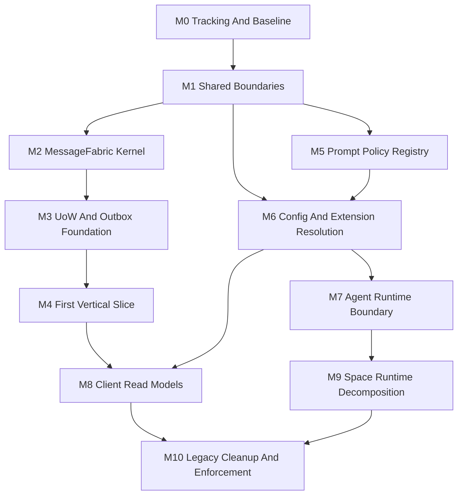

# Architecture Refactor Execution Plan

## Goal Summary

Execute the accepted target architecture refactor through NeoKai's own Goal and Forge system while keeping `dev` releasable after every merged PR.

The target architecture is already defined in:

- [Target Architecture Overview](../../architecture/target-architecture/README.md)
- [Unified Message Fabric Architecture Design](../../architecture/target-architecture/unified-message-fabric-design.md)
- [Storage Unit Of Work And Outbox Design](../../architecture/target-architecture/storage-unit-of-work-and-outbox.md)
- [Space Runtime Decomposition Design](../../architecture/target-architecture/space-runtime-decomposition.md)
- [Client State And Read Models Design](../../architecture/target-architecture/client-state-and-read-models.md)
- [Shared Package Boundaries Design](../../architecture/target-architecture/shared-package-boundaries.md)
- [Agent Runtime And Provider Compatibility Design](../../architecture/target-architecture/agent-runtime-and-provider-compatibility.md)
- [Configuration And Extension Resolution Design](../../architecture/target-architecture/configuration-and-extension-resolution.md)
- [UI Design System Architecture Design](../../architecture/target-architecture/ui-design-system-architecture.md)
- [Prompt Policy Registry Spec](../../research/token-efficiency/prompt-policy-registry-spec.md)

This plan is the execution layer over those specs. It defines the Goal/Forge operating model, PR sequence, release invariants, and acceptance gates.

## Operating Model

Create one parent Goal:

> Architecture Refactor: MessageFabric, UoW, Config/Extensions, Agent Runtime, Space Runtime, Client Read Models, and UI Boundaries

Create one linked Forge scope for the same objective. The Forge scope is the evidence and learning surface for the refactor, not a separate backlog. Every implementation PR should attach evidence to that scope before the next PR is planned.

The Goal tracks delivery state. Forge tracks evidence, episodes, lessons, and task proposals.

| System | Use |
| --- | --- |
| Goal | Parent objective, milestone status, release readiness, human approval gates. |
| Tasks | One implementation PR each, except tiny doc or follow-up fixes. |
| Forge evidence | Design links, codegraph/context notes, PR diffs, test output, CI links, review comments, release notes, and rollback notes. |
| Forge episodes | Post-merge summaries for a milestone or meaningful PR cluster. |
| Forge lessons | Durable implementation rules discovered during execution. |
| Forge proposals | Candidate next tasks generated from evidence and unresolved exit criteria. |

## Release Invariants

These rules apply to every PR.

1. `dev` must remain releasable after the PR merges.
2. A PR must not depend on a later PR to restore existing behavior.
3. Existing public behavior stays on the old path until the new path is fully validated.
4. Compatibility layers are introduced before callers migrate.
5. Migrations are additive, idempotent, and safe for existing databases.
6. Destructive cleanup waits until replacement paths have shipped and have tests.
7. New code paths are disabled, shadowed, or compatibility-routed until the switch PR.
8. Dual-write or dual-read phases must have readback tests or explicit diagnostics.
9. PRs target `dev`, are rebased on current `dev`, and pass the repository checks.
10. Each PR includes a short release note: user-visible change, migration risk, rollback note, and validation run.
11. New source files should stay under 300 lines including comments; temporary exceptions must stay under 500 lines and explain the planned split.
12. Touched oversized source files should not grow unless the PR is an explicit compatibility bridge; each architecture migration should move code toward smaller modules.

## Definition Of Done For Each PR

Every implementation task should include:

- a narrow objective tied to one architecture gate;
- a compatibility and rollback note;
- additive schema or API changes only unless explicitly marked cleanup;
- targeted tests for changed behavior;
- unchanged existing tests for preserved behavior;
- updated docs when contracts, boundaries, or migration status change;
- source file size check: new files under 300 lines where practical, no new file over 500 lines, and touched oversized files either shrink or have a named follow-up split;
- Forge evidence attached before selecting the next task.

Suggested verification baseline:

```bash
bun run check
```

Use narrower test commands during development, then run the baseline before merge. Do not run root `bun test`.

## Goal And Forge Cadence

### Before A PR

1. Pick the next task from the active Goal.
2. Attach relevant target docs and current-code evidence to the Forge scope.
3. Confirm the task has a release-safe slice: additive first, migration second, cleanup later.
4. Write the PR acceptance criteria before coding.

### During A PR

1. Keep the branch focused on the task.
2. Add evidence as facts are discovered: current coupling, test gaps, migration hazards, review feedback.
3. If a task grows, split it. Do not stretch one PR into a milestone.
4. Preserve compatibility paths unless the PR is explicitly a cleanup PR with proven replacement coverage.

### After A PR

1. Attach the merged PR link, commit hash, CI result, and validation output as Forge evidence.
2. Record a Forge episode when the PR changes a milestone's state.
3. Promote recurring implementation rules to Forge lessons.
4. Generate or update Forge proposals for the next two to three tasks.
5. Only then move the Goal milestone forward.

## Milestone Dependency Graph



The graph is intentionally serial at the platform foundation. Later milestones can overlap only after their dependencies have merged to `dev`.

## PR Sequence

### M0: Tracking And Baseline

Purpose: make the refactor executable by Goal/Forge without touching runtime behavior.

| PR | Scope | Release safety | Acceptance |
| --- | --- | --- | --- |
| 0.1 | Add this execution plan and link it from target architecture docs. | Docs only. | Plan explains Goal/Forge cadence and release invariants. |
| 0.2 | Create the parent Goal and linked Forge scope in NeoKai. | Product data only. | Goal has milestones; Forge scope has seed evidence from accepted specs. |
| 0.3 | Add an architecture-refactor status note or dashboard entry if needed. | Docs/read-only UI only. | Current milestone, active PR, and blockers are visible. |

### M1: Shared Boundaries

Purpose: make ownership visible before moving behavior.

| PR | Scope | Release safety | Acceptance |
| --- | --- | --- | --- |
| 1.1 | Add `@neokai/shared` subpath skeletons: `contracts`, `read-models`, `domain`, `messaging`, `compat`. | Re-export only; no behavior changes. | Existing imports keep working; new subpaths compile. |
| 1.2 | Add Forge domain/contract/read-model subpaths as the first real shared slice. | Re-export existing types first. | `SpaceForge` and low-risk Forge files can import from subpaths. |
| 1.3 | Add prompt-policy shared domain/contract/read-model types. | Types only; no rendering path changes. | Types match the prompt policy spec and do not expose renderer internals. |
| 1.4 | Add config and extension shared domain/contract/read-model types for effective previews. | Types only; no storage or runtime changes. | Types distinguish config keys, scopes, source chains, packages, contributions, skills, plugins, MCP, hooks, and prompt policy. |
| 1.5 | Add import-boundary checks for newly touched files. | Advisory or narrow allowlist first. | New code cannot expand root barrel usage in migrated slices. |

### M2: MessageFabric Kernel

Purpose: add the canonical command/query/event machinery without forcing existing callers through it yet.

| PR | Scope | Release safety | Acceptance |
| --- | --- | --- | --- |
| 2.1 | Add fabric envelope, contract registry, subjects, auth policy shape, and handler interfaces. | Library only; no app routing changes. | Unit tests cover command/query/event registration and validation. |
| 2.2 | Add in-process transport and fabric router. | Not connected to WebSocket yet. | In-process commands/queries/events work in tests. |
| 2.3 | Add module registration lifecycle for fabric modules. | Existing `setupRPCHandlers` remains source of truth. | A no-op or health module can register and run in-process. |
| 2.4 | Add MessageHub compatibility bridge for fabric calls. | Existing RPCs remain unchanged. | One low-risk query can be routed through bridge with old API shape preserved. |
| 2.5 | Add MessageHub exit tracker. | Documentation and static checks only. | New semantic APIs are blocked from MessageHub; remaining hub call sites are classified as bridge, transport plumbing, or deletion candidates. |

### M3: UoW And Outbox Foundation

Purpose: establish durable write primitives before migrating write paths.

| PR | Scope | Release safety | Acceptance |
| --- | --- | --- | --- |
| 3.1 | Add additive migrations and repositories for `message_outbox`, `message_inbox`, `command_receipts`, `read_model_cursors`. | Tables are unused initially. | Migration tests pass on new and existing DBs. |
| 3.2 | Add `StorageUnitOfWorkRunner`, `ChangeRecorder`, and repository binding skeleton. | Existing direct transactions remain. | Unit tests prove commit, rollback, after-commit hooks, and change recording. |
| 3.3 | Add outbox dispatcher in shadow mode. | Dispatcher can be disabled and has no required subscribers. | Outbox rows can be claimed, retried, and marked without affecting current events. |
| 3.4 | Add command receipt helpers for idempotency. | No command migrated yet. | Duplicate request behavior is covered in unit tests. |

### M4: First Vertical Slice

Purpose: prove the full target path on one bounded behavior before broad migration.

Preferred slice: `space.task.create`.

| PR | Scope | Release safety | Acceptance |
| --- | --- | --- | --- |
| 4.1 | Add fabric contract for `space.task.create` and compatibility adapter from existing RPC. | Old RPC name and response shape stay stable. | Existing task creation tests still pass. |
| 4.2 | Route `space.task.create` through UoW with outbox append. | Existing repository behavior preserved. | Task row, command receipt, and outbox event commit atomically. |
| 4.3 | Project `space.task.created` into existing client/update paths. | Keep legacy event bridge until client read model is ready. | UI receives the same task creation result as before. |
| 4.4 | Add release evidence and decide whether next vertical slice is task update, schedule fire, or Forge proposal-to-task. | No behavior change if decision-only. | Forge episode records what the vertical slice proved and what it did not. |

### M5: Prompt Policy Registry

Purpose: move output/prompt behavior into the scoped prompt policy boundary.

| PR | Scope | Release safety | Acceptance |
| --- | --- | --- | --- |
| 5.1 | Add `prompt_policy_records` migration and repository. | Existing output behavior unchanged. | Additive migration and repository tests pass. |
| 5.2 | Add resolver, composer, renderer, and preview metadata in daemon code. | Not wired into session options yet. | Tests cover precedence, suppression, channels, and subagent eligibility. |
| 5.3 | Add `neokai.output-mode.compressed` built-in as a policy template. | Disabled unless activated by scoped row. | Built-in content is versioned in code and previewable. |
| 5.4 | Wire prompt policy into current Claude Agent SDK option construction. | Preserve existing behavior when no records apply. | Existing sessions are unchanged by default; activated compressed mode renders through policy. |
| 5.5 | Add `promptPolicy.effective.preview` query and client store surface. | Read-only preview first. | UI/debug callers can see applied/suppressed records without duplicating precedence logic. |

### M6: Configuration And Extension Resolution

Purpose: make settings, skills, plugins, MCP, hooks, native SDK settings, and prompt-affecting extension behavior resolve through one understandable effective-config model.

| PR | Scope | Release safety | Acceptance |
| --- | --- | --- | --- |
| 6.1 | Add `ConfigRegistry` skeleton with registered key metadata and effective preview types. | Read-only diagnostics first. | Existing settings keep their storage; preview shows key, value, source, inherited value, and allowed scopes. |
| 6.2 | Add `ExtensionRegistry` contribution model over current skills and MCP registries. | Compatibility mapping only. | Built-in `SKILL.md`, local plugin, and MCP-backed skills are described as contributions without changing injection. |
| 6.3 | Add effective skill/extension preview for Space/session context. | Preview only. | UI/debug output distinguishes skill, plugin package, MCP server, hook policy, and prompt policy contribution. |
| 6.4 | Register built-in hooks and workflow declarative guards as hook policies. | Existing hook behavior unchanged. | Loop detector, output limiter if retained, and workflow tool guards appear in hook preview with scope/trust/effect metadata. |
| 6.5 | Enforce prompt-affecting extension rule for new paths. | New paths only; legacy prompt fields remain. | A prompt-only plugin/Markdown package must declare `skill.command` or `prompt.policy`; no new silent always-on prompt append bypasses PromptPolicyRegistry. |

### M7: Agent Runtime Boundary

Purpose: make runtime selection and provider selection independent axes without breaking current Claude Agent SDK behavior.

| PR | Scope | Release safety | Acceptance |
| --- | --- | --- | --- |
| 7.1 | Audit SDK source/type files for Claude Agent SDK, OpenAI Agents SDK, Codex SDK/server, Pi, and provider bridges. | Docs/type matrix only. | Capability matrix identifies native, bridged, degraded, and unsupported features. |
| 7.2 | Add NeoKai superset Agent Runtime types based on the audit. | Types and adapter contracts only. | Types avoid prematurely hiding runtime-specific capabilities. |
| 7.3 | Add `AgentRuntimeGateway` wrapping current `AgentSession` behavior. | Default runtime remains Claude Agent SDK. | Existing session tests pass through the gateway. |
| 7.4 | Add capability resolver and read-only compatibility diagnostics. | No runtime selection change yet. | UI/API can report compatibility without changing execution. |
| 7.5 | Add runtime profile persistence with default Claude profile. | Existing sessions map to default profile. | No existing session loses provider/model configuration. |

### M8: Client Read Models

Purpose: move the client from broad mutable stores to focused read-model stores without a UI rewrite.

| PR | Scope | Release safety | Acceptance |
| --- | --- | --- | --- |
| 8.1 | Add fabric client kernel beside existing MessageHub client. | Existing components keep using current paths. | Typed command/query/event clients can call low-risk contracts. |
| 8.2 | Add config/extension, prompt policy, and runtime behavior preview stores. | New stores are additive. | Settings/debug UI reads effective values and source chains instead of rebuilding precedence. |
| 8.3 | Split Forge state into `ForgeStore` backed by contracts/read models. | `SpaceForge` compatibility preserved. | Forge scope/detail data no longer lives only in component-local state. |
| 8.4 | Add focused task/runtime stores behind `spaceStore` compatibility facade. | Components can migrate one at a time. | Existing task and runtime views behave unchanged. |
| 8.5 | Move selected components to focused stores. | `spaceStore` remains fallback until all consumers migrate. | Stale-response and subscription lifecycle tests pass. |

### M9: Space Runtime Decomposition

Purpose: decompose workflow orchestration behind a stable `SpaceRuntimeFacade`.

| PR | Scope | Release safety | Acceptance |
| --- | --- | --- | --- |
| 9.1 | Add `SpaceRuntimeFacade` with compatibility methods over current runtime. | No internal behavior move yet. | Existing RPC/MCP callers can use facade without behavior change. |
| 9.2 | Extract `RuntimeScheduler` and recovery startup flow. | Same scheduling triggers preserved. | Existing schedule and recovery tests pass. |
| 9.3 | Extract `WorkflowRunCoordinator` and state-machine helpers. | Keep current persistence and event semantics. | Active/blocked/completed run behavior is unchanged. |
| 9.4 | Extract `NodeExecutionSupervisor`, `ChannelDeliveryService`, and `GateOrchestrator` incrementally. | One component per PR if needed. | Workflow channel, gate, and node execution tests remain green. |
| 9.5 | Route Space runtime commands through fabric contracts where UoW path exists. | Compatibility methods stay until callers migrate. | Runtime behavior can be driven through fabric in tests. |

### M10: Legacy Cleanup And Enforcement

Purpose: remove old coupling only after replacement paths are proven.

| PR | Scope | Release safety | Acceptance |
| --- | --- | --- | --- |
| 10.1 | Shrink `setupRPCHandlers` by moving migrated surfaces to module registration. | Compatibility aliases remain. | No migrated surface depends on broad service internals. |
| 10.2 | Replace migrated client RPC calls with fabric clients. | Keep old RPC aliases until no consumers remain. | Client tests cover reconnect, stale responses, and event delivery. |
| 10.3 | Remove direct root shared imports from migrated packages. | Enforcement applies only after replacement imports exist. | Boundary checks are mandatory for migrated slices. |
| 10.4 | Remove obsolete event bridges and duplicated broadcasts. | Only cleanup paths with replacement coverage. | No double-delivery and no missing-delivery tests fail. |
| 10.5 | Final architecture exit review. | Docs/review only unless gaps are found. | Target architecture exit criteria are checked against code and tests. |

## Parallelization Rules

Parallel work is allowed only when branches do not require each other to keep `dev` releasable.

Good parallel candidates after M1:

- Prompt policy shared types and repository work can run beside MessageFabric kernel work.
- Config/extension preview types can run beside MessageFabric kernel work because they are read-only until migration.
- SDK capability audit can run beside UoW foundation work because it is documentation/type discovery.
- UI design system extraction can continue as long as it does not depend on fabric/client store changes.

Avoid parallel work when:

- two branches edit the same shared type barrel or migration sequence;
- one branch assumes a compatibility adapter from another unmerged branch;
- a client migration branch depends on an unmerged daemon contract;
- cleanup removes a path still used by a parallel branch.

## Release Cut Checklist

Before cutting a release from `dev`, verify:

- latest merged PR has a Forge evidence record with validation output;
- no milestone is halfway through a switch PR that disables an old path before enabling the new path;
- migrations are additive and have run on an existing dev database;
- compatibility aliases for migrated RPCs/contracts are still present unless cleanup has shipped;
- known degraded or shadow-mode behavior is documented;
- CI is green for the release branch.

## Risk Register

| Risk | Mitigation |
| --- | --- |
| Refactor PR grows too large. | Split by compatibility-first, migrate-second, cleanup-third. |
| New fabric/UoW path diverges from legacy behavior. | Start with one vertical slice and keep legacy tests running against compatibility adapters. |
| Additive schema becomes accidental behavior change. | Add migrations first, leave tables unused, then migrate commands. |
| Client store migration causes stale or missing updates. | Move stores behind compatibility facade and test stale-response policy. |
| Prompt policy changes model behavior unexpectedly. | Preserve default no-record behavior; preview and tests before rendering activation. |
| Agent runtime abstraction hides SDK-specific capabilities. | Audit SDK source/type files before stable adapter contracts. |
| Large files keep accumulating hidden responsibilities. | Apply a file-size ratchet: 500-line hard ceiling for new source files, 300-line target, and split touched oversized files by ownership boundary. |
| Cleanup removes a path still used by release code. | Cleanup PRs require search evidence, tests, and Forge episode approval. |

## Exit Criteria

The parent Goal is complete when:

- the [Target Architecture Overview](../../architecture/target-architecture/README.md) exit criteria pass;
- at least one durable vertical slice uses `fabric command -> auth/policy -> UoW -> DB/job/receipt/outbox -> dispatcher -> event/projector -> client store`;
- effective configuration and extension previews can explain active settings, skills, plugins, MCP servers, hooks, native SDK settings, and prompt-affecting contributions;
- Prompt Policy Registry is the source of scoped prompt behavior;
- Agent Runtime Gateway owns runtime/provider execution boundaries;
- focused client read-model stores own migrated UI state;
- migrated source files are below 500 lines including comments, with new and actively refactored files targeting 300 lines or less;
- legacy MessageHub/RPC surfaces are compatibility adapters, not the architecture center;
- `MessageHub` is removed as a public semantic API; any still-useful WebSocket/session plumbing is renamed and owned as a MessageFabric transport adapter;
- Forge contains evidence and episodes for the completed milestones.
