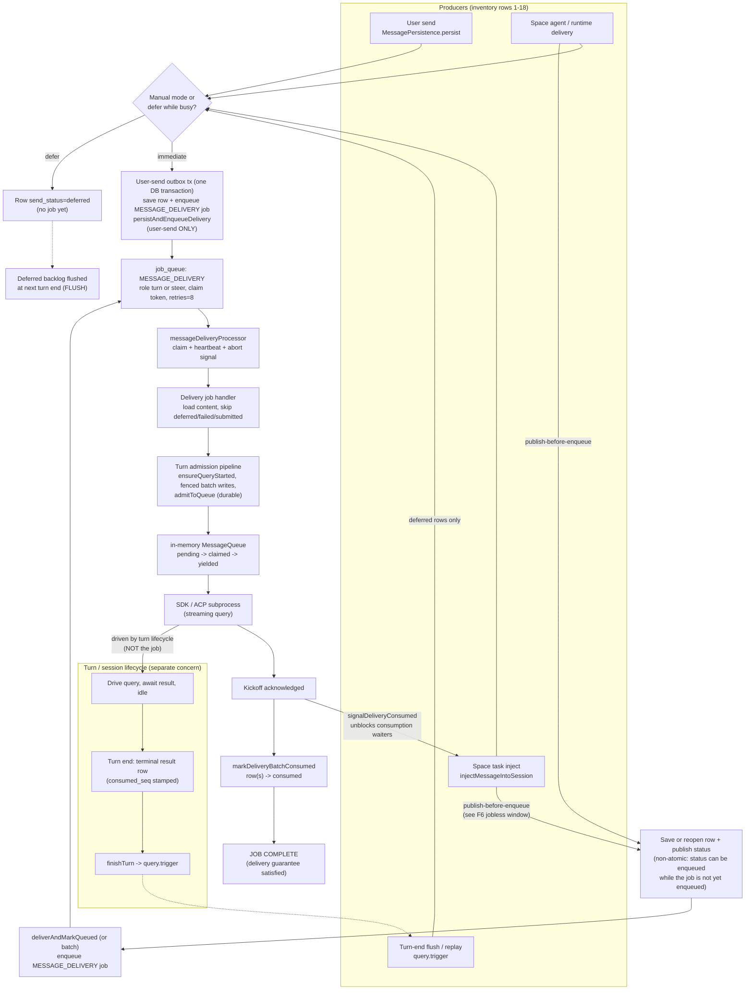
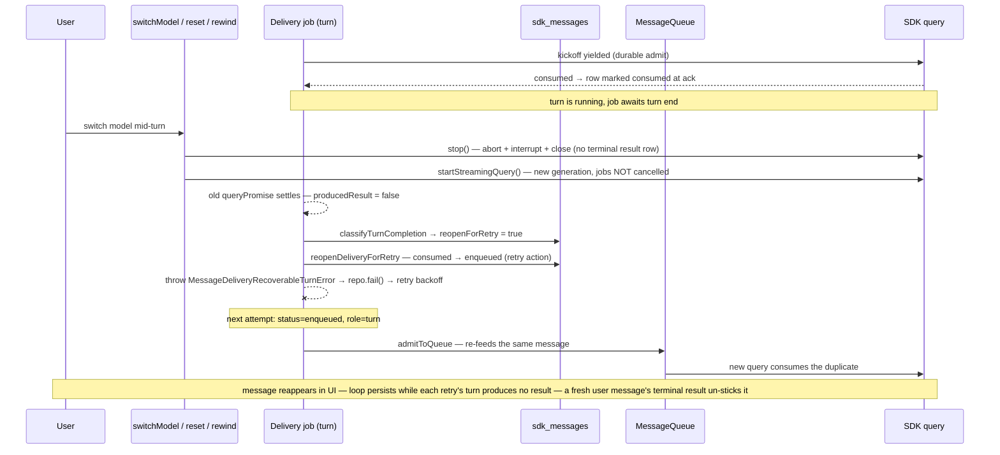
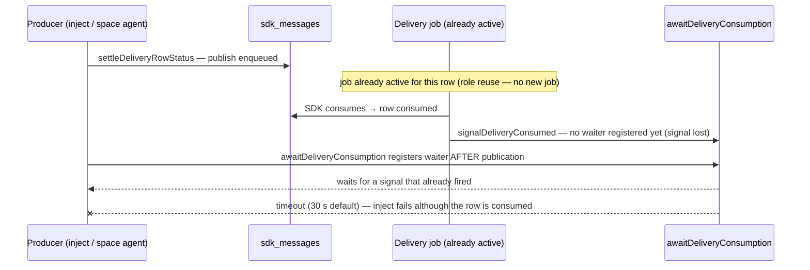
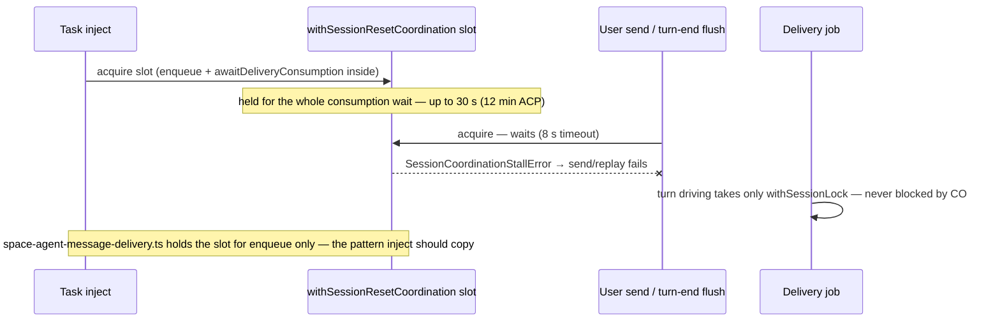

# Job Queue and Message Delivery Pipeline Review

**Date:** 2026-08-29
**Task:** #1687 — comprehensive review of the per-session job queue and the V2 message delivery pipeline
**Audited base:** `dev` @ `546f294f92` — file:line references pin to that head unless noted. The branch was subsequently rebased onto `dev` @ `daae58d616` (4 commits later); the only audited file that delta touches is `acp/acp-query-runner.ts` (15 lines), and its citations below are re-verified against the new base and marked accordingly. Read the review as a point-in-time snapshot of the audited head, not a diff-verified claim about the merge base.
**Companion tasks:** #1685 (remove legacy V2=0 delivery system), #1686 (fix model-switch re-injection of the last delivered message)

## Executive summary

The V2 delivery pipeline is fundamentally sound: durable `MESSAGE_DELIVERY` jobs own delivery, DB `send_status` transitions are fenced and directional, delivered messages cannot be replayed by the turn-end replay paths, and the interrupt path cannot downgrade consumed rows. No *unintended* stuck-`enqueued` state exists — the 60 s reconciler, the turn-end flush, and dead-letter settlement bound every recovery window — with one deliberate exception: user-gated waits. A turn parked on `sdk_resume_choice` and a steer parked while `waiting_for_input` requeue through `routeDriveTurnOutcome`/`routeFeedSteerOutcome` (`packages/daemon/src/lib/agent/handler-outcome-routing.ts:38-53`, `:76-84`), and plain `requeue` increments neither the retry count nor the park count, so dead-letter settlement never bounds them and the reconciler ignores them (their job stays active). Those waits are intentionally unbounded until the user acts.

Two findings matter:

1. **#1686's root cause is confirmed end-to-end at code level.** When a turn is torn down without writing a terminal result (model switch, reset, clear race), the delivery job unconditionally reopens its **already-consumed** kickoff row (`consumed → enqueued`) and re-feeds it into the restarted query. The fix direction is a generation comparison distinguishing "my query was replaced" from "my query died".
2. **#1685 has a scope gap.** Its goal 2 lists removing `withSessionResetCoordination` from send/delivery/promote/retry/inject paths, but not from the turn-end flush paths, and it does not address that Space task inject holds the coordination slot across the entire delivery-consumption wait (30 s default, 12 min ACP), starving concurrent sends and replays.

## Lifecycle diagrams

### Architectural intent and observed drift

**Intended design (operator-specified).** The `MESSAGE_DELIVERY` job exists only to deliver a message: it is complete as soon as the SDK has taken the message (non-ACP) or the ACP subprocess has accepted it. The job must NOT be responsible for the rest of the turn — tool calls, terminal result, the idle wait, the flush, the next message's admission. The consumption/acceptance boundaries are the natural completion signal:

- **Non-ACP:** `agent-session.ts:2574-2582` — `markDeliveryBatchConsumed` + `signalDeliveryConsumed` for the kickoff and every admitted batch member, called inside `driveDeliveryTurn` once the SDK has acknowledged the kickoff (`kickoffAcknowledged`).
- **ACP:** `sdk-message-handler.ts:748` — `markMessageAccepted` → `handleMessageYielded` (`sdk-message-handler.ts:827+`, the `consume` transition on the row) → `completeDeliveryAcceptance` (`signalDeliveryConsumed` + batch-member consumption via `consumeBatchMembersAtAcceptance`).

**Observed drift.** The current `driveDeliveryTurn` (`agent-session.ts:2424`) and the message-delivery job handler (`message-delivery.handler.ts:148-176`) couple the job to the *turn* lifecycle: after consumption the job awaits `activeTurnEnd.promise` and the result (`hasTerminalResultAfter`/`producedResult`); only then does it return `completed`. Concretely, the drift shows in:

- The job's wait on `waitForIdleTransition` and the `producedResult` check in `driveDeliveryTurn` (`:2603-2655`).
- `classifyTurnCompletion` re-evaluating the row's lifecycle on turn exit and unconditionally flipping a consumed row back to `enqueued` (`:2691-2694`) when no result is found — the turn lifecycle reaching back into the delivery state machine.
- `awaitDeliveryConsumption` / `awaitDeliveryConsumptionTolerant` (`:361-468`) waiting on a signal whose scope the job did not actually need; the `retry-on-failure` path on the tolerant helper is also a delivery-state-on-the-job behavior.
- `handler-outcome-routing.ts:38-53, 76-84` reusing `requeue` to keep the turn alive for `blocked`/`recovery_pending`/`park` outcomes — job state representing a turn state.
- ACP `awaiting_acceptance` is delivery-state-on-the-job; once the subprocess accepts, the turn's remainder is turn-lifecycle work.

**Recommended split.** The `MESSAGE_DELIVERY` queue owns **delivery guarantee** (one of: `consumed` for non-ACP, `accepted`/consumed for ACP, or terminalized `failed`/dead-lettered after bounded retries). A separate turn/session lifecycle owns **turn execution** (ensureQueryStarted, tool calls, terminal result, idle, flush, next-message admission). The job completes on the consumption/acceptance signal and never reaches into turn state. F1 (model-switch re-injection), F5 (consumption-wait lost wakeup), and the F6 archival hazard all stem from this drift; the fix is the split, not a per-finding suppression predicate.

### D1 — V2 delivery lifecycle (happy path, all producers, split view)



### D2 — `send_status` state machine

```mermaid
stateDiagram-v2
    [*] --> deferred : manual mode / defer-while-busy / task inject busy
    [*] --> enqueued : outbox tx (save + job)
    deferred --> enqueued : turn-end flush flips backlog
    enqueued --> submitted : batch admission (fenced) / ACP onSubmitted
    submitted --> enqueued : admission rollback (fenced, bypasses routing table)
    submitted --> consumed : SDK ack (non-ACP) / ACP prompt acceptance / shared-turn result (seq-fenced)
    enqueued --> consumed : SDK ack (non-ACP kickoff)
    enqueued --> deferred : defer transition (busy / clear blocked)
    enqueued --> failed : interrupt / archived / enqueue failure
    deferred --> failed : interrupt of job-owned deferred rows only (dead letter SKIPS deferred; delivery-status-routing.ts:21 accepts enqueued/submitted/consumed for fail_inclusive, and the handler returns skipped when it loads a deferred row at message-delivery.handler.ts:95-98)
    submitted --> failed : interrupt / dead letter
    consumed --> failed : dead letter only (fail_inclusive, F7)
    failed --> enqueued : RPC retry (reopen)
    consumed --> enqueued : retry action — reopenDeliveryForRetry (turn ended w/o result) OR ACP startup/connection restore (F1)
```

### D3 — Teardown race, F1 / #1686 (model switch, reset, rewind, restart RPCs)



### D4 — Interrupt path (verified safe, F4)

```mermaid
sequenceDiagram
    participant U as User
    participant IH as handleInterrupt
    participant JQ as job_queue
    participant DB as sdk_messages
    participant MQ as MessageQueue
    U->>IH : interrupt
    IH->>JQ : cancelForSessionWithMessages — delete pending+processing jobs
    IH->>DB : markDeliveryFailedByUuid for job uuids + all enqueued rows
    Note over DB : fail accepts enqueued/deferred/submitted only — consumed rows stay consumed; jobless deferred rows survive (still replayable)
    IH->>MQ : clear() — reject pending/claimed, resolve yielded
    IH->>JQ : in-flight attempt fences on claimGuard (job gone) → aborts, no reopen
    IH->>IH : setIdle → optional deferred replay trigger
```

### D5 — Consumption-wait lost wakeup, F5 (inject and non-ACP space producers)



### D6 — Coordination-slot starvation, F2



## 1. Entry-point inventory

Every entry point that can mutate a session's message state or query lifecycle, with its delivery mechanism, locks, and race exposure.

| # | Entry point | Path | Via `MESSAGE_DELIVERY` job? | Cross-locks held | Race exposure |
|---|---|---|---|---|---|
| 1 | User send | RPC → `MessagePersistence.persist` (`packages/daemon/src/lib/session/message-persistence.ts:119`) → outbox `persistAndEnqueueDelivery` (row save + job enqueue in **one** tx) → `message.persisted` → `deliverChatMessage` | Yes (atomic outbox tx) | `withSessionResetCoordination` around the outbox tx (fast); `withSessionLock` in `deliverChatMessage` | Persist waits up to 8 s on a coordination holder, then throws `SessionCoordinationStallError` → send fails (F2) |
| 2 | Manual-mode / defer send | same persist, `sendStatus='deferred'`, no job | No (deferred row only) | none | Delivered later by the flush (row 4) |
| 3 | Clear (context reset) | `clearConversationContext` (`packages/daemon/src/lib/agent/agent-session.ts:943`): internal `/clear` via memory queue + suppressed-result wait; reset on timeout | No (memory-queue internal message) | none itself; callers may hold coordination | A delivery job can admit a message after `/clear` is queued (feeds share the queue, FIFO with bypass lanes) → cleared context + consumed row → turn without result → reopen loop (F1 family) |
| 4 | Turn-end flush / replay | result → `finishTurn` → `query.trigger` (`packages/daemon/src/lib/agent/sdk-message-handler.ts:1568`) → `replayPendingMessagesForAutomaticTurnEnd` → `sendEnqueuedMessagesOnTurnEnd` + `handleQueryTrigger` (`packages/daemon/src/lib/agent/query-mode-handler.ts:47`, `:380`, `:440`) | Yes (`deliverAndMarkQueued` / `deliverBatchAndMarkQueued`) | `withSessionResetCoordination` (unless `skipResetCoordination`) | Waits behind long coordination holders (F2); flips deferred→enqueued before the ownership check (F6) |
| 5 | Startup replay | `scheduleInitialPendingMessageReplay` (`packages/daemon/src/lib/agent/agent-session.ts:792`) → same as row 4 | Yes | coordination | Same as row 4; guarded by manual-mode / `waiting_for_input` checks |
| 6 | Periodic reconcile | `reconcileStrandedDeliveries` (`packages/daemon/src/lib/agent/agent-session.ts:3354`), every 60 s + on idle | Yes (re-enqueue stranded) | `withSessionLock` | Benign double-enqueue defended by role arbitration `reuse` |
| 7 | Space task inject | `injectMessageIntoSession` (`packages/daemon/src/lib/space/runtime/task-agent-manager.ts:3849`) → `deliverInjectedMessage` (`packages/daemon/src/lib/space/runtime/injection-delivery-steps.ts:110`) → `deliverAndMarkQueued` + `awaitDeliveryConsumption` | Yes | `withSessionResetCoordination` for the whole inject including the consumption wait (F2) + per-session inject lock | Starves sends/flushes up to 30 s (12 min ACP) |
| 8 | Model switch | `switchModel` (`packages/daemon/src/lib/agent/model-switch-handler.ts:135`) → `lifecycleManager.restart()` when a query is active | No — direct restart; delivery job stays in flight | none | Confirmed re-injection bug (F1 = #1686) |
| 9 | Reset — public (hard) | RPC `session.resetQuery` / `agent.resetRequest` (both pass `hardReset: true`, `session-handlers.ts:966-978`, `event-subscription-setup.ts:79-85`) → `SessionManager.performHardResetAgentSession`: replaces the entire `AgentSession` and cleans up the old instance; with `restartQuery: false` it explicitly cancels the session's delivery jobs and fails affected rows (`session-manager.ts:244-262`) | Jobs cancelled when `restartQuery: false`; the fresh session re-drives surviving `enqueued` rows via startup replay | none | Hard reset replaces in-memory state wholesale; job/row state depends on the `restartQuery` flag — test both |
| 9b | Reset — internal (lifecycle) | `QueryLifecycleManager.reset` (`query-lifecycle-manager.ts:324`) reached from **public configuration entry points** (system-prompt, tools, agents, sandbox, MCP, output-format, beta, environment, bulk-config handlers — `config-handlers.ts:140-153, 195-205, 242-247, 285-289, 339-343, 379-383, 421-425, 467-471, 509-513, 556-560, 686-696`), the coordinator and sandbox switch RPCs (`session-handlers.ts:679-703, 714-743`), and internal callers (queue-timeout recovery `handleQueuedMessageFailure`, stuck-state clearance) | No — memory queue cleared, delivery jobs **not** cancelled | none | Same reopen/re-feed mechanism as F1 after reset; **all of these are part of the #1686 acceptance surface**, not just the explicit restart RPCs |
| 10 | Interrupt | `handleInterrupt` (`packages/daemon/src/lib/agent/agent-session.ts:878`, `packages/daemon/src/lib/agent/interrupt-handler.ts:60`) | Cancels all session delivery jobs + fails their rows plus every jobless `enqueued` row (`interrupt-handler.ts:81-100`) | `withSessionLock` around cancellation | Jobless `deferred` rows survive; the post-interrupt deferred trigger replays them **only when not suppressed** — Space teardown callers pass `skipDeferredReplay: true` (`task-agent-manager.ts:2932`, `:4081`, `:4233`); consumed rows stay consumed (F4) |
| 11 | Retry / promote pending | RPC `session.messages.retry` / `promotePending` (`packages/daemon/src/lib/rpc-handlers/session-handlers.ts:1172`, `:1248`) → reopen + `deliverAndMarkQueued` | Yes | coordination | Rollback-to-failed on error is correct |
| 12 | Remove/defer pending | `revokePendingDelivery` (`packages/daemon/src/lib/agent/agent-session.ts:849`): delete/defer row + `cancelDelivery` + memory remove | Cancels the one job | `withSessionLock` | Clean — ACP's per-attempt ownership check (`attemptOwnsRun`, `acp-query-runner.ts:481-484`) is the gate that prevents the orphan response: once `cancelDelivery` runs, subsequent ACP `onSubmitted` / `onAccepted` early-return, and the transport submission is canceled before any SDK execution |
| 13 | Query-runner self-heal retries | startup-timeout / provider-error teardown requeues **consumed** messages into the memory queue (`packages/daemon/src/lib/agent/query-runner.ts:1950` `requeueConsumedList`, `requeueLastConsumed`) | No (memory re-feed) | none | Deduped against job re-admission via `resolveExistingOrFreshEntry` + content match; benign but is a second, independent replay mechanism (F1 family) |
| 14 | Rewind (checkpoint / message rewind) | RPC `rewind.execute` → `RewindHandler` (`packages/daemon/src/lib/agent/rewind-handler.ts:232`, `:606`) → `deleteMessagesAtAndAfter` (deletes rows regardless of `send_status`, clears `delivery_turn_end` markers, `packages/daemon/src/storage/repositories/sdk-message-repository.ts:1625`) + SDK transcript truncation + `lifecycleManager.restart()` | No — deletes rows directly and restarts the query; delivery jobs not cancelled | none | Restart exposure as row 9: a surviving pre-rewind-point row mid-delivery hits F1's reopen/re-feed. Jobs for deleted rows complete `no_content` (graceful). Distinct hazard: durable memory-queue admissions for deleted rows are not revoked, and the restarted generator re-feeds leftover queue entries (`messageQueue.stop()` retains them) — content can reach the SDK with no DB backing |
| 15 | Explicit restart RPCs | `session.restart` → `agentSession.restart()` (`packages/daemon/src/lib/rpc-handlers/session-handlers.ts:988`); `session.sdkResumeChoice` → `agentSession.restart()` + `replayPendingMessagesForImmediateMode` (`session-handlers.ts:1383`) | No — direct lifecycle restarts; delivery jobs not cancelled | none | Same restart-without-job-cancellation exposure as rows 8/9 (F1 family) |
| 16 | Space agent chat delivery | `deliverAndAwaitConsumption` (`packages/daemon/src/lib/space/runtime/space-agent-message-delivery.ts:218`) → `deliverAndMarkQueued` origin `space_agent` under coordination, waited via `awaitDeliveryConsumptionTolerant` (status polling for ACP) | Yes | `withSessionResetCoordination` around the enqueue only — the consumption wait sits **outside** the coordination hold (the pattern task inject should copy, F5) | Same as inject (row 7) minus the long coordination hold |
| 17 | Space runtime service deliveries | `space-runtime-service.ts` producer paths: `injectLongTermAgentMessage` (`:701-745`) and notification/reminder producers — `getDeliveryContent` → save/reopen row → `deliverAndMarkQueued` (long-horizon agent reminders, notifications) | Yes | coordination around enqueue | Same as row 16; **separate-stage publish-before-wait race** — `awaitDeliveryConsumption` is registered after the status publication (F5) |
| 19 | Space-managed session resets (adjacent mutations) | `space-runtime-service.ts:839-869` `refreshLongHorizonAgentSessionConfig` — on any config change calls `resetQuery({ restartQuery: false })` then `restart()`; `space-runtime-service.ts:968-1062` `ensureLongTermAgentSession` — `resetQuery({ restartQuery: true })` for every existing regular agent session | Neither call passes `hardReset`, so both go through `QueryLifecycleManager.reset` (the internal lifecycle reset): memory queue cleared, **delivery jobs NOT cancelled** regardless of `restartQuery` | none | Both calls preserve the in-flight delivery job across the reset — the same F1 exposure as the configuration-driven reset routes (row 9b); add these callers to the F1 race set and the #1686 acceptance surface |
| 18 | Mid-turn context-budget interrupt | `runMidTurnContextBudgetCheck` passes `lifecycleManager.restart` into the survivor pipeline (`agent-session.ts:1678-1686`); `finishSurvivorTeardownWithRestart` restarts **after** deliberately requeueing survivors and reopening them (`message-queue.ts:1095-1110`, `requeueInterruptSurvivor` → `onSurvivorRequeued` → `reopenDeliveryForRetry`) | No — a **planned** restart whose survivors are intentionally re-fed | none | Changes generation while preserving the session identifier, yet its survivors MUST be re-fed — the #1686 suppression predicate must distinguish this planned recovery from an unplanned teardown or it will suppress required replay (see F1) |
| 20 | Circuit-breaker teardown | `SDKMessageHandler.handleCircuitBreakerTrip` clears the memory queue and calls `lifecycleManager.stop()` (`sdk-message-handler.ts:455-500`) without cancelling the delivery job or writing a terminal result | No — direct lifecycle stop; delivery jobs not cancelled | none | Same restart-without-job-cancellation exposure as row 8/9/14/15/19: an in-flight delivery job observes the query ending with `producedResult === false` and runs the F1 reopen/re-feed. Distinct from the rest because the trigger is a *circuit-breaker trip during an acknowledged turn*, not a user/operator action |

**Direct callers that can race each other or the delivery processor.** Model switch (8), internal lifecycle reset (9b, including the configuration-driven reset routes it surfaces from), rewind (14), the explicit restart RPCs (15), and clear (3) mutate query state directly without cancelling or fencing in-flight `MESSAGE_DELIVERY` jobs. **Public hard reset with `restartQuery: true`** (row 9) keeps the in-flight job and restarts the query (the same F1 family); **public hard reset with `restartQuery: false`** (row 9) explicitly cancels delivery jobs and fails the rows (`session-manager.ts:244-262`) and is therefore **not** a direct-race path — limit the F1 race set to internal lifecycle reset 9b and the `restartQuery: true` hard-reset case. The delivery job's own defenses — `claimGuard` (`isClaimCurrent`), generation anchors, and fenced SQL transitions (`transitionDeliverySendStatusFenced`, `updateDeliveryBatchUuidsFenced`, `DELIVERY_CLAIM_FENCE_SQL` in `packages/daemon/src/storage/repositories/job-queue-repository.ts:74`) — make concurrent *status writes* safe. The residual hazard is the job's reopen-and-re-feed reaction to a teardown it did not cause (F1).

**Lock families.** Two independent lock families serialize these paths: `sessionResetCoordinationLocks` (user sends, injects, promote/retry, turn-end flush) and `sessionLocks` (`packages/daemon/src/lib/agent/message-delivery.ts:470`, `:499` — delivery-job turn driving, interrupt cancellation, revoke, reconcile). User sends (1) and Space injects (7) **both** acquire the coordination lock for their persist/enqueue phase — that mutual exclusion is precisely F2's starvation surface — and both then take the session lock inside `deliverChatMessage` / `deliverAndMarkQueued`. The two families do not fence each other: a coordination holder never excludes an in-flight delivery job's turn driving, and vice versa, which is why the teardown races in F1 are possible and why DB-transaction fencing carries the correctness load.

## 2. `send_status` state machine audit

Transitions (`packages/daemon/src/storage/repositories/delivery-status-routing.ts`):

| Action | Accepted from | Target | Writers |
|---|---|---|---|
| `fail` | enqueued, deferred, submitted | failed | **shared routing** — interrupt (`interrupt-handler.ts:81-100`), archive, enqueue failure; the `fail` rule itself (`delivery-status-routing.ts:20`) accepts `deferred` for every caller, not just interrupt |
| `fail_inclusive` | enqueued, submitted, **consumed** | failed | dead-letter settlement only |
| `consume` | enqueued, submitted | consumed | SDK ack (non-ACP), ACP prompt acceptance, successful result (shared-turn fallback, seq-fenced) |
| `submit` | enqueued | submitted | batch admission (fenced), ACP `onSubmitted` |
| `submit`-rollback | submitted | **enqueued** | fenced batch-admission compensation (`unsubmitMembersFenced`, `delivery-turn-admission-pipeline.ts:132-147` → `agent-session.ts:2808-2818`) — a real re-enqueue edge that bypasses `delivery-status-routing.ts` entirely |
| `reopen` | failed | enqueued | RPC retry |
| `retry` | **consumed** | enqueued | `reopenDeliveryForRetry` (agent session) **and** the ACP runner's startup-timeout / transient-connection restore (`packages/daemon/src/lib/acp/acp-query-runner.ts:1258-1280`, refs re-verified at `daae58d616`) |
| `defer` | enqueued | deferred | manual mode, defer-while-busy |

Routed transitions cover the user-facing `markDelivery*ByUuid` API. The following status writes **bypass `routeDeliveryTransition`** — necessary but not exhaustive:

- `transitionMessageSendStatus(id, expected, target)` (`packages/daemon/src/storage/repositories/sdk-message-repository.ts:1503`) — unconditional conditional UPDATE; used by `handleInterrupt` rollback (`message-persistence.ts:284`), `promotePending` (`session-handlers.ts:1210`), and the turn-end digest handoff (`space-runtime.ts:1662-1680`).
- `updateMessageStatus(dbIds, target, options)` (`sdk-message-repository.ts:1449`) — claimed bulk update with a `PENDING_ROW_FROM_STATUSES` source-side guard, but **the guard only runs for `consumed`/`failed` targets**; for `enqueued`/`deferred` targets the pending-row query is skipped and every supplied dbId is updated unconditionally (`applyMessageStatusPlan`, `sdk-message-status-plan.ts`). Concretely: a stale `updateMessageStatus([dbId], 'enqueued')` from the turn-end flush can overwrite an `enqueued`/`submitted` row that `handleMessageYielded` flipped to `consumed` in the gap between read and write, and a stale `updateMessageStatus([dbId], 'failed')` can overwrite a `consumed` row — both contradict the routed invariants. This writer must be added to the fencing work.
- `handleMessageYielded` (`sdk-message-handler.ts:827+`) — writes `consumed` directly via `updateMessageStatus([dbId], 'consumed', { sharedTurn: true })`; accepts `enqueued`/`submitted`/`deferred` rows (not just the routed `enqueued`/`submitted`). Called from ACP `markMessageAccepted` and from `deferredMessage` recovery in the same file.
- `markDeliveriesConsumedAtTurnEnd` (`sdk-message-repository.ts:1855`) — the shared-turn result-side fence writing `consumed` for any UUID whose `consumed_seq` reaches the result's; bypasses the per-UUID check.
- `deferEnqueuedUserMessage` (`sdk-message-repository.ts:1589`) — `enqueued → deferred` rollup that uses the routing table directly but **rejects rows that have no `deferred` acceptFrom** without first inspecting the per-row `send_status`.

Consumption writers: at SDK admission time for non-ACP (`markDeliveryBatchConsumed`, `agent-session.ts:2574`); for ACP, normally at prompt **acceptance** — `onSubmitted` → `markMessageSubmitted`, `onAccepted` → `markMessageAccepted` → `handleMessageYielded` flips the row `consumed` (`acp-query-runner.ts:975-995` — refs re-verified at `daae58d616` — `sdk-message-handler.ts:827-885`) — with `markDeliveriesConsumedAtTurnEnd` (`sdk-message-handler.ts:689`, fenced to the result's `consumed_seq`) covering the shared-turn fallback, not the normal ACP boundary.

### Can a delivered message be re-enqueued or replayed?

- `sendEnqueuedMessagesOnTurnEnd` reads status `enqueued` only and pre-filters memory-pending entries (`query-mode-handler.ts:394-397`) → consumed rows are never replayed. ✓
- `replayPendingMessagesForImmediateMode` and `scheduleInitialPendingMessageReplay` route through the above plus `handleQueryTrigger`, which reads `deferred` only. ✓
- `handleQueryTrigger` flips deferred→enqueued and delivers under V2 with ownership gates (`planFlushDelivery`); skipped rows keep their existing job. ✓ (minor: F6)
- The `retry` action (`consumed → enqueued`) has **two** writers with independent replay semantics. `reopenDeliveryForRetry` (`agent-session.ts:3338`) fires when a turn ends without a result (`agent-session.ts:2691-2694` via `classifyTurnCompletion`) and for mid-turn budget survivors — #1686's re-injection source (F1), bounded by `MESSAGE_DELIVERY_MAX_RETRIES` (8) → dead letter. The ACP runner independently restores the last consumed message **and its batch members** via `reopenDeliveryByUuid ?? markDeliveryRetryableByUuid` plus a memory re-enqueue on ACP startup timeout or transient connection errors (`acp-query-runner.ts:1258-1280`) — at-least-once by design, with its own replay budget.
- Dead-letter `fail_inclusive` can flip an actually-consumed row to `failed` (F7) — misleading UI status after exhausted retries.

### In-memory `MessageQueue` vs DB after reset, restart, interrupt, model switch

- **Reset:** `MessageQueue.clear()` rejects pending and claimed entries with `Interrupted by user` but **resolves** yielded entries (`message-queue.ts:452-459`) — a durable kickoff already yielded to the SDK completes its delivery acknowledgment on reset, and correctness then rests on the bumped clear epoch invalidating that acknowledgment in `driveDeliveryTurn`/`feedDeliverySteer` (`clearEpoch` comparisons), not on a rejection. Rows and jobs untouched → enqueued rows stay enqueued; the reconciler re-drives them. Consistent. ✓
- **Restart / model switch:** the memory queue survives `stop()` (only internal compactions are cancelled); durable admissions keep their armed 30 s yield timeouts. Rows unchanged. Consistent **except** F1's consumed→enqueued→re-feed divergence. ⚠
- **Interrupt:** jobs cancelled; their rows plus every jobless `enqueued` row failed; memory cleared; consumed rows stay consumed (`fail` does not accept `consumed`); jobless `deferred` rows survive and remain replayable via the post-interrupt deferred trigger. ✓
- **Divergence hazard:** durable entries that were yielded but never acknowledged are **resolved** by the 30 s queue timeout (`packages/daemon/src/lib/agent/message-queue-timeout-policy.ts` — durable + yielded → resolve), and `driveDeliveryTurn` then marks them consumed if its state checks pass — an at-most-once trade-off (F8).

### `deliverAndMarkQueued` / `awaitDeliveryConsumption` stuck-`enqueued` analysis

Inject with `rowExists=true` passes **no** `terminalizeOnTimeout` (`injection-delivery-steps.ts:123-145`). On timeout the row stays `enqueued` — not permanently stuck (the job retries → delivers or dead-letters to `failed`; an interrupt fails it; the reconciler re-enqueues if jobless), but the inject caller has already thrown, so task-side bookkeeping and the eventual delivery disagree (F5). For `rowExists=false`, terminalization is applied. ✓

## 3. Cross-cutting traces

### `QueryLifecycleManager.restart()` / `reset()` (`query-lifecycle-manager.ts:190-412`)

Both stop the query (abort + interrupt + close + process reaping) but **never cancel `MESSAGE_DELIVERY` jobs and never touch `send_status`**. `setIdle({suppressDeliveryWaiters: true})` deliberately withholds the delivery job's turn-end waiter across the restart idle, so the job re-anchors on the post-restart query. The in-flight job attempt then observes query-end without a terminal result → F1. `reset()` additionally clears the memory queue — rejecting pending/claimed entries and resolving yielded ones (§2). Note this is the **internal lifecycle** reset; the public reset routes go through the hard reset instead (row 9), which replaces the whole `AgentSession` and — when `restartQuery: false` — does cancel the session's delivery jobs and fails their rows (`session-manager.ts:244-262`).

### `ModelSwitchHandler.switchModel()` (`model-switch-handler.ts:212-309`)

The inactive-query path is a pure config swap (clean). The active path swaps config then calls `restart()` — inheriting F1. It does **not** interrupt (delivery jobs preserved — the intent), does not mark the in-flight message, and does not exclude it from replay. The re-fed duplicate surfaces in the UI and can ping-pong while each retry's turn fails to produce a result; a fresh user message writes a terminal result after the row's `consumed_seq`, which un-sticks the session — matching #1686's report exactly. ACP→ACP `setModel` on the live adapter avoids the restart and the bug.

### `MessagePersistence.persist` and the turn-end flush under coordination

Contrary to the review premise, under V2 user sends **do** enter `withSessionResetCoordination` (around the outbox tx, `message-persistence.ts:215`); the turn-end flush takes it too (`query-mode-handler.ts:172`, `:424`); and task inject holds it across the whole consumption wait (`task-agent-manager.ts:1877` — `withSessionInjectLock` is `withSessionResetCoordination` — plus `injection-delivery-steps.ts:123`). The acquire timeout is 8 s (`getCoordinationAcquireTimeoutMs`), so a 30 s–12 min inject holder makes concurrent sends and turn-end replays fail with `SessionCoordinationStallError` (F2). This is the stalling class #1685 goal 2 targets — but #1685's listed paths (send/delivery/promote/retry/inject) omit the turn-end flush coordination and the inject-holds-slot-across-wait fact.

### Space `injectMessageIntoSession` (`task-agent-manager.ts:3849`)

Under V2 it saves/reopens the row and delivers through the **same** `MESSAGE_DELIVERY` pipeline as user input (`deliverAndMarkQueued`, origin `space_inject`) — parity confirmed. ✓ The `handleQueryTrigger` / `sendEnqueuedMessagesOnTurnEnd` calls inside it correctly pass `skipResetCoordination: true` (the coordination lock is not re-entrant). The deferred-when-busy, clear-before-deliver, and failed-reopen gates (`decideInjectDelivery`, `packages/daemon/src/lib/agent/message-delivery-pipeline.ts:90`) are coherent; RPC `promotePending` covers the deferred→deliver transition.

**Immediate reinjection of an existing deferred row.** When a caller reuses an `explicitMessageId` whose row is already `deferred` and the inject takes the `deliver` branch, `settleDeliveryRowStatus(... 'enqueued')` (`injection-delivery-steps.ts:115-123`) only **re-publishes** the status on the same row at the same `messageId` — no duplicate row exists, the job is keyed to the same uuid. The actual concern is that the deferred→enqueued transition in the row has not happened by the time the job lands: `settleDeliveryRowStatus` returns the SDK UUID when `rowExists: true` (the `dbId` it returns is the message uuid, not a flip), and the row is still `deferred` on disk. The job handler then short-circuits on `sendStatus === 'deferred'` and returns `{ outcome: 'skipped', sendStatus: 'deferred' }` (`message-delivery.handler.ts:95-98`) — the immediate reinjection delivers nothing, the row remains `deferred`, and the next turn end / flush replays it normally. Fix: at the head of the inject deliver branch, flip the existing row from `deferred` to `enqueued` before publishing the status. **No existing repo helper takes a SDK UUID and transitions `deferred → enqueued` cleanly**: `markDeliveryRetryableByUuid` (the `retry` action) accepts only `consumed` (`delivery-status-routing.ts:25`), not `deferred`, and `transitionMessageSendStatus` is keyed on the DB row id. Options: add a new repo helper `transitionDeferredToEnqueuedByUuid(sessionId, uuid)`; or use `getDeliveryMessageIdsByUuids` to map uuid→dbId and call `updateMessageStatus([dbId], 'enqueued')`; or assert no existing deferred row at that boundary.

## 4. Findings (ranked)

### F1 — design drift (owned by #1686): the delivery job's reach into the turn lifecycle, and the symptoms it produces

The drift (see "Architectural intent and observed drift" above) is that the `MESSAGE_DELIVERY` job is responsible for more than delivery: it awaits the turn's result, re-evaluates the row's lifecycle on turn exit, and reaches back into the delivery state machine. F1 is the most user-visible symptom — a re-injected, never-completing message after a teardown — but the underlying problem is the job's coupling to the turn, not any specific decision in `classifyTurnCompletion` or `reopenDeliveryForRetry`.

Symptom chain: model switch / reset / rewind / clear race / explicit restart RPCs tear down the query mid-turn → the interrupted turn writes no terminal result → the job's `producedResult` check fails → `classifyTurnCompletion` unconditionally returns `reopenForRetry: true` (`packages/daemon/src/lib/agent/turn-outcome-classification.ts:47-53`) → `reopenDeliveryForRetry` flips the **already-acknowledged, consumed** kickoff back to `enqueued` (`agent-session.ts:2691-2694`) → the retried job's admission re-feeds it (`admitToQueue`) into the restarted query. The `awaitDeliveryConsumption` wait is satisfied immediately on the second attempt (the message is still in the SDK's transcript), and the same loop repeats.

The drift makes the bug multi-dimensional and resistant to per-finding suppression predicates:

- **Batch members.** Initial admission marks every UUID in `started.admittedBatchUuids` consumed (`agent-session.ts:2572-2582`), but teardown reopens only `messageUuid`; on retry, `rebuildBatchDeliveryContent` skips only `deferred`/`failed` members (`:3317-3327`), so the reconstructed batch prompt re-feeds **every already-consumed member** of the batch. A kickoff-only test can pass while the rest of the batch is duplicated.
- **Planned recovery must stay re-feedable.** The mid-turn context-budget interrupt (row 18) restarts the query *after* deliberately requeueing and reopening its survivors — a generation change with the session identifier preserved where re-feed is **required** (the survivors were never consumed at the SDK boundary; they were only the budget interrupt's "still-queued" inventory).
- **Transcript preservation is independent.** A generation change alone does not prove the replacement query already contains the kickoff. Cross-provider switches deliberately clear the previous provider's session state (`model-switch-handler.ts:208-210`, `:264-274` — `clearSdkSessionState` drops `sdkSessionId`), and ACP reset clears `acpSessionId` (`query-lifecycle-manager.ts:81-105`); in those cases the fresh query has no transcript holding the kickoff, so suppressing re-feed would park the delivery with no possible result and effectively drop the input.
- **Memory-queue layer.** Durable admissions survive `messageQueue.stop()` and the restarted generator re-feeds leftover entries independently of the DB reopen (row 14's hazard generalizes to every teardown).

**Recommended fix for #1686 (revised).** The fix is the architectural split, not a suppression predicate:

1. Decouple the job: on consumption/acceptance (`markDeliveryBatchConsumed` for non-ACP, `markMessageAccepted` for ACP), the job writes `consumed`/`accepted` and returns `completed`. It must not await the turn result, must not re-evaluate the row on turn exit, and must not feed `producedResult` into its completion decision.
2. **Atomic handoff of turn ownership.** The split removes the current durable job owner at acknowledgment without an atomic successor; if the daemon exits between `consumed` and a recorded turn-lifecycle owner, startup replay scans only `enqueued`/`deferred` (`query-mode-handler.ts:60-130` — `getUserMessagesByStatus(session.id, 'enqueued')` / `'deferred'`) and no active job remains to recover the unfinished turn. The handoff must be **atomic with the consumption write** (single DB tx: row→`consumed` + turn-ownership record), or startup reconciliation must scan for `consumed` rows lacking a terminal result on every startup. This is a non-negotiable part of the split; an in-memory handoff is not sufficient.
3. Move the turn-driving work (the wait, the result check, the `classifyTurnCompletion` reopen logic) to the separate turn-lifecycle handler that lives in the turn/session state machine, not the delivery state machine. That handler is allowed to re-queue surviving durable entries when the turn ends without a result — but only entries that the SDK never consumed (the `evictedYieldEpochs` / generation-anchor family of gates, not the `consumed`-on-disk state).
4. The "replay an already-consumed message after teardown" symptom disappears by construction — there is no place in the delivery job that can flip a `consumed` row back to `enqueued`.
5. Test surfaces to expand: `reset()` (both variants), rewind, the explicit restart RPCs (15), the mid-turn budget interrupt (18), the cross-provider switch path, the batched-turn path (every member UUID), and a **crash-recovery test** (acknowledged row + no terminal result + daemon restart) to exercise the handoff.

Note that `query-runner.ts` `requeueConsumedList` is a second, independent consumed-message replay mechanism that dedupes against this one only via the memory-queue entry plus content match; the split also reduces the value of that mechanism (its budget-survivor purpose can move to the turn-lifecycle handler).

### F2 — bug, partially owned by #1685: coordination-slot starvation

Task inject holds the reset-coordination slot across `awaitDeliveryConsumption` (30 s default / 12 min ACP); user sends, turn-end replays, promote, and retry wait ≤ 8 s and then fail with `SessionCoordinationStallError`. #1685 goal 2 covers removing coordination from send/delivery/promote/retry/inject but does **not** list the turn-end flush coordination (`query-mode-handler.ts:172`, `:424`). Gap to close inside #1685 or a follow-up slice.

### F3 — latent: the flush plan's memory-ownership gate never fires

`planFlush` hardcodes `pendingInMemoryUuids: new Set<string>()` (`query-mode-handler.ts:285`), so `planFlushDelivery`'s memory-queue ownership check (`packages/daemon/src/lib/agent/message-ownership-gates.ts:51-57`) never triggers. The only protection is `sendEnqueuedMessagesOnTurnEnd`'s pre-filter; `handleQueryTrigger` has none. No live V2 path violates the invariant today (deferred rows are never memory-pending), so this is latent — fix opportunistically inside #1685's rewrite of this file (pass a real `hasPendingOrInFlight` snapshot, or drop the parameter).

### F4 — verified safe: interrupt

`handleInterrupt` cancels jobs and fails rows under `fail` routing, which cannot downgrade consumed rows; in-flight attempts fence on `claimGuard` and skip the reopen when the claim is gone. Precision: it fails the cancelled jobs' rows (which can include deferred rows that kept an active job via the turn-end re-defer path) plus every jobless `enqueued` row — ordinary jobless `deferred` rows survive interrupt; the post-interrupt deferred trigger replays them only when not suppressed (`skipDeferredReplay`, used by Space teardown callers). No action.

### F5 — bug (race): consumption waits can miss an already-consumed row (lost wakeup), plus timeout disagreement

The structural window: a producer publishes the row's `enqueued` status **before** its consumption-wait helper registers a waiter, and an already-active delivery job can consume and `signalDeliveryConsumed` precisely in that gap — the producer then waits for a signal that already fired and times out even though the row is already `consumed`. Affected producers, not just task inject:

- Task inject (`rowExists=true`): `settleDeliveryRowStatus` publishes before `awaitDeliveryConsumption` registers its waiter (`injection-delivery-steps.ts:115-123`); `deliverAndMarkQueued` only *reuses* the active job (role arbitration), so no second signal is guaranteed. Inject also passes no `terminalizeOnTimeout` here, so a timeout disagrees with later delivery.
- Space agent chat delivery: the `persistOrReopenRow` stage (save/reopen + publish, `space-agent-message-delivery.ts:205-212`) runs before `deliverAndAwaitConsumption`, and the tolerant helper's status poll only engages when `getSendStatus` is supplied — which that path does **only for ACP** (`:218-254`). Non-ACP space-agent deliveries keep the window.

Producers without a consumption wait — e.g. the `spaceAgentInjector` fallback (`rpc-handlers/index.ts:1063-1075`, save + publish + memory enqueue, no waiter) — are not affected by this race. **Long-horizon agent delivery** (`space-runtime-service.ts:701-723` `injectLongTermAgentMessage`) *is* affected — it uses `awaitDeliveryConsumption` (the non-tolerant helper) and runs `getDeliveryContent` → save/reopen + publish → register-wait, with no `getSendStatus` fallback for any provider; the same lost-wakeup window applies, with the additional risk that no status poll rescues it.

Fix direction: make waiter registration atomic with (or precede) the status publication, or always pass a `getSendStatus` fallback so the wait self-resolves from persisted state — copying the tolerant pattern is sufficient only if the status callback is supplied for every provider, which today it is not.

### F6 — minor: flush flips deferred→enqueued before ownership check (and can race session archival)

`handleQueryTrigger` flips deferred rows to `enqueued` (`updateMessageStatus`) before the V2 ownership plan; rows whose `deliverAndMarkQueued` then fails stay `enqueued` without a job until the 60 s reconciler or the next turn end heals them. Bounded; note only. Same flip happens in the turn-end digest handoff (`space-runtime.ts:1655-1680` — `transitionMessageSendStatus(dbId, 'deferred', 'enqueued')` then enqueue, with rollback on error) and in `promotePending` (`session-handlers.ts:1210`). Distinct hazard: when the flip succeeds but the subsequent job-insertion / delivery fails, the row is `enqueued` without a job. If the session is then archived (`session-handlers.ts:500-621` and `task-agent-manager.ts:386-393, 614-626`, which only clean up resources and rehydrate-gate on `status === 'archived'`), a still-jobless `enqueued` row can be re-claimed by a later job whose `enqueue` no longer sees the archived session — archive should also opportunistically fail jobless `enqueued` rows (or the reconciler should drop them) before the archive completes.

### F7 — UX: dead-letter settlement flips delivered messages to `failed`

`markDeliveryFailedByUuidInclusive` (`fail_inclusive`) flips consumed→failed after 8 exhausted retries — a delivered-and-executed message can render as failed. Note the obvious remedy is ineffective: "keep `consumed` when a terminal result follows the row" can never fire, because a job only reaches exhausted-retry settlement when no terminal result exists — `reclaimDeliveryTurnState` terminates the attempt when `hasTerminalResultAfter` is true (`agent-session.ts:3207-3222`) and `driveDeliveryTurn` completes when `producedResult` (`:2655-2698`). The provenance-based remedy I proposed in F7's earlier draft is also insufficient as literally specified: in non-ACP delivery, `query-runner.ts:2141` calls `onMessageYielded` *before* `yield message` at `:2190`, and that callback already writes `consumed` through `sdk-message-handler.ts:827-885`; the genuine SDK `onSent` fires only after the yield at `:2191`, while the queue timeout independently resolves the same entry at `message-queue.ts:391-416`. Provenance must be captured **at the later boundary** (the real `onSent` callback or the timeout resolution), not at the earlier `onMessageYielded` callback — otherwise a real acknowledgment and a future timeout are indistinguishable, and a timeout-derived row gets the same provenance stamp and is preserved as "successfully delivered" at settlement. The workable invariant: capture provenance at the `onSent`/timeout boundary, persist it as a per-row column (or companion row), and at dead-letter settlement preserve `consumed` only for ack-backed rows.

### F8 — accepted trade-off, should be documented

Durable yielded entries resolve at the 30 s queue timeout and can be marked consumed without a real SDK ack (at-most-once). Recovery paths exist (stall-watchdog reset + reopen; the query runner's consumed-list requeue). The trade-off interacts with the F7 provenance fix: a timeout resolution must be distinguishable from a real `onSent` (see F7), and the durable 30 s yield timeout is the specific boundary where the distinction is recorded. Worth an explicit design note so it is a chosen invariant rather than folklore.

## 5. Follow-up task proposals

1. **#1686 (exists, in progress):** adopt the **architectural split** (delivery job ends at consumption/acceptance; turn lifecycle owns driving/result/flush — see "Architectural intent and observed drift") as the fix for F1. The split itself is several deliverables — per the project's `CLAUDE.md` decomposition procedure (pin / extract / build / wire / delete, separate construction from integration, prod-line budget ~300/slice, separate tasks for separate concerns), this item should be **decomposed into measured child slices** with explicit prod and test budgets. Per the decomposition rule, **pin slices cover only behavior that survives**; tests for replacement-specific behavior live in the build or wire slice. Start with (a) a **characterization** slice that captures the **true current invariants** any later slice must keep — assertions that hold against the audited code today, independent of the coupling being removed:

- `fail` does not accept `consumed` — only `enqueued`/`deferred`/`submitted` can be flipped to `failed` by the standard `fail` action (`delivery-status-routing.ts:20`).
- `fail_inclusive` (dead-letter settlement only) does accept `consumed`; it is the **only** routed action that can write `failed` on a `consumed` row.
- The interrupt path (`interrupt-handler.ts:60-112`) cancels the session's `pending`/`processing` delivery jobs, fails the rows of the **cancelled** jobs (`enqueued`/`deferred`/`submitted`), and additionally scans **only jobless `enqueued`** rows via `getUserMessageIdsByStatus(..., 'enqueued')` (`interrupt-handler.ts:92-99`) — jobless `deferred` and `submitted` rows are not failed by the jobless pass; the post-interrupt deferred trigger replays them only when not suppressed.
- `QueryLifecycleManager.markEnqueuedMessageFailed` (`query-lifecycle-manager.ts:715-735`) reads an `enqueued` row by status and writes `failed` via `updateMessageStatus`. The read is the only fencing: by the time `handleMessageYielded`/`markDeliveryBatchConsumed` has flipped the row to `consumed`, `getMessageByStatusAndUuid(..., 'enqueued', ...)` returns `null` and the write is skipped. The `failed` target is not in `PENDING_ROW_FROM_STATUSES` (`sdk-message-repository.ts:1457-1472`), so the unconditional UPDATE branch in `applyMessageStatusPlan` would overwrite any source status if the read filter were not present — this is why the read is a status filter, not just a fetch.
- The `retry` action's two current writers are `AgentSession.reopenDeliveryForRetry` (`agent-session.ts:3338`) and the ACP runner's startup-timeout / transient-connection restore (`acp-query-runner.ts:1262-1283`); interrupt and dead letter do **not** invoke the `retry` action.
- The `consume` action is written at SDK ack for non-ACP (`markDeliveryBatchConsumed` + `signalDeliveryConsumed` at the `kickoffAcknowledged` branch, `agent-session.ts:2574-2582`), at ACP prompt acceptance (`markMessageAccepted` → `handleMessageYielded` → `completeDeliveryAcceptance`, `sdk-message-handler.ts:748` and `827+`), and at a successful result for shared-turn fallback (`markDeliveriesConsumedAtTurnEnd`, seq-fenced). `handleMessageYielded` (`sdk-message-handler.ts:827+`) writes `consumed` **directly** via `updateMessageStatus([dbId], 'consumed')` without a source-side fence — it reads the row by uuid in the `enqueued`/`submitted`/`deferred` state and updates unconditionally, so a stale read can restore `consumed` over `failed` (or any non-pending state) and conflict with the routed `fail_inclusive` invariant. The narrower `consume` rule (`enqueued`/`submitted` only) is the **routed** form, not the full reach of this code.
- The `submit` action is written by batch admission (fenced) and ACP `onSubmitted`; it is **not** written by interrupt, dead letter, or the turn-end flush.
- Ordinary jobless `deferred` rows survive interrupt (the interrupt-owned failure only fires for rows in the same cancelled-job set, not for arbitrary jobless `deferred`); the post-interrupt deferred trigger replays them only when not suppressed (`skipDeferredReplay`, used by Space teardown callers).

(b) a **build** slice that introduces the new turn-lifecycle handler with its own tests (no callers yet); (c) a **wire** slice that moves the wait/`producedResult`/reopen from the delivery job to the turn-lifecycle handler (with replacement-specific tests here, not in the characterization slice); (d) a **delete** slice that removes the old coupling. **Pin only what is true today** — assertions that depend on the split being complete belong to the build/wire/delete slices, not the characterization slice. **Timeouts and acknowledged turns are not just implementation details** — a durable entry whose SDK `onSent` callback never runs is resolved by the 30 s `message-queue-timeout-policy` (F8), and the split must distinguish genuine `onSent` from timeout resolution (otherwise a known timeout case silently consumes the prompt), and must keep a durable turn-lifecycle replay for acknowledged-but-unfinished prompts across cross-provider switches where the old transcript is cleared. Acceptance scope (still here) covers: the configuration-driven reset routes (row 9b), the Space-managed session resets (row 19 — both `resetQuery` calls in `space-runtime-service.ts:839-869, 968-1062` go through the internal lifecycle reset regardless of `restartQuery` and so preserve delivery jobs; the explicit follow-up `restart()` after the first reset runs with the original job still active), rewind, the explicit restart RPCs (row 15), the mid-turn context-budget interrupt (row 18), the circuit-breaker teardown (row 20; the same F1 reopen/re-feed path is reachable when the SDK error-loop circuit breaker trips during an acknowledged turn), batched-turn coverage over all member UUIDs, transcript-preservation gating, and the memory-queue layer.
2. **#1685 (exists, in progress):** expand goal 2 to explicitly include (a) the turn-end flush coordination in `query-mode-handler.handleQueryTrigger` / `sendEnqueuedMessagesOnTurnEnd`, and (b) narrowing the inject coordination hold so it does not span `awaitDeliveryConsumption`; fold F3 while rewriting that file.
3. **New:** the F5 lost-wakeup work, **split by producer family and measured** (per the repo decomposition contract — one entry family per slice, prod+test budgets) rather than combined:
   - 3a. Task inject `injection-delivery-steps.ts:115-123` (the rowExists=true + missing `terminalizeOnTimeout` window) — one slice.
   - 3b. Space agent chat `space-agent-message-delivery.ts:205-212, 218-254` (the publish-before-wait + non-ACP `getSendStatus` gap) — one slice.
   - 3c. Space runtime service long-horizon `space-runtime-service.ts:701-723` (currently uses the non-tolerant helper for every provider) — one slice.
   Each: register the consumption waiter before the status publication (or check persisted `send_status` at registration), and supply `getSendStatus` for every provider, not just ACP.
4. **New (small, **measured and split** before coding):** dead-letter settlement UX (F7) — the remedy is **not** a small `settleMessageDeliveryDeadLetter` change. It is two separate work items, each measured against the code: (a) **queue-boundary provenance persistence** (build, additive) — stamp and persist per-row provenance (ack-backed vs yield-timeout) at the later boundary in `message-queue.ts` and `query-runner.ts:2191` (the real `onSent` callback, not the earlier `onMessageYielded` at `:2141`), and **propagate to every admitted batch member** (`markDeliveryBatchConsumed` consumes every `admittedBatchUuids` row at `agent-session.ts:2572-2582`; dead-letter settlement iterates the kickoff and all `batchUuids` at `message-delivery-dead-letter.ts:18-22`); for ACP, stamp at the `markMessageAccepted` / `handleMessageYielded` / `completeDeliveryAcceptance` boundary (`sdk-message-handler.ts:748`, `:827+`) since `query-runner.ts:2191` is non-ACP only; add a column (or companion row), migrate existing rows; (b) **settlement integration** (wire) — consume that state during dead-letter settlement and preserve `consumed` only for ack-backed rows. Items (a) and (b) have separate prod-line and test-line budgets and should not share a PR.
5. **New (measured and split, **not** a small task):** revoke durable memory-queue admissions when their rows are deleted. **Inventory and measure the deletion call sites first** (rewind, row 14, plus the unspecified message-deletion paths), then split by entry family with explicit prod/test budgets — the cross-family merge contract is not derivable from a single-task description and an implementer cannot tell whether the work fits one PR. Per the project's decomposition procedure, this is multiple slices, not one.
6. **New (small, docs):** record the F8 at-most-once decision (durable 30 s yield timeout ⇒ consumed) as a design note.
7. **New (live bug, **assigned explicitly**):** **existing-deferred injection timeout.** When a `task-agent-manager.injectSubSessionMessageWithOrigin` caller reuses an `explicitMessageId` whose row is already `deferred`, the `deliver` branch in `injectMessageIntoSession` (`task-agent-manager.ts:3923-4031`) reaches `deliverInjectedMessage` → `deliverAndMarkQueued` while the existing row stays `deferred`; the delivery job loads the deferred row, returns `skipped` (`message-delivery.handler.ts:95-98`), and the inject's `awaitDeliveryConsumption` times out. The report previously treated this as an informational note under the deferred-replay paragraph; it is a live deterministic bug. Add the **deferred→enqueued transition step** at the head of the inject deliver branch (so the existing row is updated to `enqueued` before `deliverAndMarkQueued` is called, or the existing deferred row is rejected with a clear error), plus acceptance coverage for the explicit-UUID reuse case.
8. **New (deferred to F1's split):** **startup-recovery fencing for intentionally ended turns.** If the implementation chooses the offered startup-scan alternative for stranded-deliveries reconciliation, scanning every `consumed` row with no later terminal result also selects turns that were intentionally ended — `handleInterrupt` cancels the job but deliberately leaves an already-consumed kickoff `consumed` (`interrupt-handler.ts:81-100`); after a daemon restart the scan would treat that row as an unfinished crash window and replay the prompt, undoing the user's interrupt. Require an atomic durable owner or an explicit ownership/termination marker that lets reconciliation exclude intentionally settled turns, and cover interrupt-then-restart in acceptance tests. The work belongs to the F1 architectural-split build/wire slices (the *turn-lifecycle* handler owns termination markers); do not assign it to a separate small task.
9. **No new tasks** for F4 (safe) or F6 (bounded; revisit if #1685's coordination removal changes its economics).

This review made no code changes — every material fix is owned by an in-progress sibling task touching the same files.
